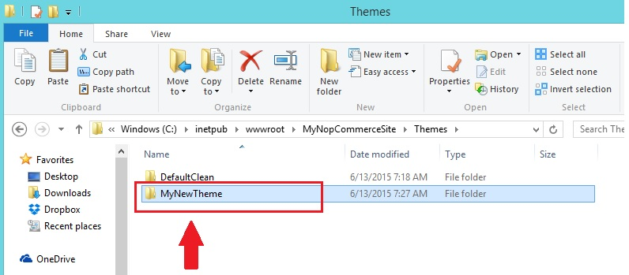

# 在 nopCommerce 中安裝 / 套用佈景主題

假設您剛下載了一個新的佈景主題，且它是一個壓縮檔。

1. 解壓縮該檔案內容，並將其複製到「Themes」資料夾下，如下圖所示：
1. 前往管理後台（`http://www.yourdomain.com/admin`）
1. 前往 **設定 → 設定 → 一般與雜項設定**
1. 從 **預設商店佈景主題** (Default Store Theme) 中選擇新的佈景主題，並點擊 **儲存**。

現在，前往前台網站。您應該就能在網站上看到新的佈景主題了。