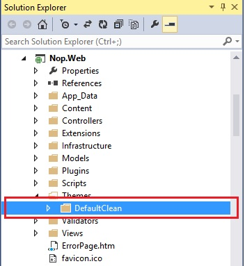
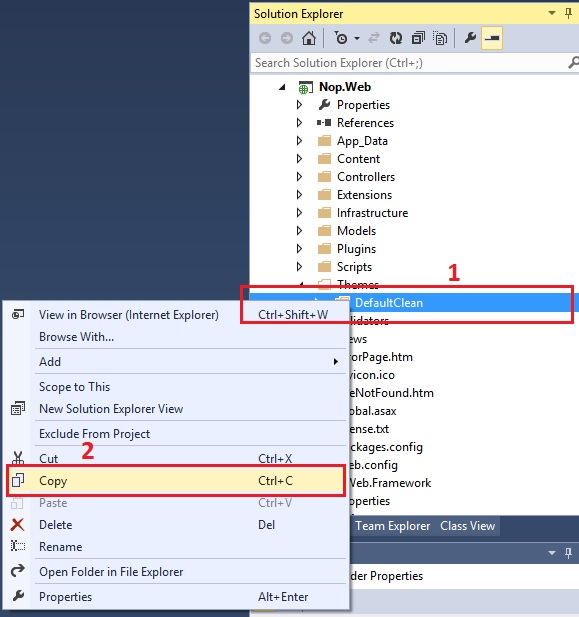
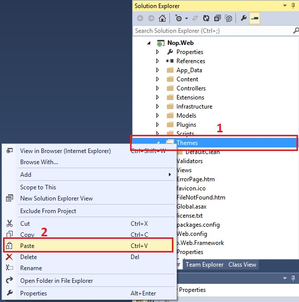
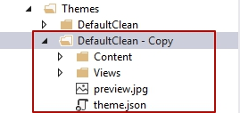
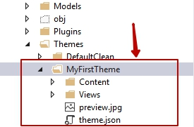
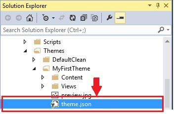
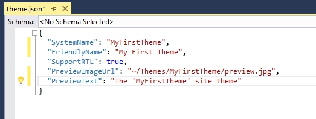
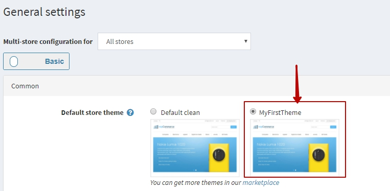

# 建立 / 編寫您的佈景主題（使用當前 / 預設佈景主題）

在 Microsoft Visual Studio 中開啟您的 nopCommerce 方案或網站（網站版本） - 前往此路徑：

* 若使用原始碼：`\Nop.Web\Themes\`
* 若使用網站版本：`\[Project Root]\Themes\`

1. 選擇任何預設 / 當前的佈景主題

    

1. 現在，在佈景主題上按一下滑鼠右鍵 → 選擇 **複製 (COPY)**

    

1. 現在選擇「Themes」資料夾 → 按一下滑鼠右鍵 → **貼上 (PASTE)**

    

1. 您會得到類似「Copy of default/current theme」的資料夾

    

1. 將其重新命名為您想要的佈景主題名稱，例如：MyFirstTheme

    

1. 現在進入您的新佈景主題資料夾「MyFirstTheme」 → 開啟 `theme.json`

    

1. 將當前或現有的佈景主題名稱更改為您的新佈景主題名稱「MyFirstTheme」

    

1. 現在，在您的新佈景主題資料夾 **「MyFirstTheme」 → Content → Images** 內，將您的新圖片加入到「images」目錄中，並開始根據您的需求更新或自訂 `style.css`。

    如果您想測試變更 → 前往後台管理區域 → 套用您的新佈景主題 → 儲存變更並預覽您的前台網站。

    