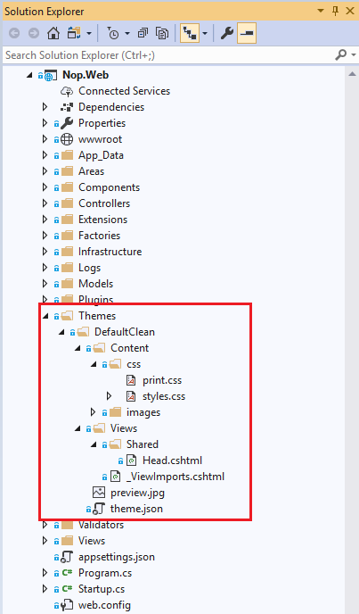

# 概覽（設計師指南）

## 什麼是佈景主題

佈景主題是一組屬性設定的集合，讓您可以定義頁面與控制項的外觀，並將其一致地套用到 Web 應用程式的各個頁面、整個 Web 應用程式，或伺服器上的所有 Web 應用程式。

佈景主題由多個元素組成：面板（skins）、串接樣式表（CSS）、影像以及其他資源。最起碼，一個佈景主題會包含面板。佈景主題定義在您網站或 Web 伺服器上的特定目錄中。

佈景主題也可以包含串接樣式表（`.CSS` 檔案）。當您將 `.CSS` 檔案放入佈景主題資料夾時，該樣式表會作為佈景主題的一部分自動套用。您可以透過在佈景主題資料夾中使用副檔名為 `.CSS` 的檔案來定義樣式表。（來源：[msdn.microsoft.com](https://msdn.microsoft.com)）

## nopCommerce 佈景主題的定義

nopCommerce 佈景主題用於在所有頁面或整個網站上維持一致的版面配置與外觀。nopCommerce 佈景主題由數個輔助檔案組成，包括用於頁面外觀的樣式表與輔助影像。

**nopCommerce 佈景主題的位置**：所有佈景主題皆位於 `[nopCommerce root folder]/Themes/` 下方。