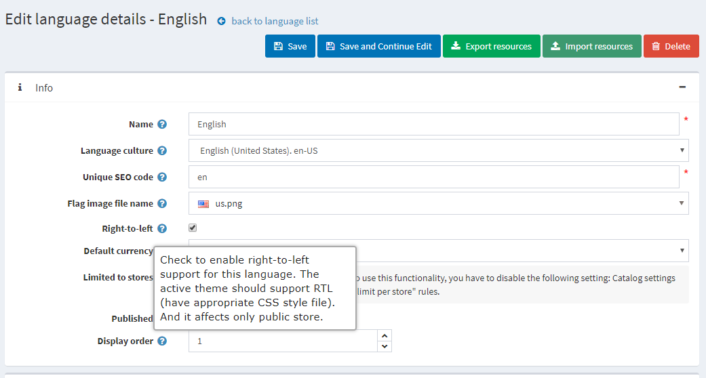
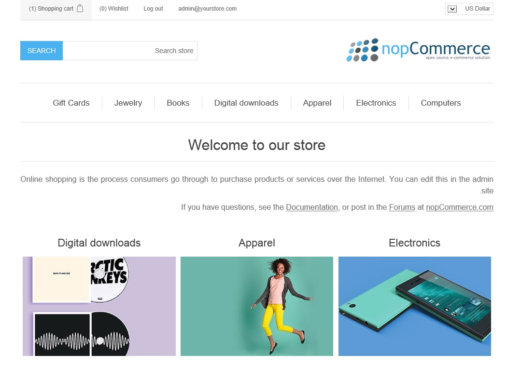
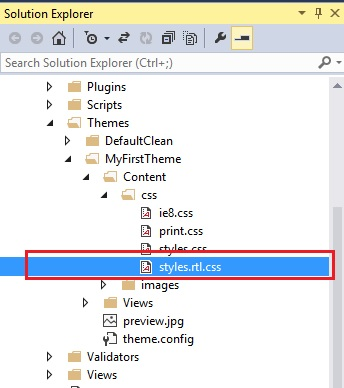

# 由右至左 (RTL) 佈景主題

nopCommerce 同時支援前台網站佈景主題的 RTL（由右至左）版本。

nopCommerce 預設的前台網站佈景主題 **DefaultClean** 內建了由右至左版本的樣式表功能。

若要啟用佈景主題的「由右至左」版本，請前往 **後台 → 設定 → 語言**，點擊語言的 **編輯** 按鈕，並確保已勾選 **由右至左 (Right-to-Left)** 選項。

現在，當您瀏覽前台網站時，看起來會像這樣：

用於支援 RTL 的樣式位於 `styles.rtl.css` 檔案中。

