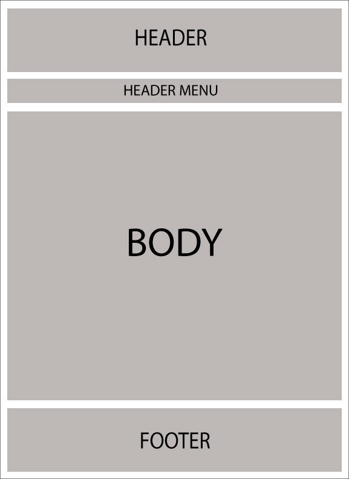
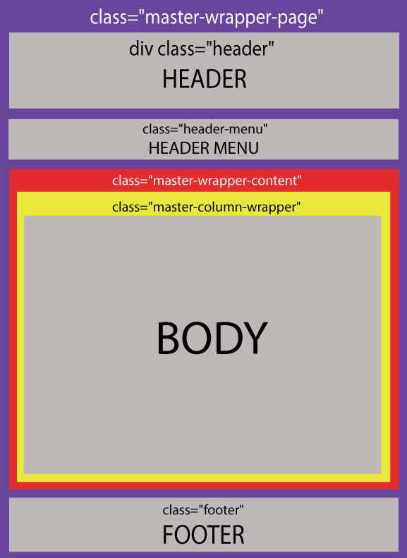
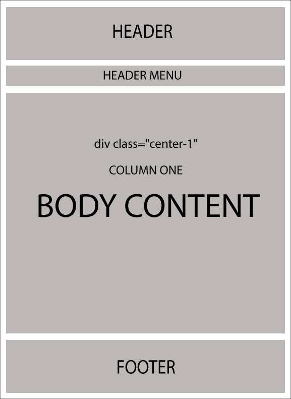
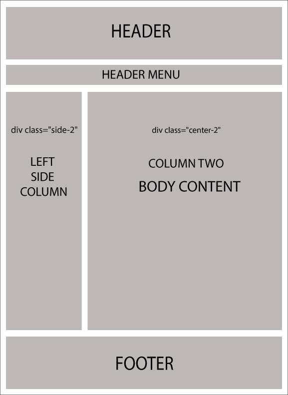

# 瞭解佈局 / 設計

什麼是佈局？每一位網頁開發人員或設計師都希望在網站的所有頁面上保持一致的外觀與感受。在過去，ASP.NET 2.0 引入了「主版頁面 (Master Pages)」的概念，透過將其與 .aspx 頁面對應，協助維持網站的一致性。

Razor 也支援類似的概念，即稱為「佈局 (Layouts)」的功能。它允許您定義一個通用的網站範本，並將其外觀與感受套用到網站上的所有檢視 (Views) 或頁面。

在 nopCommerce 中，有兩種不同的佈局：

* `_ColumnsOne.cshtml`
* `_ColumnsTwo.cshtml`

這兩種佈局皆繼承自一個主要佈局：`_Root.cshtml`。`_Root.cshtml` 本身則繼承自 `_Root.Head.cshtml`。如果您需要連結 CSS 樣式表或 jQuery 檔案，`_Root.Head.cshtml` 就是您需要查看的檔案（您可以在此處新增或連結更多 `.css` 和 `.js` 檔案）。這些佈局在 nopCommerce 中的存放路徑如下：`[nopCommerce root directory]/Views/Shared/...`。如果您使用的是原始碼版本，則位於：`\Presentation\Nop.Web\Views\Shared\...`

* **_Root.cshtml 的佈局**

    

* **`_Root.cshtml` 的佈局（關於 CSS 類別）**

    

現在，以下兩種佈局會覆寫 `_Root.cshtml` 的主體 (Body)：

* `_ColumnsOne.cshtml`

    在此情況下，主體的佈局沒有變更，因此結構與 `_Root.cshtml` 幾乎相同：

    

* `_ColumnsTwo.cshtml`

    在此情況下，主體結構中有兩個欄位：

    