# 行動應用程式說明文件

## 簡介

nopCommerce 團隊提供了 [iOS 與 Android 的行動應用程式](https://www.nopcommerce.com/ecommerce-mobile-app)。這將為您的業務帶來巨大的價值。該行動應用程式完全開箱即用，因此您可以立即開始銷售您的商品與服務。如同 nopCommerce 平台，此行動應用程式隨附原始程式碼，並提供無限的客製化選項。此外，它還能無縫適應您線上商店的設計與功能。將該應用程式與您的 nopCommerce 商店整合、設定其內容與功能、發布至 Google Play Store 和 App Store，以及管理其工作流程，完全不需要具備程式設計或設計技能。

以下是其他一些能確保高效進行行動電子商務發布、客製化與維護的重要功能：

- 使用最新版本的 Flutter 與 Dart 建置

- 相容於 Android 與 iOS

- 使用 Riverpod (狀態管理) 功能

- 易於使用的 UI 與精美的 Material design 3

- 基於 Token 的驗證 (Token-Based Authentication)

- 支援國際化 (多國語言)

- 支援深色與淺色佈景主題

- 免費圖示

## 設定

透過「nopCommerce mobile app」外掛，除了「Web API Frontend」外掛之外，還可以管理部分應用程式設定。

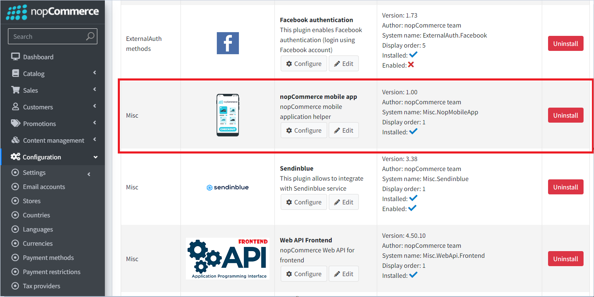

以下功能可供使用：

1. 可以將特定設定傳輸至行動應用程式。此舉是刻意為之，目的是為了避免授予對所有應用程式設定的完整存取權。如果您需要額外的設定，必須確保它們在行動應用程式中受到支援。
1. 主畫面上的輪播圖（Slider）控制。您也可以指定使用者點擊每個輪播圖圖片時，會跳轉至哪些商品。

## Visual Studio Code

Flutter 的推薦開發環境是 [Android Studio](https://developer.android.com/studio)。另一個方便的選擇是 VS Studio Code 編輯器，以下是幫助您舒適地處理程式碼的基本設定，以及開發與除錯所需的擴充功能集。

### 編輯器設定

```json
{
    "[dart]": {
        "editor.codeActionsOnSave": {
            "source.fixAll": true
        },
        "editor.selectionHighlight": false,
        "editor.suggest.snippetsPreventQuickSuggestions": false,
        "editor.suggestSelection": "first",
        "editor.tabCompletion": "onlySnippets",
        "editor.wordBasedSuggestions": false,
    },
    "dart.warnWhenEditingFilesOutsideWorkspace": false,
    "dart.renameFilesWithClasses": "prompt",
    "editor.bracketPairColorization.enabled": true,
    "editor.inlineSuggest.enabled": true,
    "editor.formatOnSave": true,
    "explorer.compactFolders": false,
    "dart.debugExternalPackageLibraries": false,
    "dart.debugSdkLibraries": false,
    "editor.minimap.enabled": false
}
```

### 擴充功能

為了進行開發，您需要安裝下列擴充功能：

名稱：**Flutter**\
識別碼：Dart-Code.flutter\
描述：Visual Studio Code 的 Flutter 支援與除錯工具。\
發佈者：Dart Code\
VS Marketplace 連結：<https://marketplace.visualstudio.com/items?itemName=Dart-Code.flutter>

名稱：**Dart**\
識別碼：Dart-Code.dart-code\
描述：Visual Studio Code 的 Dart 語言支援與除錯工具。\
發佈者：Dart Code\
VS Marketplace 連結：<https://marketplace.visualstudio.com/items?itemName=Dart-Code.dart-code>

## 開始開發與客製化

在購買應用程式後，請使用 Visual Studio Code 編輯器開啟從壓縮檔解壓縮出來的原始程式碼。

在編輯器中開啟專案後，系統會立即提示您下載所包含的程式庫。您也可以在終端機執行以下指令自行下載：

```bash
flutter pub get
```

現在您需要指定一個端點（Endpoint）來連線至伺服器，以便存取 API。此設定位於 `lib\constants\app_constants.dart` 檔案中：

```dart
class AppConstants {
  static const String storeUrl = 'https://yourstore.com';
}
```

現在一切準備就緒，可以執行應用程式了：

```bash
flutter run
```

> [!IMPORTANT]
>
> 請確保 `paymentSettings.BypassPaymentMethodSelectionIfOnlyOne` 設定為停用。
>
> 關於結帳流程設定的另一個一般建議：請勿啟用會停用或跳過步驟的設定（例如 `ordersettings.disablebillingaddresscheckoutstep`）。這類設定在行動應用程式中將不會產生任何作用。

## 專案結構

使用 Flutter 開發的行動應用程式，負責處理與公開商店使用 Web API (Frontend) 進行互動的功能。使用者與應用程式互動的所有主要流程均呈現於下圖：

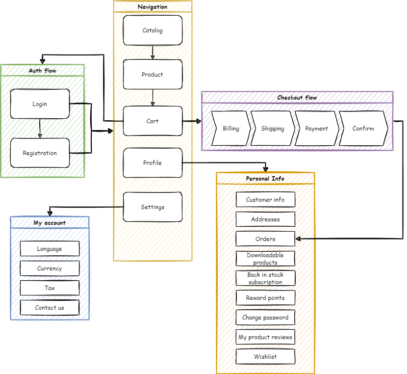

我們將採用一種將應用程式功能視為根資料夾的開發方法。在這些資料夾內，我們會以子資料夾的形式描述該特定功能所具備的架構層。因此，所有與我們感興趣的功能相關的項目都會集中在一個資料夾中，這將大幅簡化對於程式碼的理解。

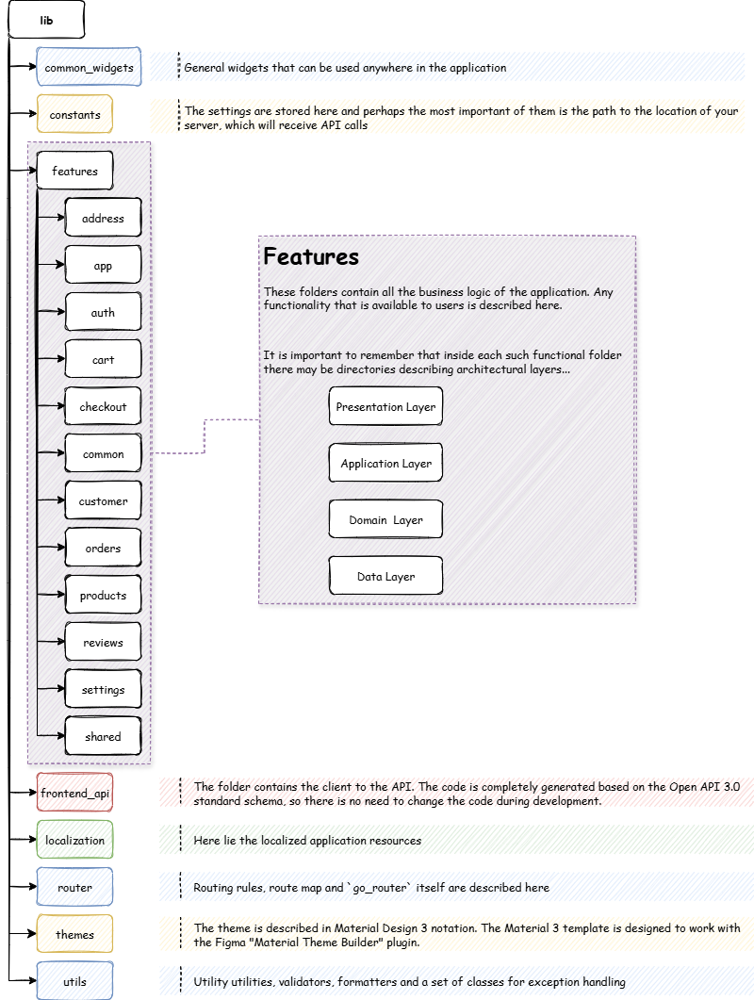

## 技術堆疊

使用的框架與函式庫：

- Flutter SDK 3.35.1
- Dart SDK 3.9.0
- flutter_riverpod: 2.6.1
- go_router: 16.1.0
- flutter_secure_storage: 9.2.4
- dio: 5.9.0

> [!IMPORTANT]
>
> 為了確保應用程式能正確運作，建議使用設定中指定的套件版本。

## 應用程式架構

本應用程式架構是根據普遍認可的標準所建構，相關內容請參閱 [Android 文件](https://developer.android.com/topic/architecture)。由於專案使用 Riverpod 狀態管理系統，該架構已進行擴充，呈現如下：

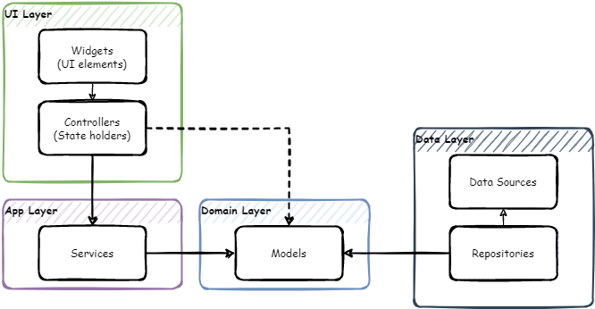

## 導覽 - go_router

應用程式的導覽功能採用 [go_router](https://pub.dev/packages/go_router) 函式庫。這是一套建構於 [Flutter Router API](https://api.flutter.dev/flutter/widgets/Router-class.html) 之上的宣告式路由系統。

應用程式的導覽地圖如下所示：

```bash
├─/splash (SplashScreen)
└─ (ShellRoute)
  ├─/home 
  ├─/catalog 
  │ ├─/catalog/category/:id (CategoryDetailsScreen)
  │ ├─/catalog/manufacturer/:id (ManufacturerDetailsScreen)
  │ ├─/catalog/vendor/:id (VendorDetailsScreen)
  │ ├─/catalog/productsByTag/:id (ProductsByTagScreen)
  │ ├─/catalog/productSearch/:q (ProductsSearchScreen)
  │ └─/catalog/product/:id (ProductDetailsScreen)
  │   ├─/catalog/product/:id/review (ProductReviewScreen)
  │   └─/catalog/product/:id/addReview 
  ├─/cart 
  │ └─/cart/checkout 
  └─/account 
    ├─/account/logincheckout 
    ├─/account/login 
    │ └─/account/login/forgotPassword (ForgotPasswordScreen)
    ├─/account/register 
    ├─/account/settings 
    ├─/account/contactUs 
    ├─/account/wishlist (WishlistScreen)
    ├─/account/accountInfo (AccountInfoScreen)
    ├─/account/accountAddresses (AccountAddressesScreen)
    │ └─/account/accountAddresses/createUpdateAddress/:id teAddressScreen)
    ├─/account/accountOrders (AccountOrdersScreen)
    │ └─/account/accountOrders/orderDetails/:id (OrderDetailsScreen)
    ├─/account/accountDownloadableProducts nloadableProductsScreen)
    ├─/account/accountBackInStock (AccountBackInStockScreen)
    ├─/account/accountRewardPoints (AccountRewardPointsScreen)
    ├─/account/accountChangePassword (AccountChangePassword)
    ├─/account/accountProductReviews (AccountProductReviewsScreen)
    ├─/account/accountGdprTools (AccountGdprToolsScreen)
    ├─/account/accountReturnRequests (AccountReturnRequestsScreen)
    └─/account/returnRequest/:id (ReturnRequestScreen)
```

## Web API 客戶端產生

安裝 [OpenAPI Generator](https://openapi-generator.tech/)（需要 [Node.js](https://nodejs.org/en/download/)）。

若要更新 OpenAPI Generator 的版本，請使用下列指令，並從提供的列表中選擇最新的穩定版本。

```bash
openapi-generator-cli version-manager list
```

建立一個 *openapitools.json* 檔案。
使用 [dart-dio](https://openapi-generator.tech/docs/generators/dart-dio) 產生器。

```json
{
  "$schema": "node_modules/@openapitools/openapi-generator-cli/config.schema.json",
  "spaces": 2,
  "generator-cli": {
    "version": "7.14.0",
    "generators": {
        "frontend": {
            "input-spec": "swagger.json",
            "generator-name": "dart-dio",
            "output": "frontend_api",
            "additionalProperties": {
                "pubName": "frontend_api"
            }
        }
    }
  }
}
```

> [!NOTE]
>
> 若要更新產生器版本，請執行下列指令：
>
> ```bash
> openapi-generator-cli version-manager list
> ```

OpenAPI schema *swagger.json* 必須位於安裝產生器的目錄中。

1. 呼叫下列指令來產生客戶端：

    ```bash
    openapi-generator-cli generate
    ```

1. 標準的 openapi-generator 只會產生依賴 Dart 自身程式碼產生庫的基礎程式碼。因此，在基礎產生完成後，必須啟動 Dart 產生器：

    ```bash
    cd frontend_api
    flutter pub get  
    dart run build_runner build -d
    ```

    最終我們將得到一個現成的套件，它會位於您在設定檔或主控台指令中指定的位置。最後只需將其納入 *pubspec.yaml* 即可：

    ```yaml
    frontend_api: # <- nopCommerce generated api library
        path: lib/frontend_api
    ```

## 在地化

若要進行應用程式本身的介面在地化，您需要將包含語系資訊的檔案放置於 `\lib\localization` 資料夾中。檔案名稱必須符合下列格式，這點非常重要：

`intl_`**{your_language_code_from_server}**`.arb`

您可以直接使用工具包中已有的 *intl_en.arb* 檔案作為基礎，並將其中的資源翻譯為目標語言。

在終端機中執行下列指令，以產生在地化所需的資源檔案。

```bash
flutter gen-l10n
```

您可以確認所有必要的資源皆已正確產生在 `lib\localization\generated\i18n` 路徑下。

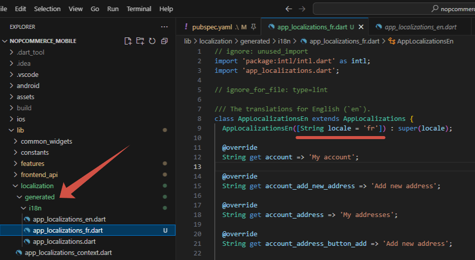

> [!WARNING]
>
> 請勿對此檔案進行任何修改，因為這部分的程式碼是自動產生的。所有在地化的變更都必須嚴格在位於 `\lib\localization` 路徑下的 `intl_`**{your_language_code_from_server}**`.arb` 檔案中進行。

現在，當您在應用程式設定中切換語言時，應用程式介面也會同步在地化。

> [!IMPORTANT]
>
> 嵌入在在地化檔案名稱中的語言代碼，必須與您伺服器上新增的代碼相符。否則，介面將會以預設的語系（即 `en`）進行在地化。

## 設計使用者介面

為了在不同裝置上維持統一且一致的外觀，我們運用了 Material 3 所提供的設計標記 (design tokens)。這些標記可用於儲存樣式、字型與動畫數值，讓我們能在設計檔案與程式碼中使用相同的樣式數值。

使用標記具有以下幾項優勢：

- 一致性：標記確保了跨螢幕與組件之間的設計一致性。
- 佈景主題：透過切換 ColorScheme 或 ThemeData，可輕鬆在淺色/深色/動態佈景主題之間進行變換。
- 可維護性：從單一位置即可變更整個應用程式的外觀（無需搜尋並取代顏色代碼）。
- 設計與開發協作：標記成為了 Figma 與 Flutter 之間的橋樑。

### 整合設計工具的 Tokens

**Material Theme Builder** (MTB) 是一個供設計師與開發者使用的工具，用於建立 Material Design 3 (M3) 的色彩與字體 tokens，並將其匯出為程式碼（如 Flutter、Compose、Android XML、design tokens 等）。它能協助您從種子色（seed/brand color）產生協調的淺色與深色 `ColorScheme`，預覽組件，並匯出可直接用於實作的產出物。

#### 產生色彩配置

1. 開啟 **[Material Theme Builder](https://m3.material.io/theme-builder)**。

1. 挑選一個種子色 / 主要顏色

   - 輸入十六進位數值（hex）、使用色彩選擇器或使用滴管工具。種子色（主要顏色）是產生色調調色盤的唯一起始點。

     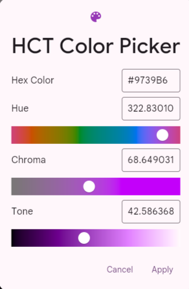

   - 您也可以啟用 *動態色彩* 輸入（桌布/圖片）或匯入圖片來提取顏色 — MTB 將會從該來源衍生出色調調色盤。

     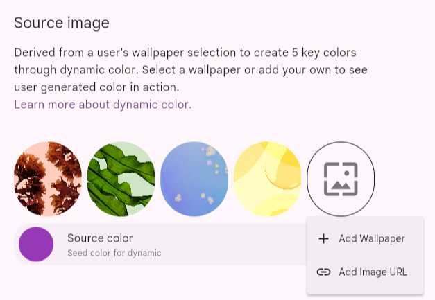

1. 選擇或調整次要 / 第三色 / 錯誤 / 中性色

   MTB 會顯示常見角色的欄位（次要、第三色、錯誤、中性等）。您可以接受自動產生的數值，或覆寫特定的角色顏色（手動輸入十六進位數值）。該產生器會依照 M3 規則保持角色關係的一致性。

   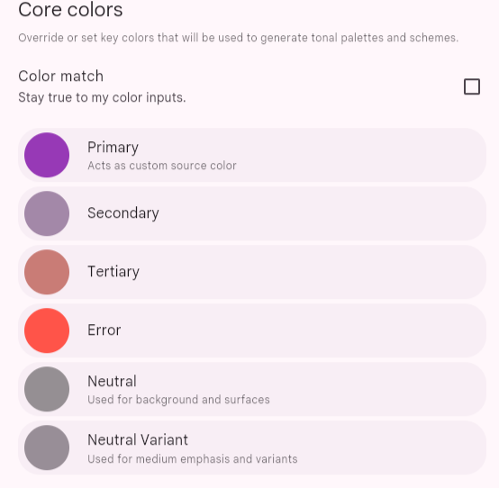

   您需要在這裡為整個配置選擇基礎顏色。例如，如果您的品牌顏色已經定義好了，您可以手動輸入這些數值。在 **Dynamic** 面板上，您可以上傳圖片並從中提取顏色。建議使用 [https://coolors.co/](https://coolors.co/) 服務來產生和諧的色彩。

   點擊 **Start the generator**：

   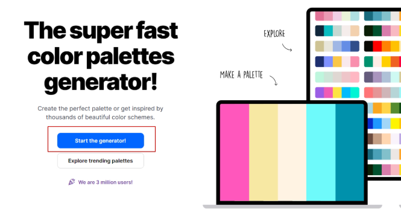

   您可以刪除多餘的區塊直到只剩下 3 個，然後按下空白鍵來產生變化。

1. 在淺色與深色預覽之間切換

   切換 Light/Dark 以立即查看兩種配置；

   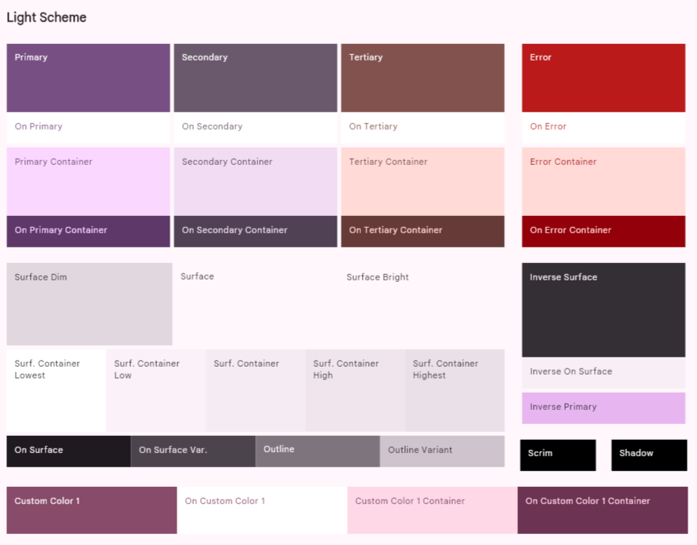

   MTB 會產生配對的淺色/深色 `ColorScheme`，確保在不同的亮度模式下仍能保留對比度與視覺層級。

   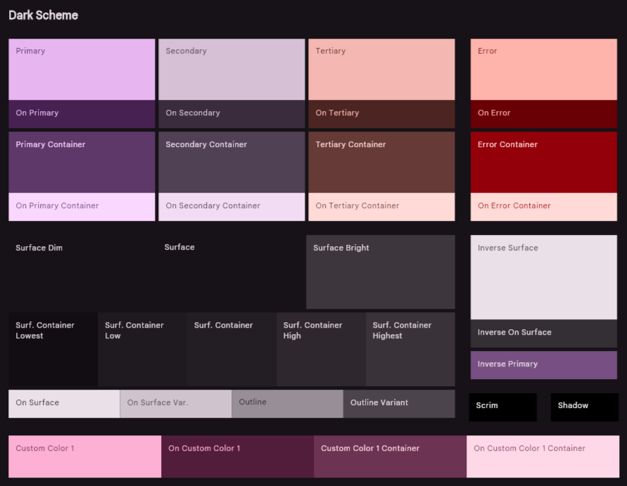

1. 預覽組件與表面

   該產生器提供即時預覽（應用程式列、按鈕、晶片、卡片、列表項目、導覽列、對話框）。請利用這些功能來驗證您的調色盤在表面、文字、圖示與互動控制項上的表現。

   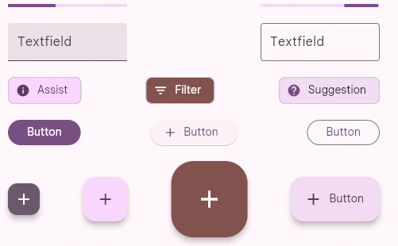

1. 使用色彩匹配 / 和諧化

   如果您有與已產生的色調調色盤衝突的品牌顏色，MTB 提供了色彩匹配或和諧化模式，這些模式會調整調色盤以與品牌色調協調，同時仍遵循 M3 的色調規則。當您從多種品牌顏色開始設計時，此功能非常實用。

   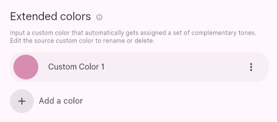

1. 排版

   選擇基礎字型系列。MTB 可以產生排版用的 tokens（字重、尺寸、行高）來搭配您的色彩 tokens。

   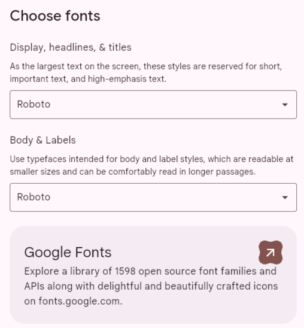

1. 匯出

    選擇匯出格式 - **Flutter (Dart)**，然後匯出/下載包含程式碼產出物與 token 檔案的 ZIP。對於 Flutter，產生器通常會產生一個 `theme.dart` 檔案，您可以將其放入您的專案中。

    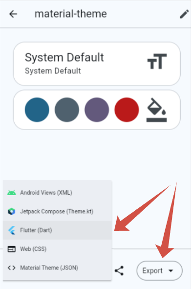

#### theme.dart 檔案概述

一旦您在 *Material Theme Builder* 中建立並匯出了您的調色盤，您將會得到一個 `theme.dart` 檔案。此檔案是為您的應用程式設定樣式的起點。通常，其主要內容包含兩個 `ColorScheme` 物件：

- `lightScheme`：定義應用程式淺色主題的一組顏色（例如在淺色模式下的背景、文字與強調色）。

- `darkScheme`：定義深色主題的相同顏色。

這些配置是根據您選擇的種子色所產生的，並確保在整個應用程式中遵循 Material Design 3 的原則，提供和諧且一致的色彩組合。

#### 將 theme.dart 整合至專案

為了保持專案結構井然有序，建議將與主題相關的檔案儲存在獨立的目錄中。

將產生的 `ColorScheme` 物件從 `theme.dart` 取代至 - `lib/themes/material_theme.dart`。

隨著您的設計系統擴展，您可能需要引入自訂 tokens（例如特定的品牌顏色、語意狀態）。請使用擴充功能（extensions）。此程式碼展示了行動應用程式中使用的擴充功能 tokens。

```dart
ThemeData theme(ColorScheme colorScheme) => ThemeData(
        useMaterial3: true,
        brightness: colorScheme.brightness,
        colorScheme: colorScheme,
        textTheme: textTheme.apply(
          bodyColor: colorScheme.onSurface,
          displayColor: colorScheme.onSurface,
        ),
        scaffoldBackgroundColor: colorScheme.surface,
        canvasColor: colorScheme.surface,
        // defailt extensions - BEGIN
        extensions: [
          CustomColors(
            subTextColor: colorScheme.onSurfaceVariant,
            ratingStarColor: colorScheme.secondary,
            pictureIndicatorColor: colorScheme.surfaceContainerHighest,
            pictureIndicatorCurrentColor: colorScheme.primary,
            inStockColor: colorScheme.tertiary,
            outOfStockColor: colorScheme.error,
          ),
        ],
        // defailt extensions - END
      );
```

>[!NOTE]
>
> 您可以使用 `theme.dart` 檔案中的所有內容，但別忘了包含 `custom_color_scheme.dart` 檔案中可用的預設擴充功能。

就這樣 — 重新啟動應用程式，盡情享受您的新色彩配置吧。

## 發佈至 Google Play 商店

將您的 Flutter 應用程式發佈到 Google Play 商店的流程包含準備、建置，以及將應用程式上傳至 Google Play Console。

關鍵步驟：

1. 註冊 Google Play 開發者帳號：您需要註冊一個開發者帳號。
1. 準備發佈應用程式：這包括在 `pubspec.yaml` 檔案中設定應用程式名稱、圖示和版本號，並設定必要的權限。
1. 簽署應用程式：您必須產生一個上傳金鑰儲存庫（keystore）並用它簽署您的應用程式，以驗證您的身分。
1. 建置發佈版本：使用 `flutter build appbundle` 指令來建立應用程式的 Android App Bundle (*.aab*)。
1. 在 Google Play Console 上發佈：在您的 Play Console 中建立新的應用程式清單，填寫所有必要的商店資訊（標題、描述、螢幕截圖、隱私權政策），並上傳您的 *.aab* 檔案進行審核。

官方文件：[建置並發佈 Android 應用程式](https://docs.flutter.dev/deployment/android)

## 發佈至 Apple App Store

部署至 Apple App Store 需要加入 Apple Developer Program，並使用 Xcode 來管理流程的最後步驟。

關鍵步驟：

1. 加入 Apple Developer Program：這是一項年度付費訂閱服務，讓您獲得在 App Store 發佈應用程式的權限。
1. 在 Xcode 中設定專案：在 Xcode 中開啟專案的 `ios` 資料夾，以設定 Bundle ID、版本號碼以及程式碼簽署（code signing）設定。
1. 建立 App Store Connect 列表：登入 App Store Connect 以建立新的應用程式記錄。您將在此輸入應用程式的所有中繼資料，例如名稱、描述、螢幕截圖、關鍵字以及隱私權資訊。
1. 建置並封存（Archive）應用程式：使用 Xcode 建立應用程式的建置封存檔 (*.ipa*)。
1. 上傳至 App Store Connect：使用 Xcode 或 Transporter 工具上傳已封存的建置檔。
1. 提交審核：當建置檔處理完成且所有中繼資料填寫完畢後，您即可將應用程式提交給 Apple 進行審核。

官方文件：[建置並發佈 iOS 應用程式](https://docs.flutter.dev/deployment/ios)