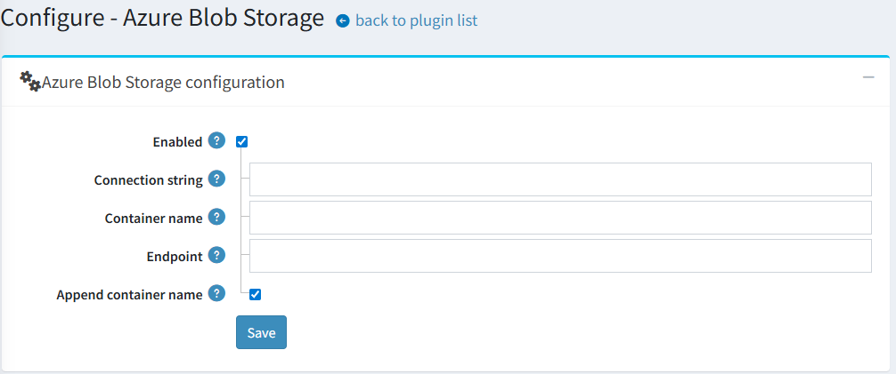
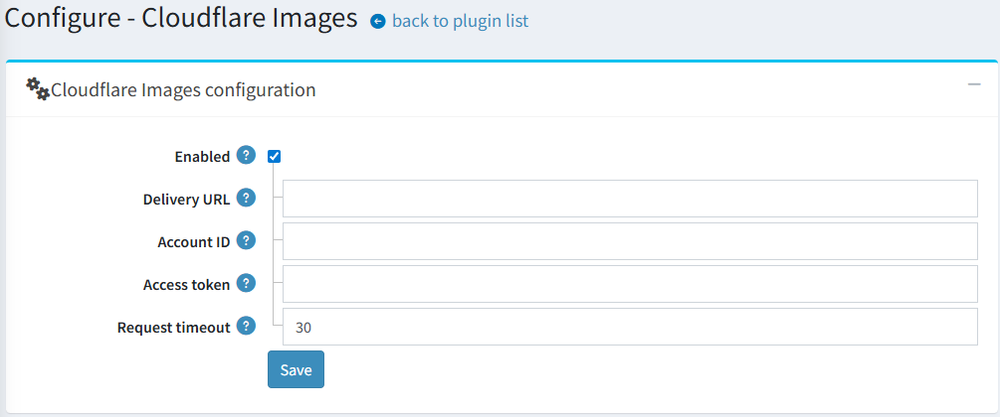

# Cloudflare Images 整合

## 概述

從 4.90 版本開始，縮圖管理功能已進行重構以提供更高的彈性。系統引入了一個新的介面 `IThumbService` 來處理先前由 `IPictureService` 所管理的所有縮圖相關操作。

以下方法已移至 `IThumbService`：

- `GetThumbLocalPathAsync`
- `GeneratedThumbExistsAsync`
- `SaveThumbAsync`
- `GetThumbLocalPathByFileNameAsync`
- `GetThumbUrlAsync`
- `DeletePictureThumbsAsync`

作為此項變更的一部分，縮圖儲存邏輯已從核心應用程式中解耦，改為獨立的外掛。現有的 **Azure Blob Storage** 功能現在是一個獨立的外掛。此外，我們也開發了一個新的外掛，將 **Cloudflare Images** 作為縮圖儲存解決方案整合進來。

> [!NOTE]
>
> 預設情況下，Azure Blob 和 Cloudflare Images 外掛（`Misc.AzureBlob` 和 `Misc.CloudflareImages`）都會列在 `InstallationConfig.DisabledPlugins` 屬性中。這確保了這些外掛不會在全新安裝時自動啟用，讓商店負責人能根據需求選擇並安裝最合適的儲存解決方案。

## 設定 Azure Blob Storage

我們可以使用 *Azure Blob Storage* 來儲存 Blob 資料。nopCommerce 已經內建此功能的整合，您只需要正確設定以下資訊即可使用。這些設定值可以在您於 *Azure* 建立儲存帳戶時取得。



- **ConnectionString** 此設定需要一個字串值。您需要在此處加入您的 `AzureBlobStorage` 連接字串。
- **ContainerName** 此設定的值同樣為字串類型。在此設定中，我們指定 *Azure BLOB storage* 的容器名稱。
- **EndPoint** 此設定同樣需要一個字串值。我們需要在這裡設定 *Azure BLOB storage* 的端點。
- **AppendContainerName** 此設定需要一個布林值。根據在建構 URL 時是否需要將容器名稱附加到 `EndPoint`，將此值設為 **`true`** 或 **`false`**。

## 設定 Cloudflare Images

此外掛的設定相當簡單，除了總開關之外，包含四個欄位。



其中一個關鍵欄位是 **Delivery URL**。它必須依照下列特定格式進行設定：

```bash
https://imagedelivery.net/[account_hash]/<image_id>/<variant_name>
```

此 URL 作為一個範本。此外掛將動態插入所需的 `image_id` 和 `variant_name`，以產生顯示在網站上的縮圖最終 URL。

## 使用方式

一旦設定完成並啟用，此外掛便會在背景自動運作，與 Azure Blob storage 的整合方式類似。它會無縫處理以下事項：

- 將新縮圖上傳至 Cloudflare Images 服務。
- 在所有公開頁面上，將本機縮圖 URL 取代為對應的 Cloudflare Images URL。