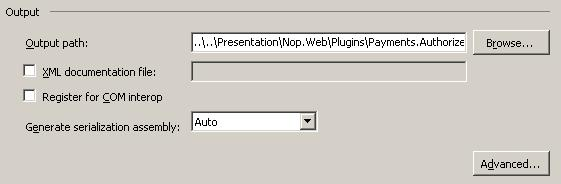
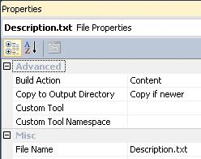
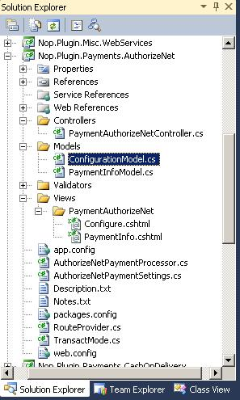

# 如何為 nopCommerce 3.90（及先前版本）編寫外掛

> 在電腦運算中，外掛（plug-in 或 plugin）是一組軟體元件，能為較大型的軟體應用程式添加特定功能（來源：維基百科）。

外掛用於擴充 nopCommerce 的功能。nopCommerce 擁有多種不同類型的外掛。例如：付款方式（如 PayPal）、稅額提供者、運送方式計算方法（如 UPS、USPS、FedEx）、小工具（如「線上客服」區塊）等等。nopCommerce 本身已內建許多不同的外掛。您也可以在 [nopCommerce 官方網站](https://www.nopcommerce.com/marketplace) 搜尋各種外掛，看看是否已經有人開發了符合您需求的外掛。如果沒有，這篇文章將指引您完成建立自訂外掛的過程。

## 外掛結構、必要檔案與位置

1. 您需要做的第一件事是在方案中建立一個新的「類別庫 (Class Library)」專案。將所有外掛放置在方案根目錄的 `\Plugins` 目錄中是一個良好的習慣（請勿與位於 `\Nop.Web` 目錄下的 `\Plugins` 子目錄混淆，後者是用於已部署的外掛）。將所有外掛放置在「Plugins」方案資料夾中也是一種良好的做法（您可以從 [here](http://msdn.microsoft.com/library/sx2027y2.aspx) 找到更多關於方案資料夾的資訊）。

    建議的外掛專案命名為 "Nop.Plugin.{Group}.{Name}"。其中 {Group} 是您的外掛群組（例如 "Payment" 或 "Shipping"），{Name} 是您的外掛名稱（例如 "PayPalStandard"）。例如，PayPal Standard 付款外掛的名稱為：Nop.Plugin.Payments.PayPalStandard。但請注意，這並非強制規定，您可以為外掛選擇任何名稱，例如 "MyGreatPlugin"。

    

1. 建立外掛專案後，請更新專案的組建輸出路徑，將其設為 `..\..\Presentation\Nop.Web\Plugins\{Group}.{Name}`。例如，Authorize.NET 付款外掛的輸出路徑為：`..\..\Presentation\Nop.Web\Plugins\Payments.AuthorizeNet`。完成後，適當的外掛 DLL 將會自動複製到 `\Presentation\Nop.Web\Plugins` 目錄，nopCommerce 核心會從該目錄搜尋有效的外掛。但請注意，這同樣不是強制規定，您可以為外掛選擇任何輸出目錄名稱。

    

    - 在「專案 (Project)」選單上，點擊「屬性 (Properties)」。
    - 點擊「建置 (Build)」索引標籤。
    - 點擊「輸出路徑 (Output path)」方塊旁的「瀏覽 (Browse)」按鈕，並選擇一個新的組建輸出目錄。

    您應該對所有現有的設定（「Debug」和「Release」）執行上述步驟。

1. 下一步是建立每個外掛都必須具備的 `Description.txt` 檔案。此檔案包含描述您外掛的中繼資料。只需從任何其他現有的外掛複製此檔案並根據您的需求進行修改即可。例如，PayPal Standard 付款外掛擁有以下 `Description.txt` 檔案：

    ```txt
    Group: Payment methods
    FriendlyName: PayPal Standard
    SystemName: Payments.PayPalStandard
    Version: 1.28
    SupportedVersions: 3.90
    Author: nopCommerce team
    DisplayOrder: 1
    FileName: Nop.Plugin.Payments.PayPalStandard.dll
    Description: This plugin allows paying with PayPal Standard
    ```

    所有欄位皆不言自明，但以下提供幾點注意事項。**SystemName** 欄位必須是唯一的。**Version** 欄位是您外掛的版本號，您可以將其設為任何您喜歡的值。**SupportedVersions** 欄位可以包含以逗號分隔的 nopCommerce 支援版本列表（請確保當前的 nopCommerce 版本包含在此列表中，否則外掛將不會被載入）。**FileName** 欄位格式為 *Nop.Plugin.{Group}.{Name}.dll*（這是您的外掛組件檔案名稱）。請確保此檔案的「複製到輸出目錄 (Copy to Output Directory)」屬性已設為「如果較新則複製 (Copy if newer)」。

    

1. 您還應該建立一個 web.config 檔案，並確保它會被複製到輸出目錄中。只需從任何現有的外掛複製即可。

    > [!IMPORTANT]
    > 接下來請確保所有第三方組件參考（包含核心函式庫，如 Nop.Services.dll 或 Nop.Web.Framework.dll）的「Copy local」屬性皆設為「False」（不複製）。

1. 最後一個必要步驟是建立一個實作 `IPlugin` 介面（位於 Nop.Core.Plugins 命名空間）的類別。nopCommerce 擁有 `BasePlugin` 類別，它已經實作了部分 `IPlugin` 方法，可讓您避免重複撰寫原始程式碼。nopCommerce 也提供了一些衍生自 `IPlugin` 的特定介面。例如，我們有用於建立新付款方式外掛的 `IPaymentMethod` 介面。它包含一些僅針對付款方式的方法，如 ProcessPayment() 或 GetAdditionalHandlingFee()。目前，nopCommerce 擁有以下特定的外掛介面：

   - **IPaymentMethod**：這些外掛用於處理付款。
   - **IShippingRateComputationMethod**：這些外掛用於檢索接受的運送方式及相應的運費計算。例如 UPS、FedEx 等。
   - **IPickupPointProvider**：這些外掛用於提供取貨點。
   - **ITaxProvider**：稅務提供者用於取得稅率。
   - **IExchangeRateProvider**：用於取得貨幣匯率。
   - **IDiscountRequirementRule**：允許您建立新的折扣規則，例如「顧客的結帳國家必須是……」。
   - **IExternalAuthenticationMethod**：用於建立外部驗證方法，如 Facebook、Twitter、OpenID 等。
   - **IWidgetPlugin**：允許您建立小工具。小工具會渲染在網站的某些部位，例如網站左側欄位的「即時對話 (Live chat)」區塊。
   - **IMiscPlugin**：若您的外掛不符合上述任何介面，請使用此介面。

> [!IMPORTANT]
> 每次建置專案後，在進行變更前請先清理方案。某些資源會被快取，這可能會導致開發人員崩潰。

## 處理請求：控制器、模型與檢視

現在，您可以透過前往 **後台 → 設定 → 外掛** 來看到您的外掛。但正如您所料，我們的外掛目前還沒有任何功能。它甚至沒有用於設定的使用者介面。讓我們建立一個頁面來設定此外掛。

我們現在需要做的是建立一個控制器 (Controller)、一個模型 (Model) 以及一個檢視 (View)。

- MVC 控制器負責回應針對 ASP.NET MVC 網站所提出的請求。每個瀏覽器請求都會對應到特定的控制器。
- 檢視包含傳送到瀏覽器的 HTML 標記與內容。在開發 ASP.NET MVC 應用程式時，檢視相當於一個頁面。
- MVC 模型包含應用程式中所有未包含在檢視或控制器中的應用程式邏輯。

您可以找到更多關於 MVC 模式的資訊 [here](http://www.asp.net/mvc/tutorials/older-versions/overview/understanding-models-views-and-controllers-cs)。

那麼讓我們開始吧：

- **建立模型**：在新的外掛中加入一個 Models 資料夾，然後加入一個符合您需求的模型類別。
- **建立檢視**：在新的外掛中加入一個 Views 資料夾，接著加入一個 {Name} 資料夾（其中 {Name} 是您的外掛名稱），最後加入一個名為 `Configure.cshtml` 的 cshtml 檔案。重要提示：對於 2.00-3.30 版本，檢視應標記為嵌入式資源。從 3.40 版本開始，請確保檢視檔案的「Build Action」屬性設為「Content」，並將「Copy to Output Directory」屬性設為「Copy if newer」。
- **建立控制器**：在新的外掛中加入一個 Controllers 資料夾，然後加入一個新的控制器類別。一個良好的做法是將外掛控制器命名為 `{Group}{Name}Controller.cs`。例如：PaymentAuthorizeNetController。當然，這並非強制規定（僅為建議）。接著，為設定頁面（在管理後台）建立一個對應的動作方法 (Action method)。讓我們將其命名為 "Configure"。準備一個模型類別並將其傳遞給對應的檢視。對於 nopCommerce 2.00-3.30 版本，您應該傳遞嵌入式檢視路徑 - "Nop.Plugin.{Group}.{Name}.Views.{Group}{Name}.Configure"。從 nopCommerce 3.40 版本開始，您應該傳遞實體檢視路徑 - `~/Plugins/{PluginOutputDirectory}/Views/{ControllerName}/Configure.cshtml`。例如，開啟 Authorize.NET 付款外掛並查看其 PaymentAuthorizeNetController 的實作方式。

    > [!TIP]
    >
    > - 完成上述步驟最簡單的方法是開啟任何其他外掛，並將這些檔案複製到您的外掛專案中。然後只需重新命名對應的類別與目錄即可。
    >
    > - 如果您想限制只有管理員（商店擁有者）才能存取控制器的特定動作方法，只需使用 [AdminAuthorize] 屬性標記它即可。

    例如，Authorize.NET 外掛的專案結構如下圖所示：

    

## 路由

現在我們需要註冊適當的外掛路由。ASP.NET 路由負責將傳入的瀏覽器請求對應到特定的 MVC 控制器動作。您可以參考 [here](http://www.asp.net/mvc/tutorials/older-versions/controllers-and-routing/asp-net-mvc-routing-overview-cs) 以獲取關於路由的更多資訊。請遵循以下步驟：

- 部分特定外掛介面（如上述說明）以及 `IMiscPlugin` 介面擁有以下方法：「GetConfigurationRoute」。它應該回傳一個用於外掛設定的控制器動作路由。請在您的外掛介面中實作 `GetConfigurationRoute` 方法。此方法會通知 nopCommerce 關於外掛設定所使用的路由。如果您的外掛沒有設定頁面，則 `GetConfigurationRoute` 應回傳 null。範例如下：

    ```csharp
    public void GetConfigurationRoute(out string actionName,
                out string controllerName,
                out RouteValueDictionary routeValues)
    {
        actionName = "Configure";
        controllerName = "PaymentAuthorizeNet";
        routeValues = new RouteValueDictionary()
        {
            { "Namespaces", "Nop.Plugin.Payments.AuthorizeNet.Controllers" },
            { "area", null }
        };
    }
    ```

- （選用）如果您需要新增自訂路由，請建立 `RouteProvider.cs` 檔案。它會將外掛路由資訊通知給 nopCommerce 系統。例如，以下的 RouteProvider 類別新增了一條新路由，您可以透過開啟網頁瀏覽器並前往 `http://www.yourStore.com/Plugins/PaymentPayPalStandard/PDTHandler` URL 來存取（PayPal 外掛即使用此方式）：

    ```csharp
    public partial class RouteProvider : IRouteProvider
    {
        public void RegisterRoutes(RouteCollection routes)
        {
             routes.MapRoute("Plugin.Payments.PayPalStandard.PDTHandler",
                 "Plugins/PaymentPayPalStandard/PDTHandler",
                 new { controller = "PaymentPayPalStandard", action = "PDTHandler" },
                 new[] { "Nop.Plugin.Payments.PayPalStandard.Controllers"  }
            );
        }

        public int Priority
        {
            get
            {
                return 0;
            }
        }
    }
    ```

    一旦您安裝了外掛並新增了設定方法，您就能在 **後台 → 設定 → 外掛** 下方找到連結來設定您的外掛。

## 處理「安裝 (Install)」與「解除安裝 (Uninstall)」方法

此步驟為選用。有些外掛在安裝過程中可能需要額外的邏輯。例如，外掛可能需要插入新的語系資源。因此，請開啟您的 `IPlugin` 實作（大多數情況下會繼承自 `BasePlugin` 類別）並覆寫下列方法：

- Install。此方法將在外掛安裝期間被呼叫。您可以在此初始化任何設定、插入新的語系資源，或建立一些新的資料庫表格（若有需要）。
- Uninstall。此方法將在外掛解除安裝期間被呼叫。

> [!IMPORTANT]
> 如果您覆寫了這些方法中的其中一個，請勿隱藏其基礎實作。

例如，Authorize.NET 外掛的專案結構如下圖所示：

```csharp
public override void Install()
{
    var settings = new AuthorizeNetPaymentSettings()
    {
        UseSandbox = true,
        TransactMode = TransactMode.Authorize,
        TransactionKey = "123",
        LoginId = "456"
    };
    _settingService.SaveSetting(settings);
    base.Install();
}
```

> [!TIP]
> 已安裝外掛的清單位於 `\App_Data\InstalledPlugins.txt`。該清單是在安裝過程中建立的。

## 升級 nopCommerce 可能會導致外掛失效

部分外掛可能會因為版本過舊，而無法在新版的 nopCommerce 中運作。如果您在升級至新版本後遇到問題，請刪除該外掛，並前往 nopCommerce 官方網站查看是否有更新的版本。許多外掛開發者會更新其外掛以適應新版本，然而，有些開發者可能不會這麼做，導致其外掛隨著 nopCommerce 的改良而遭到淘汰。但在大多數情況下，您只需開啟適當的 `plugin.json` 檔案並更新 **SupportedVersions** 欄位即可。

## 結論

希望這能協助您開始使用 nopCommerce，並為您日後開發更複雜的外掛做好準備。