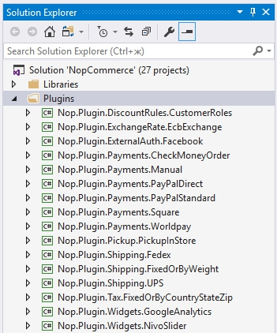
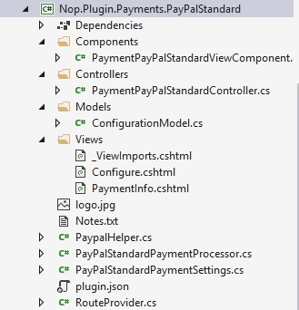

# 如何為 nopCommerce 4.00 編寫外掛

> 在電腦運算中，外掛（plugin）是一組軟體元件，能為大型軟體應用程式新增特定功能（維基百科）。

外掛用於擴充 nopCommerce 的功能。nopCommerce 擁有幾種類型的外掛。例如，付款方式（如 PayPal）、稅務提供者、運送方式計算方法（如 UPS、USPS、FedEx）、小工具（如「線上交談」區塊）以及其他多種功能。nopCommerce 本身已經內建了許多不同的外掛。您也可以在 [nopCommerce 官方網站](https://www.nopcommerce.com/marketplace) 上搜尋各種外掛，看看是否已經有人開發了符合您需求的外掛。如果沒有，本文將引導您完成建立自訂外掛的過程。

## 外掛結構、必要檔案與位置

1. 首先，您需要為方案建立一個新的「類別庫 (Class Library)」專案。建議將所有外掛放置於方案根目錄下的 `\Plugins` 目錄中（請勿與位於 `\Nop.Web` 目錄下的 `\Plugins` 子目錄混淆，該目錄是專門用於已部署的外掛）。將所有外掛放置於「Plugins」方案資料夾中是一個良好的習慣（關於方案資料夾的更多資訊，請參閱 [here](http://msdn.microsoft.com/library/sx2027y2.aspx)）。

    建議的外掛專案命名方式為「Nop.Plugin.{Group}.{Name}」。其中 {Group} 是您的外掛群組（例如「Payment」或「Shipping」），{Name} 則是您的外掛名稱（例如「PayPalStandard」）。例如，PayPal Standard 付款外掛的名稱為：Nop.Plugin.Payments.PayPalStandard。但請注意，這並非強制規定，您可以為外掛選擇任何名稱，例如「MyGreatPlugin」。

    

1. 外掛專案建立完成後，您必須使用任何文字編輯器開啟其 `.csproj` 檔案，並將其內容取代為以下內容：

    ```xml
    <Project Sdk="Microsoft.NET.Sdk">
     <PropertyGroup>
       <TargetFramework>net461</TargetFramework>
     </PropertyGroup>
     <PropertyGroup Condition="'$(Configuration)|$(Platform)'=='Release|AnyCPU'">
       <OutputPath>..\..\Presentation\Nop.Web\Plugins\PLUGIN_OUTPUT_DIRECTORY</OutputPath>
       <OutDir>$(OutputPath)</OutDir>
     </PropertyGroup>
     <PropertyGroup Condition="'$(Configuration)|$(Platform)'=='Debug|AnyCPU'">
       <OutputPath>..\..\Presentation\Nop.Web\Plugins\PLUGIN_OUTPUT_DIRECTORY</OutputPath>
       <OutDir>$(OutputPath)</OutDir>
     </PropertyGroup>
     <!-- This target execute after "Build" target -->
     <Target Name="NopTarget" AfterTargets="Build">
       <!-- Delete unnecessary libraries from plugins path -->
       <MSBuild Projects="$(MSBuildProjectDirectory)\..\..\Build\ClearPluginAssemblies.proj"    Properties="PluginPath=$(MSBuildProjectDirectory)\$(OutDir)" Targets="NopClear" />
     </Target>
    </Project>
    ```

    其中 PLUGIN_OUTPUT_DIRECTORY 應替換為外掛名稱，例如 Payments.PayPalStandard。

    我們採用這種方式，是為了能夠使用 .NET Core 引入的新方法來新增第三方參考。但這並非強制要求。此外，已參考之函式庫中的參考項目會自動載入，非常方便。

1. 下一步是為每個外掛建立必要的 `plugin.json` 檔案。此檔案包含描述您外掛的中繼資料。只需從任何其他現有外掛複製此檔案，並根據您的需求進行修改即可。有關 `plugin.json` 檔案的資訊，請參閱 [plugin.json file](xref:zh-Hant/developer/plugins/plugin_json)。

1. 最後一個必要步驟是建立一個實作 `IPlugin` 介面（位於 Nop.Core.Plugins 命名空間）的類別。nopCommerce 提供了 `BasePlugin` 類別，該類別已實作部分 `IPlugin` 方法，可讓您避免重複撰寫原始程式碼。nopCommerce 還提供了一些衍生自 `IPlugin` 的特定介面。例如，「IPaymentMethod」介面用於建立新的付款方式外掛。它包含一些僅適用於付款方式的方法，例如 `ProcessPayment()` 或 `GetAdditionalHandlingFee()`。目前，nopCommerce 具備以下特定的外掛介面：

   - **IPaymentMethod**：這些外掛用於處理付款。
   - **IShippingRateComputationMethod**：這些外掛用於取得可用的配送方式與對應的運費。例如 UPS、FedEx 等。
   - **IPickupPointProvider**：這些外掛用於提供取貨點。
   - **ITaxProvider**：稅務提供者用於取得稅率。
   - **IExchangeRateProvider**：用於取得匯率。
   - **IDiscountRequirementRule**：允許您建立新的折扣規則，例如「顧客的帳單地址國家必須是……」。
   - **IExternalAuthenticationMethod**：用於建立外部驗證方式，例如 Facebook、Twitter、OpenID 等。
   - **IWidgetPlugin**：允許您建立小工具。小工具會呈現在網站的某些區塊中。例如，網站左欄的「線上客服」區塊。
   - **IMiscPlugin**：如果您的外掛不屬於上述任何介面，請使用此介面。

> [!IMPORTANT]
> 每次建置專案後，在進行變更之前請先清理方案。某些資源會被快取，這可能會導致開發者抓狂。

## 處理請求：控制器、模型與檢視

現在您可以前往 **管理後台 → 設定 → 外掛** 查看您的外掛。但如您所料，我們的外掛目前什麼功能都沒有，甚至連設定用的使用者介面都沒有。讓我們來建立一個頁面來設定外掛。

我們現在需要做的是建立一個控制器 (Controller)、一個模型 (Model) 以及一個檢視 (View)。

- MVC 控制器負責回應針對 ASP.NET MVC 網站發出的請求。每個瀏覽器請求都會對應到特定的控制器。
- 檢視包含發送到瀏覽器的 HTML 標記與內容。在開發 ASP.NET MVC 應用程式時，檢視就等同於一個頁面。
- MVC 模型包含應用程式中所有未包含在檢視或控制器中的邏輯。

您可以透過 [here](http://www.asp.net/mvc/tutorials/older-versions/overview/understanding-models-views-and-controllers-cs) 找到更多關於 MVC 模式的資訊。

那麼讓我們開始吧：

- **建立模型**：在新的外掛中加入一個 `Models` 資料夾，然後新增一個符合您需求的模型類別。
- **建立檢視**：在新的外掛中加入一個 `Views` 資料夾，然後新增一個名為 `Configure.cshtml` 的 cshtml 檔案。將該檢視檔案的「Build Action」屬性設為「Content」，並將「Copy to Output Directory」屬性設為「Copy if newer」。請注意，設定頁面應使用 `_ConfigurePlugin` 範本。此外，請確保您的 `\Views` 目錄中有 `_ViewImports` 檔案。您可以直接從任何現有的外掛中複製一份。
- **建立控制器**：在新的外掛中加入一個 `Controllers` 資料夾，然後新增一個控制器類別。一個良好的做法是將外掛控制器命名為 `{Group}{Name}Controller.cs`。例如：`PaymentPayPalStandardController`。當然，這並非強制性要求（僅為建議）。接著，為設定頁面（在管理後台區域）建立適當的動作方法。我們將其命名為「Configure」。準備一個模型類別並使用實體檢視路徑將其傳遞給檢視：`~/Plugins/{PluginOutputDirectory}/Views/Configure.cshtml`。
- 請為您的動作方法使用以下屬性：

    ```csharp
    [AuthorizeAdmin] //confirms access to the admin panel
    [Area(AreaNames.Admin)] //specifies the area containing a controller or action
    ```

    例如，開啟 PayPalStandard 付款外掛並查看其 `PaymentPayPalStandardController` 的實作。

接著，對於每個擁有設定頁面的外掛，您都應該指定一個設定 URL。名為 `BasePlugin` 的基礎類別擁有 `GetConfigurationPageUrl` 方法，該方法會回傳一個設定 URL：

```csharp
return $"{_webHelper.GetStoreLocation()}Admin/ControllerName/ActionName";
```

其中 ControllerName 是您的控制器名稱，ActionName 是動作名稱（通常為「Configure」）。

一旦您安裝了外掛並新增了設定方法，您就會在 **管理後台 → 設定 → 外掛** 下方找到連結來設定您的外掛。

> [!TIP]
> 完成上述步驟最簡單的方法是開啟任何其他外掛，將這些檔案複製到您的外掛專案中，然後重新命名對應的類別與目錄。

例如，PayPalStandard 外掛的專案結構如下圖所示：



## 處理「Install」與「Uninstall」方法

此步驟為選填。有些外掛在安裝過程中可能需要額外的邏輯。例如，外掛可能需要插入新的語言資源。請開啟您的 `IPlugin` 實作（大多數情況下會繼承自 `BasePlugin` 類別）並覆寫下列方法：

- Install。此方法將在外掛安裝期間被呼叫。您可以在此初始化任何設定、插入新的語言資源，或是建立新的資料庫資料表（如有需要）。
- Uninstall。此方法將在外掛移除期間被呼叫。

> [!IMPORTANT]
> 如果您覆寫了這些方法其中之一，請勿隱藏其基礎實作。

例如，覆寫的「Install」方法應包含下列方法呼叫：base.Install()。PayPalStandard 外掛的「Install」方法看起來如下方程式碼所示：

```csharp
public override void Install()
{
    var settings = new PayPalStandardPaymentSettings()
    {
        UseSandbox = true
    };
    _settingService.SaveSetting(settings);
    base.Install();
}
```

> [!TIP]
> 已安裝外掛的清單位於 `\App_Data\installedPlugins.json`。該清單會在安裝過程中建立。

## 路由

在這裡，我們將了解如何註冊外掛路由。ASP.NET Core 路由負責將傳入的瀏覽器請求對應到特定的 MVC 控制器動作。您可以參考 [here](https://docs.microsoft.com/aspnet/core/fundamentals/routing) 以取得關於路由的更多資訊。請遵循以下步驟：

- 如果您需要新增自訂路由，請建立 `RouteProvider.cs` 檔案。它會將外掛路由通知 nopCommerce 系統。例如，以下的 RouteProvider 類別新增了一個新路由，可以透過開啟網頁瀏覽器並瀏覽至 `http://www.yourStore.com/Plugins/PaymentPayPalStandard/PDTHandler` 這個 URL 來存取（PayPal 外掛會用到）：

    ```csharp
    public partial class RouteProvider : IRouteProvider
    {
        public void RegisterRoutes(IRouteBuilder routeBuilder)
        {
             routeBuilder.MapRoute("Plugin.Payments.PayPalStandard.PDTHandler", "Plugins/   PaymentPayPalStandard/PDTHandler",
             new { controller = "PaymentPayPalStandard", action = "PDTHandler" });
        }
        public int Priority
        {
            get
            {
                return -1;
            }
        }
    }
    ```

## 升級 nopCommerce 可能會導致外掛失效

部分外掛可能會因為過時，而無法在新版本的 nopCommerce 中運作。如果您在升級到新版本後遇到問題，請刪除該外掛，並前往 nopCommerce 官方網站查看是否有更新的版本可用。許多外掛開發者會更新其外掛以適應新版本，但並非所有開發者都會這麼做，導致部分外掛會隨著 nopCommerce 的升級改進而變得無法使用。不過在大多數情況下，您可以直接開啟對應的 `plugin.json` 檔案，並更新 **SupportedVersions** 欄位。

## 結論

希望這篇文章能幫助您入門 nopCommerce，並為您開發更複雜的外掛做好準備。