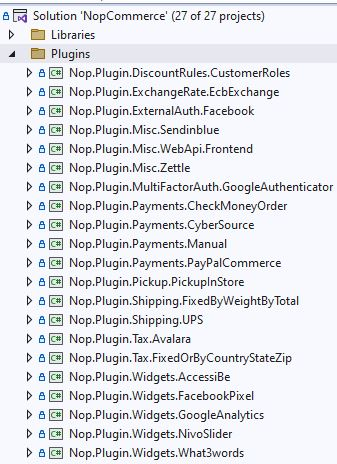

# 如何為 nopCommerce 編寫外掛

外掛用於擴充 nopCommerce 的功能。nopCommerce 擁有幾種類型的外掛。例如，付款方式（如 PayPal）、稅額計算提供者、運送方式計算方法（如 UPS、USPS、FedEx）、小工具（如「線上客服」區塊）等等。nopCommerce 本身已經發行了許多不同的外掛。您也可以在 [nopCommerce 官方網站](https://www.nopcommerce.com/marketplace) 上搜尋各種外掛，看看是否已經有人建立了符合您需求的外掛。如果沒有，本文將引導您完成建立外掛的過程。

## 外掛結構、必要檔案與位置

1. 您需要做的第一件事是在方案中建立一個新的 *`Class Library`* 專案。將所有外掛放置在方案根目錄的 `\Plugins` 目錄中是一個良好的習慣（請勿與位於 `\Nop.Web` 目錄下用於已部署外掛的 `\Plugins` 子目錄混淆）。將所有外掛放置在 `Plugins` 方案資料夾中是一個良好的習慣。

    外掛專案的建議命名方式為 **`Nop.Plugin.{Group}.{Name}`**。**`{Group}`** 是您的外掛群組（例如 *Payment* 或 *Shipping*）。**`{Name}`** 是您的外掛名稱（例如 *PayPalCommerce*）。例如，PayPal Commerce 付款外掛的名稱如下：**`Nop.Plugin.Payments.PayPalCommerce`**。但請注意，這並非強制要求。您可以為外掛選擇任何名稱，例如 `MyGreatPlugin`。

    

1. 建立外掛專案後，您必須在任何文字編輯器中開啟其 `.csproj` 檔案，並將其內容取代為以下內容：

    ```xml
    <Project Sdk="Microsoft.NET.Sdk">
        <PropertyGroup>
            <TargetFramework>net7.0</TargetFramework>
            <Copyright>SOME_COPYRIGHT</Copyright>
            <Company>YOUR_COMPANY</Company>
            <Authors>SOME_AUTHORS</Authors>
            <PackageLicenseUrl>PACKAGE_LICENSE_URL</PackageLicenseUrl>
            <PackageProjectUrl>PACKAGE_PROJECT_URL</PackageProjectUrl>
            <RepositoryUrl>REPOSITORY_URL</RepositoryUrl>
            <RepositoryType>Git</RepositoryType>
            <OutputPath>..\..\Presentation\Nop.Web\Plugins\PLUGIN_OUTPUT_DIRECTORY</OutputPath>
            <OutDir>$(OutputPath)</OutDir>
            <!--Set this parameter to true to get the dlls copied from the NuGet cache to the output of your    project. You need to set this parameter to true if your plugin has a nuget package to ensure that   the dlls copied from the NuGet cache to the output of your project-->
            <CopyLocalLockFileAssemblies>true</CopyLocalLockFileAssemblies>
        </PropertyGroup>
        <ItemGroup>
            <ProjectReference Include="..\..\Presentation\Nop.Web.Framework\Nop.Web.Framework.csproj" />
            <ClearPluginAssemblies Include="$(MSBuildProjectDirectory)\..\..\Build\ClearPluginAssemblies.proj" />
        </ItemGroup>
        <!-- This target execute after "Build" target -->
        <Target Name="NopTarget" AfterTargets="Build">
            <!-- Delete unnecessary libraries from plugins path -->
            <MSBuild Projects="@(ClearPluginAssemblies)" Properties="PluginPath=$(MSBuildProjectDirectory)\$(OutDir)" Targets="NopClear" />
        </Target>
    </Project>
    ```

    > [!TIP]
    > 其中 **PLUGIN_OUTPUT_DIRECTORY** 應替換為外掛名稱，例如 `Payments.PayPalStandard`。
    >
    > 我們這樣做是為了能夠使用 .NET Core 中引入的添加第三方參考的新方法。但實際上，這並非必要。此外，來自已參考函式庫的參考將會自動載入，因此非常方便。

1. 下一個步驟是建立每個外掛都需要的 `plugin.json` 檔案。此檔案包含描述您外掛的元資訊（meta-information）。您可以直接從任何其他現有的外掛複製此檔案，並根據您的需求進行修改。關於 `plugin.json` 檔案的資訊，請參閱 [plugin.json 檔案](xref:zh-Hant/developer/plugins/plugin_json)。

1. 最後一個必要的步驟是建立一個實作 **`IPlugin`** 介面（命名空間為 `Nop.Services.Plugins`）的類別。nopCommerce 擁有 **`BasePlugin`** 類別，它已經實作了一些 `IPlugin` 方法，讓您可以避免重複編寫原始碼。nopCommerce 也提供了一些衍生自 `IPlugin` 的特定介面。例如，我們有 `IPaymentMethod` 介面，用於建立新的付款方式外掛。它包含一些僅針對付款方式特定的方法，例如 *`ProcessPaymentAsync()`* 或 *`GetAdditionalHandlingFeeAsync()`*。目前，nopCommerce 擁有以下特定的外掛介面：

   - **IPaymentMethod**。這些外掛用於付款處理。
   - **IShippingRateComputationMethod**。這些外掛用於擷取可用的配送方式及對應的運費費率。例如，UPS、USPS、FedEx 等。
   - **IPickupPointProvider**。這些外掛用於提供取貨點。
   - **ITaxProvider**。稅務提供者用於取得稅率。
   - **IExchangeRateProvider**。用於取得匯率。
   - **IDiscountRequirementRule**。允許您建立新的折扣規則，例如「顧客的帳單地址國家/地區必須為……」。
   - **IExternalAuthenticationMethod**。用於建立外部驗證方式，例如 Facebook、Twitter、OpenID 等。
   - **IMultiFactorAuthenticationMethod**。用於建立多重驗證方式，例如 *GoogleAuthenticator* 等。
     >[!NOTE]
     > 這是一個新的介面，自 4.40 版本起，我們開箱即用地提供了對應的 MFA 整合基礎架構。

   - **IWidgetPlugin**。它允許您建立小工具。小工具會呈現在網站的某些區塊上。例如，它可以是您網站左欄的一個「線上客服」區塊。
   - **IMiscPlugin**。如果您的外掛不適用於上述任何介面。

> [!IMPORTANT]
> 每次專案建置後，請在進行更改前清理方案（Clean Solution）。某些資源會被快取，可能會導致開發者感到崩潰。
>
> 新增外掛後，您可能需要重新建置方案。如果您在 `Nop.Web\Plugins\PLUGIN_OUTPUT_DIRECTORY` 下沒有看到您的外掛 DLL，則需要重新建置您的方案。如果您的 DLL 不存在於 `Nop.Web` 中的正確資料夾內，nopCommerce 將不會在「本地外掛」頁面中列出您的外掛。

## 處理請求：Controller、Model 與 View

現在，您可以前往 **後台 → 設定 → 本地外掛** 查看您的外掛。但如您所料，目前我們的外掛尚未具備任何功能，甚至連用於設定的使用者介面都沒有。讓我們來建立一個頁面來設定外掛。

我們現在需要做的是建立一個 Controller、一個 Model 和一個 View。

1. MVC Controller 負責回應針對 ASP.NET Core MVC 網站所發出的請求。每一個瀏覽器請求都會對應到特定的 Controller。
2. View 包含發送至瀏覽器的 HTML 標記與內容。在開發 `ASP.NET Core MVC` 應用程式時，View 就相當於一個網頁。
3. MVC Model 包含了所有不屬於 View 或 Controller 的應用程式邏輯。

您可以透過 [here](https://docs.microsoft.com/aspnet/core/mvc/overview?view=aspnetcore-6.0) 找到更多關於 MVC 模式的資訊。

讓我們開始吧：

- **建立 Model**：在新的外掛中新增一個 **Models** 資料夾，然後新增一個符合您需求的 Model 類別。
- **建立 View**：在新的外掛中新增一個 **Views** 資料夾，然後新增一個名為 `Configure.cshtml` 的 `*.cshtml` 檔案。將該 View 檔案的 **「建置動作」(Build Action)** 屬性設為 **「內容」(Content)**，並將 **「複製到輸出目錄」(Copy to Output Directory)** 屬性設為 **「永遠複製」(Copy always)**。請注意，設定頁面應使用 `_ConfigurePlugin` 範本。
- 同時請確保您的 \Views 目錄中有 `_ViewImports.cshtml` 檔案。您可以直接從任何現有的外掛中複製一份過來。
- **建立 Controller**：在新的外掛中新增一個 **Controllers** 資料夾，然後新增一個新的 Controller 類別。一個良好的慣例是將外掛的 Controller 命名為 `{Group}{Name}Controller.cs`。例如：PaymentPayPalStandardController。當然，這並非強制規定（僅為建議）。接著，為設定頁面（在管理後台）建立適當的 Action 方法。我們將其命名為 *`Configure`*。準備一個 Model 類別，並使用實體 View 路徑將其傳遞給 View：`~/Plugins/{PluginOutputDirectory}/Views/Configure.cshtml`。
- 請為您的 Action 方法使用下列屬性：

    ```csharp
    [AutoValidateAntiforgeryToken]
    [AuthorizeAdmin] //confirms access to the admin panel
    [Area(AreaNames.Admin)] //specifies the area containing a controller or action
    ```

    > [!TIP]
    > 您也可以將這些屬性直接加在 Controller 上。若是如此，則不需要為每個方法個別標記。

    例如，請打開 `PayPalStandard` 付款外掛，查看其 `PaymentPayPalStandardController` 的實作方式。

接著，對於每個擁有設定頁面的外掛，您都應該指定一個設定 URL。基底類別 `BasePlugin` 擁有 `GetConfigurationPageUrl` 方法，該方法會回傳設定 URL：

```csharp
public override string GetConfigurationPageUrl()
{
    return $"{_webHelper.GetStoreLocation()}Admin/{CONTROLLER_NAME}/{ACTION_NAME}";
}
```

其中 **{CONTROLLER_NAME}** 是您的 Controller 名稱，而 **{ACTION_NAME}** 是 Action 的名稱（通常為 `Configure`）。

一旦安裝了外掛並新增了設定方法，您就能在 **後台 → 設定 → 本地外掛** 中找到設定該外掛的連結。

> [!TIP]
> 完成上述步驟最簡單的方式，就是打開任何其他外掛，並將這些檔案複製到您的外掛專案中，然後再重新命名對應的類別與目錄即可。

例如，*PayPalCommerce* 外掛的專案結構如下圖所示：


## 處理 "InstallAsync"、"UninstallAsync" 與 "UpdateAsync" 方法

此步驟為選用。有些外掛在安裝過程中可能需要額外的邏輯。例如，外掛可能需要插入新的語系資源。因此，請開啟您的 `IPlugin` 實作（大多數情況下會繼承自 `BasePlugin` 類別）並覆寫下列方法：

1. **InstallAsync**。此方法將在外掛安裝期間被呼叫。您可以在此處初始化任何設定、插入新的語系資源，或建立一些新的資料庫表格（若有需要）。
1. **UninstallAsync**。此方法將在外掛解除安裝期間被呼叫。
1. **UpdateAsync**。此方法將在外掛更新期間被呼叫（當 `plugin.json` 檔案中的版本號變更時）。

> [!IMPORTANT]
> 若您覆寫了這些方法中的其中一個，請勿隱藏其基礎實作。

例如，覆寫後的 `InstallAsync` 方法應包含以下方法呼叫：*`base.InstallAsync()`*。*PayPalStandard* 外掛的 `InstallAsync` 方法看起來如下列程式碼所示：

```csharp
public override async Task InstallAsync()
{
    await _settingService.SaveSettingAsync(new PayPalStandardPaymentSettings
    {
        UseSandbox = true
    });
    
    await _localizationService.AddLocaleResourceAsync(new Dictionary<string, string>
    {
        ...
    });
    await base.InstallAsync();
}
```

> [!TIP]
> 已安裝外掛的清單位於 `\App_Data\plugins.json`。該清單是在安裝過程中建立的。

## 路由

在這裡，我們將探討如何註冊外掛路由。ASP.NET Core 路由負責將傳入的瀏覽器請求對應到特定的 MVC 控制器動作。您可以參閱 [here](https://docs.microsoft.com/aspnet/core/fundamentals/routing) 以取得更多關於路由的資訊。請依照下列步驟操作：

如果您需要加入自訂路由，請建立 `RouteProvider.cs` 檔案。它會告知 nopCommerce 系統有關外掛路由的資訊。例如，下方的 `RouteProvider` 類別加入了一條新路由，您可以透過瀏覽器前往 `http://www.yourStore.com/Plugins/PayPalCommerceWebhook/WebhookHandler` 來存取它：

```csharp
public class RouteProvider : IRouteProvider
    {
        /// <summary>
        /// Register routes
        /// </summary>
        /// <param name="endpointRouteBuilder">Route builder</param>
        public void RegisterRoutes(IEndpointRouteBuilder endpointRouteBuilder)
        {
            endpointRouteBuilder.MapControllerRoute(PayPalCommerceDefaults.WebhookRouteName,
                "Plugins/PayPalCommerce/Webhook",
                new { controller = "PayPalCommerceWebhook", action = "WebhookHandler" });
        }

        /// <summary>
        /// Gets a priority of route provider
        /// </summary>
        public int Priority => 0;
    }
```

## 升級 nopCommerce 可能會導致外掛失效

部分外掛可能會過時，且無法再於較新版本的 nopCommerce 中運作。如果您在升級到新版本後遇到問題，請刪除該外掛，並前往 nopCommerce 官方網站查看是否有更新的版本可用。許多外掛開發者會更新其外掛以適應新版本，然而，有些開發者則不會，導致其外掛因 nopCommerce 的改進而變得無法使用。但在大多數情況下，您只需開啟對應的 `plugin.json` 檔案，並更新 **SupportedVersions** 欄位即可。

## 結論

希望這能協助您開始使用 nopCommerce，並為您建立更複雜的外掛做好準備。

## 外掛範本

您可以使用我們提供的 Visual Studio 範本來開發新的 nopCommerce 外掛。這可以為開發者節省大量時間，因為現在不需要手動執行所有初始步驟，例如建立資料夾（Controllers、Views、Models 等）、其他必要檔案（PluginNopStartup.cs、_ViewImports.cshtml、ObjectContex、plugin.json 等）、設定、專案參考等。請參閱相關說明與安裝指引 [here](https://github.com/nopSolutions/nopCommerce-plugin-template-VS/)