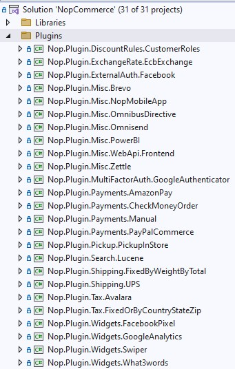
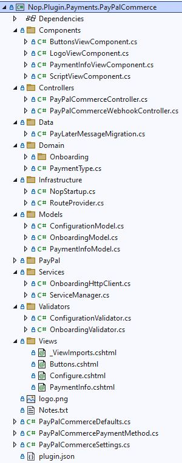

# 如何為 nopCommerce 撰寫外掛

外掛用於擴充 nopCommerce 的功能。nopCommerce 擁有多種類型的外掛。例如，付款方式（如 PayPal）、稅務提供者、運送方式計算方法（如 UPS、USPS、FedEx）、小工具（如「線上客服」區塊）以及許多其他類型。nopCommerce 本身已預先內建許多不同的外掛。您也可以在 [nopCommerce 官方網站](https://www.nopcommerce.com/marketplace) 上搜尋各式外掛，看看是否有人已經開發出符合您需求的外掛。如果沒有，本文將引導您完成建立自訂外掛的過程。

## 外掛結構、必要檔案與位置

1. 您需要做的第一件事是在解決方案中建立一個新的 *`Class Library`* 專案。將所有外掛放置在解決方案根目錄的 `\Plugins` 資料夾中是一種良好的實作方式（請勿與位於 `\Nop.Web` 目錄下、用於已部署外掛的 `\Plugins` 子目錄混淆）。將所有外掛放置於 `Plugins` 解決方案資料夾中是一個良好的實作方式。

    外掛專案的建議命名方式為 **`Nop.Plugin.{Group}.{Name}`**。**`{Group}`** 是您的外掛群組（例如 *Payment* 或 *Shipping*）。**`{Name}`** 是您的外掛名稱（例如 *PayPalCommerce*）。例如，PayPal Commerce 付款外掛的名稱如下：**`Nop.Plugin.Payments.PayPalCommerce`**。但請注意，這並非強制要求，您可以為外掛選擇任何名稱。例如，`MyGreatPlugin`。

    

1. 當外掛專案建立完成後，您必須在任何文字編輯器中開啟其 `.csproj` 檔案，並將其內容替換為以下內容：

    ```xml
    <Project Sdk="Microsoft.NET.Sdk">
        <PropertyGroup>
            <TargetFramework>net9.0</TargetFramework>
            <Copyright>SOME_COPYRIGHT</Copyright>
            <Company>YOUR_COMPANY</Company>
            <Authors>SOME_AUTHORS</Authors>
            <PackageLicenseUrl>PACKAGE_LICENSE_URL</PackageLicenseUrl>
            <PackageProjectUrl>PACKAGE_PROJECT_URL</PackageProjectUrl>
            <RepositoryUrl>REPOSITORY_URL</RepositoryUrl>
            <RepositoryType>Git</RepositoryType>
            <OutputPath>$(SolutionDir)\Presentation\Nop.Web\Plugins\PLUGIN_OUTPUT_DIRECTORY</OutputPath>
            <OutDir>$(OutputPath)</OutDir>
            <!--Set this parameter to true to get the dlls copied from the NuGet cache to the output of your    project. You need to set this parameter to true if your plugin has a nuget package to ensure that   the dlls copied from the NuGet cache to the output of your project-->
            <CopyLocalLockFileAssemblies>true</CopyLocalLockFileAssemblies>
            <ImplicitUsings>enable</ImplicitUsings>
        </PropertyGroup>
        <ItemGroup>
            <ProjectReference Include="$(SolutionDir)\Presentation\Nop.Web.Framework\Nop.Web.Framework.csproj" />
            <ClearPluginAssemblies Include="$(SolutionDir)\Build\ClearPluginAssemblies.proj" />
        </ItemGroup>
        <!-- This target executes after "Build" target -->
        <Target Name="NopTarget" AfterTargets="Build">
            <!-- Delete unnecessary libraries from plugins path -->
            <MSBuild Projects="@(ClearPluginAssemblies)" Properties="PluginPath=$(OutDir)" Targets="NopClear" />
        </Target>
    </Project>
    ```

    > [!TIP]
    > 其中 **PLUGIN_OUTPUT_DIRECTORY** 應替換為外掛名稱，例如 `Payments.PayPalStandard`。
    >
    > 我們這樣做是為了能夠使用在 .NET Core 中引入的添加第三方參考的新方法。但實際上，這並非強制要求。此外，已經參考過的程式庫中的參考項目會被自動載入，這非常方便。

1. 下一個步驟是為每個外掛建立必要的 `plugin.json` 檔案。此檔案包含描述您外掛的中繼資料。只需從任何其他現有的外掛複製此檔案，並根據您的需求進行修改即可。關於 `plugin.json` 檔案的資訊，請參閱 [plugin.json 檔案](xref:zh-Hant/developer/plugins/plugin_json)。

1. 最後一個必要步驟是建立一個實作 **`IPlugin`** 介面（位於 `Nop.Services.Plugins` 命名空間）的類別。nopCommerce 擁有 **`BasePlugin`** 類別，它已經實作了一些 `IPlugin` 方法，並允許您避免原始程式碼重複。nopCommerce 還提供了一些衍生自 `IPlugin` 的特定介面。例如，我們有 `IPaymentMethod` 介面，用於建立新的付款方式外掛。它包含一些僅針對付款方式才有的方法，例如 *`ProcessPaymentAsync()`* 或 *`GetAdditionalHandlingFeeAsync()`*。目前，nopCommerce 擁有下列特定的外掛介面：

   - **IPaymentMethod**。這些外掛用於付款處理。
   - **IShippingRateComputationMethod**。這些外掛用於檢索接受的運送方式及對應的運費計算。例如：UPS、FedEx 等。
   - **IPickupPointProvider**。這些外掛用於提供取貨點。
   - **ITaxProvider**。稅務提供者用於取得稅率。
   - **IExchangeRateProvider**。用於取得貨幣匯率。
   - **IDiscountRequirementRule**。允許您建立新的折扣規則，例如「顧客的帳單地址國家必須是……」。
   - **IExternalAuthenticationMethod**。用於建立外部驗證方法，例如 Facebook、Twitter、OpenID 等。
   - **IMultiFactorAuthenticationMethod**。用於建立多重驗證方法，例如 *GoogleAuthenticator* 等。
     > [!NOTE]
     > 這是一個新的介面，自 4.40 版本起，我們已內建提供相應的 MFA 整合基礎設施。

   - **IWidgetPlugin**。它允許您建立小工具。小工具會顯示在網站的某些區塊中。例如，網站左欄的「線上客服」區塊。
   - **IMiscPlugin**。如果您的外掛不適用於上述任何介面，則使用此介面。

> [!IMPORTANT]
> 每次編譯專案後，在進行更改前請先清理解決方案。某些資源會被快取，這可能會導致開發人員抓狂。
>
> 加入外掛後，您可能需要重新編譯您的解決方案。如果您在 `Nop.Web\Plugins\PLUGIN_OUTPUT_DIRECTORY` 下看不到外掛的 DLL 檔案，則需要重新編譯您的解決方案。如果您的 DLL 檔案不存在於 `Nop.Web` 的正確資料夾中，nopCommerce 將不會在 *本地外掛 (Local Plugins)* 頁面中列出您的外掛。

## 處理請求：控制器 (Controllers)、模型 (Models) 與檢視 (Views)

現在，您可以透過前往 **後台 → 設定 → 本地外掛** 來查看該外掛。但如您所料，我們的外掛目前什麼功能都沒有，甚至連設定用的使用者介面都沒有。讓我們建立一個頁面來設定此外掛。

我們現在需要做的是建立一個控制器、一個模型和一個檢視。

1. MVC 控制器負責回應針對 ASP.NET Core MVC 網站發出的請求。每個瀏覽器請求都會對應到特定的控制器。
1. 檢視包含傳送到瀏覽器的 HTML 標記與內容。在開發 `ASP.NET Core MVC` 應用程式時，檢視就等同於一個頁面。
1. MVC 模型包含了應用程式中所有未包含在檢視或控制器內的邏輯。

您可以在 [here](https://docs.microsoft.com/aspnet/core/mvc/overview) 找到更多關於 MVC 模式的資訊。

那麼讓我們開始吧：

- **建立模型**：在新的外掛中加入一個 **Models** 資料夾，然後加入一個符合您需求的模型類別。
- **建立檢視**：在新的外掛中加入一個 **Views** 資料夾，然後加入一個名為 `Configure.cshtml` 的 `*.cshtml` 檔案。將該檢視檔案的 **「建置動作」(Build Action)** 屬性設為 **「內容」(Content)**，並將 **「複製到輸出目錄」(Copy to Output Directory)** 屬性設為 **「永遠複製」(Copy always)**。請注意，設定頁面應使用 `_ConfigurePlugin` 佈局。
- 此外，請確保您的 \Views 目錄下有 `_ViewImports.cshtml` 檔案。您可以直接從任何其他現有的外掛複製過來。
- **建立控制器**：在新的外掛中加入一個 **Controllers** 資料夾，然後加入一個新的控制器類別。一個良好的做法是將外掛控制器命名為 `{Group}{Name}Controller.cs`。例如：PaymentPayPalStandardController。當然，這並非強制規定（僅為建議）。接著，為設定頁面（在管理後台）建立適當的動作方法 (action method)。我們將其命名為 *`Configure`*。準備一個模型類別，並使用實體檢視路徑將其傳遞給檢視：`~/Plugins/{PluginOutputDirectory}/Views/Configure.cshtml`。
- 對您的動作方法使用以下屬性：

    ```csharp
    [AutoValidateAntiforgeryToken]
    [AuthorizeAdmin] //confirms access to the admin panel
    [Area(AreaNames.ADMIN)] //specifies the area containing a controller or action
    public class PayPalCommerceController : BasePluginController
    {
        public async Task<IActionResult> Configure(bool showtour = false)
        {
            return View("~/Plugins/Payments.PayPalCommerce/Views/Configure.cshtml");
        }
    }
    ```

    > [!TIP]
    > 您也可以直接將這些屬性加到控制器上。在這種情況下，就不需要為每個方法加上這些屬性。

    例如，開啟 `PayPalStandard` 付款外掛，並查看其 `PaymentPayPalStandardController` 的實作方式。

接著，對於每個具有設定頁面的外掛，您應該指定一個設定 URL。名為 `BasePlugin` 的基底類別擁有 `GetConfigurationPageUrl` 方法，該方法會回傳設定 URL：

```csharp
protected readonly IWebHelper _webHelper;

public PaymentPayPalStandardProvider(IWebHelper webHelper)
{
    _webHelper = webHelper;
}

public override string GetConfigurationPageUrl()
{
    return $"{_webHelper.GetStoreLocation()}Admin/{CONTROLLER_NAME}/{ACTION_NAME}";
}

```

其中 **{CONTROLLER_NAME}** 是您的控制器名稱，而 **{ACTION_NAME}** 是動作名稱（通常為 `Configure`）。

一旦安裝了外掛並加入了設定方法，您就會在 **後台 → 設定 → 本地外掛** 下方找到設定此外掛的連結。

> [!TIP]
> 完成上述步驟最簡單的方法，就是開啟任何其他外掛，並將這些檔案複製到您的外掛專案中，然後重新命名適當的類別與目錄即可。

例如，*PayPalCommerce* 外掛的專案結構如下圖所示：



## 處理 "InstallAsync"、"UninstallAsync" 與 "UpdateAsync" 方法

此步驟為選用。有些外掛在安裝過程中可能需要額外的邏輯。例如，外掛可能需要插入新的語系資源。因此，請開啟您的 `IPlugin` 實作（通常會繼承自 `BasePlugin` 類別）並覆寫下列方法：

1. **InstallAsync**。此方法將在外掛安裝期間被呼叫。您可以在此初始化任何設定、插入新的語系資源，或建立一些新的資料庫表格（若有需要）。
1. **UninstallAsync**。此方法將在外掛解除安裝期間被呼叫。
1. **UpdateAsync**。此方法將在外掛更新期間被呼叫（當 `plugin.json` 檔案中的版本號變更時）。

> [!IMPORTANT]
> 如果您覆寫了其中一個方法，請勿隱藏其基礎實作。

例如，覆寫後的 `InstallAsync` 方法應包含下列方法呼叫：*`base.Install()`*。*PayPalStandard* 外掛的 `InstallAsync` 方法看起來如下方程式碼所示：

```csharp
public override async Task InstallAsync()
{
    await _settingService.SaveSettingAsync(new PayPalStandardPaymentSettings
    {
        UseSandbox = true
    });
    
    await _localizationService.AddOrUpdateLocaleResourceAsync(new Dictionary<string, string>
    {
        ...
    });
    await base.InstallAsync();
}
```

> [!TIP]
> 已安裝外掛的清單位於 `\App_Data\plugins.json`。此清單是在安裝過程中建立的。

## 路由

在這裡，我們將探討如何註冊外掛路由。ASP.NET Core 路由負責將傳入的瀏覽器請求對應到特定的 MVC 控制器動作。您可以查看 [here](https://docs.microsoft.com/aspnet/core/fundamentals/routing) 以取得更多關於路由的資訊。請依照下列步驟操作：

如果您需要新增自訂路由，請建立 `RouteProvider.cs` 檔案。它會告知 nopCommerce 系統有關外掛路由的資訊。例如，下方的 `RouteProvider` 類別新增了一個路由，您可以透過開啟網頁瀏覽器並前往 `http://www.yourStore.com/Plugins/PayPalCommerceWebhook/WebhookHandler` URL 來存取它：

```csharp
public class RouteProvider : IRouteProvider
    {
        /// <summary>
        /// Register routes
        /// </summary>
        /// <param name="endpointRouteBuilder">Route builder</param>
        public void RegisterRoutes(IEndpointRouteBuilder endpointRouteBuilder)
        {
            endpointRouteBuilder.MapControllerRoute(PayPalCommerceDefaults.ConfigurationRouteName,
                "Admin/PayPalCommerce/Configure",
                new { controller = "PayPalCommerce", action = "Configure" });

            endpointRouteBuilder.MapControllerRoute(PayPalCommerceDefaults.WebhookRouteName,
                "Plugins/PayPalCommerce/Webhook",
                new { controller = "PayPalCommerceWebhook", action = "WebhookHandler" });
        }

        /// <summary>
        /// Gets a priority of route provider
        /// </summary>
        public int Priority => 0;
    }
```

## 升級 nopCommerce 可能會導致外掛失效

部分外掛可能會因為過時，而無法在新版本的 nopCommerce 中運作。如果您在升級到新版本後遇到問題，請刪除該外掛，並前往 nopCommerce 官方網站查看是否有更新的版本。許多外掛作者會更新其外掛以適應新版本，然而，部分外掛作者可能不會這樣做，導致其外掛隨著 nopCommerce 的改進而變得過時。但在大多數情況下，您只需開啟對應的 `plugin.json` 檔案並更新 **SupportedVersions** 欄位即可。

## 結論

希望這能協助您開始使用 nopCommerce，並為您開發更複雜的外掛做好準備。

## 外掛範本

您可以使用我們的 Visual Studio 範本來建立新的 nopCommerce 外掛。這可以為開發者節省大量時間，因為現在他們不必手動執行所有初始步驟，例如建立資料夾（Controllers、Views、Models 等）、建立其他必要的檔案（PluginNopStartup.cs、_ViewImports.cshtml、ObjectContext、plugin.json 等）、設定組態、專案參考等。請前往 [here](https://github.com/nopSolutions/nopCommerce-plugin-template-VS/) 尋找範本與安裝說明。