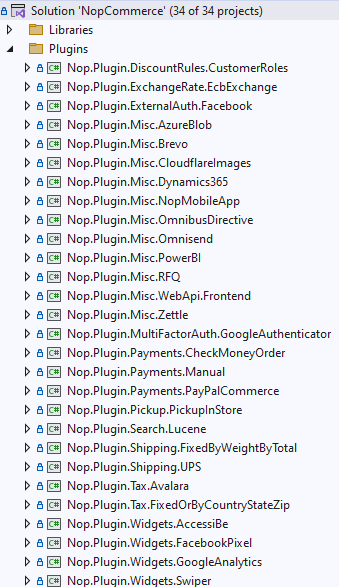
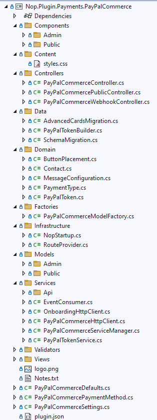

# 如何為 nopCommerce 編寫外掛

外掛（Plugins）是用於擴充 nopCommerce 功能的組件。nopCommerce 擁有幾種不同類型的外掛，例如：付款方式（如 PayPal）、稅務提供者、運送方式計算方法（如 UPS、USPS、FedEx）、小工具（如「線上客服」區塊）等等。nopCommerce 本身已經內建了許多不同的外掛。您也可以在 [nopCommerce 官方網站](https://www.nopcommerce.com/marketplace) 上搜尋各式各樣的外掛，看看是否已經有人開發出符合您需求的外掛。如果沒有，這篇文章將引導您完成建立自訂外掛的過程。

## 外掛結構、必要檔案與位置

1. 您首先需要做的是在方案中建立一個新的 *`Class Library`* 專案。將所有外掛放置於方案根目錄的 `\Plugins` 目錄中是一個良好的習慣（請勿與位於 `\Nop.Web` 目錄下用於已部署外掛的 `\Plugins` 子目錄混淆）。將所有外掛放置於 `Plugins` 方案資料夾中是個好習慣。

    建議的外掛專案命名為 **`Nop.Plugin.{Group}.{Name}`**。**`{Group}`** 是您的外掛群組（例如 *Payment* 或 *Shipping*）。**`{Name}`** 是您的外掛名稱（例如 *PayPalCommerce*）。例如，PayPal Commerce 付款外掛的名稱如下：**`Nop.Plugin.Payments.PayPalCommerce`**。但請注意，這並非強制要求。您可以為外掛選擇任何名稱，例如 `MyGreatPlugin`。

    

1. 外掛專案建立完成後，您必須使用任何文字編輯器開啟其 `.csproj` 檔案，並將其內容替換為以下內容：

    ```xml
    <Project Sdk="Microsoft.NET.Sdk">
        <PropertyGroup>
            <TargetFramework>net9.0</TargetFramework>
            <Copyright>SOME_COPYRIGHT</Copyright>
            <Company>YOUR_COMPANY</Company>
            <Authors>SOME_AUTHORS</Authors>
            <PackageLicenseUrl>PACKAGE_LICENSE_URL</PackageLicenseUrl>
            <PackageProjectUrl>PACKAGE_PROJECT_URL</PackageProjectUrl>
            <RepositoryUrl>REPOSITORY_URL</RepositoryUrl>
            <RepositoryType>Git</RepositoryType>
            <OutputPath>$(SolutionDir)\Presentation\Nop.Web\Plugins\PLUGIN_OUTPUT_DIRECTORY</OutputPath>
            <OutDir>$(OutputPath)</OutDir>
            <!--Set this parameter to true to get the dlls copied from the NuGet cache to the output of your    project. You need to set this parameter to true if your plugin has a nuget package to ensure that   the dlls copied from the NuGet cache to the output of your project-->
            <CopyLocalLockFileAssemblies>true</CopyLocalLockFileAssemblies>
            <ImplicitUsings>enable</ImplicitUsings>
        </PropertyGroup>
        <ItemGroup>
            <ProjectReference Include="$(SolutionDir)\Presentation\Nop.Web.Framework\Nop.Web.Framework.csproj" />
            <ClearPluginAssemblies Include="$(SolutionDir)\Build\ClearPluginAssemblies.proj" />
        </ItemGroup>
        <!-- This target executes after "Build" target -->
        <Target Name="NopTarget" AfterTargets="Build">
            <!-- Delete unnecessary libraries from plugins path -->
            <MSBuild Projects="@(ClearPluginAssemblies)" Properties="PluginPath=$(OutDir)" Targets="NopClear" />
        </Target>
    </Project>
    ```

    > [!TIP]
    > 其中 **PLUGIN_OUTPUT_DIRECTORY** 應替換為外掛名稱，例如 `Payments.PayPalCommerce`。
    >
    > 我們這樣做是為了能夠使用 .NET Core 中引入的添加第三方參考的新方法。但實際上，這並非必要。此外，來自已參考函式庫的參考將會自動載入，因此非常方便。

1. 下一個步驟是建立每個外掛都必需的 `plugin.json` 檔案。此檔案包含描述您外掛的中繼資訊。您可以直接從任何現有的外掛複製此檔案並根據需求進行修改。有關 `plugin.json` 檔案的資訊，請參閱 [plugin.json 檔案](xref:zh-Hant/developer/plugins/plugin_json)。

1. 最後一個必要步驟是建立一個實作 **`IPlugin`** 介面（位於 `Nop.Services.Plugins` 命名空間）的類別。nopCommerce 提供了 **`BasePlugin`** 類別，它已經實作了一些 `IPlugin` 方法，讓您可以避免重複編寫原始程式碼。nopCommerce 還為您提供了一些從 `IPlugin` 衍生出的特定介面。例如，我們有用於建立新付款方式外掛的 `IPaymentMethod` 介面。它包含一些僅針對付款方式的方法，例如 *`ProcessPaymentAsync()`* 或 *`GetAdditionalHandlingFeeAsync()`*。目前，nopCommerce 擁有以下特定外掛介面：

   - **IPaymentMethod**：這些外掛用於處理付款。
   - **IShippingRateComputationMethod**：這些外掛用於擷取可用的配送方式與對應的運費計算。例如 UPS、FedEx 等。
   - **IPickupPointProvider**：這些外掛用於提供取貨點。
   - **ITaxProvider**：稅務提供者用於取得稅率。
   - **IExchangeRateProvider**：用於取得貨幣匯率。
   - **IDiscountRequirementRule**：允許您建立新的折扣規則，例如「顧客的帳單國家/地區必須為……」。
   - **IExternalAuthenticationMethod**：用於建立外部驗證方式，例如 Facebook、Twitter、OpenID 等。
   - **IMultiFactorAuthenticationMethod**：用於建立多重因素驗證方式，例如 *GoogleAuthenticator* 等。
     > [!NOTE]
     > 這是一個新的介面，自 4.40 版本起，我們已直接內建了對應的 MFA 整合基礎設施。

   - **IWidgetPlugin**：允許您建立小工具。小工具會渲染在網站的某些區塊中。例如，網站左欄的「線上客服」區塊。
   - **IMiscPlugin**：如果您的外掛不適用於上述任何介面。

> [!IMPORTANT]
> 每次專案建置後，請在進行更改前先清除方案。部分資源會被快取，這可能會讓開發人員感到困擾。
>
> 新增外掛後，您可能需要重建方案。如果您在 `Nop.Web\Plugins\PLUGIN_OUTPUT_DIRECTORY` 下沒有看到外掛的 DLL 檔案，則需要重建方案。如果您的 DLL 檔案不存在於 `Nop.Web` 的正確資料夾中，nopCommerce 將不會在「本機外掛」頁面中列出您的外掛。

## 處理請求：Controller、Model 與 View

現在，您可以前往 **後台 → 設定 → 本地外掛** 查看您的外掛。但如您所料，我們的外掛目前什麼功能都沒有。它甚至沒有用於設定的使用者介面。讓我們建立一個頁面來設定此外掛。

我們現在需要做的是建立一個 Controller、一個 Model 和一個 View。

1. MVC Controller 負責回應針對 ASP.NET Core MVC 網站提出的請求。每個瀏覽器請求都會對應到特定的 Controller。
1. View 包含傳送給瀏覽器的 HTML 標記與內容。在 `ASP.NET Core MVC` 應用程式中，View 就等同於一個頁面。
1. MVC Model 包含應用程式中所有未包含在 View 或 Controller 中的邏輯。

您可以在 [這裡](https://docs.microsoft.com/aspnet/core/mvc/overview) 找到關於 MVC 模式的更多資訊。

讓我們開始吧：

- **建立 Model**。在新的外掛中新增一個 **Models** 資料夾，然後新增一個符合您需求的 Model 類別。
- **建立 View**。在新的外掛中新增一個 **Views** 資料夾，然後新增一個名為 `Configure.cshtml` 的 `*.cshtml` 檔案。將該 View 檔案的 **"Build Action"** 屬性設為 **"Content"**，並將 **"Copy to Output Directory"** 屬性設為 **"Copy always"**。請注意，設定頁面應使用 `_ConfigurePlugin` 版面配置（layout）。
- 同時請確保您的 \Views 目錄中有 `_ViewImports.cshtml` 檔案。您可以直接從任何其他現有的外掛中複製它。
- **建立 Controller**。在新的外掛中新增一個 **Controllers** 資料夾，然後新增一個 Controller 類別。一個好的做法是將外掛的 Controller 命名為 `{Group}{Name}Controller.cs`。例如 `PaymentPayPalStandardController`。當然，這並非強制性要求（僅為建議）。接著，為設定頁面建立一個適當的 Action 方法（在後台區域）。我們將其命名為 *`Configure`*。準備一個 Model 類別，並使用實體 View 路徑將其傳遞給 View：`~/Plugins/{PluginOutputDirectory}/Views/Configure.cshtml`。
- 為您的 Action 方法使用下列 Attribute：

    ```csharp
    [AutoValidateAntiforgeryToken]
    [AuthorizeAdmin] //confirms access to the admin panel
    [Area(AreaNames.ADMIN)] //specifies the area containing a controller or action
    public class PayPalCommerceController : BasePluginController
    {
        public async Task<IActionResult> Configure(bool showtour = false)
        {
            return View("~/Plugins/Payments.PayPalCommerce/Views/Admin/Configure.cshtml");
        }
    }
    ```

    > [!TIP]
    > 您也可以直接將這些 Attribute 加到 Controller 上。在這種情況下，就不需要為每個方法都加上這些標記。

    例如，開啟 `PayPalCommerce` 付款外掛並查看其 `PayPalCommerceController` 的實作。

接著，對於每個具有設定頁面的外掛，您都應該指定一個設定 URL。基底類別 `BasePlugin` 擁有 `GetConfigurationPageUrl` 方法，該方法會回傳設定 URL：

```csharp
private readonly INopUrlHelper _nopUrlHelper;

public PayPalCommercePaymentMethod(INopUrlHelper nopUrlHelper)
{
    _nopUrlHelper = nopUrlHelper;
}

public override string GetConfigurationPageUrl()
{
    return _nopUrlHelper.RouteUrl(PayPalCommerceDefaults.Route.Configuration);
}

```

現在 *INopUrlHelper* 被用於 Controller 之外的路由。標準路由名稱會以常數形式儲存在外掛的預設值中。

```csharp
/// <summary>
/// Represents the plugin constants
/// </summary>
public class PayPalCommerceDefaults
{
    /// <summary>
    /// Represents the route names
    /// </summary>
    public class Route
    {
        /// <summary>
        /// Gets the configuration route name
        /// </summary>
        public static string Configuration => "Plugin.Payments.PayPalCommerce.Configure";
    }
}
```

註冊外掛設定頁面的路由如下所示。

```csharp
endpointRouteBuilder.MapControllerRoute(name: PayPalCommerceDefaults.Route.Configuration,
    pattern: "Admin/PayPalCommerce/Configure",
    defaults: new { controller = "{CONTROLLER_NAME}", action = "{ACTION_NAME}", area = AreaNames.ADMIN });
```

其中 **{CONTROLLER_NAME}** 是您的 Controller 名稱，而 **{ACTION_NAME}** 是 Action 的名稱（通常是 `Configure`）。

一旦您安裝了外掛並新增了設定方法，您就會在 **後台 → 設定 → 本地外掛** 下方找到連結來設定您的外掛。

> [!TIP]
> 完成上述步驟最簡單的方法是開啟任何其他外掛，並將這些檔案複製到您的外掛專案中。然後只需重新命名對應的類別與目錄即可。

例如，*PayPalCommerce* 外掛的專案結構如下圖所示：



## 處理 "InstallAsync"、"UninstallAsync" 與 "UpdateAsync" 方法

此步驟為選用。有些外掛在安裝過程中可能需要額外的邏輯。例如，外掛可能需要插入新的語系資源。因此，請開啟您的 `IPlugin` 實作（大多數情況下會繼承自 `BasePlugin` 類別）並覆寫下列方法：

1. **InstallAsync**。此方法將在外掛安裝期間被呼叫。您可以在此初始化任何設定、插入新的語系資源，或建立一些新的資料庫表格（若有需要）。
1. **UninstallAsync**。此方法將在外掛解除安裝期間被呼叫。
1. **UpdateAsync**。此方法將在外掛更新期間被呼叫（當 `plugin.json` 檔案中的版本號變更時）。

> [!IMPORTANT]
> 若您覆寫了這些方法之一，請勿隱藏其基礎實作。

例如，覆寫後的 `InstallAsync` 方法應包含下列方法呼叫：*`base.Install()`*。*PayPalStandard* 外掛的 `InstallAsync` 方法如下方程式碼所示：

```csharp
public override async Task InstallAsync()
{
    await _settingService.SaveSettingAsync(new PayPalStandardPaymentSettings
    {
        UseSandbox = true
    });
    
    await _localizationService.AddOrUpdateLocaleResourceAsync(new Dictionary<string, string>
    {
        ...
    });
    await base.InstallAsync();
}
```

> [!TIP]
> 已安裝外掛的清單位於 `\App_Data\plugins.json`。該清單會在安裝過程中建立。

## 路由

在這裡，我們將探討如何註冊外掛路由。ASP.NET Core 路由負責將傳入的瀏覽器請求對應到特定的 MVC 控制器動作（Action）。您可以在 [此處找到更多路由資訊](https://docs.microsoft.com/aspnet/core/fundamentals/routing)。請依照下列步驟操作：

如果您需要新增自訂路由，請建立 `RouteProvider.cs` 檔案。它會告知 nopCommerce 系統有關外掛路由的資訊。例如，下方的 `RouteProvider` 類別新增了一個路由，您可以透過開啟網頁瀏覽器並瀏覽至 `http://www.yourStore.com/Plugins/PayPalCommerceWebhook/WebhookHandler` 這個 URL 來存取它：

```csharp
public class RouteProvider : IRouteProvider
    {
        /// <summary>
        /// Register routes
        /// </summary>
        /// <param name="endpointRouteBuilder">Route builder</param>
        public void RegisterRoutes(IEndpointRouteBuilder endpointRouteBuilder)
        {
            ...
            endpointRouteBuilder.MapControllerRoute(name: PayPalCommerceDefaults.Route.Webhook,
                pattern: "Plugins/PayPalCommerce/Webhook",
                defaults: new { controller = "PayPalCommerceWebhook", action = "WebhookHandler" });
        }

        /// <summary>
        /// Gets a priority of route provider
        /// </summary>
        public int Priority => 0;
    }
```

## 升級 nopCommerce 可能會導致外掛失效

部分外掛可能會過時，導致無法在新版的 nopCommerce 中運作。如果您在升級至新版本後遇到問題，請刪除該外掛，並前往 nopCommerce 官方網站查看是否有更新的版本可用。許多外掛開發者會更新其外掛以相容新版本，但也有部分開發者不會更新，導致其外掛隨著 nopCommerce 的改進而變得無法使用。但在大多數情況下，您只需開啟對應的 `plugin.json` 檔案並更新 **SupportedVersions** 欄位即可。

## 結論

希望這篇文章能幫助您開始使用 nopCommerce，並為您開發更複雜的外掛做好準備。

## 外掛範本

您可以針對新的 nopCommerce 外掛使用我們的 Visual Studio 範本。這可以為開發者節省大量時間，因為現在他們不必手動執行所有初始步驟，例如建立資料夾（Controllers、Views、Models 等），以及建立其他必要的檔案（PluginNopStartup.cs、_ViewImports.cshtml、ObjectContext、plugin.json、設定、專案參考等）。請在此處查看相關內容與 [安裝說明](https://github.com/nopSolutions/nopCommerce-plugin-template-VS/)。