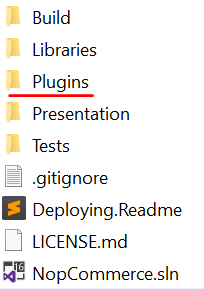
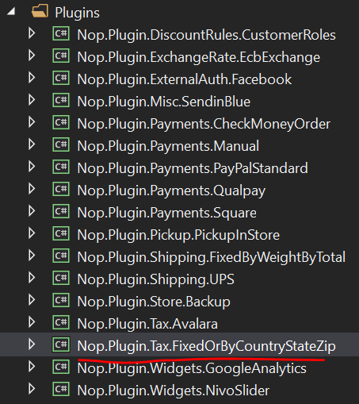
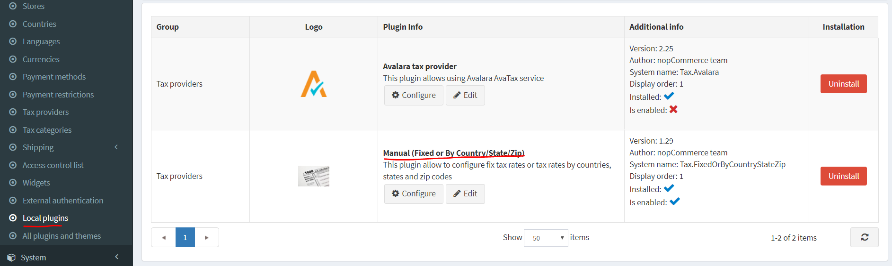
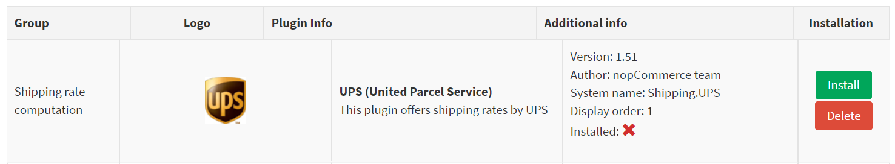
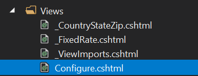
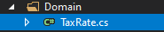
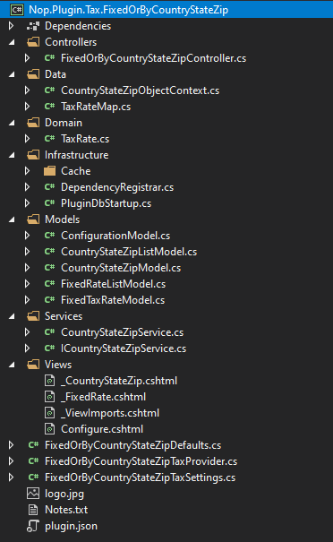

# 如何為 nopCommerce 編寫稅務外掛

我們使用外掛來擴充 nopCommerce 的功能。nopCommerce 發行版本中已經包含多種不同類型的外掛，例如「PickupInStore」和「PayPal Standard」。您也可以在 [nopCommerce 官方網站](https://www.nopcommerce.com/marketplace) 上搜尋各種外掛，看看是否已經有人開發出符合您需求的外掛。如果您找不到適合的，那麼您來對地方了，因為本文將引導您完成開發外掛的過程，特別是根據您的需求來開發稅務外掛。

## 外掛結構、必要檔案與位置

1. 首先，在方案中建立一個新的「Class Library」專案。建議將您的外掛放置在原始碼根目錄下的 **Plugins** 目錄中，這裡也是其他外掛和小工具存放的地方。

    

    > [!NOTE]
    > 請勿將此目錄與 `Presentation\Nop.Web` 目錄中存在的目錄混淆。位於 `Nop.Web` 目錄中的 Plugins 目錄包含的是外掛的已編譯檔案。

    外掛專案的建議命名格式為 `Nop.Plugin.{Group}.{Name}`。其中 `{Group}` 是您的外掛群組（例如 `Payment` 或 `Shipping`），`{Name}` 是您的外掛名稱（例如 `FixedOrByCountryStateZip`）。舉例來說，`FixedOrByCountryStateZip` 稅務外掛的名稱為：`Nop.Plugin.Tax.FixedOrByCountryStateZip`。但請注意，這並非強制要求，您可以為外掛選擇任何名稱，例如 `MyFirstTaxPlugin`。方案的 Plugins 目錄結構看起來如下。

    

1. 外掛專案建立完成後，應使用任何文字編輯器應用程式更新 **.csproj** 檔案的內容。請將其內容替換為以下內容：

    ```xml
    <Project Sdk="Microsoft.NET.Sdk">
        <PropertyGroup>
            <TargetFramework>netcoreapp2.2</TargetFramework>
            <Copyright>SOME_COPYRIGHT</Copyright>
            <Company>YOUR_COMPANY</Company>
            <Authors>SOME_AUTHORS</Authors>
            <PackageLicenseUrl>PACKAGE_LICENSE_URL</PackageLicenseUrl>
            <PackageProjectUrl>PACKAGE_PROJECT_URL</PackageProjectUrl>
            <RepositoryUrl>REPOSITORY_URL</RepositoryUrl>
            <RepositoryType>Git</RepositoryType>
            <OutputPath>..\..\Presentation\Nop.Web\Plugins\PLUGIN_OUTPUT_DIRECTORY</OutputPath>
            <OutDir>$(OutputPath)</OutDir>
            <!--Set this parameter to true to get the dlls copied from the NuGet cache to the output of your        project. You need to set this parameter to true if your plugin has a nuget package to ensure that       the dlls copied from the NuGet cache to the output of your project-->
            <CopyLocalLockFileAssemblies>true</CopyLocalLockFileAssemblies>
        </PropertyGroup>
        <ItemGroup>
            <ProjectReference Include="..\..\Presentation\Nop.Web.Framework\Nop.Web.Framework.csproj" />
            <ClearPluginAssemblies Include="$(MSBuildProjectDirectory)\..\..\Build\ClearPluginAssemblies.sproj" />
        </ItemGroup>
        <!-- This target execute after "Build" target -->
        <Target Name="NopTarget" AfterTargets="Build">
            <!-- Delete unnecessary libraries from plugins path -->
            <MSBuild Projects="@(ClearPluginAssemblies)" Properties="PluginPath=$(MSBuildProjectDirectory)\ $    (OutDir)" Targets="NopClear" />
        </Target>
    </Project>
    ```

    > [!NOTE]
    > **PLUGIN_OUTPUT_DIRECTORY** 應替換為外掛名稱，例如 `Tax.FixedOrByCountryStateZip`。

1. 更新 **.csproj** 檔案後，應新增外掛所需的 `plugin.json` 檔案。此檔案包含描述您外掛的元資訊。只需從任何其他現有的外掛或小工具複製此檔案，並根據您的需求進行修改即可。有關 `plugin.json` 檔案的資訊，請參閱 [plugin.json 檔案](xref:zh-Hant/developer/plugins/plugin_json)。

1. 最後一個必要步驟是建立一個類別，該類別必須實作 `BasePlugin`（位於 `Nop.Core.Plugins` 命名空間）以及 `ITaxProvider` 介面（位於 `Nop.Services.Tax` 命名空間）。**ITaxProvider** 實作了 `GetTaxRate` 方法，該方法會根據自訂邏輯（通常基於顧客地址）回傳 **CalculateTaxResult** 型別（包含稅率、錯誤訊息（若有）以及 `Boolean` 的成功狀態）。

## 處理請求：控制器、模型與檢視

現在，您可以前往 **後台** → **設定** → **在地化外掛** 來查看該外掛。



當外掛/小工具已安裝時，您會看到 **解除安裝** 按鈕。為了效能最佳化，建議將非必要的外掛/小工具解除安裝，這是一個良好的習慣。



當外掛/小工具尚未安裝或已被解除安裝時，將會顯示 **安裝** 和 **刪除** 按鈕。

> [!NOTE]
> 刪除操作會從伺服器上移除實體檔案。

但正如您所猜測的，我們的外掛目前什麼也沒做，甚至沒有用於設定的使用者介面。讓我們建立一個頁面來設定此外掛。

我們現在需要做的是建立一個控制器 (Controller)、一個模型 (Model)、一個檢視 (View) 以及一個檢視元件 (View Component)。

* MVC 控制器負責回應針對 `ASP.NET MVC` 網站發出的請求。每個瀏覽器請求都會對應到特定的控制器。
* 檢視包含傳送到瀏覽器的 HTML 標記與內容。在開發 `ASP.NET MVC` 應用程式時，檢視就相當於一個頁面。
* 實作 **NopViewComponent** 的檢視元件，其中包含轉譯檢視所需的邏輯與程式碼。
* MVC 模型包含應用程式中所有未包含在檢視或控制器中的應用程式邏輯。

那麼讓我們開始吧：

* **建立模型**。在新的外掛中新增一個 `Models` 資料夾，然後新增一個符合您需求的模型類別。
* **建立檢視**。在新的外掛中新增一個 `Views` 資料夾，然後新增一個名為 `Configure.cshtml` 的 `.cshtml` 檔案。將該檢視檔案的 **建置動作 (Build Action)** 屬性設為 **內容 (Content)**，並將 **複製到輸出目錄 (Copy to Output Directory)** 屬性設為 **一律複製 (Copy always)**。請注意，設定頁面應使用 *_ConfigurePlugin* 範本。

```html
@model Nop.Plugin.Tax.FixedOrByCountryStateZip.Models.ConfigurationModel

@{
    Layout = "_ConfigurePlugin";
}

<div class="form-group">
    <div class="col-md-12">
        <div class="onoffswitch">
            <input type="checkbox" name="onoffswitch" class="onoffswitch-checkbox" id="advanced-settings-mode" checked="@Model.CountryStateZipEnabled">
            <label class="onoffswitch-label" for="advanced-settings-mode">
                <span class="onoffswitch-inner"
                      data-locale-basic="@T("Plugins.Tax.FixedOrByCountryStateZip.Fixed")"
                      data-locale-advanced="@T("Plugins.Tax.FixedOrByCountryStateZip.TaxByCountryStateZip")"></span>
                <span class="onoffswitch-switch"></span>
            </label>
        </div>
    </div>
</div>
<script>
    function checkAdvancedSettingsMode(advanced) {
        if (advanced) {
            $("body").addClass("advanced-settings-mode");
            $("body").removeClass("basic-settings-mode");
        } else {
            $("body").removeClass("advanced-settings-mode");
            $("body").addClass("basic-settings-mode");
        }
    }
    checkAdvancedSettingsMode($("#advanced-settings-mode").is(':checked'));
    $(document).ready(function() {
        $("#advanced-settings-mode").click(function() {
            checkAdvancedSettingsMode($(this).is(':checked'));
            $.ajax({
                cache: false,
                url: "@Url.Action("SaveMode", "FixedOrByCountryStateZip")",
                type: "POST",
                data: {
                    value: $(this).is(':checked')
                },
                dataType: "json",
                error: function (jqXHR, textStatus, errorThrown) {
                    $("#saveModeAlert").click();
                }
            });
            ensureDataTablesRendered();
        });
    });
</script>
<nop-alert asp-alert-id="saveModeAlert" asp-alert-message="@T("Admin.Common.Alert.Save.Error")" />

@await Html.PartialAsync("~/Plugins/Tax.FixedOrByCountryStateZip/Views/_FixedRate.cshtml")
@await Html.PartialAsync("~/Plugins/Tax.FixedOrByCountryStateZip/Views/_CountryStateZip.cshtml", Model)
```

* 同時請確保您的 `Views` 目錄中有 **_ViewImports.cshtml** 檔案。您可以直接從任何其他現有的外掛或小工具中複製過來。



* **建立控制器**。在新的外掛中新增一個 `Controllers` 資料夾，然後新增一個新的控制器類別。一個好的習慣是將外掛控制器命名為 **{Group}{Name}Controller.cs**。例如 `FixedOrByCountryStateZipController`。當然，這並非強制命名規範（僅為建議）。接著，為設定頁面（在後台區域）建立適當的動作方法 (Action method)。我們將其命名為 `Configure`。準備一個模型類別，並使用實體檢視路徑將其傳遞給檢視：**~/Plugins/{PluginOutputDirectory}/Views/Configure.cshtml**。

```cs
public IActionResult Configure()
{
    if (!_permissionService.Authorize(StandardPermissionProvider.ManageTaxSettings))
        return AccessDeniedView();

    var taxCategories = _taxCategoryService.GetAllTaxCategories();
    if (!taxCategories.Any())
        return Content("No tax categories can be loaded");

    var model = new ConfigurationModel { CountryStateZipEnabled = _countryStateZipSettings.CountryStateZipEnabled };
    //stores
    model.AvailableStores.Add(new SelectListItem { Text = "*", Value = "0" });
    var stores = _storeService.GetAllStores();
    foreach (var s in stores)
        model.AvailableStores.Add(new SelectListItem { Text = s.Name, Value = s.Id.ToString() });
    //tax categories
    foreach (var tc in taxCategories)
        model.AvailableTaxCategories.Add(new SelectListItem { Text = tc.Name, Value = tc.Id.ToString() });
    //countries
    var countries = _countryService.GetAllCountries(showHidden: true);
    foreach (var c in countries)
        model.AvailableCountries.Add(new SelectListItem { Text = c.Name, Value = c.Id.ToString() });
    //states
    model.AvailableStates.Add(new SelectListItem { Text = "*", Value = "0" });
    var defaultCountry = countries.FirstOrDefault();
    if (defaultCountry != null)
    {
        var states = _stateProvinceService.GetStateProvincesByCountryId(defaultCountry.Id);
        foreach (var s in states)
            model.AvailableStates.Add(new SelectListItem { Text = s.Name, Value = s.Id.ToString() });
    }

    return View("~/Plugins/Tax.FixedOrByCountryStateZip/Views/Configure.cshtml", model);
}
```

* 為您的動作方法使用下列屬性：

```cs
[AuthorizeAdmin] //confirms access to the admin panel
[Area(AreaNames.Admin)] //specifies the area containing a controller or action
[AdminAntiForgery] //Helps prevent malicious scripts from submitting forged page requests.
```

例如，開啟 `FixedOrByCountryStateZip` 外掛並查看其 `FixedOrByCountryStateZipController` 的實作方式。
接著，對於每個具有設定頁面的外掛，您應該指定一個設定 URL。名為 `BasePlugin` 的基底類別具有 `GetConfigurationPageUrl` 方法，該方法會回傳設定 URL：

```cs
public override string GetConfigurationPageUrl()
{
    return $"{_webHelper.GetStoreLocation()}Admin/{CONTROLLER_NAME}/{ACTION_NAME}";
}
```

其中 *{CONTROLLER_NAME}* 是您的控制器名稱，而 *{ACTION_NAME}* 是動作名稱（通常為 `Configure`）。

為了根據顧客地址指定不同的稅率，需要一個記錄所有稅務相關資料的新資料表。為此，新增了一個 `Domain` 資料夾，並在其中加入一個繼承自 **BaseEntity** 類別的類別。在本例中為 `TaxRate.cs`。



此外也新增了一個 `Data` 資料夾，其中包含對應類別 (Mapping class) 與物件內容類別 (Object Context class)。對應類別實作了 **`NopEntityTypeConfiguration<T>`** (`Nop.Data.Mapping` 命名空間)。在此處覆寫了 Configure 方法。

```cs
public override void Configure(EntityTypeBuilder<TaxRate> builder)
{
    builder.ToTable(nameof(TaxRate));
    builder.HasKey(rate => rate.Id);

    builder.Property(rate => rate.Percentage).HasColumnType("decimal(18, 4)");
}
```

物件內容類別實作了 **DbContext** 類別 (`Microsoft.EntityFrameworkCore` 命名空間) 與 **IDbContext** 介面 (`Nop.Data` 命名空間)。此 `IDbContext` 介面包含與資料表建立、刪除相關的方法，以及其他自訂動作，例如根據之前在 `Domain` 資料夾中新增的模型執行原始 SQL 查詢。

```cs
public class CountryStateZipObjectContext : DbContext, IDbContext
{
    #region Ctor

    public CountryStateZipObjectContext(DbContextOptions<CountryStateZipObjectContext> options) : base(options)
    {
    }

    #endregion

    #region Utilities

    /// <summary>
    /// Further configuration the model
    /// </summary>
    /// <param name="modelBuilder">Model muilder</param>
    protected override void OnModelCreating(ModelBuilder modelBuilder)
    {
        modelBuilder.ApplyConfiguration(new TaxRateMap());
        base.OnModelCreating(modelBuilder);
    }

    #endregion

    #region Methods

    /// <summary>
    /// Creates a DbSet that can be used to query and save instances of entity
    /// </summary>
    /// <typeparam name="TEntity">Entity type</typeparam>
    /// <returns>A set for the given entity type</returns>
    public new virtual DbSet<TEntity> Set<TEntity>() where TEntity : BaseEntity
    {
        return base.Set<TEntity>();
    }

    /// <summary>
    /// Generate a script to create all tables for the current model
    /// </summary>
    /// <returns>A SQL script</returns>
    public virtual string GenerateCreateScript()
    {
        return Database.GenerateCreateScript();
    }

    /// <summary>
    /// Creates a LINQ query for the query type based on a raw SQL query
    /// </summary>
    /// <typeparam name="TQuery">Query type</typeparam>
    /// <param name="sql">The raw SQL query</param>
    /// <param name="parameters">The values to be assigned to parameters</param>
    /// <returns>An IQueryable representing the raw SQL query</returns>
    public virtual IQueryable<TQuery> QueryFromSql<TQuery>(string sql, params object[] parameters) where TQuery : class
    {
        throw new NotImplementedException();
    }

    /// <summary>
    /// Creates a LINQ query for the entity based on a raw SQL query
    /// </summary>
    /// <typeparam name="TEntity">Entity type</typeparam>
    /// <param name="sql">The raw SQL query</param>
    /// <param name="parameters">The values to be assigned to parameters</param>
    /// <returns>An IQueryable representing the raw SQL query</returns>
    public virtual IQueryable<TEntity> EntityFromSql<TEntity>(string sql, params object[] parameters) where TEntity : BaseEntity
    {
        throw new NotImplementedException();
    }

    /// <summary>
    /// Executes the given SQL against the database
    /// </summary>
    /// <param name="sql">The SQL to execute</param>
    /// <param name="doNotEnsureTransaction">true - the transaction creation is not ensured; false - the transaction creation is ensured.</param>
    /// <param name="timeout">The timeout to use for command. Note that the command timeout is distinct from the connection timeout, which is commonly set on the database connection string</param>
    /// <param name="parameters">Parameters to use with the SQL</param>
    /// <returns>The number of rows affected</returns>
    public virtual int ExecuteSqlCommand(RawSqlString sql, bool doNotEnsureTransaction = false, int? timeout = null, params object[] parameters)
    {
        using (var transaction = Database.BeginTransaction())
        {
            var result = Database.ExecuteSqlCommand(sql, parameters);
            transaction.Commit();

            return result;
        }
    }

    /// <summary>
    /// Detach an entity from the context
    /// </summary>
    /// <typeparam name="TEntity">Entity type</typeparam>
    /// <param name="entity">Entity</param>
    public virtual void Detach<TEntity>(TEntity entity) where TEntity : BaseEntity
    {
        throw new NotImplementedException();
    }

    /// <summary>
    /// Install object context
    /// </summary>
    public void Install()
    {
        //create tables
        this.ExecuteSqlScript(GenerateCreateScript());
    }

    /// <summary>
    /// Uninstall object context
    /// </summary>
    public void Uninstall()
    {
        //drop the table
        this.DropPluginTable(nameof(TaxRate));
    }

    #endregion
}
```

針對稅率的 **CRUD** 操作，會建立對應的服務。在本例中，建立了介面 **ICountryStateZipService** 與類別 **CountryStateZipService**。它包含如 `InsertTaxRate`、`UpdateTaxRate`、`DeleteTaxRate`、`GetAllTaxRates` 和 `GetTaxRateById` 等方法。這些方法名稱具有自我描述性，並將由控制器調用。其他方法可根據需求進行新增。

### ICountryStateZipService.cs

```cs
public partial interface ICountryStateZipService
{
    /// <summary>
    /// Deletes a tax rate
    /// </summary>
    /// <param name="taxRate">Tax rate</param>
    void DeleteTaxRate(TaxRate taxRate);

    /// <summary>
    /// Gets all tax rates
    /// </summary>
    /// <returns>Tax rates</returns>
    IPagedList<TaxRate> GetAllTaxRates(int pageIndex = 0, int pageSize = int.MaxValue);

    /// <summary>
    /// Gets a tax rate
    /// </summary>
    /// <param name="taxRateId">Tax rate identifier</param>
    /// <returns>Tax rate</returns>
    TaxRate GetTaxRateById(int taxRateId);

    /// <summary>
    /// Inserts a tax rate
    /// </summary>
    /// <param name="taxRate">Tax rate</param>
    void InsertTaxRate(TaxRate taxRate);

    /// <summary>
    /// Updates the tax rate
    /// </summary>
    /// <param name="taxRate">Tax rate</param>
    void UpdateTaxRate(TaxRate taxRate);
}
```

#### CountryStateZipService.cs

```cs
public partial class CountryStateZipService : ICountryStateZipService
{
    #region Fields

    private readonly IEventPublisher _eventPublisher;
    private readonly IRepository<TaxRate> _taxRateRepository;
    private readonly ICacheManager _cacheManager;

    #endregion

    #region Ctor

    /// <summary>
    /// Ctor
    /// </summary>
    /// <param name="eventPublisher">Event publisher</param>
    /// <param name="cacheManager">Cache manager</param>
    /// <param name="taxRateRepository">Tax rate repository</param>
    public CountryStateZipService(IEventPublisher eventPublisher,
        ICacheManager cacheManager,
        IRepository<TaxRate> taxRateRepository)
    {
        _eventPublisher = eventPublisher;
        _cacheManager = cacheManager;
        _taxRateRepository = taxRateRepository;
    }

    #endregion

    #region Methods

    /// <summary>
    /// Deletes a tax rate
    /// </summary>
    /// <param name="taxRate">Tax rate</param>
    public virtual void DeleteTaxRate(TaxRate taxRate)
    {
        if (taxRate == null)
            throw new ArgumentNullException(nameof(taxRate));

        _taxRateRepository.Delete(taxRate);

        //event notification
        _eventPublisher.EntityDeleted(taxRate);
    }

    /// <summary>
    /// Gets all tax rates
    /// </summary>
    /// <returns>Tax rates</returns>
    public virtual IPagedList<TaxRate> GetAllTaxRates(int pageIndex = 0, int pageSize = int.MaxValue)
    {
        var key = string.Format(ModelCacheEventConsumer.TAXRATE_ALL_KEY, pageIndex, pageSize);
        return _cacheManager.Get(key, () =>
        {
            var query = from tr in _taxRateRepository.Table
                        orderby tr.StoreId, tr.CountryId, tr.StateProvinceId, tr.Zip, tr.TaxCategoryId
                        select tr;
            var records = new PagedList<TaxRate>(query, pageIndex, pageSize);
            return records;
        });
    }

    /// <summary>
    /// Gets a tax rate
    /// </summary>
    /// <param name="taxRateId">Tax rate identifier</param>
    /// <returns>Tax rate</returns>
    public virtual TaxRate GetTaxRateById(int taxRateId)
    {
        if (taxRateId == 0)
            return null;

       return _taxRateRepository.GetById(taxRateId);
    }

    /// <summary>
    /// Inserts a tax rate
    /// </summary>
    /// <param name="taxRate">Tax rate</param>
    public virtual void InsertTaxRate(TaxRate taxRate)
    {
        if (taxRate == null)
            throw new ArgumentNullException(nameof(taxRate));

        _taxRateRepository.Insert(taxRate);

        //event notification
        _eventPublisher.EntityInserted(taxRate);
    }

    /// <summary>
    /// Updates the tax rate
    /// </summary>
    /// <param name="taxRate">Tax rate</param>
    public virtual void UpdateTaxRate(TaxRate taxRate)
    {
        if (taxRate == null)
            throw new ArgumentNullException(nameof(taxRate));

        _taxRateRepository.Update(taxRate);

        //event notification
        _eventPublisher.EntityUpdated(taxRate);
    }

    #endregion
}
```

最後，我們需要在應用程式啟動時註冊服務並設定外掛的 DB context。為此，我們加入了 **Infrastructure** 資料夾，其中包含 `DependencyRegister` 和 `PluginDbStartup` 類別。

**DependencyRegister** 類別實作了 `IDependencyRegister` 介面（位於 `Nop.Core.Infrastructure.DependencyManagement` 命名空間），該介面擁有一個 `Register` 方法。

```cs
public class DependencyRegistrar : IDependencyRegistrar
{
    /// <summary>
    /// Register services and interfaces
    /// </summary>
    /// <param name="builder">Container builder</param>
    /// <param name="typeFinder">Type finder</param>
    /// <param name="config">Config</param>
    public virtual void Register(ContainerBuilder builder, ITypeFinder typeFinder, NopConfig config)
    {
        builder.RegisterType<FixedOrByCountryStateZipTaxProvider>().As<ITaxProvider>().InstancePerLifetimeScope();
        builder.RegisterType<CountryStateZipService>().As<ICountryStateZipService>().InstancePerLifetimeScope();

        //data context
        builder.RegisterPluginDataContext<CountryStateZipObjectContext>("nop_object_context_tax_country_state_zip");

        //override required repository with our custom context
        builder.RegisterType<EfRepository<TaxRate>>().As<IRepository<TaxRate>>()
            .WithParameter(ResolvedParameter.ForNamed<IDbContext>("nop_object_context_tax_country_state_zip"))
            .InstancePerLifetimeScope();
    }

    /// <summary>
    /// Order of this dependency registrar implementation
    /// </summary>
    public int Order => 1;
}
```

同樣地，**PluginDbStartup** 類別實作了 `INopStartup` 介面（位於 `Nop.Core.Infrastructure` 命名空間），該介面擁有 `ConfigureServices` 和 `Configure` 方法。在此範例中，object context 是在 `ConfigureServices` 方法中加入的。

```cs
public class PluginDbStartup : INopStartup
{
    /// <summary>
    /// Add and configure any of the middleware
    /// </summary>
    /// <param name="services">Collection of service descriptors</param>
    /// <param name="configuration">Configuration of the application</param>
    public void ConfigureServices(IServiceCollection services, IConfiguration configuration)
    {
        //add object context
        services.AddDbContext<CountryStateZipObjectContext>(optionsBuilder =>
        {
            optionsBuilder.UseSqlServerWithLazyLoading(services);
        });
    }

    /// <summary>
    /// Configure the using of added middleware
    /// </summary>
    /// <param name="application">Builder for configuring an application's request pipeline</param>
    public void Configure(IApplicationBuilder application)
    {
    }

    /// <summary>
    /// Gets order of this startup configuration implementation
    /// </summary>
    public int Order => 11;
}
```

## 稅務外掛的專案結構



## 處理「Install」與「Uninstall」方法

此步驟為選用。某些外掛在安裝過程中可能需要額外的邏輯。例如，外掛可以插入新的語系資源，或新增必要的資料表與設定值。因此，請開啟您的 `BasePlugin` 實作並覆寫下列方法：

* `Install`。此方法將在安裝外掛時被呼叫。您可以在此初始化任何設定、插入新的語系資源，或建立一些新的資料庫資料表（若有需要）。

```cs
public override void Install()
{
    //database objects
    _objectContext.Install();

    //settings
    _settingService.SaveSetting(new FixedOrByCountryStateZipTaxSettings());

    //locales
    _localizationService.AddOrUpdatePluginLocaleResource("Plugins.Tax.FixedOrByCountryStateZip.Fixed", "Fixed rate");
    _localizationService.AddOrUpdatePluginLocaleResource("Plugins.Tax.FixedOrByCountryStateZip.TaxByCountryStateZip", "By Country");
    _localizationService.AddOrUpdatePluginLocaleResource("Plugins.Tax.FixedOrByCountryStateZip.Fields.TaxCategoryName", "Tax category");
    _localizationService.AddOrUpdatePluginLocaleResource("Plugins.Tax.FixedOrByCountryStateZip.Fields.Rate", "Rate");
    _localizationService.AddOrUpdatePluginLocaleResource("Plugins.Tax.FixedOrByCountryStateZip.Fields.Store", "Store");
    _localizationService.AddOrUpdatePluginLocaleResource("Plugins.Tax.FixedOrByCountryStateZip.Fields.Store.Hint", "If an asterisk is selected, then this shipping rate will apply to all stores.");
    _localizationService.AddOrUpdatePluginLocaleResource("Plugins.Tax.FixedOrByCountryStateZip.Fields.Country", "Country");
    _localizationService.AddOrUpdatePluginLocaleResource("Plugins.Tax.FixedOrByCountryStateZip.Fields.Country.Hint", "The country.");
    _localizationService.AddOrUpdatePluginLocaleResource("Plugins.Tax.FixedOrByCountryStateZip.Fields.StateProvince", "State / province");
    _localizationService.AddOrUpdatePluginLocaleResource("Plugins.Tax.FixedOrByCountryStateZip.Fields.StateProvince.Hint", "If an asterisk is selected, then this tax rate will apply to all customers from the given country, regardless of the state.");
    _localizationService.AddOrUpdatePluginLocaleResource("Plugins.Tax.FixedOrByCountryStateZip.Fields.Zip", "Zip");
    _localizationService.AddOrUpdatePluginLocaleResource("Plugins.Tax.FixedOrByCountryStateZip.Fields.Zip.Hint", "Zip / postal code. If zip is empty, then this tax rate will apply to all customers from the given country or state, regardless of the zip code.");
    _localizationService.AddOrUpdatePluginLocaleResource("Plugins.Tax.FixedOrByCountryStateZip.Fields.TaxCategory", "Tax category");
    _localizationService.AddOrUpdatePluginLocaleResource("Plugins.Tax.FixedOrByCountryStateZip.Fields.TaxCategory.Hint", "The tax category.");
    _localizationService.AddOrUpdatePluginLocaleResource("Plugins.Tax.FixedOrByCountryStateZip.Fields.Percentage", "Percentage");
    _localizationService.AddOrUpdatePluginLocaleResource("Plugins.Tax.FixedOrByCountryStateZip.Fields.Percentage.Hint", "The tax rate.");
    _localizationService.AddOrUpdatePluginLocaleResource("Plugins.Tax.FixedOrByCountryStateZip.AddRecord", "Add tax rate");
    _localizationService.AddOrUpdatePluginLocaleResource("Plugins.Tax.FixedOrByCountryStateZip.AddRecordTitle", "New tax rate");

    base.Install();
}
```

* `Uninstall`。此方法將在移除外掛時被呼叫。您可以移除先前在安裝過程中由外掛所初始化的設定、語系資源或資料庫資料表。

```cs
public override void Uninstall()
{
    //settings
    _settingService.DeleteSetting<FixedOrByCountryStateZipTaxSettings>();

    //fixed rates
    var fixedRates = _taxCategoryService.GetAllTaxCategories()
        .Select(taxCategory => _settingService.GetSetting(string.Format(FixedOrByCountryStateZipDefaults.FixedRateSettingsKey, taxCategory.Id)))
        .Where(setting => setting != null).ToList();
    _settingService.DeleteSettings(fixedRates);

    //database objects
    _objectContext.Uninstall();

    //locales
    _localizationService.DeletePluginLocaleResource("Plugins.Tax.FixedOrByCountryStateZip.Fixed");
    _localizationService.DeletePluginLocaleResource("Plugins.Tax.FixedOrByCountryStateZip.TaxByCountryStateZip");
    _localizationService.DeletePluginLocaleResource("Plugins.Tax.FixedOrByCountryStateZip.Fields.TaxCategoryName");
    _localizationService.DeletePluginLocaleResource("Plugins.Tax.FixedOrByCountryStateZip.Fields.Rate");
    _localizationService.DeletePluginLocaleResource("Plugins.Tax.FixedOrByCountryStateZip.Fields.Store");
    _localizationService.DeletePluginLocaleResource("Plugins.Tax.FixedOrByCountryStateZip.Fields.Store.Hint");
    _localizationService.DeletePluginLocaleResource("Plugins.Tax.FixedOrByCountryStateZip.Fields.Country");
    _localizationService.DeletePluginLocaleResource("Plugins.Tax.FixedOrByCountryStateZip.Fields.Country.Hint");
    _localizationService.DeletePluginLocaleResource("Plugins.Tax.FixedOrByCountryStateZip.Fields.StateProvince");
    _localizationService.DeletePluginLocaleResource("Plugins.Tax.FixedOrByCountryStateZip.Fields.StateProvince.Hint");
    _localizationService.DeletePluginLocaleResource("Plugins.Tax.FixedOrByCountryStateZip.Fields.Zip");
    _localizationService.DeletePluginLocaleResource("Plugins.Tax.FixedOrByCountryStateZip.Fields.Zip.Hint");
    _localizationService.DeletePluginLocaleResource("Plugins.Tax.FixedOrByCountryStateZip.Fields.TaxCategory");
    _localizationService.DeletePluginLocaleResource("Plugins.Tax.FixedOrByCountryStateZip.Fields.TaxCategory.Hint");
    _localizationService.DeletePluginLocaleResource("Plugins.Tax.FixedOrByCountryStateZip.Fields.Percentage");
    _localizationService.DeletePluginLocaleResource("Plugins.Tax.FixedOrByCountryStateZip.Fields.Percentage.Hint");
    _localizationService.DeletePluginLocaleResource("Plugins.Tax.FixedOrByCountryStateZip.AddRecord");
    _localizationService.DeletePluginLocaleResource("Plugins.Tax.FixedOrByCountryStateZip.AddRecordTitle");

    base.Uninstall();
}
```

> [!IMPORTANT]
> 如果您覆寫了其中一個方法，請勿隱藏其基礎實作，即必須呼叫 base.Install() 與 base.Uninstall()。