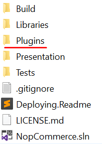
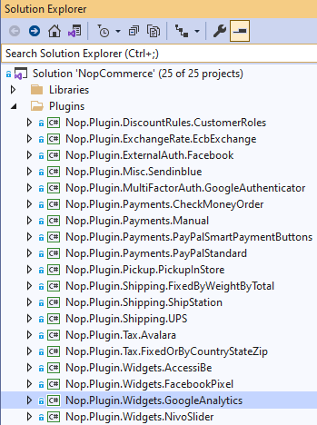
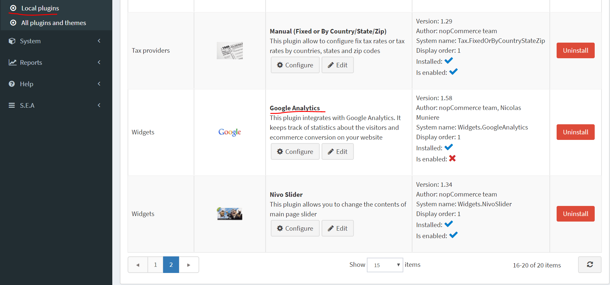
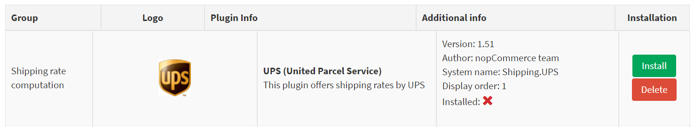
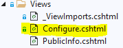
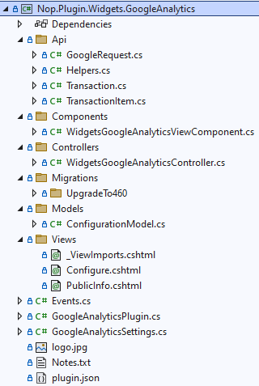

# 如何為 nopCommerce 撰寫小工具

為了擴充 nopCommerce 的功能，我們使用小工具（Widgets）。nopCommerce 的儲存庫中已經包含多種不同類型的小工具，例如 [Swiper](https://github.com/nopSolutions/nopCommerce/tree/master/src/Plugins/Nop.Plugin.Widgets.Swiper) 和 [Google Analytics](https://github.com/nopSolutions/nopCommerce/tree/master/src/Plugins/Nop.Plugin.Widgets.GoogleAnalytics)。nopCommerce 市集也已經提供了各種（包含免費與付費的）小工具，或許能滿足您的需求。如果您還沒找到合適的，那麼您來對地方了，因為這篇文章將引導您完成根據需求建立小工具的流程。

## 小工具的結構、必要檔案與位置

1. 首先，在方案中建立一個新的 **Class Library** 專案。建議將您的小工具放置在原始碼根目錄下的 **Plugins** 資料夾中，其他的小工具與外掛皆存放於此。

    

    > [!NOTE]
    > 請勿將此目錄與 *Presentation\Nop.Web* 目錄下的同名資料夾搞混。位於 *Nop.Web* 目錄下的 *Plugins* 資料夾包含的是已編譯完成的外掛檔案。

    小工具專案建議的命名格式為 `Nop.Plugin.Widgets.{Name}`。其中 `{Name}` 是您的小工具名稱（例如 "**GoogleAnalytics**"）。舉例來說，*Google Analytics widget* 的名稱為：`Nop.Plugin.Widgets.GoogleAnalytics`。但請注意這並非強制要求，您可以為小工具選擇任何名稱，例如 "*MyFirstNopWidget*"。方案中的 *Plugins* 目錄結構如下所示。

    

1. 當小工具專案建立完成後，應使用任何文字編輯器應用程式更新 **.csproj** 檔案的內容。請將其內容替換為以下程式碼：

    ```xml
    <Project Sdk="Microsoft.NET.Sdk">
        <PropertyGroup>
            <TargetFramework>net9.0</TargetFramework>
            <Copyright>SOME_COPYRIGHT</Copyright>
            <Company>YOUR_COMPANY</Company>
            <Authors>SOME_AUTHORS</Authors>
            <PackageLicenseUrl>PACKAGE_LICENSE_URL</PackageLicenseUrl>
            <PackageProjectUrl>PACKAGE_PROJECT_URL</PackageProjectUrl>
            <RepositoryUrl>REPOSITORY_URL</RepositoryUrl>
            <RepositoryType>Git</RepositoryType>
            <OutputPath>$(SolutionDir)\Presentation\Nop.Web\Plugins\WIDGET_OUTPUT_DIRECTORY</OutputPath>
            <OutDir>$(OutputPath)</OutDir>
            <!--Set this parameter to true to get the dlls copied from the NuGet cache to the output of your    project. You need to set this parameter to true if your plugin has a nuget package to ensure that   the dlls copied from the NuGet cache to the output of your project-->
            <CopyLocalLockFileAssemblies>true</CopyLocalLockFileAssemblies>
            <ImplicitUsings>enable</ImplicitUsings>
        </PropertyGroup>
        <ItemGroup>
            <ProjectReference Include="$(SolutionDir)\Presentation\Nop.Web.Framework\Nop.Web.Framework.csproj" />
            <ClearPluginAssemblies Include="$(SolutionDir)\Build\ClearPluginAssemblies.csproj" />
        </ItemGroup>
        <!-- This target execute after "Build" target -->
        <Target Name="NopTarget" AfterTargets="Build">
            <!-- Delete unnecessary libraries from plugins path -->
            <MSBuild Projects="@(ClearPluginAssemblies)" Properties="PluginPath=$(OutDir)" Targets="NopClear" />
        </Target>
    </Project>
    ```

    > [!NOTE]
    > **WIDGET_OUTPUT_DIRECTORY** 應替換為外掛名稱，例如 *Widgets.GoogleAnalytics*。

1. 更新 *.csproj* 檔案後，應加入小工具必備的 **plugin.json** 檔案。此檔案包含描述您小工具的詮釋資料。您可以直接從任何現有的外掛或小工具複製此檔案，並根據需求進行修改。關於 `plugin.json` 檔案的詳細資訊，請參閱 [plugin.json 檔案](xref:zh-Hant/developer/plugins/plugin_json)。

    最後一個必要步驟是建立一個類別，該類別需實作 **BasePlugin**（位於 *Nop.Core.Plugins* 命名空間）以及 **IWidgetPlugin** 介面（位於 *Nop.Services.Cms* 命名空間）。IWidgetPlugin 允許您建立小工具。小工具會顯示在您網站的某些區塊中；例如，它可以是網站右下角的即時對話視窗。

## 處理請求：Controllers、Models 與 Views

現在，您可以前往 **後台** → **設定** → **在地外掛** 查看該小工具。



當外掛/小工具安裝後，您會看到 **解除安裝** 按鈕。*為了提升效能，建議您將不需要的外掛/小工具解除安裝*。


當外掛/小工具未安裝或已解除安裝時，會顯示 **安裝** 和 **刪除** 按鈕。*執行刪除將會從伺服器移除實體檔案*。

但如您所料，我們的小工具目前什麼都沒做。它甚至沒有用於設定的使用者介面。讓我們建立一個頁面來設定該小工具。

我們現在需要做的是建立一個 controller、一個 model、一個 view 以及一個 view component。

- **MVC controllers** 負責回應針對 *ASP.NET MVC* 網站發出的請求。每個瀏覽器請求都會對應到特定的 controller。
- View 包含了發送到瀏覽器的 **HTML** 標記和內容。在使用 *ASP.NET MVC* 應用程式時，view 就相當於一個頁面。
- 實作 **NopViewComponent** 的 view component 包含了轉譯 view 所需的邏輯與程式碼。
- **MVC model** 包含了應用程式中不屬於 view 或 controller 的所有邏輯。

那麼讓我們開始吧：

1. 建立 model。在新的小工具中加入一個 `Models` 資料夾，然後加入一個符合您需求的 model 類別。

1. 建立 view。在新的小工具中加入一個 `Views` 資料夾，然後加入一個名為 `Configure.cshtml` 的 `cshtml` 檔案。將該 view 檔案的「**建置動作** (Build Action)」屬性設為「**內容** (Content)」，並將「**複製到輸出目錄** (Copy to Output Directory)」屬性設為「**永遠複製** (Copy always)」。請注意，設定頁面應使用「**_ConfigurePlugin**」版面配置。

    ```cs
    @{
        Layout = "_ConfigurePlugin";
    }
    ```

1. 同時確保您的 `Views` 目錄中有 **_ViewImports.cshtml** 檔案。您可以直接從任何其他現有的外掛或小工具中複製它。

    

1. 建立 controller。在新的小工具中加入一個 `Controllers` 資料夾，然後加入一個新的 controller 類別。一個良好的做法是將外掛的 controller 命名為 `Widgets{Name}Controller.cs`。例如：**WidgetsGoogleAnalyticsController**。當然，這並非強制性的命名方式，僅為建議。接著，為設定頁面（在後台區域）建立適當的動作方法 (action method)。我們將其命名為 `Configure`。準備一個 model 類別並使用實體 view 路徑將其傳遞給 view：`~/Plugins/{PluginOutputDirectory}/Views/Configure.cshtml`。

    ```cs
    public async Task<IActionResult> Configure()
    {
        if (!await _permissionService.AuthorizeAsync(StandardPermissionProvider.ManageWidgets))
            return AccessDeniedView();

        //load settings for a chosen store scope
        var storeScope = await _storeContext.GetActiveStoreScopeConfigurationAsync();
        var myWidgetSettings = await _settingService.LoadSettingAsync<MyWidgetSettings>(storeScope);

        var model = new ConfigurationModel
        {
            // configuration model settings here
        };

        if (storeScope > 0)
        {
            // override settings here based on store scope
        }

        return View("~/Plugins/Widgets.MyFirstNopWidget/Views/Configure.cshtml", model);
    }
    ```

1. 為您的動作方法使用以下屬性：

    ```cs
    [AutoValidateAntiforgeryToken]
    [AuthorizeAdmin] //confirms access to the admin panel
    [Area(AreaNames.Admin)] //specifies the area containing a controller or action
    [AdminAntiForgery] //Helps prevent malicious scripts from submitting forged page requests.
    ```

    例如，開啟 `GoogleAnalytics` 小工具並查看其 `WidgetsGoogleAnalyticsController` 的實作方式。
    接著，對於每個擁有設定頁面的小工具，您都應該指定一個設定 URL。名為 **BasePlugin** 的基底類別擁有 `GetConfigurationPageUrl` 方法，該方法會回傳設定 URL：

    ```cs
    public override string GetConfigurationPageUrl()
    {
        return $"{_webHelper.GetStoreLocation()}Admin/{CONTROLLER_NAME}/{ACTION_NAME}";
    }
    ```

    其中 `{CONTROLLER_NAME}` 是您的 controller 名稱，而 `{ACTION_NAME}` 是動作名稱（通常為 "Configure"）。
    每個小工具都應該指定一個小工具區域 (widget zones) 清單。名為 **IWidgetPlugin** 的介面擁有 `GetWidgetZones` 方法，該方法會回傳一組將被轉譯的小工具區域清單。

    ```cs
    public Task<IList<string>> GetWidgetZonesAsync()
    {
        return Task.FromResult<IList<string>>(new List<string> {PublicWidgetZones.HeadHtmlTag });
    }
    ```

    您可以從此處 [link](https://github.com/nopSolutions/nopCommerce/blob/master/src/Presentation/Nop.Web.Framework/Infrastructure/PublicWidgetZones.cs) 找到公開小工具區域的清單，並依循此處 [link](https://github.com/nopSolutions/nopCommerce/blob/master/src/Presentation/Nop.Web.Framework/Infrastructure/AdminWidgetZones.cs) 找到後台小工具區域。
    除了 `GetWidgetZonesAsync` 之外，**IWidgetPlugin** 還擁有 `GetWidgetViewComponentName` 方法，該方法會回傳 ViewComponent 名稱。它接受 "*widgetZone*" 名稱作為參數，並可用於根據所選的小工具區域來轉譯不同的 view。

    ```cs
    public string GetWidgetViewComponentName(string widgetZone)
    {
        return "MyFirstWidget";
    }
    ```

## Google Analytics 小工具的專案結構



## 處理「InstallAsync」與「UninstallAsync」方法

此步驟為選填。有些小工具在安裝過程中可能需要額外的邏輯。例如，小工具可以插入新的語言資源或設定值。因此，請開啟您的 **IWidgetPlugin** 實作（大多數情況下它會繼承自 **BasePlugin** 類別）並覆寫下列方法：

1. **InstallAsync**。此方法將在安裝外掛期間被呼叫。您可以在此初始化任何設定、插入新的語言資源，或建立新的資料庫資料表（若有需要）。

    ```cs
    public override async Task InstallAsync()
    {
        // custom logic like adding settings, locale resources, and database table(s) here

        await base.InstallAsync();
    }
    ```

1. **UninstallAsync**。此方法將在解除安裝外掛期間被呼叫。您可以移除該小工具在安裝期間所初始化的設定、語言資源或資料庫資料表。

    ```cs
    public override async Task UninstallAsync()
    {
        // custom logic like removing settings, locale resources, and database table(s) which was created during widget installation

        await base.UninstallAsync();
    }
    ```

    > [!IMPORTANT]
    > 若您覆寫了這些方法中的其中一個，請勿隱藏其基礎實作——即上圖中所標示的 **base.InstallAsync()** 與 **base.UninstallAsync()**。