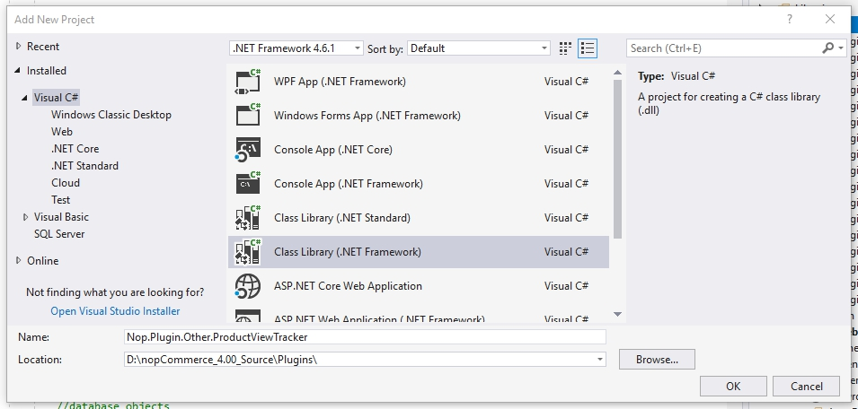
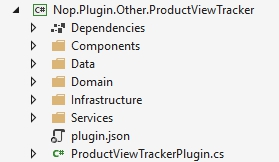

# 具備資料存取的插件 (4.20 與更早版本)

在本教學中，我將使用 nopCommerce 外掛架構來實作一個商品瀏覽追蹤器。在開始開發之前，請務必確認您已閱讀、理解並成功完成下列教學課程。我將會跳過先前文章中已涵蓋的部分說明，但您可以透過提供的連結進行複習。

- [開發者教學](xref:zh-Hant/developer/tutorials/index)
- [更新現有實體。如何新增屬性。](xref:zh-Hant/developer/tutorials/update-existing-entity)
- [如何為 nopCommerce 4.20 編寫外掛](xref:zh-Hant/developer/plugins/how-to-write-plugin-4.20)

我們將從資料存取層開始編寫程式碼，接著進入服務層，最後以相依性注入結束。

> [!NOTE]
> 此插件的實際應用價值有待商榷，但我一時想不出什麼 nopCommerce 原生未包含且適合在適當篇幅內介紹的功能。如果您在正式營運環境中使用此插件，我不提供任何保證。我總是對成功案例感到興趣，若此文章不僅具備教學價值，還能對您有所幫助，我將感到非常高興。

## 入門指南

建立一個新的類別庫專案「Nop.Plugin.Other.ProductViewTracker」。



新增下列資料夾與 `plugin.json` 檔案。



關於 `plugin.json` 檔案的詳細資訊，請參閱 [plugin.json 檔案](xref:zh-Hant/developer/plugins/plugin_json)。

接著，加入對下列專案的參考：Nop.Core、Nop.Data、Nop.Web.Framework

## 資料存取層（又名：在 nopCommerce 中建立新實體）

我們將在「domain」命名空間內建立一個名為 `ProductViewTrackerRecord` 的公開類別。此類別繼承自 `BaseEntity`，除此之外這是一個非常單純的檔案。有一點需要記住的是，所有屬性都被標記為 `virtual`，這不只是為了好玩。由於 Entity Framework 實例化與追蹤類別的方式，資料庫實體必須具備虛擬屬性。另一點需要注意的是，我們沒有導覽屬性（關聯屬性），我稍後會再詳細說明。

```csharp
namespace Nop.Plugin.Other.ProductViewTracker.Domain
{
    public class ProductViewTrackerRecord : BaseEntity
    {
        public virtual int ProductId { get; set; }
        public virtual string ProductName { get; set; }
        public virtual int CustomerId { get; set; }
        public virtual string IpAddress { get; set; }
        public virtual bool IsRegistered { get; set; }
    }
}
```

**檔案位置**：若要確定特定檔案應存放的位置，請分析其命名空間並據此建立檔案。

接下來要建立的是 Entity Framework 對應類別。我們在對應類別中對應資料行、資料表關聯以及資料庫資料表。

```csharp
namespace Nop.Plugin.Other.ProductViewTracker.Data
{
    public class ProductViewTrackerRecordMap : NopEntityTypeConfiguration<ProductViewTrackerRecord>
    {
        /// <summary>
        /// Configures the entity
        /// </summary>
        /// <param name="builder">The builder to be used to configure the entity</param>
        public override void Configure(EntityTypeBuilder<ProductViewTrackerRecord> builder)
        {
            builder.ToTable(nameof(ProductViewTrackerRecord));
            //Map the primary key
            builder.HasKey(record => record.Id);
            //Map the additional properties
            builder.Property(record => record.ProductId);
            //Avoiding truncation/failure
            //so we set the same max length used in the product tame
            builder.Property(record => record.ProductName).HasMaxLength(400);
            builder.Property(record => record.IpAddress);
            builder.Property(record => record.CustomerId);
            builder.Property(record => record.IsRegistered);
        }
    }
}
```

下一個類別是資料存取層中最複雜且最重要的類別。Entity Framework 的 Object Context 是一個傳遞類別，它提供我們資料庫存取權限，並協助追蹤實體狀態（例如：新增、更新、刪除）。此 Context 也用於產生資料庫結構描述（Schema）或更新現有的結構描述。在自訂 Context 類別中，我們無法參考先前存在的實體，因為這些型別已經關聯到另一個 Object Context。這也是為什麼我們的追蹤記錄中沒有複雜導覽屬性的原因。

```csharp
namespace Nop.Plugin.Other.ProductViewTracker.Data
{
    public class ProductViewTrackerRecordObjectContext : DbContext, IDbContext
    {
        public ProductViewTrackerRecordObjectContext(DbContextOptions<ProductViewTrackerRecordObjectContext> options) : base(options)
        {
        }
        protected override void OnModelCreating(ModelBuilder modelBuilder)
        {
            modelBuilder.ApplyConfiguration(new ProductViewTrackerRecordMap());
            base.OnModelCreating(modelBuilder);
        }

        public new virtual DbSet<TEntity> Set<TEntity>() where TEntity : BaseEntity
        {
            return base.Set<TEntity>();
        }

        public virtual string GenerateCreateScript()
        {
            return Database.GenerateCreateScript();
        }

        public virtual IQueryable<TQuery> QueryFromSql<TQuery>(string sql) where TQuery : class
        {
            throw new NotImplementedException();
        }

        public virtual IQueryable<TEntity> EntityFromSql<TEntity>(string sql, params object[] parameters) where TEntity : BaseEntity
        {
            throw new NotImplementedException();
        }

        public virtual int ExecuteSqlCommand(RawSqlString sql, bool doNotEnsureTransaction = false, int? timeout = null, params object[] parameters)
        {
            using (var transaction = Database.BeginTransaction())
            {
                var result = Database.ExecuteSqlCommand(sql, parameters);
                transaction.Commit();
                return result;
            }
        }

        public void Install()
        {
               //create the table
               this.ExecuteSqlScript(GenerateCreateScript());
        }
        public void Uninstall()
        {
               //drop the table
               this.DropPluginTable(nameof(ProductViewTrackerRecord));
        }

        public IList<TEntity> ExecuteStoredProcedureList<TEntity>(string commandText, params object[] parameters) where TEntity : BaseEntity, new()
        {
            throw new NotImplementedException();
        }

        public IEnumerable<TElement> SqlQuery<TElement>(string sql, params object[] parameters)
        {
            throw new NotImplementedException();
        }
        public int ExecuteSqlCommand(string sql, bool doNotEnsureTransaction = false, int? timeout = null, params object[] parameters)
        {
            throw new NotImplementedException();
        }

        public virtual void Detach<TEntity>(TEntity entity) where TEntity : BaseEntity
        {
            throw new NotImplementedException();
        }

        public IQueryable<TQuery> QueryFromSql<TQuery>(string sql, params object[] parameters) where TQuery : class
        {
            throw new NotImplementedException();
        }

        public virtual bool ProxyCreationEnabled
        {
            get => ProxyCreationEnabled;
            set => ProxyCreationEnabled = value;
        }

        public virtual bool AutoDetectChangesEnabled
        {
            get => AutoDetectChangesEnabled;
            set => AutoDetectChangesEnabled = value;
        }
    }
}
```

## 應用程式啟動

此部分會註冊我們在先前步驟中建立的紀錄物件 context。

```csharp
using Microsoft.AspNetCore.Builder;
using Microsoft.Extensions.Configuration;
using Microsoft.Extensions.DependencyInjection;
using Nop.Core.Infrastructure;
using Nop.Plugin.Other.ProductViewTracker.Data;
using Nop.Web.Framework.Infrastructure.Extensions;

namespace Nop.Plugin.Misc.RepCred.Infrastructure
{
    /// <summary>
    /// Represents object for the configuring plugin DB context on application startup
    /// </summary>
    public class PluginDbStartup : INopStartup
    {
        /// <summary>
        /// Add and configure any of the middleware
        /// </summary>
        /// <param name="services">Collection of service descriptors</param>
        /// <param name="configuration">Configuration of the application</param>
        public void ConfigureServices(IServiceCollection services, IConfiguration configuration)
        {
            //add object context
            services.AddDbContext<ProductViewTrackerRecordObjectContext>(optionsBuilder =>
            {
                optionsBuilder.UseSqlServerWithLazyLoading(services);
            });
        }

        /// <summary>
        /// Configure the using of added middleware
        /// </summary>
        /// <param name="application">Builder for configuring an application's request pipeline</param>
        public void Configure(IApplicationBuilder application)
        {
        }

        /// <summary>
        /// Gets order of this startup configuration implementation
        /// </summary>
        public int Order => 11;
    }
}
```

## 服務層

服務層負責連接資料存取層與表現層。由於在程式碼中混合任何類型的職責是不好的做法，因此每一層都需要被隔離。服務層將資料層與商業邏輯封裝起來，而表現層則相依於服務層。由於我們的任務非常簡單，我們的服務層僅負責與 Repository 進行通訊（在 nopCommerce 中，Repository 扮演著物件內容的外觀模式角色）。

```csharp
namespace Nop.Plugin.Other.ProductViewTracker.Services
{
    public interface IProductViewTrackerService
    {
        /// <summary>
        /// Logs the specified record.
        /// </summary>
        /// <param name="record">The record.</param>
        void Log(ProductViewTrackerRecord record);
    }
}

namespace Nop.Plugin.Other.ProductViewTracker.Services
{
    public class ProductViewTrackerService : IProductViewTrackerService
    {
        private readonly IRepository<ProductViewTrackerRecord> _productViewTrackerRecordRepository;
        public ViewTrackingService(IRepository<ProductViewTrackingRecord> productViewTrackerRecordRepository)
        {
            _productViewTrackerRecordRepository = productViewTrackerRecordRepository;
        }

        /// <summary>
        /// Logs the specified record.
        /// </summary>
        /// <param name="record">The record.</param>
        public virtual void Log(ProductViewTrackerRecord record)
        {
            if (record == null)
                throw new ArgumentNullException(nameof(record));
            _productViewTrackerRecordRepository.Insert(record);
        }
    }
}
```

## 相依性注入

Martin Fowler 對於相依性注入（Dependency Injection）或控制反轉（Inversion of Control）有非常詳盡的描述。我不會重複他的工作，您可以點擊 [此處](https://martinfowler.com/articles/injection.html) 閱讀他的文章。相依性注入會管理物件的生命週期，並提供實例供相依物件使用。首先，我們需要設定相依性容器（Dependency Container），讓它了解將要控制哪些物件，以及這些物件的建立規則為何。

```csharp
namespace Nop.Plugin.Other.ProductViewTracker.Infrastructure
{
    public class DependencyRegistrar : IDependencyRegistrar
    {
        private const string CONTEXT_NAME = "nop_object_context_product_view_tracker";

        public virtual void Register(ContainerBuilder builder, ITypeFinder typeFinder, NopConfig config)
        {
            builder.RegisterType<ProductViewTrackerService>().As<IProductViewTrackerService>().InstancePerLifetimeScope();

            //data context
            builder.RegisterPluginDataContext<ProductViewTrackerRecordObjectContext>(CONTEXT_NAME);

            //override required repository with our custom context
            builder.RegisterType<EfRepository<ProductViewTrackerRecord>>()
            .As<IRepository<ProductViewTrackerRecord>>()
            .WithParameter(ResolvedParameter.ForNamed<IDbContext>(CONTEXT_NAME))
            .InstancePerLifetimeScope();
        }

        public int Order => 1;
    }
}
```

在上述程式碼中，我們註冊了不同型別的物件，以便稍後可以將它們注入到 Controller、服務（Service）與 Repository 中。既然我們已經涵蓋了新的主題，接下來我將帶回一些舊的主題，以便我們完成此外掛的開發。

## View component

讓我們來建立一個 view component：

```csharp
namespace Nop.Plugin.Other.ProductViewTracker.Components
{
    [ViewComponent(Name = "ProductViewTracker")]
    public class ProductViewTrackerViewComponent : NopViewComponent
    {
        private readonly IProductService _productService;
        private readonly IProductViewTrackerService _productViewTrackerService;
        private readonly IWorkContext _workContext;
        public ProductViewTrackerViewComponent(IWorkContext workContext,
        IProductViewTrackerService productViewTrackerService,
        IProductService productService)
        {
            _workContext = workContext;
            _productViewTrackerService = productViewTrackerService;
            _productService = productService;
        }
        public IViewComponentResult Invoke(int productId)
        {
            //Read from the product service
            Product productById = _productService.GetProductById(productId);
            //If the product exists we will log it
            if (productById != null)
            {
                //Setup the product to save
                var record = new ProductViewTrackerRecord();
                record.ProductId = productId;
                record.ProductName = productById.Name;
                record.CustomerId = _workContext.CurrentCustomer.Id;
                record.IpAddress = _workContext.CurrentCustomer.LastIpAddress;
                record.IsRegistered = _workContext.CurrentCustomer.IsRegistered();
                //Map the values we're interested in to our new entity
                _productViewTrackerService.Log(record);
            }
            return Content("");
        }
    }
}
```

## 外掛安裝程式

```csharp
namespace Nop.Plugin.Other.ProductViewTracker
{
    public class ProductViewTrackerPlugin : BasePlugin
    {
        private readonly ProductViewTrackerRecordObjectContext _context;
        public ProductViewTrackerPlugin(ProductViewTrackerRecordObjectContext context)
        {
            _context = context;
        }
        public override void Install()
        {
            _context.Install();
            base.Install();
        }
        public override void Uninstall()
        {
            _context.Uninstall();
            base.Uninstall();
        }
    }
}
```

## 使用方式

追蹤程式碼應新增至 `ProductTemplate.Simple.cshtml` 與 `ProductTemplate.Grouped.cshtml` 檔案中。這些檔案是商品範本。

```csharp
@await Component.InvokeAsync("ProductViewTrackerIndex", new { productId = Model.Id })
```

附註：您也可以將其實作為一個小工具。在這種情況下，您就不需要編輯 cshtml 檔案。