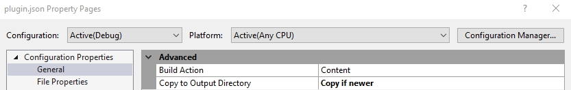

# `plugin.json` 檔案結構說明

此檔案包含外掛的 Meta 資訊描述，nopCommerce 使用這些資訊來判斷此檔案屬於哪個外掛群組、該外掛是否與當前的 nopCommerce 版本相容、外掛的版本號，以及其他相關資訊。每個 nopCommerce 外掛都必須包含此檔案。

## 檔案結構

```json
{
  "Group": "Payment methods",
  "FriendlyName": "PayPal Commerce",
  "SystemName": "Payments.PayPalCommerce",
  "Version": "4.70.1",
  "SupportedVersions": [ "4.70" ],
  "Author": "nopCommerce team",
  "DisplayOrder": -1,
  "FileName": "Nop.Plugin.Payments.PayPalCommerce.dll",
  "Description": ""
}
```

- **Group**：nopCommerce 用於在 **後台 → 設定 → 本地外掛** 選單的外掛列表中，識別、搜尋或篩選外掛所屬的群組名稱。這可以是您的公司名稱。

- **FriendlyName**：這是外掛的顯示名稱，用於從外掛列表中識別該外掛。

- **SystemName**：nopCommerce 用於唯一識別該外掛，因此它必須與所有其他外掛不同。我們無法註冊超過一個具有相同 `SystemName` 的外掛。

- **Version**：這是外掛的版本號，您可以將其設定為任何您喜歡的值。此數字用於識別目前安裝在 nopCommerce 應用程式中的外掛版本。不過，我們建議遵循以下格式 - `"{nopCommerce_version_number}.{build_number}"`。

- **SupportedVersions**：這是一個字串陣列。它包含此項外掛所支援的一個或多個 nopCommerce 版本。在開發過程中，請確保當前您正在開發此項外掛的 nopCommerce 版本已包含在此清單中，否則它將不會載入到外掛列表中。

- **Author**：這是關於外掛創作者的資訊。可以是個人姓名、公司名稱或開發此項外掛的團隊名稱。

- **DisplayOrder**：用於設定此項外掛在外掛列表中顯示的順序。其值為數字類型。

- **FileName**：具有以下格式 **Nop.Plugin.{Group}.{Name}.dll**（這是您的外掛組件檔案名稱）。

- **Description**：包含外掛的簡短描述，例如此項外掛的用途以及功能。這將顯示在插件列表中的外掛名稱下方。
- **LimitedToStores**：可使用此項外掛的商店識別碼清單。若為空，則此項外掛可在所有商店中使用。
- **LimitedToCustomerRoles**：可使用此項外掛的顧客角色識別碼清單。若為空，則此項外掛適用於所有角色。
- **DependsOnSystemNames**：此項外掛所依賴的其他外掛系統名稱清單。

> [!TIP]
> 編輯完 **plugin.json** 檔案內容後，您需要將其 `Copy to Output Directory`（複製到輸出目錄）屬性值設為 `Copy if newer`（若有更新則複製）。
> 
> 這是必要的，因為我們需要將此檔案複製到編譯後的目錄，nopCommerce 才能存取此檔案，以便在管理後台的外掛列表中顯示我們的外掛。

## 範例

- **FixedOrByCountryStateZip** 外掛擁有以下 `plugin.json` 檔案：

  ```json
    {
        "Group": "Tax providers",
        "FriendlyName": "Manual (Fixed or By Country/State/Zip)",
        "SystemName": "Tax.FixedOrByCountryStateZip",
        "Version": "4.70.1",
        "SupportedVersions": [ "4.70" ],
        "Author": "nopCommerce team",
        "DisplayOrder": 1,
        "FileName": "Nop.Plugin.Tax.FixedOrByCountryStateZip.dll",
        "Description": "This plugin allow to configure fix tax rates or tax rates by countries, states and zip codes"
    }
  ```

- **Google Analytics** 小工具擁有以下 *plugin.json* 檔案：

  ```json
    {
        "Group": "Widgets",
        "FriendlyName": "Google Analytics",
        "SystemName": "Widgets.GoogleAnalytics",
        "Version": "4.70.1",
        "SupportedVersions": [ "4.70" ],
        "Author": "nopCommerce team, Nicolas Muniere",
        "DisplayOrder": 1,
        "FileName": "Nop.Plugin.Widgets.GoogleAnalytics.dll",
        "Description": "This plugin integrates with Google Analytics. It keeps track of statistics about    the visitors and ecommerce conversion on your website"
    }
  ```