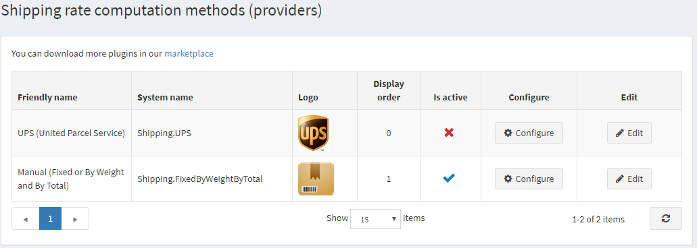

# 如何編寫自己的運費計算方式

如果顧客購買了需要運送的商品，他們可以在結帳期間選擇運送方式。這些運送方式是由運費計算方式（例如 *UPS*、*USPS*、*FedEx* 等）所回傳的。在 nopCommerce 中，運費計算方式是以「外掛」的形式實作。我們建議您在開始編寫新的運費計算方式之前，先閱讀 [如何為 nopCommerce 4.90 編寫外掛](xref:zh-Hant/developer/plugins/how-to-write-plugin-4.70)。該文章將向您解釋建立外掛所需的步驟。實際上，運費計算方式就是一個實作 **IShippingRateComputationMethod** 介面（位於 `Nop.Services.Shipping` 命名空間）的一般外掛。因此，請將一個新的外掛專案（*類別庫*）新增至解決方案，讓我們開始吧。

## 控制器、檢視與模型

新增一個控制器以及對應的 **Configure** 動作方法和檢視。這將決定商店擁有者如何在管理後台的 *系統 → 設定 → 運送 → 運送提供者* 中查看設定選項。本文不說明如何設定外掛，但您可以 [在此處找到更多相關資訊](xref:zh-Hant/getting-started/configure-shipping/shipping-providers/index)。



完成此步驟後，您就可以開始新增取得運送選項所需的業務邏輯。

## 取得運送選項

現在，您需要建立一個實作 **IShippingRateComputationMethod** 介面的類別。這就是負責處理所有實際工作的類別。當 nopCommerce 計算運費總額或需要取得可用運送選項列表時，您類別中的 **GetShippingOptionsAsync** 或 **GetFixedRateAsync** 方法將會被呼叫。以下是 UPSComputationMethod 類別的定義方式（即「UPS」方法）：

```csharp
public class UPSComputationMethod : BasePlugin, IShippingRateComputationMethod
```

**IShippingRateComputationMethod** 介面有幾個必須實作的方法與屬性。

- **GetShippingOptionsAsync**。當顧客在結帳期間選擇運送選項時，此方法會被呼叫。此方法回傳 **`GetShippingOptionResponse`**，其中包含一個 **ShippingOption** 物件列表。每個 **ShippingOption** 物件都包含關於特定運送選項的資訊，例如選項名稱（例如「陸運」）、其費率（例如 10 美元）以及其他資訊。請將您的所有邏輯放在這裡（從您的資料庫取得費率，或向第三方網站如 *UPS* 請求費率）。
- **GetFixedRateAsync**。如您所知，**GetShippingOptionsAsync** 用於在結帳期間（在「選擇運送方式」頁面上）取得運送選項。但有時我們需要在選擇運送選項之前就知道運費（例如在購物車頁面上）。在這種情況下，您可以回傳一個固定費率。例如，若您的運費計算方式僅提供一種運送選項，則無需等待顧客在「選擇運送方式」頁面上進行選擇。若您的固定費率不支援此項功能，請回傳 **`null`**。在這種情況下，顧客將會在購物車的「運費總計」旁看到以下訊息：「*於結帳時計算*」。
- **GetShipmentTrackerAsync**。此方法用於取得關聯的運送追蹤器。結果會回傳一個 **IShipmentTracker**，其中包含顯示追蹤資訊的頁面 URL（第三方追蹤頁面）以及關於運送事件的所有資訊。

## 結論

希望這些內容能協助您開始新增自訂的運費計算方式。