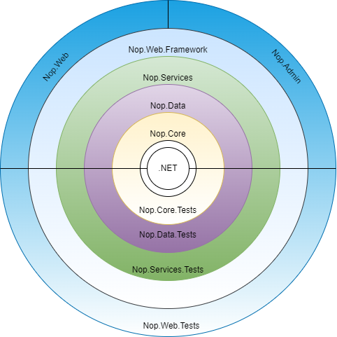

# nopCommerce 的架構

## 簡介

nopCommerce 是一個高度客製化且靈活、支援多商店、多供應商、對 SEO 友善且功能完整的開源電子商務解決方案。它是建立在 Microsoft `ASP.NET Core` 框架之上。nopCommerce 始終保持採用最新技術並遵循最佳實作。

## 概觀

本文件提供了 nopCommerce 系統的全面架構概觀。本文件旨在協助 nopCommerce 的新進開發者。在文件中，我們將探索 nopCommerce 解決方案中的每個專案、這些專案之間的相依性等。

## nopCommerce 架構總覽

nopCommerce 是目前最受歡迎且成功的 `.NET` 架構開放原始碼電子商務解決方案之一。nopCommerce 之所以成功，不僅是因為它開箱即用並具備現代化電子商務解決方案所需的大部分功能，且其 UI 高度可客製化且對使用者友善，更重要的是 nopCommerce 解決方案結構嚴謹且對開發者非常友善。nopCommerce 的核心優勢在於其靈活、可擴充的架構以及組織良好的原始程式碼。nopCommerce 的架構非常接近洋蔥架構（Onion Architecture），其主要目標是控制程式碼的耦合程度。根據此架構，所有程式碼都可以依賴更核心的層級，但不能依賴核心之外的層級。換句話說，所有的耦合都是朝向核心層集中。

這意味著專案只能依賴位於當前專案內部的其他專案。例如，若您查看上述圖表，`Nop.Data` 專案可以依賴 `Nop.Core` 專案並將其作為相依性項目，但 `Nop.Core` 不能依賴 `Nop.Data`。同樣地，`Nop.Services` 可以將 `Nop.Data` 和 `Nop.Core` 作為其相依性項目，但 `Nop.Core` 或 `Nop.Data` 都不能將 `Nop.Services` 作為其相依性項目。這意味著專案只有在另一個專案位於當前專案層級的內部或更核心的位置時，才能將其視為相依性項目，這正是程式碼解耦的關鍵。這種方法與架構的主要優點在於，即使我們沒有應用程式的任何 `UI`，也能測試應用程式核心（Application Core），因為應用程式核心並不依賴 `UI` 層。或者，我們可以將我們的 `UI framework` 從 `Razor` 檢視引擎和 `JQuery` 更換為 `Angular`、`React` 或 `Vue`，而不會影響我們的應用程式核心，並且可以使用同一個核心來建置行動應用程式或桌面應用程式，且完全不需要修改應用程式核心中的任何程式碼。

## nopCommerce 解決方案中的專案

### 應用程式核心 (Application Core)

這是 nopCommerce 架構中最內層的架構。它是整個應用程式的核心，所有的資料存取邏輯與商業邏輯類別都位於這一層。在 nopCommerce 解決方案中，我們可以在「Libraries」目錄下找到此層的所有專案。此層包含三個專案。

#### Nop.Core

此專案包含 nopCommerce 的一組核心類別。此專案處於架構的中心，並且對解決方案中的其他專案沒有任何相依性。此專案包含與整個解決方案共享的核心類別，例如領域實體 (Domain Entities)、快取 (Caching)、事件 (Events) 以及其他輔助類別 (Helper classes)。

#### Nop.Data

`Nop.Data` 專案相依於位於架構中間層的 `Nop.Core` 專案。它不相依於解決方案中的任何其他專案。`Nop.Data` 專案擁有用於讀取與寫入資料庫或其他資料儲存區的類別與函式，它將資料存取邏輯與商業物件區隔開來。

#### Nop.Services

`Nop.Services` 專案是 nopCommerce 架構中應用程式核心的最外層。它相依於應用程式核心中的另外兩個專案。它包含了針對資料的核心服務、商業邏輯、驗證與計算。有些人稱它為商業存取層 (BAL) 或商業邏輯層 (BLL)。它作為所有其他層的 facade（外觀），擁有服務類別並使用 Repository 模式來公開其功能。這種方法將核心與核心之外的其他層進行了去耦合。如果應用程式核心的邏輯發生變更，它也能防止或減少其他層的程式碼變更。這種方法非常適合進行相依性注入。

### UI Layer（UI 層）

此層位於「Application Core（應用程式核心）」之外。在 nopCommerce 解決方案中，我們可以於「Presentation」目錄內找到此層的所有專案。所有的呈現邏輯與 UI 皆位於此層。這是使用者可與之互動的 UI 所在的層級。在 nopCommerce 中，此層細分為另外兩個層級。

#### Nop.Web.Framework

`Nop.Web.Framework` 專案是 Presentation 層的內部層級，且相依於 Application Core 層。這是一個類別庫專案，作為 Presentation 層的框架使用。它擁有 nopCommerce 公開網站與管理後台所共用的邏輯。

#### Nop.Web

`Nop.Web` 專案是 nopCommerce 架構中 Presentation 層的最外層。它包含了使用者可與之互動的電子商務前台網站使用者介面。這是一個 ASP.NET Core 應用程式，並相依於 `Nop.Web.Framework` 與 Application Core。它利用 `Nop.Web.Framework` 來處理前台與管理後台之間的共用邏輯；並利用 Application Core 來進行資料存取與操作。

#### Admin（管理後台）

在 nopCommerce 中，它屬於與 `Nop.Web` 專案相同的層級。它以區域（Area）的形式存在於 `Nop.Web` 專案中。它同樣也是一個 UI（使用者介面），但這部分的 Presentation 包含了管理後台的 UI。管理後台是維護公開網站所有內容的地方，我們也可以從這裡監控公開網站的活動。公開網站可無限制地存取，但「管理後台」需要透過身份驗證（Authentication）與授權（Authorization）才能進入，因為它包含只有網站管理員才有權存取的資訊。

### 測試層 (Test Layer)

此層位於與「表現層 (Presentation Layer)」相同的層級，正好位於「應用程式核心 (Application Core)」之外。此層專門用於測試應用程式的不同部分。由於 nopCommerce 在系統設計上遵循特定的架構，因此在其中進行測試既簡單又更為可靠。在 nopCommerce 解決方案中，我們可以於「Tests」目錄內找到此層的所有專案。nopCommerce 使用 **NUnit** 測試框架進行 *單元測試 (Unit Testing)*。

#### Nop.Tests

此層是「測試層」的內部層，且對「應用程式核心 (Application Core)」層具有相依性。此專案包含了用於測試的核心邏輯。

#### Nop.Core.Tests

這些測試是為 `Nop.Core` 專案進行 *單元測試* 而建立的，用於測試快取、網域實體等項目。

#### Nop.Data.Tests

這些測試是為 `Nop.Data` 專案進行 *單元測試* 而建立的，它們測試各種資料提供者對實體進行的操作，例如新增、刪除等。

#### Nop.Services.Tests

這些測試是為 `Nop.Service` 專案進行 *單元測試* 而建立的。它包含了測試每個服務類別 (Service class) 各項操作的邏輯。

#### Nop.Web.Tests

這些測試可用於測試 nopCommerce 的表現層，其中包含了「前台網站 (Public website)」與「管理後台 (Admin Panel)」。