# 將 nopCommerce 部署至 Azure VM

## 在 Azure 上建立虛擬機器

本說明旨在引導您完成設定 Azure 虛擬機器的必要步驟，以便託管 nopCommerce 網頁應用程式，並允許使用 **WebDeploy** 進行部署。

### 建立新的 VM

1. 登入 [Azure portal](https://portal.azure.com/)
1. 點擊 **Add** 按鈕

    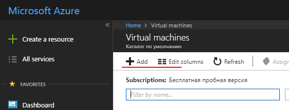

1. 在 *Get Started* 類別中選擇 *Windows Server 2016 VM*，或是在 Compute 類別中選擇任何 Windows Server 2016 版本，例如 **Windows Server 2016 Datacenter**
1. 填寫必要的欄位以設定新的 VM。
    - 使用者名稱/密碼。您將需要此資訊來存取 VM。這是用於透過 RDP 連接到 VM 的管理員帳號。
    - 資源群組。這是包含為此 VM 建立的所有資源的「虛擬資料夾」名稱。您可以透過刪除該資源群組，來刪除在此過程中建立的所有資源。

### 在虛擬機器 (VM) 上設定元件與功能

1. DNS 名稱：
    - 從 [Azure portal](https://portal.azure.com/)，導覽至您的虛擬機器總覽頁面。
    - 在 DNS 名稱下方，點擊 **Configure**。
    - 提供一個全球唯一的 DNS 名稱。（當名稱驗證通過時，會出現一個綠色勾號。）
    - 點擊 **Save** 以儲存設定。

### 設定 Azure 防火牆規則

1. 在 Azure 入口網站中設定輸入防火牆規則。在「網路 (Networking)」區段中，新增一項輸入連接埠規則以建立新的防火牆項目：
    - http - 連接埠 80 (優先級 100)
    - WebDeploy - 連接埠 8172 (優先級 1010)
    - RDP - 連接埠 3389 (優先級 320)

    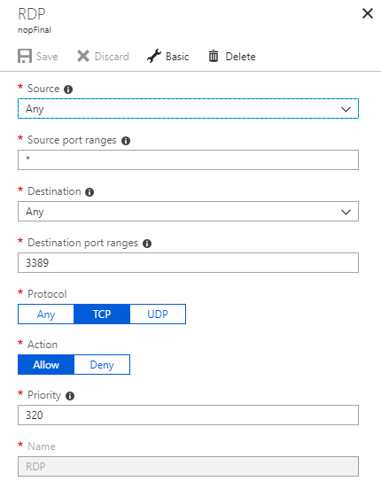

2. 在 Azure 入口網站中設定輸出防火牆規則。在「網路 (Networking)」區段中，新增一項輸出連接埠規則以建立新的防火牆項目：
    - RDP - 連接埠 3389 (優先級 100)

### 使用帳號密碼連線至虛擬機器 (RDP)

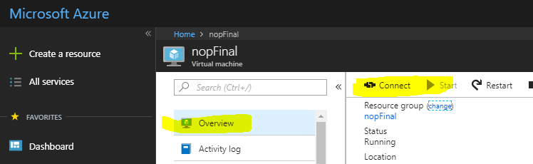

### 安裝 IIS (網頁伺服器) 與 ASP.NET 4.6

1. 開啟 **伺服器管理員儀表板** (伺服器管理員 - 儀表板會在第一次啟動時開啟)
1. 選擇 **2 新增角色及功能**

    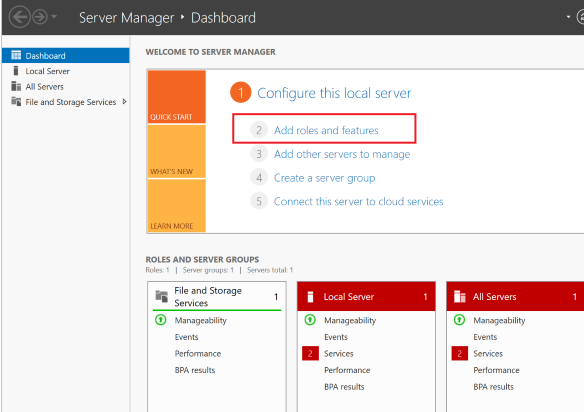

1. 接受預設值並按 **下一步** 三次，以前往「伺服器角色」區段。
1. 選擇 **網頁伺服器 (IIS)**

    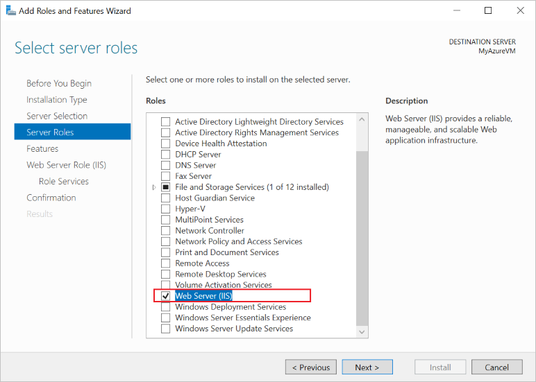

1. 當系統提示時，確認安裝額外的 *IIS 管理主控台*。
1. 按 **下一步** 三次，以前往 *網頁伺服器角色 (IIS) --> 角色服務* 區段。
1. 選擇 **管理服務**，這是啟用 Web Deploy (透過連接埠 8172) 所必需的。當系統提示時，確認安裝額外的 ASP.NET 4.6。

    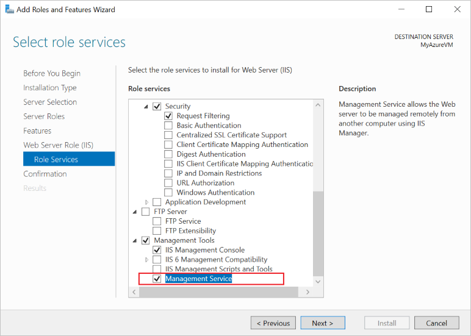

1. 選擇 **下一步** 以確認設定，然後按 **安裝** 以完成 IIS 設定。

    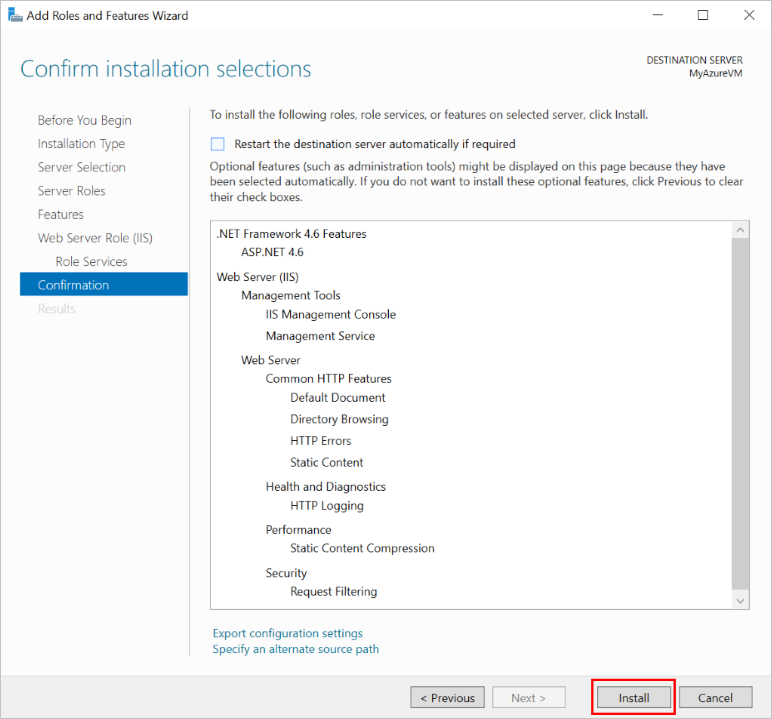

    安裝完成後：
    - IIS 已安裝並執行，且已為連接埠 80 建立內部防火牆規則。
    - 網頁管理服務已安裝，且已為連接埠 8172 建立內部防火牆規則。

### 設定 IE 增強安全性 (Off)

在新的 Azure VM 上，預設的安全規則會防止透過 Internet Explorer 下載執行檔。若要下載 WebDeploy 執行檔，您必須先停用 IE 增強安全性。

1. 在 **Server Manager** 中，開啟左側的 **Local Server** 區段。
1. 在主面板中，找到「**IE Enhanced Security Configuration:**」，點選旁邊的 On。
1. 在出現的對話視窗中，選擇 **Off for Administrators**，並將使用者選項選擇 **On for Users**，然後點選 **OK**。

    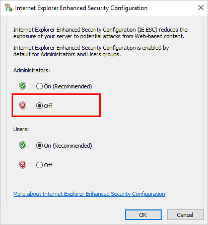

### 安裝 Web Deploy

1. 啟動 Internet Explorer。
1. 接受預設的安全性設定。
1. [下載](https://www.microsoft.com/download/details.aspx?id=43717) *WebDeploy_amd64_en-US.msi*
1. 依照安裝步驟安裝 Web Deploy。
1. 選擇「Complete」（完整）選項以安裝所有元件。

### 安裝最新版本的 [NET Core SDK](https://www.microsoft.com/net/download/all)

### 安裝 [.NET Core Windows Server Hosting](https://www.microsoft.com/net/download/all) 套件

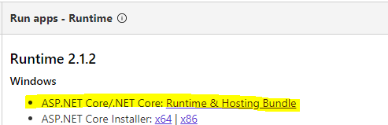

IIS 用於託管 ASP.NET Core 網頁應用程式，其角色將轉變為代理伺服器。ASP.NET Core 應用程式在 IIS 上的託管是透過原生的 *AspNetCoreModuleV2* 來進行，該模組會將請求重新導向至 *Kestrel* 網頁伺服器。此模組會控制外部處理程序 `dotnet.exe` 的啟動（應用程式即託管於該處理程序中），並將所有來自 IIS 的請求轉發給此主機處理程序。

安裝此套件後，請在命令列執行 **iisreset** 指令，或手動重新啟動 IIS，以便伺服器套用變更。

### 設定 IIS

1. 您必須賦予 `wwwroot` 資料夾相關權限。在 **IIS Manager** 中選取該網站，選擇 **Edit Permissions**，並確保 *IUSR*、*IIS_IUSRS* 或為應用程式集區 (Application Pool) 設定的使用者，是具有「讀取與執行 (Read & Execute)」權限的授權使用者。如果這些使用者都不存在，請新增 *IUSR* 並賦予其「讀取與執行」權限。

    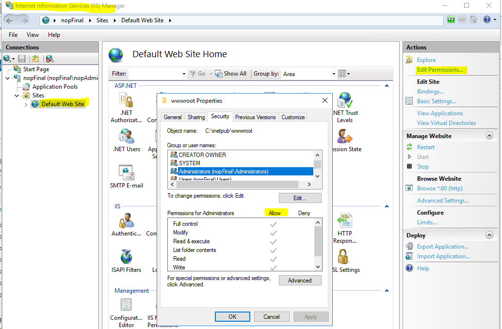

1. 點擊右側面板上的 **Restart** 以重新啟動 IIS。

現在一切準備就緒，可以將專案部署 (publish) 了。

## 將 nopCommerce 發佈至 Azure VM (使用 Microsoft Visual Studio)

發佈 nopCommerce 應用程式與發佈任何其他 ASP.NET Core 應用程式並無不同。因此，以下將說明執行發佈的最低需求。更多詳細資訊請參閱 [here](https://docs.microsoft.com/aspnet/core/tutorials/publish-to-azure-webapp-using-vs?view=aspnetcore-2.1#deploy-the-app-to-azure)。

## 部署 `Nop.Web` 專案

1. 在 Microsoft Visual Studio 中開啟您的網頁應用程式解決方案。在「方案總管」(Solution Explorer) 中對專案按一下右鍵，並選擇 **發布 (Publish)**。

    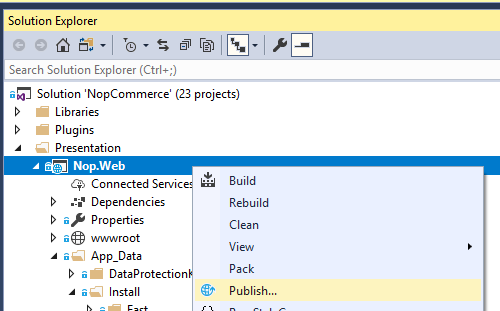

1. 使用頁面右側的箭頭捲動發布選項，直到找到 **Microsoft Azure Virtual Machines**。從現有的虛擬機器清單中選擇適當的 VM。
1. 點擊 **建立設定檔 (Create Profile)**。

    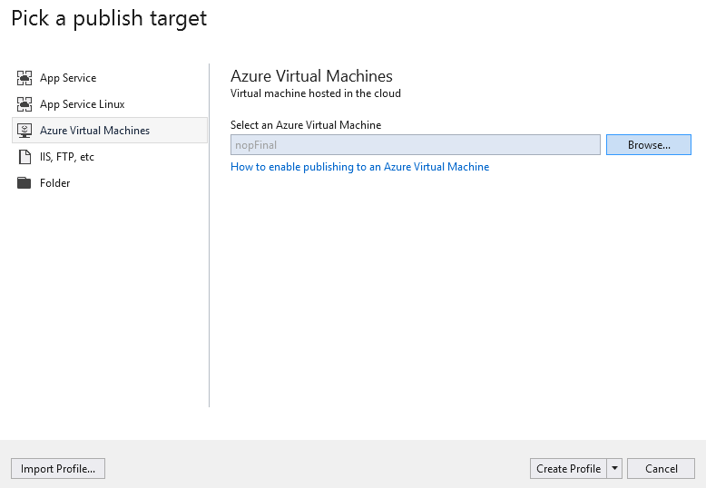

1. 若要檢視與修改發布設定檔的設定，請選擇 **設定 (Configure)**。使用 **驗證連線 (Validate Connection)** 按鈕來確認您已輸入正確的資訊。

    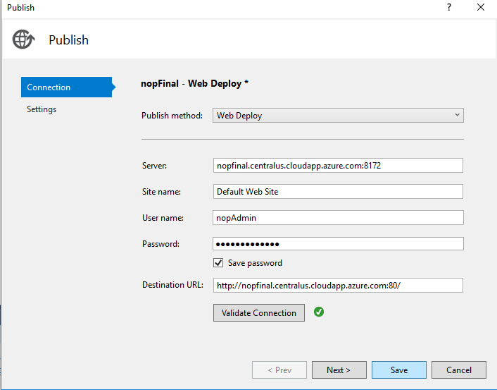

1. 如果您希望確保每次上傳後，網頁伺服器都能擁有乾淨的網頁應用程式複本（且不會留下先前部署所遺留的檔案），您可以在 **設定 (Settings)** 索引標籤中勾選 **移除目的地處的其他檔案 (Remove additional files at destination)** 核取方塊。警告：啟用此設定進行發布將會刪除網頁伺服器（*wwwroot* 目錄）上現有的所有檔案。請確保在啟用此選項進行發布前，您已了解該機器的狀態。

    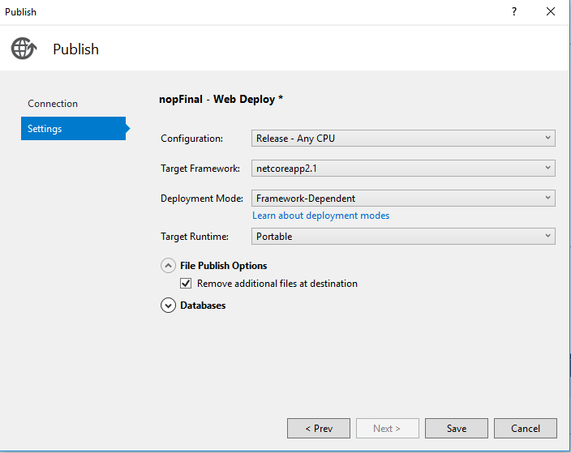

1. 點擊 **儲存 (Save)**。
1. 點擊 **發布 (Publish)** 以開始部署程序。

現在，您已將網頁應用程式成功部署至 Azure 虛擬機器。

## 常見問題與解決方案

若要準確地調查任何問題，您需要啟用記錄功能 - 在 `web.config` 中啟用 stdoutLog：

```sh
stdoutLogEnabled="true" stdoutLogFile=".\logs\stdout"
```

### IIS 無法找到 web.config

您可以參考以下網址找到可能的解決方案： [support.microsoft.com](http://support.microsoft.com/kb/942055)