# 預設資料庫綱要

在本文中，我們將介紹在初始安裝期間所建立，且在 90% 的情況下保持不變的資料庫綱要。

我們不會列出整個綱要，而是會描述預設安裝中提供的 126 個資料表。

為了更輕易地理解此綱要，我們將其拆分為幾個部分。以下我們將資料表進行了最自然且易於理解的分組：

* [顧客資訊](#customers-info)
* [商品資訊](#products-info)
  * [商品屬性](#product-attributes)
  * [階梯價格](#tier-price)
  * [各倉儲庫存](#inventory-by-warehouses)
* [訂單](#orders)
* [出貨](#shipments)
* [折扣](#discounts)
* [購物車](#shopping-cart)
* [地址](#addresses)
* [資料庫命名慣例](#database-naming-convention)

## 顧客資訊

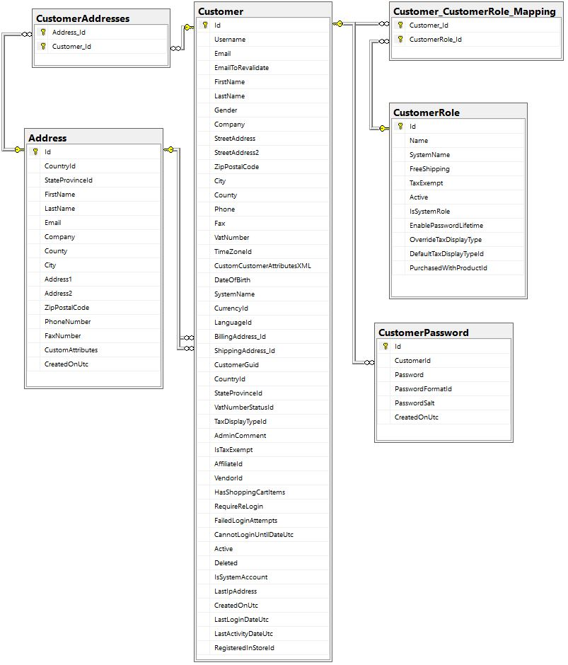

此圖表顯示了一組包含基本顧客資訊的資料表，同時也標示了連結的方向。

我們不會深入探討各個資料表與欄位的目的，因為它們的名稱已經足夠清楚明確。

### 功能（顧客資訊）

* 在 **Customer** 資料表中，有三個欄位實際上應該定義為外鍵，但實務上並沒有這樣設定：
    1. AffiliateId
    1. VendorId
    1. RegisteredInStoreId

    這麼做是刻意為之，為了避免系統負載過多不必要的連結，因為這些欄位並非每個線上商店都會用到。

* 部分顧客資料儲存在 **GenericAttribute** 資料表中。您可以在 `\src\Libraries\Nop.Core\Domain\Customers\NopCustomerDefaults.cs` 中找到所有相關定義。

    此資料表的結構如下所示：

    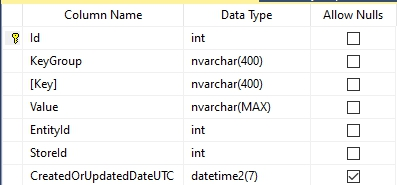

    除了上述的顧客資料外，此資料表也能儲存其他實體的任何資料。我們刻意加入此資料表，是為了讓您在不更動資料表結構的情況下，也能擴充任何實體。

    此外，此資料表以 XML 格式儲存自訂的 **Customer attributes**（顧客屬性）與 **Vendor attributes**（供應商屬性），以及供應商與顧客所選擇的值。請參閱以下資料列以了解其呈現方式：

    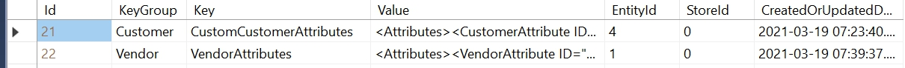

    透過 *Value* 欄位中的 XML 字串範例，我們可以觀察特定供應商的屬性值是如何儲存的：

    ```csharp
    <Attributes><VendorAttribute ID="2"><VendorAttributeValue><Value>1</Value></VendorAttributeValue></VendorAttribute></Attributes>
    ```

    如您所見，ID 為 1 的供應商只有填寫一項供應商屬性。該屬性的 ID 為 2，其值為 1。

    自訂顧客屬性的結構與供應商屬性相同。下方的截圖呈現了 **Customer attributes** 與 **Vendor attributes** 及其值之間的關聯：

    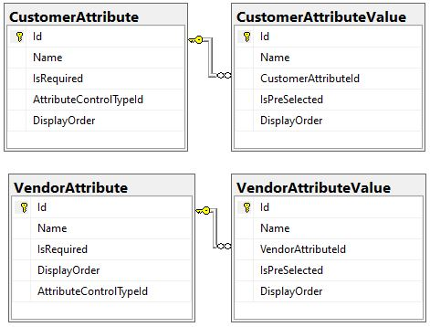

## 商品資訊

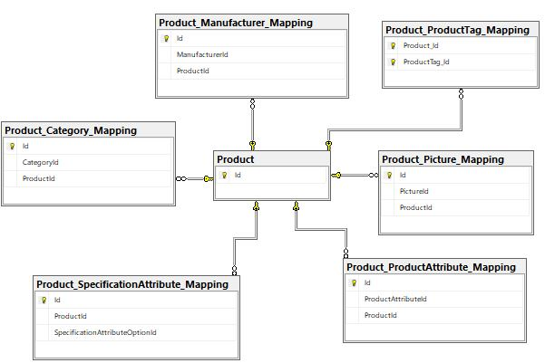

在圖表中，您可以看到商品的基礎資料（下方商品資訊資料表的結構）。通常情況下，99% 的情況都會使用這些資料。

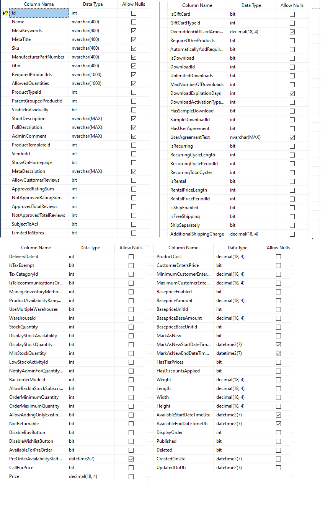

### 功能（商品資訊）

根據商店設定，其他資料表可能會連接到此結構。例如，將商品數量分配到多個倉庫。

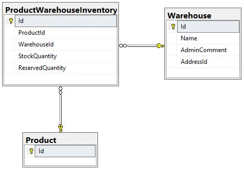

或是如果您想使用商品評論功能：

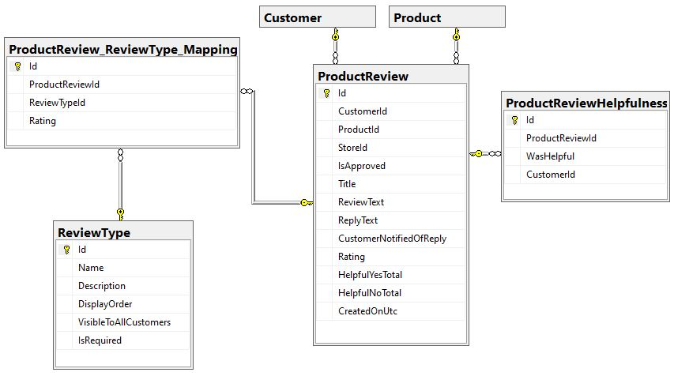

### 商品屬性

接下來，讓我們參考下方呈現的屬性結構及其組合方式：

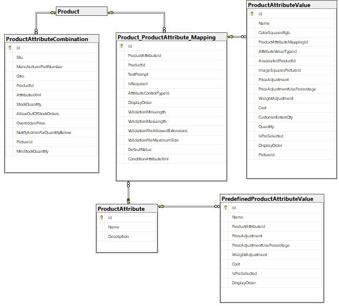

### 階梯價格

如果您為商品使用階梯價格（tier pricing），您也應該注意以下架構：

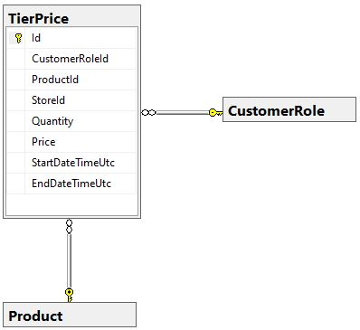

### 各倉庫庫存

儘管此功能不常被使用，但若您需要提供特定倉庫中的貨物會計架構，它可能會有所幫助：

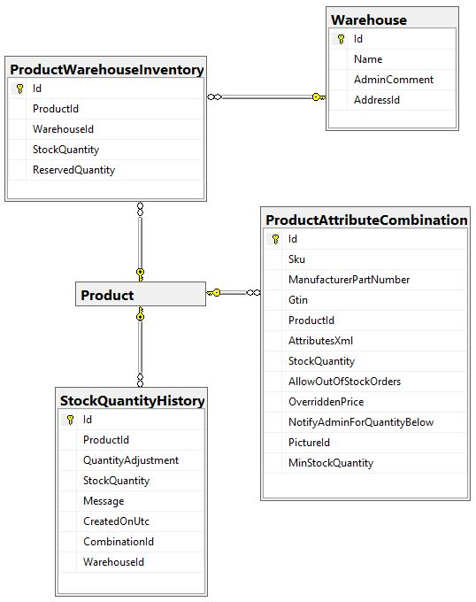

## 訂單

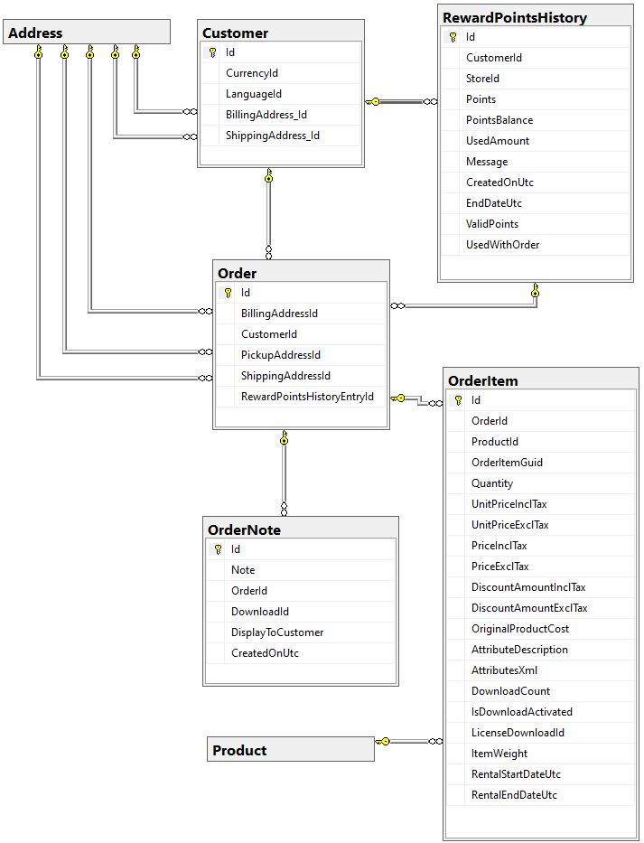

在此圖表中，我們可以看到與訂單資料相關的資料表。**Order** 資料表具有以下結構：

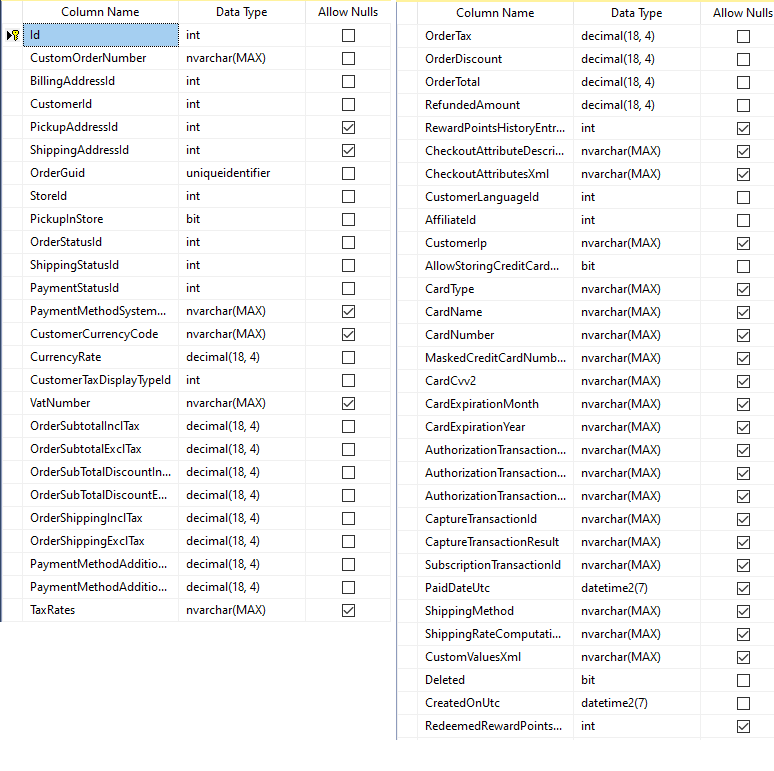

由於圖表中的內容一目了然，且欄位名稱已具備足夠的自我描述性，因此無需多做說明。僅需注意，**RewardPointsHistory** 資料表僅在商店啟用了*紅利點數系統*時才會使用。

## 出貨

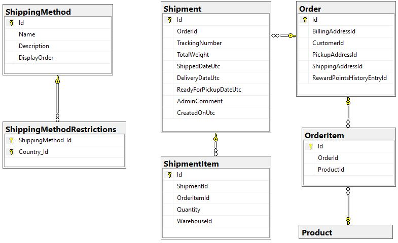

與先前一樣，圖表中的所有資料表用途皆十分明確，無須多作贅述。不過，我們還是針對幾點進行說明。**ShippingMethod** 資料表用於管理已連接的外掛清單，而特定的貨運方式則儲存在 **Order** 資料表的 *ShippingRateComputationMethodSystemName* 和 *ShippingMethod* 欄位中。

**ShipmentItem** 資料表的 *OrderItemId* 欄位本質上是對 **OrderItem** 資料表的參考。

## 折扣

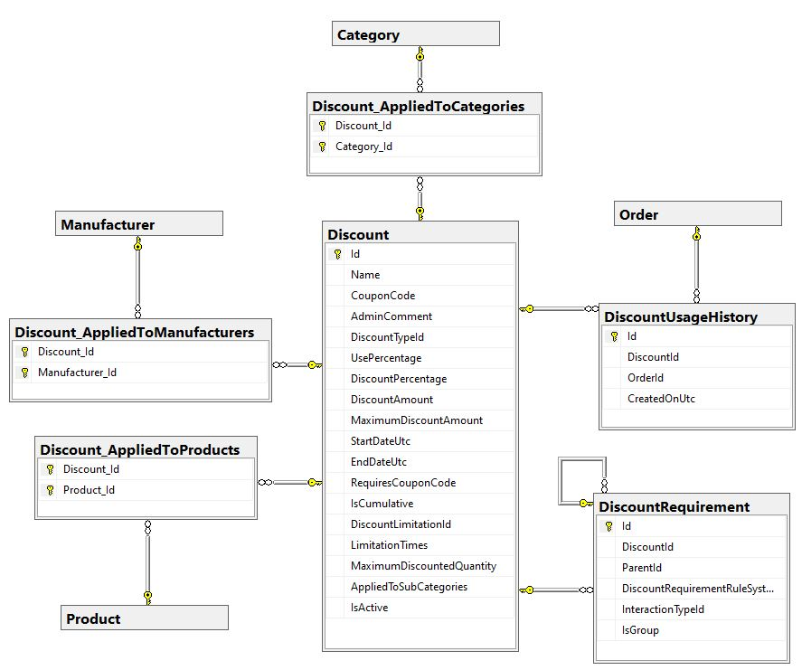

從上圖中，我們可以看到折扣可以應用於三種類別：**商品 (Products)**、**製造商 (Manufacturers)**、**分類 (Categories)**。
並且可以透過外掛 (``IDiscountRequirementRule``) 來設定各種規則。

在 **DiscountRequirement** 資料表中，*InteractionTypeId* 欄位必須包含 ``RequirementGroupInteractionType`` 列舉中所指定的其中一個值：

```csharp
/// <summary>
/// Represents an interaction type within the group of requirements
/// </summary>
public enum RequirementGroupInteractionType
{
    /// <summary>
    /// All requirements within the group must be met
    /// </summary>
    And = 0,

    /// <summary>
    /// At least one of the requirements within the group must be met 
    /// </summary>
    Or = 2
}
```

## 購物車

商店中另一個重要的部分是購物車。在我們的案例中，此機制的架構非常簡單：

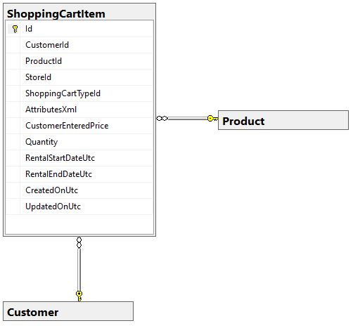

唯一值得注意的是，此架構也用於願望清單。為了區分這兩種類型，使用了 *ShoppingCartTypeId* 欄位。此欄位中的值必須與 **ShoppingCartType** 列舉中的值相符：

```csharp
/// <summary>
/// Represents a shopping cart type
/// </summary>
public enum ShoppingCartType
{
    /// <summary>
    /// Shopping cart
    /// </summary>
    ShoppingCart = 1,

    /// <summary>
    /// Wishlist
    /// </summary>
    Wishlist = 2
}
```

## 地址

或許您也會對儲存地址（包括配送地址與顧客地址）所涉及的資料表結構感興趣：

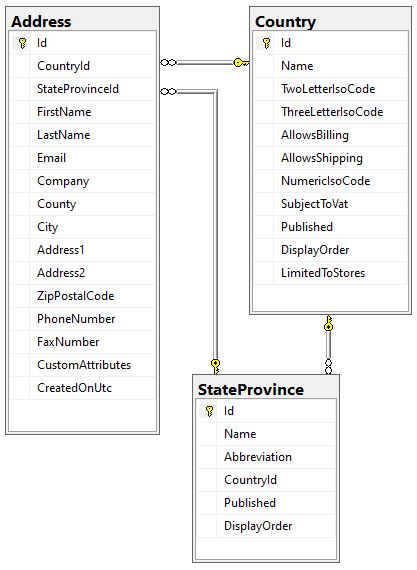

如您所知，標準安裝包含了更多的資料表。我們不會在此全部說明，因為其中許多資料表並無關聯，僅用於特定目的，而有些則極少被使用。

## 資料庫命名慣例

您可能已經注意到，資料庫在表格與欄位的命名上使用了混合方式（包含 `_` 字元、不含 `_` 以及 CamelCase）。在很久以前，我們曾使用 `_` 字元，但現在我們已完全轉向使用 **PascalCase** 標記法。我們選擇不更改現有表格或欄位的名稱，因為許多使用者已經撰寫了自訂指令碼，若更改將會導致這些指令碼失效。

為了與新標準保持向下相容性，我們引入了 `INameCompatibility` 介面。它允許您重新命名表格與欄位，以便將物件正確對應到遵循舊命名標準的表格。位於 `Nop.Data.Mapping` 命名空間中的 [BaseNameCompatibility](https://github.com/nopSolutions/nopCommerce/blob/develop/src/Libraries/Nop.Data/Mapping/BaseNameCompatibility.cs) 類別包含了完整的覆寫清單。