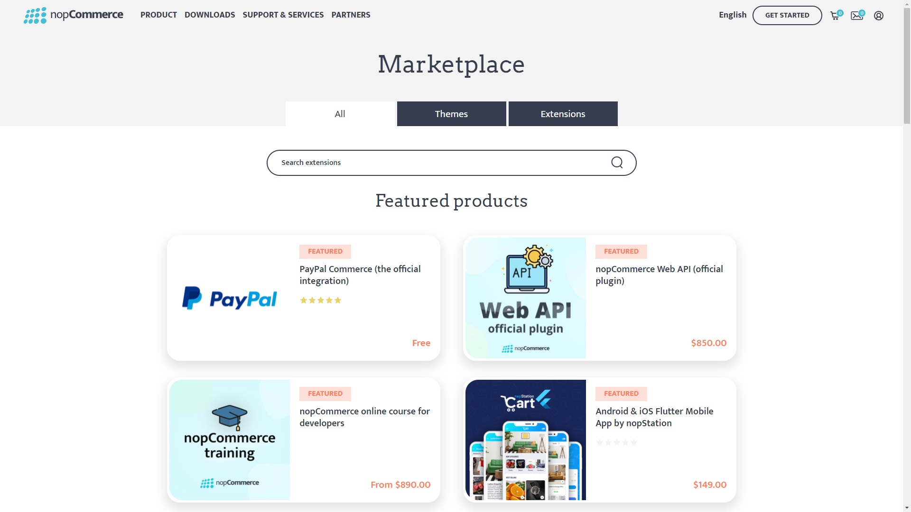

# 外掛系統簡介

## 如何初始化一個新的外掛系統（如何建立一個新的外掛專案）

nopCommerce 使用外掛系統來擴充 nopCommerce 商店的功能。外掛是一組獨立的程式或組件，可以被加入到現有的系統中以擴充某些特定功能，並且在過程中也可以從系統中移除，而不會影響主系統的運作。

> [!NOTE]
> 關於如何建立外掛的更多資訊，您可以前往 [**此頁面**](xref:zh-Hant/developer/plugins/index)。

## 如何搜尋並使用來自 nopCommerce 商店的外掛

nopCommerce 已經內建了幾個可直接使用的外掛。您也可以搜尋並尋找 nopCommerce 官方市集（marketplace）中現有的外掛，看看是否已經有人開發了符合您需求的外掛。如果沒有，您總是可以根據自己的需求開發專屬的外掛。但現在，讓我們來看看如何從 nopCommerce 商店中尋找並使用外掛。為此，nopCommerce 提供了一個市集，我們可以在其中找到不同的佈景主題與外掛。您可以前往 [nopCommerce 市集](https://www.nopcommerce.com/marketplace) 查看。



在這裡，您可以看到三個分頁。**All**（全部）分頁包含所有的佈景主題與擴充功能；**Themes**（佈景主題）分頁包含所有用於 nopCommerce 網站外觀的佈景主題；最後是 **Extensions**（擴充功能）分頁，我們可以在這裡找到外掛。請點選 Extensions 分頁，在這裡您可以找到所有免費與商業用途的外掛。若要尋找特定的外掛，您可以從這裡進行搜尋。在右側，您可以找到篩選區塊，從中可以縮小您的搜尋範圍。在找到您搜尋的外掛後，只需下載並安裝即可。每個外掛在其下載頁面上都有關於如何使用的完整說明，所以請務必閱讀這些說明。

## `IPlugin` 介面

`IPlugin` 是一個介面，用於公開安裝或解除安裝外掛時所使用的功能。每個外掛專案都必須有一個類別繼承此介面，這樣 nopCommerce 才能將該專案視為一個外掛。

### 方法 `GetConfigurationPageUrl`

```cs
string GetConfigurationPageUrl()
```

此方法應回傳設定檢視的 URL。當我們安裝此外掛時會看到一個 `Configuration` 按鈕，因此如果我們在類別中實作此方法，我們從該方法回傳的字串值將被用作該 `configuration` 按鈕的 URL。

### 屬性 `PluginDescriptor`

```cs
PluginDescriptor PluginDescriptor{ get; set; }
```

此屬性用於取得或設定描述目前外掛的資訊。當我們撰寫新的外掛或小工具時，需要建立一個 **plugin.json** 檔案。nopCommerce 會使用該檔案來初始化此屬性的值。

### `InstallAsync` 方法

```cs
Task InstallAsync();
```

當外掛安裝時會執行此方法，此邏輯通常用於實作設定、語言包以及其他為了讓外掛能正確配置所需之基礎架構的初始化。

### `UninstallAsync` 方法

```cs
Task UninstallAsync();
```

此方法與 "InstallAsync" 的功能相反，它應該在執行外掛解除安裝後，將該外掛所配置的所有資源完整刪除。

### `UpdateAsync` 方法

```cs
Task UpdateAsync(string currentVersion, string targetVersion);
```

此方法用於將外掛更新至指定的版本。

### `PreparePluginToUninstallAsync` 方法

```cs
Task PreparePluginToUninstallAsync()
```

當我們點擊外掛的 `UninstallAsync` 按鈕時，此方法將會被呼叫。在此方法內的程式碼會在 nopCommerce 從系統解除安裝此外掛之前執行。我們可以在此方法中撰寫邏輯，以驗證外掛是否符合解除安裝的條件。例如，我們可以在此檢查是否有其他外掛正依賴於我們嘗試解除安裝的外掛。若確實存在依賴關係，我們可能不希望讓使用者在解除安裝該依賴外掛之前，先行移除目前的外掛。

## 類別 `PluginDescriptor`

顧名思義，此類別保存了用於描述外掛的資訊。如果您將此類別的 *properties* 與 **plugin.json** 檔案中的 *key* 進行比較，您會發現它們具有相似的結構。這是因為 **PluginDescriptor.cs** 類別用於將該 **plugin.json** 檔案對應至 C# 類別，以便 nopCommerce 可以使用 **plugin.json** 中提供的資訊。除了這些屬性外，`PluginDescriptor` 類別還包含一些額外的屬性與輔助方法。

### 屬性 `Installed`

```cs
public virtual bool Installed { get; set; }
```

此屬性用於驗證外掛是否已安裝在我們的 nopCommerce 應用程式中。

### `PluginType` 屬性

```cs
public virtual Type PluginType { get; set; }
```

此屬性用於取得或設定外掛的類型。此類型會參考外掛專案中實作 `IPlugin` 介面的類別。

### `OriginalAssemblyFile` 屬性

```cs
public virtual string OriginalAssemblyFile { get; set; }
```

它用於取得或設定製作陰影複製（shadow copy）時所依據的原始組件檔案。

### `ReferencedAssembly` 屬性

```cs
public virtual Assembly ReferencedAssembly { get; set; }
```

此屬性用於取得或設定已進行陰影複製（shadow copied）且在應用程式中處於啟用狀態的組件（assembly）。

### 屬性 `ShowInPluginsList`

```cs
public virtual bool ShowInPluginsList { get; set; } = true;
```

此屬性用於指出是否要在外掛清單中顯示該外掛。

### Method GetPluginDescriptorFromText

```cs
public static PluginDescriptor GetPluginDescriptorFromText(string text)
```

此方法接收 *json string* 作為輸入，並將該 *json string* 解析為 `PluginDescriptor` 類型。最後會回傳從該 *json string* 解析出的 `PluginDescriptor` 物件。

### `Save` 方法

```cs
public virtual void Save()
```

此方法用於將外掛描述從 `PluginDescriptor` 儲存至 **plugin.json** 檔案。

### `CompareTo` 方法

```cs
public int CompareTo(PluginDescriptor other)
```

它透過比較 *FriendlyName* 屬性，將 `PluginDescriptor` 的目前實例與作為參數提供的其他 `PluginDescriptor` 實例進行比較，並傳回一個整數，用以指示該實例在排序順序中是位於指定參數之前、之後，還是處於相同位置。

### `Instance` 方法

```cs
public virtual TPlugin Instance<TPlugin>() where TPlugin : class, IPlugin
```

此方法用於從目前的 `PluginDescriptor` 中取得 `PluginType` 屬性類型的 *Plugin* 執行個體。

## 介面 `IPluginManager`

`IPluginManager` 是一個泛型類別介面。它包含了用於透過不同篩選參數載入外掛的方法宣告。我們可以在位於命名空間 `{Nop.Services.Plugins}` 下的 `PluginManager` 中找到此介面的實作。