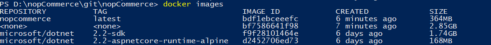
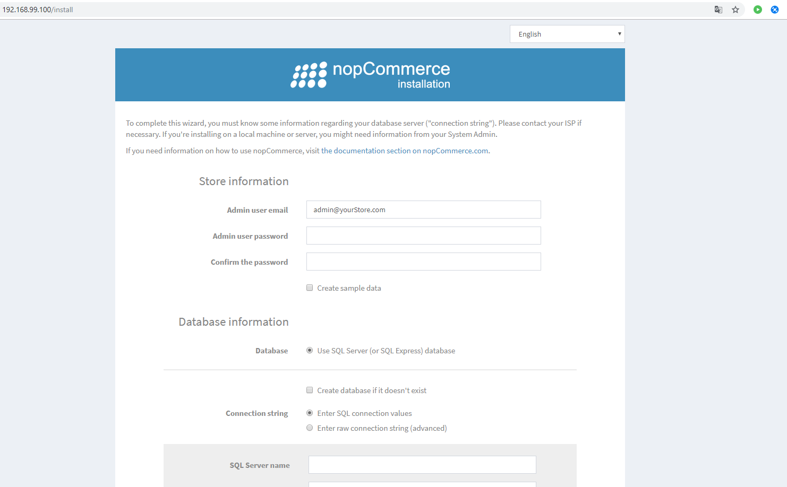

# 使用 Docker

本文件是建立並執行 Docker 容器的逐步指南。

1. **安裝 Docker** 於 Windows 環境。

    首先，我們需要在個人電腦上安裝 Docker。我們將使用適用於 Windows 的 [Docker Desktop](https://www.docker.com/products/docker-desktop/)，它能協助我們建置並共用容器化應用程式與微服務。Docker Desktop 同時也支援 Linux 與 Mac。

    安裝並執行應用程式後，您將能運用容器化的所有功能。接下來，我們將在 PowerShell 中執行所有工作，因為指令模式在任何環境中都是相同的。

2. **建置 Docker 容器**。為了方便執行指令，請前往 `Dockerfile` 所在的目錄（即 nopCommerce 原始程式碼的根目錄）。

    我們需要使用的指令：

    ```csharp
    [docker build -t nopcommerce .]
    ```

    此指令會根據「Dockerfile」檔案中描述的說明來建置容器。首次進行組建時會花費較多時間，因為需要下載兩個用於 .NET Core 應用程式的基礎映像檔。

    包含 SDK 的第一個映像檔是中介容器所需的，它將透過修復所有相依性來組建應用程式，然後執行發布 `Nop.Web` 應用程式至獨立目錄的流程；之後您將從該目錄建立最終的容器，並將其命名為 *nopcommerce*（您也可以建立不帶名稱的映像檔，但有名稱會更方便。若要在組建過程中指定容器名稱，必須加上 [-t] 旗標，如我們此處所做的一樣）。

    安裝完成後，如果一切順利，請執行下一個指令：

    ```csharp
    [docker images]
    ```

    我們應該會看到類似下方的畫面：

    

    這是所有已載入容器的列表，我們可以輕易地在其中找到我們的容器，它已建立完畢並準備好執行。

3. **執行並測試容器**

    首先，讓我們透過指令啟動容器：

    ```bash
    docker run -d -p 80:80 nopcommerce
    ```

    此指令將在背景啟動我們的容器（[-d] 旗標），並將容器的 80 連接埠對應到主機的 80 連接埠（[-p] 旗標）。

    > [!TIP]
    >
    > 您可以使用下列指令檢視正在執行的容器列表：
    >
    > ```bash
    > docker ps
    > ```

    在瀏覽器中，我們應該會看到 nopCommerce 的安裝頁面。

    

    這將作為驗證，確認容器已正確建立、啟動並成功運作。

4. 但是，若要**完整測試**應用程式的運作，只有在擁有一個我們的容器可以存取的 SQL Server 時才有效。然而，通常我們與使用者的環境會受到限制，因此我們準備了一個配置檔，讓您可以將 nopCommerce 容器與包含 SQL Server 的容器一同部署。

    若要部署容器組合，請使用以下指令：

    ```bash
    docker-compose up -d
    ```

    此指令使用 docker-compose.yml 檔案進行部署，該檔案描述了「nopcommerce_web」與「nopcommerce_database」兩個容器的建立，它們共同提供了應用程式與資料庫的組合。

    透過在瀏覽器中開啟頁面，我們就能測試任何想要的功能。若要連線到資料庫伺服器，我們使用下列資料（如 docker-compose.yml 檔案中所述）：

    ```bash
    Server name: nopcommerce_mssql_server
    User: sa
    Password: nopCommerce_db_password
    ```

5. 測試完成後，您可以移除所有容器，以免影響下次使用。兩個指令可協助達成此目的：

    ```bash
    docker stop $ (docker ps -a -q)
    ```

    以及

    ```bash
    docker system prune -a
    ```

## Docker Hub

從 nopCommerce 4.20 版本開始，我們會在 GitHub 服務上發布完成的映像檔，您可以透過 [this link](https://hub.docker.com/r/nopcommerceteam/nopcommerce) 檢查可用的版本，或是使用以下指令下載最新版本：

```bash
docker pull nopcommerceteam/nopcommerce:latest
```