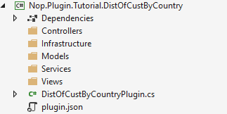
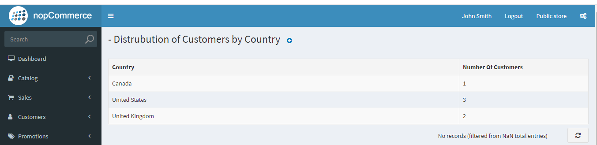

# 使用 DataTables

在本教學中，我們將學習如何透過自訂功能來擴充 nopCommerce 管理後台的功能，並建立一個包含資料表格的頁面作為報表。在開始本教學之前，您需要先具備一些相關主題的知識與理解。

* [nopCommerce 架構](xref:zh-Hant/developer/tutorials/source-code-organization)。
* [nopCommerce 外掛](xref:zh-Hant/developer/tutorials/guide-to-expanding-the-functionality-of-the-basic-functions-of-nop-commerce-through-a-plugin)。
* [nopCommerce 路由](xref:zh-Hant/developer/tutorials/register-new-routes)。

如果您不熟悉上述主題，我們強烈建議您先進行了解。

本教學將示範如何建立一個表格，用來顯示使用者按國家（根據帳單地址）分佈的相關資訊。讓我們逐步完成建立上述功能的過程。

## 建立一個 nopCommerce 外掛專案

我們假設您已經知道如何建立一個 nopCommerce 外掛專案，以及如何依照 nopCommerce 標準來設定該專案。如果您還不知道，可以前往 [此頁面](xref:zh-Hant/developer/plugins/how-to-write-plugin-4.70) 學習如何建立並設定 nopCommerce 外掛專案。

如果您已依照上述提供的連結建立並設定了您的外掛專案，那麼您最終應該會得到如下的資料夾結構。



### Models/CustomersDistribution.cs

首先，讓我們在 **Models** 資料夾中建立一個名為 **CustomersDistribution** 的模型。

```cs
public record CustomersDistribution : BaseNopModel
{
    /// <summary>
    /// Country based on the billing address.
    /// </summary>
    public string Country { get; set; }

    /// <summary>
    /// Number of customers from a specific country.
    /// </summary>
    public int NoOfCustomers { get; set; }
}
```

接著，讓我們在 *Models* 資料夾中加入名為 `CustomersByCountrySearchModel` 的搜尋模型。

```cs
public record CustomersByCountrySearchModel : BaseSearchModel
{
}
```

nopCommerce 使用 Repository 模式進行資料存取，這非常適合相依性注入機制。

### Services/ICustomersByCountry.cs

現在讓我們建立一個從資料庫取得所需資料的服務。針對此服務，我們將建立一個介面，以及一個實作該介面的服務類別。

```cs
public interface ICustomersByCountry
{
    Task<List<CustomersDistribution>> GetCustomersDistributionByCountryAsync()
}
```

### Services/CustomersByCountry.cs

在這裡，我們建立了一個名為 **CustomersByCountry** 的類別，它實作了 **ICustomersByCountry** 介面。

```cs
public class CustomersByCountry : ICustomersByCountry
{
    private readonly IAddressService _addressService;
    private readonly ICountryService _countryService;
    private readonly ICustomerService _customerService;

    public CustomersByCountry(IAddressService addressService, 
        ICountryService countryService,
        ICustomerService customerService)
    {
        _addressService = addressService;
        _countryService = countryService;
        _customerService = customerService;
    }

    public async Task<List<CustomersDistribution>> GetCustomersDistributionByCountryAsync()
    {
        return await _customerService.GetAllCustomersAsync()
            .Where(c => c.ShippingAddressId != null)
            .Select(c => new
            {
                await (_countryService.GetCountryByAddressAsync(_addressService.GetAddressById(c.ShippingAddressId ?? 0))).Name,
                c.Username
            })
            .GroupBy(c => c.Name)
            .Select(cbc => new CustomersDistribution { Country = cbc.Key, NoOfCustomers = cbc.Count() }).ToList();
    }
}
```

我們實作了該介面中從資料庫擷取資料的方法。我們採用這種方式，是為了能夠使用相依性注入技術將此服務注入到控制器中。

### Infrastructure/PluginNopStartup.cs

為了在相依性注入 (DI) 容器中註冊我們的介面及其實作，我們需要建立一個實作 `INopStartup` 介面的類別。此介面包含兩個方法和一個屬性。我們的主要重點是實作 `ConfigureServices` 方法，我們將在此處向 DI 容器註冊我們的介面。

```cs
/// <summary>
/// Represents object for the configuring services on application startup
/// </summary>
public class PluginNopStartup : INopStartup
{
    /// <summary>
    /// Add and configure any of the middleware
    /// </summary>
    /// <param name="services">Collection of service descriptors</param>
    /// <param name="configuration">Configuration of the application</param>
    public void ConfigureServices(IServiceCollection services, IConfiguration configuration)
    {
        //register custom services
        services.AddScoped<ICustomersByCountry, CustomersByCountry>();
    }

    /// <summary>
    /// Configure the using of added middleware
    /// </summary>
    /// <param name="application">Builder for configuring an application's request pipeline</param>
    public void Configure(IApplicationBuilder application)
    {
    }

    /// <summary>
    /// Gets order of this startup configuration implementation
    /// </summary>
    public int Order => 3000;
}
```

### Controllers/CustomersByCountryController.cs

現在讓我們建立一個控制器類別。為外掛控制器命名的一個良好做法是使用 *{Group}{Name}Controller.cs*。例如 TutorialCustomersByCountryController，這裡即為 *{Tutorial}{CustomersByCountry}Controller*。但請記住，使用 *{Group}{Name}* 來命名控制器並非強制要求，這只是 nopCommerce 推薦的命名方式，而名稱中包含 Controller 字樣則是 .Net MVC 的要求。

```cs
    [AutoValidateAntiforgeryToken]
    [AuthorizeAdmin] //confirms access to the admin panel
    [Area(AreaNames.Admin)] //specifies the area containing a controller or action
    public class DistOfCustByCountryPluginController : BasePluginController
    {
        private readonly ICustomersByCountry _service;
        public DistOfCustByCountryPluginController(ICustomersByCountry service)
        {
            _service = service;
        }

        [HttpGet]
        public IActionResult Configure()
        {
            CustomersByCountrySearchModel customerSearchModel = new CustomersByCountrySearchModel
            {
                AvailablePageSizes = "10"
            };
            return View("~/Plugins/Tutorial.DistOfCustByCountry/Views/Configure.cshtml", customerSearchModel);
        }

        [HttpPost]
        public async Task<IActionResult> GetCustomersCountByCountry()
        {
            try
            {
                return Ok(new DataTablesModel { Data = await _service.GetCustomersDistributionByCountryAsync() });
            }
            catch (Exception ex)
            {
                return BadRequest(ex);
            }
        }
    }
```

在控制器中，我們注入了先前建立的 **ICustomersByCountry** 服務，以便從資料庫取得資料。這裡我們建立了兩個 Action，一個類型為 `HttpGet`，另一個類型為 `HttpPost`。`Configure` action 會回傳一個名為 "Configure.cshtml" 的檢視（View），我們尚未建立該檔案。而 `GetCustomersCountByCountry` action 則使用已注入的服務來擷取資料，並以 JSON 格式回傳。此 action 將由資料表格（data table）呼叫，該表格預期會接收 `DataTablesModel` 物件作為回應。因此，我們在此設定了 data 屬性，這就是將要在表格中呈現的資料。

### Views/Configure.cshtml

現在，讓我們建立一個包含 *DataTables* 的檢視，在其中顯示我們的資料，並讓使用者能夠檢視這些資料。

```cs
@using Nop.Web.Framework.Models.DataTables
@{
    Layout = "_ConfigurePlugin";
}

@await Html.PartialAsync("Table", new DataTablesModel
{
    Name = "customersDistributionByCountry-grid",
    UrlRead = new DataUrl("GetCustomersCountByCountry", "TutorialCustomersByCountry"),
    Paging = false,
    ColumnCollection = new List<ColumnProperty>
    {
        new ColumnProperty(nameof(CustomersDistribution.Country))
        {
            Title = "Country",
            Width = "300"
        },
        new ColumnProperty(nameof(CustomersDistribution.NoOfCustomers))
        {
            Title = "Number Of Customers",
            Width = "100"
        }
    }
})
```

### Views/_ViewImports.cshtml

*_ViewImports.cshtml* 檔案包含匯入檢視檔案所需之所有參考的程式碼。

```cs
@inherits Nop.Web.Framework.Mvc.Razor.NopRazorPage<TModel>
@addTagHelper *, Microsoft.AspNetCore.Mvc.TagHelpers
@addTagHelper *, Nop.Web.Framework

@using Microsoft.AspNetCore.Mvc.ViewFeatures
@using Nop.Web.Framework.UI
@using Nop.Web.Framework.Extensions
@using System.Text.Encodings.Web
@using Nop.Plugin.Tutorial.DistOfCustByCountry.Models
@using Nop.Web.Framework.Models.DataTables;
@using Microsoft.AspNetCore.Routing;
```

* 在 `Configure.cshtml` 中，我們使用了一個名為 **`Table`** 的部分檢視（partial view）。這是 nopCommerce 對 *JQuery DataTables* 的實作。我們可以在 `Nop.Web/Areas/Admin/Views/Shared/Table.cshtml` 路徑下找到此檔案。您可以在其中看到 *DataTables* 的實作程式碼。此檢視模型（view model）採用 `DataTablesModel` 類別來進行 *DataTables* 的設定。讓我們說明為 `DataTablesModel` 類別所設定的屬性：
* **Name：** 這將被設定為 *DataTables* 的 id。
* **UrlRead：** 這是 *DataTables* 用來擷取資料以在表格中呈現的 URL。在此我們將 URL 設定為 `TutorialCustomersByCountry` 控制器中的 **`GetCustomersCountByCountry`** Action，我們從該處取得 *DataTables* 所需的資料。
* **Paging：** 此屬性用於啟用或停用 DataTables 的分頁功能。
* **ColumnCollection：** 此屬性持有欄位的設定內容。

還有許多其他屬性，您可以試著操作它們，以了解每個屬性的用途。

### Infrastructure/RouteProvider

現在最後一個步驟是為 "TutorialCustomersByCountry" 控制器的 "GetCustomersCountByCountry" 動作（Action）註冊路由。我們不需要為 "Configure" 動作註冊路由，因為我們已經在 `DistOfCustByCountryPlugin` 類別中註冊過了。

```cs
/// <summary>
/// Represents plugin route provider
/// </summary>
public class RouteProvider : IRouteProvider
{
    /// <summary>
    /// Register routes
    /// </summary>
    /// <param name="endpointRouteBuilder">Route builder</param>
    public void RegisterRoutes(IEndpointRouteBuilder endpointRouteBuilder)
    {
        //add route for the access token callback
        endpointRouteBuilder.MapControllerRoute("CustomersDistributionByCountry", "Plugins/Tutorial/CustomerDistByCountry/",
            new { controller = "TutorialCustomersByCountry", action = "GetCustomersCountByCountry" });
    }

    /// <summary>
    /// Gets a priority of route provider
    /// </summary>
    public int Priority => 0;
}
```

> [!NOTE]
> 若要了解更多關於 nopCommerce 路由的資訊，請造訪 [此頁面](xref:zh-Hant/developer/tutorials/register-new-routes)。

現在只需建置您的專案並執行它。以管理員身分登入，並前往 **設定** 底下的 *LocalPlugins* 選單，您將會在該處看到您剛建立的外掛。請安裝該外掛。安裝完成後，您會在您的外掛中看到一個 *configuration* 按鈕。如果您已正確按照本教學進行操作，您將會看到類似下圖的輸出結果：

