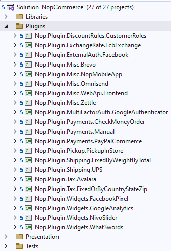
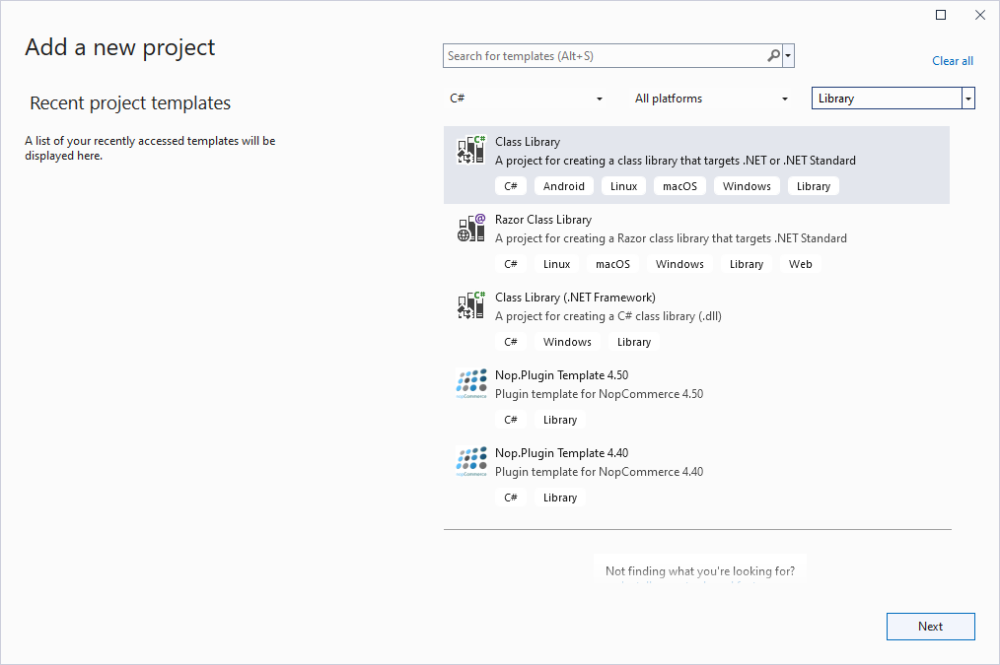
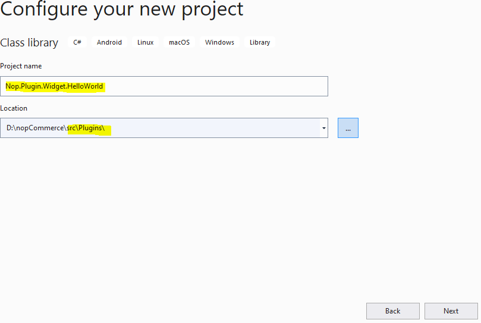
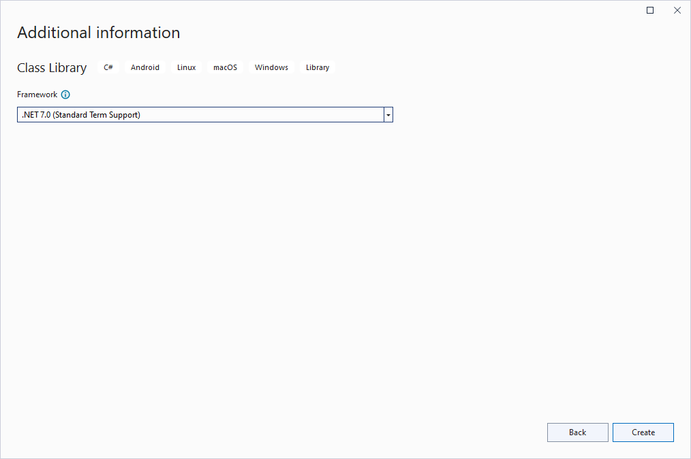
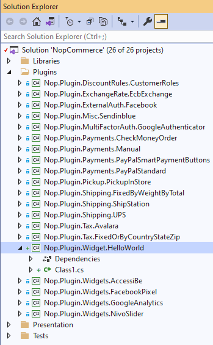
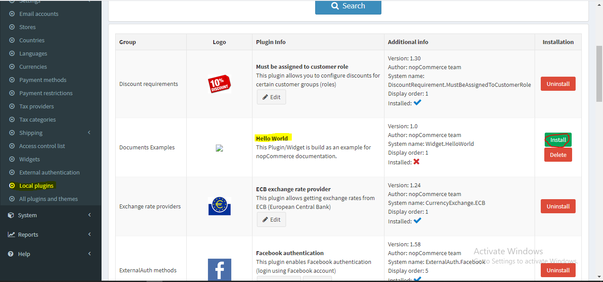
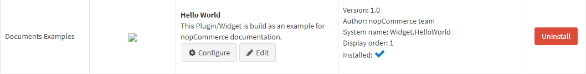
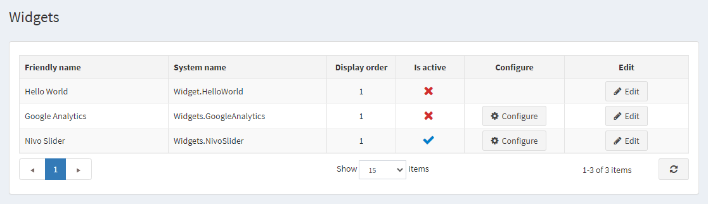
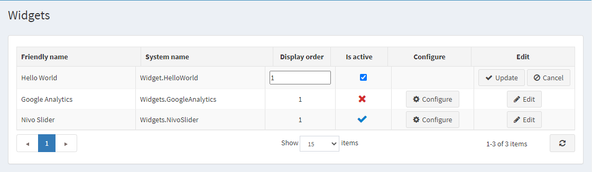
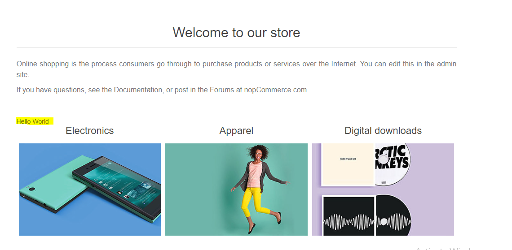

# 開發新外掛

## 概覽

nopCommerce 使用外掛系統來擴充管理後台的功能，並使用小工具系統來擴充網站的功能。外掛與小工具是一組獨立的程式或組件，可以被加入到現有的系統中以擴充某些特定功能，也可以在過程中從系統中移除，而不會影響主系統。因此，透過使用外掛與小工具的概念，我們可以在不更改或編輯 nopCommerce 解決方案核心原始程式碼的情況下，為系統增加更多功能並進行建置。這使我們能夠根據需要將 nopCommerce 解決方案升級或降級到最新版本或舊版本，而不必重寫我們已經建立的外掛與小工具。

## 外掛 (Plugins) 與小工具 (Widgets) 的差異

我們知道外掛與小工具都是用來擴充 nopCommerce 解決方案的功能。那麼，您可能會問「它們之間有什麼差別」。基本上在 nopCommerce 中，您可以將小工具視為具備額外功能的外掛。建立小工具的過程與建立外掛大致相同，但透過使用小工具，我們可以在 nopCommerce 前台網站中，由 nopCommerce 預先定義的特定區域（稱為 widget-zones）顯示一些 UI（使用者介面），而這僅透過一般外掛是無法實現的。您可以將小工具視為外掛的一個子集。

> [!NOTE]
> 所有可用的 widget zones 可以在 `Nop.Web.Framework.Infrastructure` 命名空間中找到：
>
> - 管理後台的 widget-zones 可以在 **AdminWidgetZones.cs** 檔案中找到。
>
> - 前台網站的 widget-zones 可以在 **PublicWidgetZones.cs** 檔案中找到。

現在您應該更清楚什麼是小工具、什麼是外掛、何時使用它們，以及使用它們的好處。那麼，接下來讓我們建立一個簡單的小工具，在前台網站顯示「Hello World」訊息，藉此了解如何在 nopCommerce 中建立小工具。

## 初始化外掛專案

### 步驟 1：建立新專案

前往 nopCommerce 官方網站並下載最新的 nopCommerce 原始碼。使用您偏好的 IDE 開啟 nopCommerce 方案（推薦使用 Microsoft Visual Studio）。若您想進一步了解專案結構，請先查看「[原始碼組織](xref:zh-Hant/developer/tutorials/source-code-organization)」一文。在方案的最上方，您會看到一個 *Plugins* 資料夾，展開該資料夾，即可看到 nopCommerce 預設提供的外掛專案清單。



為了建立一個新的小工具（Widget）專案，請對 *Plugins* 資料夾按右鍵：點選 **加入 (Add)** -> **新增專案 (New Project)**，接著會出現「新增專案」視窗。



選擇 **類別庫 (Class Library)** 專案範本並進入下一步，您需要在該步驟指定專案名稱。



nopCommerce 遵循一些標準命名慣例，您可以在 nopCommerce 文件中取得更多資訊。我依照 nopCommerce 的命名慣例，將專案名稱命名為 `Nop.Plugin.Widget.HelloWorld`，並將位置設定在 */src/Plugins* 目錄中。現在點選 **下一步 (Next)**。



這將在 Plugins 目錄中建立一個新專案。在您的方案中，您應該會看到如下畫面：



### 步驟 2：設定您的新專案以作為小工具（Widget）使用

我們需要在專案中設定一些項目，使其能作為「外掛（Plugin）」或「小工具（Widget）」使用。

當您成功建立專案後，請開啟其 `.csproj` 檔案。您可以透過在專案上按一下滑鼠右鍵，並點選內容選單中的 `{Your_Project_Name.csproj}` 選項，然後將其內容替換為以下程式碼。

```xml
<Project Sdk="Microsoft.NET.Sdk">
    <PropertyGroup>
        <TargetFramework>net9.0</TargetFramework>
        <Copyright>SOME_COPYRIGHT</Copyright>
        <Company>YOUR_COMPANY</Company>
        <Authors>SOME_AUTHORS</Authors>
        <PackageLicenseUrl>PACKAGE_LICENSE_URL</PackageLicenseUrl>
        <PackageProjectUrl>PACKAGE_PROJECT_URL</PackageProjectUrl>
        <RepositoryUrl>REPOSITORY_URL</RepositoryUrl>
        <RepositoryType>Git</RepositoryType>
        <OutputPath>$(SolutionDir)\Presentation\Nop.Web\Plugins\{PLUGIN_OUTPUT_DIRECTORY}</OutputPath>
        <OutDir>$(OutputPath)</OutDir>
        <!--Set this parameter to true to get the dlls copied from the NuGet cache to the output of your    project. You need to set this parameter to true if your plugin has a nuget package to ensure that   the dlls copied from the NuGet cache to the output of your project-->
        <CopyLocalLockFileAssemblies>false</CopyLocalLockFileAssemblies>
        <ImplicitUsings>enable</ImplicitUsings>
    </PropertyGroup>
    <ItemGroup>
        <ProjectReference Include="$(SolutionDir)\Presentation\Nop.Web.Framework\Nop.Web.Framework.csproj" />
        <ClearPluginAssemblies Include="$(SolutionDir)\Build\ClearPluginAssemblies.proj" />
    </ItemGroup>
    <!-- This target execute after "Build" target -->
    <Target Name="NopTarget" AfterTargets="Build">
        <!-- Delete unnecessary libraries from plugins path -->
        <MSBuild Projects="@(ClearPluginAssemblies)" Properties="PluginPath=$(OutDir)" Targets="NopClear" />
    </Target>
</Project>
```

在此請將 `{Plugin_Output_Directory}` 替換為您的專案名稱，以我的案例來說是 *Widget.HelloWorld*。

此動作會將與此專案相關的所有 DLL 檔案複製到 `Nop.Web/Plugin/{Plugin_Output_Directory}` 目錄中。這是因為 `Nop.Web` 內部的 `Plugin` 目錄是 nopCommerce 搜尋外掛與小工具的位置，以便在管理後台的「外掛」或「小工具」清單中顯示它們。

### 步驟 3：建立 plugin.json 檔案

對於我們為 nopCommerce 建立的每個 *外掛 (Plugin)* 或 *小工具 (Widget)*，此檔案皆為必要。此檔案包含關於我們外掛的後設資料（meta information），用以描述該外掛。它包含了諸如外掛名稱、目標對應的 nopCommerce 版本、外掛描述、外掛版本等資訊。如需更多資訊，請參閱 [plugin.json 檔案](xref:zh-Hant/developer/plugins/plugin_json) 一文。

### 步驟 4：建立繼承自 BasePlugin 類別的類別

我們需要有一個繼承自 `IPlugin` 介面的類別，這樣 nopCommerce 才會將我們的專案視為外掛。但 nopCommerce 已經提供了一個繼承自 `IPlugin` 介面並實作了該介面所有方法的 `BasePlugin` 類別。因此，我們可以直接擴充 `BasePlugin` 類別，而不是直接繼承 `IPlugin` 介面。如果我們在外掛或小工具的安裝與解除安裝過程中需要執行某些邏輯，我們可以將 `BasePlugin` 類別中的 `InstallAsync` 和 `UninstallAsync` 方法覆寫到我們的類別中。最後，該類別看起來應該像這樣：

```cs
public class HelloWorldPlugin: BasePlugin
{
    public override async Task InstallAsync()
    {
        //Logic during installation goes here...

        await base.InstallAsync();
    }

    public override async Task UninstallAsync()
    {
        //Logic during uninstallation goes here...

         await base.UninstallAsync();
    }
}
```

現在請編譯並執行您的專案。導航至管理後台，在 **設定** 下方會有一個 **在地外掛** 選單，請點擊該選單。在這裡您將看到所有位於我們 `Nop.Web/Plugins` 目錄下的外掛清單。您應該會在那裡看到您剛建立的外掛。如果沒有看到，請點擊 **重新載入外掛清單** 按鈕，這會重新啟動您的應用程式並列出所有可用的外掛。現在您應該能看到您的外掛了。請點擊該外掛列中的綠色 **安裝** 按鈕。



點擊安裝按鈕後，請點擊 **重新啟動應用程式以套用變更** 按鈕。這將會重新啟動您的應用程式並安裝您的外掛。安裝完成後，您將會看到 *設定*、*編輯* 以及 *解除安裝* 按鈕，如下所示：

 現在您的外掛已經安裝完畢。但 *設定* 按鈕目前還無法運作，因為我們在外掛中尚未建立任何設定頁面。

## 建立一個小工具以在我們的公開網站顯示 UI

如前所述，*小工具 (Widget)* 與一般外掛相同，但具備額外的功能。因此，我們可以使用同一個外掛專案將其轉換為小工具，並將部分 UI 呈現到我們的公開網站上。讓我們來看看如何擴充此外掛並將其變成一個小工具。

首先，我們需要建立一個 `ViewComponent`。在專案的根目錄中建立一個 *Components* 目錄，並建立一個 **`ViewComponent`** 類別。我們需要讓此類別繼承自 `NopViewComponent` 基底類別。

```cs
public class ExampleWidgetViewComponent: NopViewComponent
{
    public IViewComponentResult Invoke(string widgetZone, object additionalData)
    {
        return Content("Hello World");
    }
}
```

現在，回到我們先前建立、繼承自 `BasePlugin` 的類別，並讓它實作 `IWidgetPlugin` 介面。此介面包含 `GetWidgetZones` 和 `GetWidgetViewComponent` 兩個函式宣告，我們需要在類別中實作它們。

```cs
public class HelloWorldPlugin: BasePlugin, IWidgetPlugin
{
    /// <summary>
    /// Gets a value indicating whether to hide this plugin on the widget list page in the admin area
    /// </summary>
    public bool HideInWidgetList => false;

    /// <summary>
    /// Gets a type of a view component for displaying widget
    /// </summary>
    /// <param name="widgetZone">Name of the widget zone</param>
    /// <returns>View component type</returns>
    public Type GetWidgetViewComponent(string widgetZone)
    {
        return typeof(ExampleWidgetViewComponent);
    }
    
    /// <summary>
    /// Gets widget zones where this widget should be rendered
    /// </summary>
    /// <returns>
    /// A task that represents the asynchronous operation
    /// The task result contains the widget zones
    /// </returns>
    public Task<IList<string>> GetWidgetZonesAsync()
    {
        return Task.FromResult<IList<string>>(new List<string> { "home_page_before_categories" });        
    }

    public override async Task InstallAsync()
    {
        //Logic during installation goes here...

        await base.InstallAsync();
    }

    public override async Task UninstallAsync()
    {
        //Logic during uninstallation goes here...

         await base.UninstallAsync();
    }
}
```

現在，如果您建置您的專案，並瀏覽至管理後台，進入 **設定 -> 小工具**，您將能夠在列表中看到您的小工具。



在這裡您可能會注意到這個小工具沒有 *設定* 按鈕。這是因為我們沒有為此小工具建立設定檢視檔案，也沒有覆寫 `BasePlugin` 類別中的 `GetConfigurationPageUrl` 方法。由於我們已經安裝了此外掛，因此不需要再次安裝，但您可以發現該小工具目前尚未啟用。我們可以點擊 *編輯* 按鈕來啟用它。



現在，在我們將小工具設為啟用後，它應該能如預期般運作。如果我們前往首頁，在類別清單之前，應該會看到如圖所示（黃色標記處）的「Hello World」訊息。

