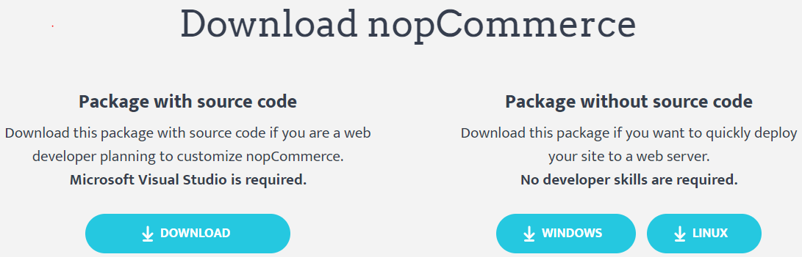
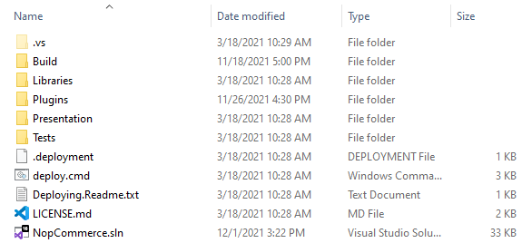
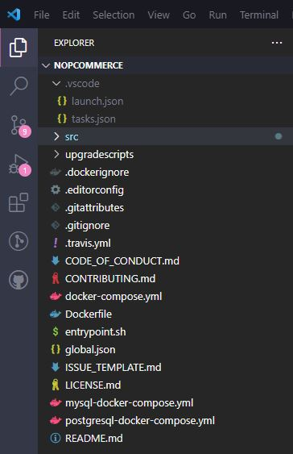
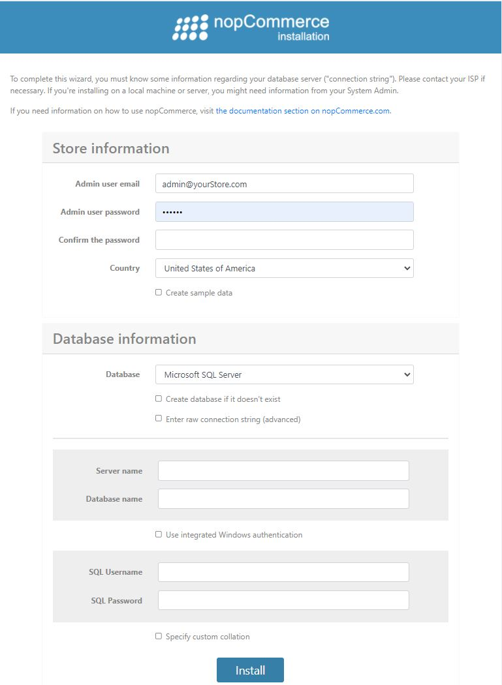

# nopCommerce 開發入門

nopCommerce 是一個基於 Microsoft ASP.NET 開源的電子商務解決方案。這是一份針對開發人員的基礎指南，教您如何開始在 nopCommerce 上進行開發。

## 1. 開發所需工具

您可以從 **「[開發所需工具](xref:zh-Hant/developer/tutorials/system-requirements-for-developing#tools-required-for-development)」** 一文中了解技術與系統需求。

## 2. nopCommerce 使用的技術堆疊

nopCommerce 最棒的一點在於其原始碼完全可客製化，且其可插拔的架構透過外掛系統，讓開發自訂功能與滿足任何商業需求變得相當容易。它遵循業界知名的軟體架構、設計模式以及最佳安全性實作。最重要的是，它執行在最新的技術之上，為終端使用者提供最佳體驗。因此，為了達成這些目標，nopCommerce 在其架構中使用了以下技術堆疊。

* 應用程式層 (Application Layer)
  * Razor View Engine

    用於在客戶端渲染 HTML 頁面。Razor View engine 是一種標記語法，協助我們在網頁中使用 C# 或 VB.NET 來撰寫 HTML 與伺服器端程式碼。
  * JQuery

    這是一個 JavaScript 函式庫，用於擴充 HTML 頁面的 UI 與 UX 功能。

* 商業邏輯層 (Business Layer)
  * Fluent Validation

    這是一個用於 .NET 的驗證函式庫，使用 Fluent 介面與 lambda 運算式來建立驗證規則。
  * AutoMapper

    AutoMapper 是一個簡單的函式庫，協助我們將一種物件型別轉換為另一種。這是一個基於慣例的物件對物件 (object-to-object) 對應工具，幾乎不需要什麼設定。
  * ASP.NET Core 內建相依性注入 (Dependency Injection)

    ASP IOC 管理類別之間的相依性，讓應用程式在規模與複雜度增加時，依然容易變更。
  * Linq2DB

    Linq2DB 是一個用於 .NET 應用程式的開源 ORM 框架。這是一個 .NET Foundation 專案。它讓開發者能使用特定領域類別 (domain-specific classes) 的物件來處理資料，而不必關注資料實際儲存所在的底層資料庫表格與欄位。因此，它是商業邏輯層與資料層之間的橋樑。
  * FluentMigrator

    Fluent Migrator 是一個用於 .NET 的遷移 (migration) 框架。遷移是一種變更資料庫綱要 (schema) 的結構化方式，用以取代需要每位參與開發人員手動執行的繁雜 SQL 指令碼。遷移解決了為多個資料庫（例如開發人員的本機資料庫、測試資料庫與生產資料庫）演進資料庫綱要的問題。資料庫綱要的變更會被描述在以 C# 撰寫的類別中，這些類別可以簽入版本控制系統。

* 資料層 (Data Layer)
  * Microsoft SQL Server

    SQL Server 是微軟功能完整的關聯式資料庫管理系統 (RDBMS)。
  * MySQL

    MySQL 是全球最受歡迎的開源資料庫。憑藉其經過驗證的效能、可靠性與易用性，MySQL 已成為網頁應用程式的首選資料庫。
  * PostgreSQL

    PostgreSQL 是一個強大且開源的物件關聯式資料庫系統，擁有超過 30 年的活躍開發歷史，並因其可靠性、強大的功能與高效能而享有盛譽。
  * Redis (快取)

    Redis 是一個開源（BSD 授權）、記憶體內的資料結構儲存庫，可用作資料庫、快取與訊息代理程式。在 nopCommerce 中，Redis 用於將舊資料儲存為記憶體內的快取資料集，這能提升應用程式的速度與效能。
  * Microsoft Azure (選擇性)

    Azure 是一個公有雲端運算平台，提供包括基礎設施即服務 (IaaS)、平台即服務 (PaaS) 與軟體即服務 (SaaS) 等解決方案，可用於分析、虛擬運算、儲存、網路等各類服務。

## 3. 如何下載專案並在本地機器上執行

在開始使用 nopCommerce 之前，我們需要確保本地機器已正確設定，且所有必要的工具都已正確安裝並運作正常。現在，讓我們按照步驟說明，了解如何下載並在您的本地機器上執行 nopCommerce。

### 步驟 1：下載 nopCommerce 原始碼

請前往 [www.nopcommerce.com](https://www.nopcommerce.com/download-nopcommerce) 進行下載。您可以在該頁面看到兩個下載按鈕，一個包含原始碼，另一個則不含原始碼，如下圖所示。



由於我們是為了開發目的下載 nopCommerce，因此我們需要下載標示為「Package with source code」的檔案，其中包含了 nopCommerce 的原始碼。若要下載 nopCommerce，您必須登入或註冊新帳號。現在，您可以將 nopCommerce 下載為 RAR 檔案，並將其解壓縮到您指定的資料夾路徑。

### 步驟 2：開啟 nopCommerce 解決方案

* 在 Microsoft Visual Studio 中開啟

  開啟該資料夾。在資料夾內，您會看到一堆構成 nopCommerce 原始碼的檔案與資料夾。

  

  您也會在那裡看到一個副檔名為 `.sln` 的解決方案檔案，請按兩下該解決方案檔案，以便在 Microsoft Visual Studio 中開啟 nopCommerce 專案。

* 在 Visual Studio Code 中開啟

  開始時，請指定根目錄：

  

### 步驟 3：執行 nopCommerce 專案

執行 nopCommerce 專案不需要任何額外的設定。nopCommerce 開箱即用，安裝後即可立即執行。

* 執行 Microsoft Visual Studio

  現在，您可以透過按下 `ctrl+F5` 或直接按下 `F5` 以除錯模式執行專案，也可以使用 *Microsoft Visual Studio* 中帶有播放圖示的按鈕來執行專案。

* 執行 Visual Studio Code

  **launch.json** 檔案用於設定 *Visual Studio Code* 中的除錯器。此檔案包含了專案如何啟動的相關資訊。當您首次啟動 *Visual Studio Code* 時，它會根據標準範本在路徑 `.vscode/launch.json` 產生此檔案。

  除了 *launch.json* 檔案外，您也可以使用 launchSettings.json 檔案來設定啟動參數。**launchSettings.json** 檔案的優點在於，它允許 *Visual Studio Code* 與完整版 *Visual Studio* 共享設定。此檔案已隨附在 nopCommerce 原始程式碼中。我們只需要在啟動專案時指定要使用的設定檔（Profile）即可。

  ```json
  "launchSettingsProfile": "Nop.Web",
  ```

  > [!NOTE]
  >
  > 僅支援 `"commandName": "Project"` 的設定檔。在此情況下無法使用 `"IIS Express"` 設定檔。

  預設情況下，專案將在 `https://localhost:5001` 執行，因為它是設定檔中列出的第一個項目。如果您想要更改此設定並停用 SSL，則需要在 **launch.json** 檔案的設定中進行指定：

  ```json
  "serverReadyAction": {
      "action": "openExternally",
      "pattern": "\\bNow listening on:\\s+http://\\S+:([0-9]+)",
      "uriFormat": "http://localhost:%s"
  },
  ```

  現在，您可以透過按下 `ctrl+F5` 或直接按下 `F5` 以除錯模式在 *Visual Studio Code* 中執行專案。

當您第一次執行專案後，將會看到如下所示的安裝頁面：



在這裡，您需要填寫所有必要資訊以完成安裝。

#### 商店資訊

在此處，您需要提供一組電子郵件地址與密碼，這組帳號將作為您 nopCommerce 商店的管理者帳號。

#### 資料庫資訊

在此處，您需要提供專案所需的資料庫相關資訊。

您必須選擇資料庫儲存方式。您可以選擇使用 `MS SQL Server`、`MySQL` 或 `PostgreSQL`。您可以自行決定要使用哪一種。

在本教學中，我們將使用 `MS SQL Server`。

此外，您會看到一個勾選方塊，詢問是否要在資料庫不存在時自動建立資料庫，請勾選此項目。

接下來，您需要設定連線字串（Connection string）。為此，您有兩個選項。第一個選項是填寫「**Server name**」（伺服器名稱）與「**Database name**」（資料庫名稱）表單。在「Server name」中，您需要提供伺服器名稱；在「Database name」中，您需要提供想要建立的資料庫名稱，或者若該資料庫已存在，則系統會直接使用現有的資料庫而不進行建立。另外，您也可以選擇「**Enter raw connection string (advanced)**」（輸入原始連線字串 - 進階），然後自行輸入完整的連線字串。之後，您還需要提供 SQL Server 的身份驗證憑證。

在填寫完所有資訊後，請點擊「install」（安裝）按鈕，安裝過程大約需要 1 分鐘，完成後您將會被重新導向至線上商店的首頁。

### 4. 如何設定 nopCommerce 以 HTTPS 執行

* Microsoft Visual Studio

  若要為您的 nopCommerce 設定 SSL/HTTPS，您需要前往 *Presentation* 資料夾下的 `Nop.Web` 專案屬性視窗，因為它是 nopCommerce 的啟動專案。若要開啟屬性視窗，請在 `Nop.Web` 專案上按一下滑鼠右鍵，在內容選單的最下方您會看到名為「Properties」的選單，點選該選單後，屬性視窗隨即出現。在屬性視窗中，請導覽至「**Debug**」頁籤。

  

  勾選「**Use SSL**」，並在其旁邊輸入 HTTPS 的 URL。接著儲存此專案。

  現在再次執行您的專案並瀏覽至該 URL，您會發現它現在正透過 SSL/HTTPS 執行。這是設定 WebProject 中 HTTPS 的其中一種方式，但還有另一種設定 SSL 的方法。請前往您的 `Nop.Web` 專案並展開專案，您會在專案結構的「Dependencies」下方看到一個名為「Properties」的虛擬檔案。在 Properties 內，您會找到一個名為 **launchSetting.json** 的 JSON 檔案。開啟該檔案，您會看到裡面已經寫入了一系列的設定。

  在該檔案內，您可能會有如上圖所示的區段。因此，若要啟用 SSL，您只需將「**sslPort**」屬性下的 0 替換為您想要用於 SSL 連線的連接埠（port），請確保該連接埠是可用的。若要進行測試，請執行您的專案並瀏覽至 `https://localhost:{yourPort}`。

* Visual Studio Code

若要透過 *SSL* 通訊協定啟動專案，您需要確保在 **launch.json** 檔案中指定了下列設定：

```json
"serverReadyAction": {
  "action": "openExternally",
  "pattern": "\\bNow listening on:\\s+(https?://\\S+)"
}
```

> [!NOTE]
>
> **launch.json** 中的設定優先順序高於 **launchSettings.json** 中的設定。因此，舉例來說，如果 launch.json 中的 args 已經設定為非空字串/陣列的內容，那麼 launchSettings.json 的內容將會被忽略。