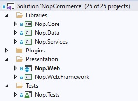

# 原始碼組織結構

這份文件是開發者指南，旨在說明 nopCommerce 解決方案的結構，幫助新進開發者了解原始碼。首先，nopCommerce 是一個開源應用程式，您可以從 [GitHub](https://github.com/nopSolutions/nopCommerce) 免費下載。專案與資料夾依據它們在 *Visual Studio* 中的排序順序列出。我們建議您在 *Visual Studio* 中開啟 nopCommerce 解決方案，並在閱讀本文件時同步檢視各個專案與檔案。

大多數的專案、目錄與檔案的命名方式，都能讓您大致了解其用途。例如，您甚至不需要查看名為 `Nop.Plugin.Payments.PayPalStandard` 的專案內部，就能猜到它的功能。

## `\Libraries\Nop.Core`

`Nop.Core` 專案包含了 nopCommerce 的核心類別集，例如快取、事件、輔助工具以及業務物件（例如 `Order` 和 `Customer` 實體）。

## `\Libraries\Nop.Data`

`Nop.Data` 專案包含了一組用於讀取與寫入資料庫或其他資料儲存區的類別與函式。`Nop.Data` 函式庫有助於將資料存取邏輯與您的業務物件分離。nopCommerce 使用 *Linq2DB* 的 Code-First 方法。Code-First 允許開發者在原始碼中定義實體（所有核心實體皆定義在 `Nop.Core` 專案中），然後使用 *Linq2DB* 和 *FluentMigrator* 從 C# 類別產生資料庫。這就是它被稱為 Code-First 的原因。接著，您可以使用 LINQ 查詢您的物件，這些查詢會在背後轉換為 SQL 並在資料庫上執行。nopCommerce 使用 [Fluent API](https://fluentmigrator.github.io/articles/technical/fluent-api-create.html) 來完全自訂持續性對應（persistence mapping）。

## `\Libraries\Nop.Services`

此專案包含了一組核心服務、業務邏輯、驗證，或是在必要時與資料相關的計算。有些人稱之為「業務存取層」（Business Access Layer, BAL）。

## `\Plugins\` 解決方案資料夾中的專案

`Plugins` 是一個 *Visual Studio* 解決方案資料夾，其中包含了外掛專案。實體路徑位於解決方案的根目錄。但由於所有外掛的建置輸出路徑都設定為 `..\..\Presentation\Nop.Web\Plugins\{Group}.{Name}`，因此外掛的 DLL 會自動複製到 `\Presentation\Nop.Web\Plugins` 目錄中，該目錄用於存放已部署的外掛。這使得外掛可以包含一些外部檔案（例如靜態內容的 CSS 或 JS 檔案），而無需為了執行專案而在專案間手動複製檔案。

## `\Presentation\Nop.Web`

`Nop.Web` 是一個 MVC 網頁應用程式專案，是前台網站的呈現層，同時也包含作為一個 Area（區域）的管理後台。如果您之前未曾使用過 `ASP.NET`，請參閱更多資訊 [here](http://www.asp.net/)。這就是您執行時的應用程式，也是該應用程式的啟動專案。

## `\Presentation\Nop.Web.Framework`

`Nop.Web.Framework` 是一個類別庫專案，包含了 `Nop.Web` 專案共用的一些呈現層組件。

## `\Test\Nop.Tests`

`Nop.Tests` 是一個類別庫專案，包含了其他測試專案共用的測試類別與輔助工具。它本身不包含任何測試。如需進一步了解 nopCommerce 中的單元測試（UNIT testing），請閱讀以下文章：[單元測試](xref:zh-Hant/developer/tutorials/unit-tests)。

### `\Nop.Core.Tests`

Nop.Core.Tests 是 Nop.Core 專案的測試專案。

### `\Nop.Services.Tests`

Nop.Services.Tests 是 Nop.Services 專案的測試專案。

### `\Nop.Web.Tests`

`Nop.Web.Tests` 是呈現層專案的測試專案。

## 教學課程

- [nopCommerce 電商平台的架構說明](https://www.youtube.com/watch?v=6gLbizzSA9o&list=PLnL_aDfmRHwtJmzeA7SxrpH3-XDY2ue0a)