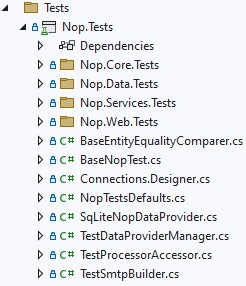
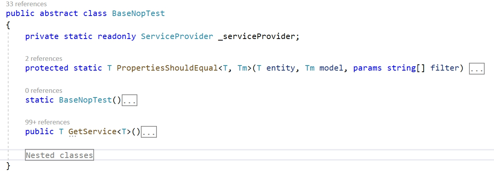

# 單元測試

我想大家都知道單元測試（UNIT test）的概念。我們知道單元測試的用途，也同意這是開發可靠軟體過程中重要的一環。在本文中，我們將不討論這些議題。您可以輕鬆地在網路上找到所有必要的資訊，例如透過以下連結：

* [https://en.wikipedia.org/wiki/Unit_testing](https://en.wikipedia.org/wiki/Unit_testing)
* [https://docs.microsoft.com/dotnet/core/testing/unit-testing-best-practices](https://docs.microsoft.com/dotnet/core/testing/unit-testing-best-practices)
* [https://en.wikipedia.org/wiki/Test-driven_development](https://en.wikipedia.org/wiki/Test-driven_development)

在本文中，我們將熟悉 nopCommerce 專案中的測試功能，並學習如何新增測試以及檢查其執行效能。我們不會測試抽象的任務，而是會從頭開始為現有的功能編寫一個完整的測試。在文章最後，將提供一個包含所有程式碼變更的參考提交（commit）連結。

## 功能概覽



在截圖中，您可以看到 `Nop.Tests` 專案的結構。像是 `Nop.Core.Tests` 這樣的資料夾包含了對應方案專案的測試程式。其他檔案則負責輔助類別與基礎類別。讓我們來看看 `BaseNopTest` 類別。

### BaseNopTest

這是主要用來公開測試用 IoC 容器，並讓我們能夠運用所有相依性注入（DI）優勢的抽象類別。



此類別包含兩個可供子類別使用的方法：

* ``PropertiesShouldEqual``：用於比較資料庫實體的所有欄位與模型欄位。

* ``GetService``：允許運用相依性注入的優勢，並簡化建立測試所需類別的過程。

**IoC** 容器的初始化是在該類別的靜態建構函式中進行；此建構函式包含了大部分的程式碼。

## IScheduleTaskService

我們將以建立實作 `IScheduleTaskService` 介面的類別測試為例。

```csharp
public partial interface IScheduleTaskService
{
    System.Threading.Tasks.Task DeleteTaskAsync(ScheduleTask task);

    Task<ScheduleTask> GetTaskByIdAsync(int taskId);

    Task<ScheduleTask> GetTaskByTypeAsync(string type);

    Task<IList<ScheduleTask>> GetAllTasksAsync(bool showHidden = false);

    System.Threading.Tasks.Task InsertTaskAsync(ScheduleTask task);

    System.Threading.Tasks.Task UpdateTaskAsync(ScheduleTask task);
}
```

如您所見，這是一個簡單的介面，但同時它允許 nopCommerce 執行非常重要的任務，例如向顧客發送電子郵件。因此，我們需要確保它能正常運作。接下來，我們將為該介面的每個方法撰寫測試。

> [!NOTE]
> 我們雖然沒有採用 **TDD**，但並不反對這種開發方式。對我們而言，功能的可信賴性比特定的測試方法更為重要。

## ScheduleTaskServiceTests 類別

在專案（Nop.Tests\Nop.Services.Tests\Tasks）中新增一個 `ScheduleTaskServiceTests` 類別，其程式碼如下所示：

```csharp
using NUnit.Framework;

namespace Nop.Tests.Nop.Services.Tests.Tasks
{
    [TestFixture]
    public class ScheduleTaskServiceTests : ServiceTest
    {
    }
}
```

這是用於測試的類別範本。從這段程式碼中，我們可以看到 nopCommerce 使用 **NUnit framework** 進行測試。
有兩點需要注意：

1. 我們的類別具有 **TestFixture** 屬性，這會告訴引擎該類別包含測試項目。
1. 我們不是直接繼承 `BaseNopTest` 類別，而是繼承另一個抽象類別 `ServiceTest`，它會將主要的外掛加入到設定中。

下一步是為我們的測試新增初始化方法。原則上，這類方法通常稱為 **SetUp**。在此方法中，我們取得一個實作了 `IScheduleTaskService` 介面的類別實例，我們將對其進行測試。

```csharp
private IScheduleTaskService _scheduleTaskService;

[OneTimeSetUp]
public void SetUp()
{
    _scheduleTaskService = GetService<IScheduleTaskService>();
}
```

如您所見，**SetUp** 方法除了可以使用 **SetUp** 屬性外，也應宣告使用 **OneTimeSetUp** 屬性。這兩個屬性之間的區別僅在於方法呼叫的次數：前者 **SetUp** 方法會在所有測試執行前呼叫一次，而後者則會針對每個測試分別呼叫。

接下來，讓我們為 CRUD 方法新增測試。在此服務中，這些方法包括：**InsertTaskAsync**、**GetTaskByIdAsync**、**UpdateTaskAsync** 以及 **DeleteTaskAsync**。

但首先，讓我們再為該類別新增一個欄位。這將是一個用於測試的 `ScheduleTask` 類別實例：

```csharp
 private ScheduleTask _task;
 ```

Update the **SetUp** method the following way:

 ```csharp
 [OneTimeSetUp]
public void SetUp()
{
    _scheduleTaskService = GetService<IScheduleTaskService>();

    _task = new ScheduleTask { Enabled = true, Name = "Test task", Seconds = 60, Type = "nop.test.task" };
}
```

所有 CRUD 測試方法如下所示，您可以發現其中並無複雜之處：

```csharp
#region CRUD tests

[Test]
public async System.Threading.Tasks.Task CanInsertAndGetTask()
{
    _task.Id = 0;
    await _scheduleTaskService.InsertTaskAsync(_task);
    var task = await _scheduleTaskService.GetTaskByIdAsync(_task.Id);
    await _scheduleTaskService.DeleteTaskAsync(_task);

    _task.Id.Should().NotBe(0);
    task.Id.Should().Be(_task.Id);
    task.Name.Should().Be(_task.Name);
}

[Test]
public void InsertTaskShouldRaiseExceptionIfTaskIsNull()
{
    Assert.Throws<AggregateException>(() =>
            _scheduleTaskService.InsertTaskAsync(null).Wait());
}

[Test]
public async System.Threading.Tasks.Task GetTaskByIdShouldReturnNullIfTaskIdIsZero()
{
    var task = await _scheduleTaskService.GetTaskByIdAsync(0);
    task.Should().BeNull();
}

[Test]
public async System.Threading.Tasks.Task GetTaskByIdShouldReturnNullIfTaskIdIsNotExists()
{
    var task = await _scheduleTaskService.GetTaskByIdAsync(int.MaxValue);
    task.Should().BeNull();
}

[Test]
public async System.Threading.Tasks.Task CanUpdateTask()
{
    _task.Id = 0;
    await _scheduleTaskService.InsertTaskAsync(_task);
    var task = await _scheduleTaskService.GetTaskByIdAsync(_task.Id);
    task.Name = "new test name";
    await _scheduleTaskService.UpdateTaskAsync(task);
    var task2 = await _scheduleTaskService.GetTaskByIdAsync(_task.Id);
    await _scheduleTaskService.DeleteTaskAsync(_task);

    task.Id.Should().Be(task2.Id);
    task2.Name.Should().NotBe(_task.Name);
}

[Test]
public void UpdateTaskShouldRaiseExceptionIfTaskIsNull()
{
    Assert.Throws<AggregateException>(() =>
        _scheduleTaskService.UpdateTaskAsync(null).Wait());
}

public async System.Threading.Tasks.Task CanDeleteTask()
{
    _task.Id = 0;
    await _scheduleTaskService.InsertTaskAsync(_task);
    await _scheduleTaskService.DeleteTaskAsync(_task);
    var task = await _scheduleTaskService.GetTaskByIdAsync(_task.Id);
    task.Should().BeNull();
}

[Test]
public void DeleteTaskShouldRaiseExceptionIfTaskIsNull()
{
    Assert.Throws<AggregateException>(() =>
        _scheduleTaskService.DeleteTaskAsync(null).Wait());
}

#endregion
```

此外，已連線的命名空間列表也已變更。更新後的列表如下提供：

```csharp
using System;
using FluentAssertions;
using Nop.Core.Domain.Tasks;
using Nop.Services.Tasks;
using NUnit.Framework;
```

> [!NOTE]
> 我們必須刪除測試對資料庫所做的所有變更。在我們的範例中，我們為此目的使用了 `DeleteTaskAsync` 方法。此外，請注意這必須在呼叫測試方法（例如 `task.Should().BeNull();`、`task2.Name.Should().NotBe(_task.Name);` 等）之前完成，因為如果測試失敗，資料庫中將會殘留資料，進而影響其他測試程序。

接著，讓我們測試剩餘的兩個方法：

```csharp
[Test]
public async System.Threading.Tasks.Task CanGetTaskByType()
{
    _task.Id = 0;
    var task = await _scheduleTaskService.GetTaskByTypeAsync(_task.Type);
    task.Should().BeNull();
    await _scheduleTaskService.InsertTaskAsync(_task);
    task = await _scheduleTaskService.GetTaskByTypeAsync(_task.Type);
    await _scheduleTaskService.DeleteTaskAsync(_task);
    task.Should().NotBeNull();
}

[Test]
public async System.Threading.Tasks.Task GetTaskByTypeShouldReturnNullIfTypeIsNull()
{
    var task = await _scheduleTaskService.GetTaskByTypeAsync(null);
    task.Should().BeNull();
}

[Test]
public async System.Threading.Tasks.Task GetTaskByTypeShouldReturnNullIfTypeIsEmpty()
{
    var task = await _scheduleTaskService.GetTaskByTypeAsync(string.Empty);
    task.Should().BeNull();
}

[Test]
public async System.Threading.Tasks.Task CanGetAllTasks()
{
    _task.Id = 0;
    var tasks = await _scheduleTaskService.GetAllTasksAsync(true);
    tasks.Count.Should().Be(0);
    tasks = await _scheduleTaskService.GetAllTasksAsync(false);
    tasks.Count.Should().Be(0);

    await _scheduleTaskService.InsertTaskAsync(_task);
    var tasksWithHidden = await _scheduleTaskService.GetAllTasksAsync(true);
    var tasksWitoutHidden = await _scheduleTaskService.GetAllTasksAsync(false);
    await _scheduleTaskService.DeleteTaskAsync(_task);

    tasksWithHidden.Count.Should().Be(1);
    tasksWitoutHidden.Count.Should().Be(1);

    _task.Enabled = false;

    await _scheduleTaskService.InsertTaskAsync(_task);
    tasksWithHidden = await _scheduleTaskService.GetAllTasksAsync(true);
    tasksWitoutHidden = await _scheduleTaskService.GetAllTasksAsync(false);
    await _scheduleTaskService.DeleteTaskAsync(_task);
    _task.Enabled = true;

    tasksWithHidden.Count.Should().Be(1);
    tasksWitoutHidden.Count.Should().Be(0);
}
```

最後，讓我們為許多測試新增一個通常稱為 **TearDown** 的標準方法。在此方法中，我們將執行資料庫的最終清理工作，以清除我們在測試過程中可能造成的變更。此方法必須具有 **OneTimeTearDown** 或 **TearDown** 屬性，與 SetUp 方法的屬性類似。

```csharp
[OneTimeTearDown]
public async System.Threading.Tasks.Task TearDown()
{
    var tasks = await _scheduleTaskService.GetAllTasksAsync(true);

    foreach (var task in tasks.Where(t=>t.Type.Equals(_task.Type, StringComparison.InvariantCultureIgnoreCase))) 
        await _scheduleTaskService.DeleteTaskAsync(task);
}
```

這樣就完成了，我們的測試類別已準備就緒。正如我在開頭所承諾的，您可以在 [this link](https://github.com/nopSolutions/nopCommerce/blob/develop/src/Tests/Nop.Tests/Nop.Services.Tests/ScheduleTasks/ScheduleTaskServiceTests.cs) 找到完整的類別，並透過 [this link](https://github.com/nopSolutions/nopCommerce/commit/81c31e1ee754f771ddfdc26e9b95a729e38b2d29) 查看其提交記錄。