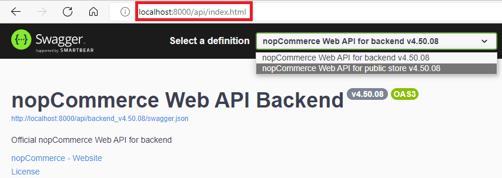
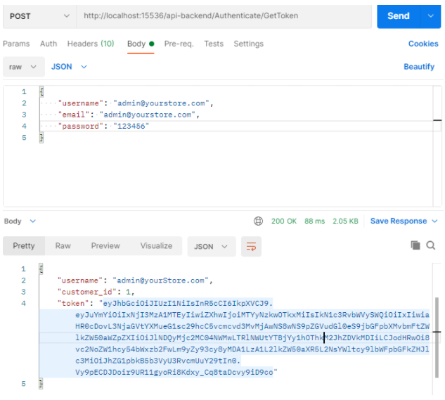
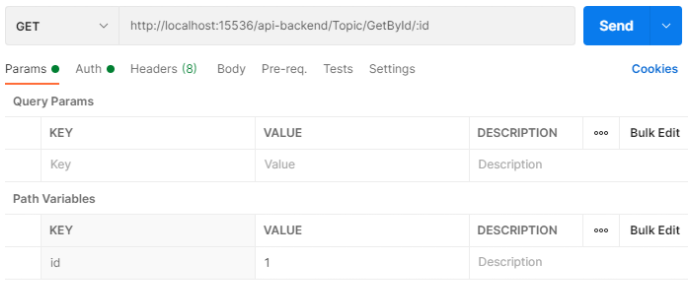
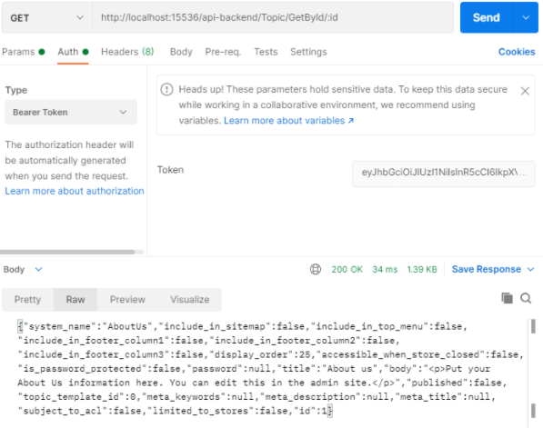

# Web API 文件

## 簡介

nopCommerce 的 [Web API](https://www.nopcommerce.com/web-api) 提供了對所有平台功能的存取權限，以及對資料庫實體的完整控制。這是一個根據 [OpenAPI 3.0 specification (OAS)](https://swagger.io/) 所建置的 RESTful API。透過使用 Swagger UI 之類的工具，或是在 [SwaggerHub 平台](https://swagger.io/tools/swaggerhub/) 中，您可以將 OAS 合約轉換為互動式 API 主控台，讓開發人員能夠與 API 進行互動，並快速了解 API 的預期運作方式。nopCommerce 提供了一套 API，允許開發人員使用並擴充平台內建的功能。這些 API 讓開發人員能夠讀寫商家資料、與其他系統和平台進行交互操作，並為 nopCommerce 增添新的功能。

## 可用 API（方法涵蓋範圍）

Web API 架構為整合者與開發者提供了使用與 nopCommerce 系統進行通訊的 Web 服務之管道。

### 前台方法

Web API 前台為您提供了一種在任何應用程式（無論是網站還是行動應用程式）中實作 nopCommerce 購物功能的方法。當賣家希望觸及更廣泛的受眾，且其需求超出 nopCommerce 標準功能範疇時，使用 API 至關重要。Web API 前台提供的方法允許在 nopCommerce 商店之外使用內建的公開商店功能。即使您的 nopCommerce 商店有進行客製化，您仍然可以使用此外掛，因為它提供了原始程式碼。

安裝此外掛後，您可以使用以下 Swagger UI 端點查看現有的 API 方法清單：
**`{store location}/api/index.html`**

> [!TIP]
> 您無法透過前台 API 使用多因素驗證（MFA）。

### 後台方法

Web API 後台提供了對所有 nopCommerce 管理後台功能的存取權。這意味著，使用 Web API 後台方法，您可以完全控制如顧客管理、建立與更新商品、銷售監控，以及任何您想要在 nopCommerce 商店管理後台控制的功能。使用此 API 來建置如 CRM 和 ERP 系統、社群網路整合，以及其他需要存取商店業務流程的應用程式。

安裝此外掛後，您可以使用以下 Swagger UI 端點查看現有的 API 方法清單：
**`{store location}/api/index.html`**

> [!IMPORTANT]
> 安裝後台與前台 API 後，兩者之間的切換可直接透過 Swagger UI 頁面中可用的定義下拉式選單來實現。
> 

#### 範圍與權限

若要使用此 API，用戶端應用程式必須在已安裝 API 外掛的 nopCommerce 商店中擁有適當的權限 (ACL)。例如，要透過 API 存取後台（管理後台）方法，需要具備特殊的「Access Web API Backend」（存取 Web API 後台）權限。預設情況下，此權限僅提供給管理員角色。您可以透過 nopCommerce 中使用的標準 ACL 來變更這些設定。

## 驗證

為了確保 nopCommerce 平台上的交易安全無虞，所有連接至我們 API 的應用程式在進行 API 呼叫時，都必須進行驗證。

若要從行動應用程式等用戶端進行 Web API 呼叫，API 用戶端必須證明其身分。為此，API 會在每個請求的 Authorization 標頭中，使用 Bearer HTTP 驗證機制來提供存取權杖（access token）。此權杖的作用就像一把電子金鑰，讓您得以存取 API。

安裝 Web API 外掛後，您需要在該外掛的設定頁面上產生一組祕鑰（secret key）。這組金鑰將用於簽署並驗證每個 JWT 權杖。

### 請求權杖 (Token)

1. 端點 (Endpoint)

    針對每個 API，都有一個無需認證的端點，用於取得存取權杖：
    * **`/api-backend/Authenticate/GetToken`**
    * **`/api-frontend/Authenticate/GetToken`**

1. 內容類型 (Content type)

    請求主體的內容類型。請將此值設為 `Content-Type:application/json-patch+json`

1. 認證資訊 (Credentials)

    nopCommerce 帳戶的使用者名稱與密碼。若要在 JSON 請求主體中指定這些認證資訊，請在呼叫中包含類似以下程式碼的內容：

    ```json
    {
        "username":"<user name>", 
        "email":"<Email>", 
        "password":"<password>"
    }
    ```

#### 範例

以下範例使用 curl 指令為顧客帳戶請求權杖：

```rest
curl -X 'POST' \
  'http://localhost:15536/api-backend/Authenticate/GetToken' \
  -H 'accept: application/json' \
  -H 'Content-Type: application/json-patch+json' \
  -d '{
   "username": "admin@yourstore.com",
   "email": "admin@yourstore.com",
   "password": "123456"
}'
```

### 驗證 Token 回應

若請求成功，將會回傳包含 Token 的回應主體，如下所示：

```json
{
  "username": "admin@yourStore.com",
  "customer_id": 1,
  "token": <authentication token>
}
```

### 在 Web API 請求中使用 Token

任何存取需要高於匿名權限層級資源的 Web API 呼叫，都應在標頭（Header）中包含驗證 Token。為此，HTTP 標頭將以下列格式發送：

```rest
curl -X 'GET' \
  'http://localhost:15536/api-backend/BlogPost/GetById/1' \
  -H 'accept: application/json' \
  -H 'Authorization: <authentication token>'
```

## 測試

*開發者模式*（Developer mode）的設計旨在方便測試 API 端點。透過在該外掛的設定頁面中啟用此模式，即可實質上停用權杖驗證。
您可以使用下列工具來測試 API：

1. [Swagger UI](https://swagger.io/swagger-ui/)。它提供了一個網頁介面，利用產生的 OpenAPI 規格來提供關於該服務的資訊。
1. [Postman](https://www.getpostman.com/)。這是一個用於測試 API 的工具。

以下說明如何使用 Postman 對使用者進行驗證，以從 API 取得 JWT 權杖，接著再攜帶該 JWT 權杖發送已驗證的請求，從 API 取得內容頁面（Topic）列表。

### 如何使用 Postman 對使用者進行驗證

若要驗證使用者並取得 JWT token，請遵循以下步驟：

1. 點擊分頁列末端的加號（+）按鈕，開啟一個 *new request* 分頁。
1. 使用 URL 輸入欄左側的下拉選單，將 HTTP 請求方法更改為「POST」。
1. 在 URL 欄位中，輸入您 API 的驗證 URL：**`{storeURL}/api-backend/Authenticate/GetToken`**。
1. 選取 URL 欄位下方的「Body」分頁，將主體類型圓形按鈕切換為「raw」，並使用下拉選單將格式更改為「JSON (application/json)」。
1. 在「Body」文字區域中，輸入包含測試使用者帳號與密碼的 JSON 物件。
1. 點擊「Send」按鈕。您應該會收到「200 OK」的回應，其中包含使用者詳細資訊，以及回應主體中的 JWT token。請複製該 token 值，因為我們將在下一個步驟中使用它來發送已驗證的請求。

以下是請求發送並完成使用者驗證後，Postman 的畫面截圖：



### 如何發送已驗證的請求以透過 ID 取得內容頁面

若要使用上一個步驟取得的 JWT token 發送已驗證的請求，請遵循以下步驟：

1. 點擊標籤頁末端的加號 (+) 按鈕，開啟新的請求分頁。
1. 使用 URL 輸入欄位左側的下拉選單，將 HTTP 請求方法變更為 "GET"。
1. 在 URL 欄位中，輸入您 API 的「取得內容頁面 (Get topic)」URL：`{storeURL}/api-backend/Topic/GetById/:id`。
1. 選取 URL 欄位下方的 "Authorization" 分頁，在類型下拉選單中將類型變更為 "Bearer Token"，並將上一步驗證步驟中取得的 JWT token 貼上至 "Token" 欄位中。
 
1. 點擊 "Send" 按鈕。您應該會收到一個 "200 OK" 的回應，其中包含一個 JSON 陣列，內容為系統中所有的使用者記錄（在範例中僅有該名測試使用者）。
 以下是發送已驗證請求以透過 ID 取得內容頁面後，Postman 的截圖：
 

## 授權

Web API 外掛採用 [下列條款](https://www.nopcommerce.com/web-api-license-terms) 進行授權。