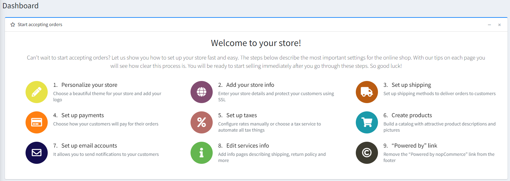
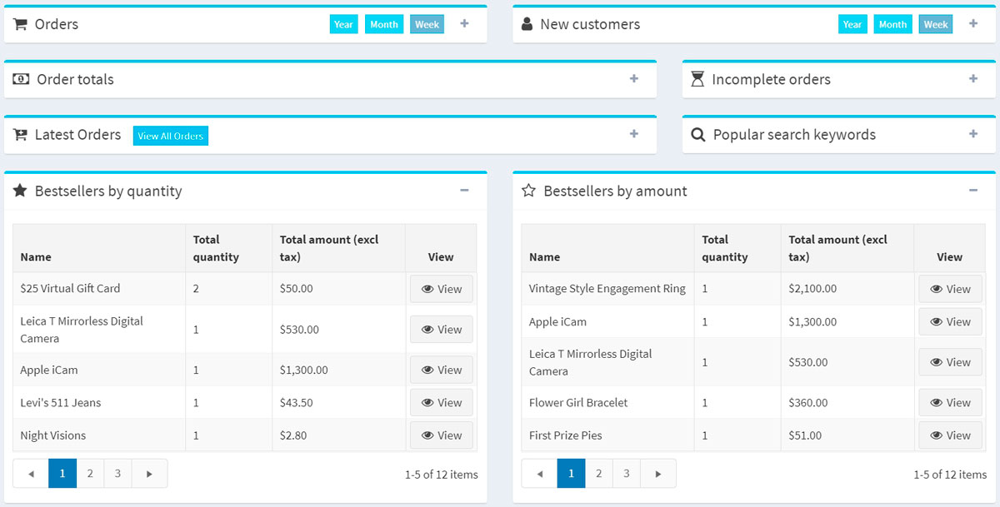
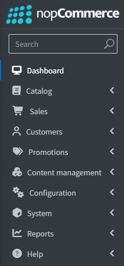
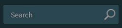
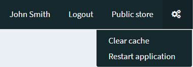
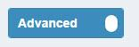
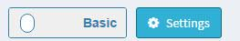
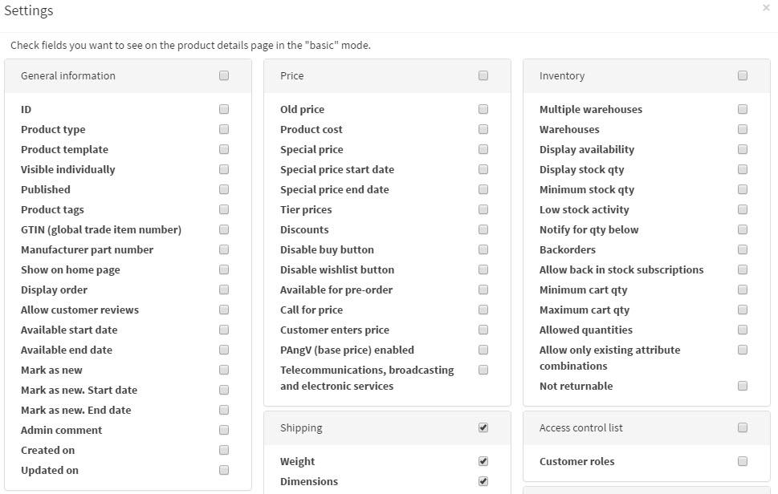

# nopCommerce 介面

本章涵蓋 nopCommerce 介面的基礎知識。

登入後，您應該會在網站頂端看到 **Administration**（管理）超連結。或者，您也可以直接在網站 URL 後面加上 `/admin` 來開啟管理後台。例如：`www.example.com/admin`。

登入 nopCommerce 管理後台後，第一個顯示的畫面是 *儀表板 (Dashboard)*：

儀表板包含以下區塊：

* **開始接受訂單 (Start accepting orders)**：此區塊包含所有與商店設定相關的主要內容頁面。此精靈將會引導您逐步操作管理後台，並說明各項功能的運作方式。

* **nopCommerce 新聞 (nopCommerce news)**：此區塊顯示來自 nopCommerce 的重要新聞、銷售與促銷資訊。

* **一般統計 (Common statistics)**：顯示您網店的統計數據，包括訂單數量、待處理的退貨請求、已註冊的顧客，以及低庫存商品。

* 顯示網店重要統計數據的其他區塊：**訂單 (orders)、新顧客 (new customers)、訂單總額 (order totals)、未完成訂單 (incomplete orders)、最新訂單 (latest orders)、熱門搜尋關鍵字 (popular search keywords)、依數量排行的暢銷商品 (bestsellers by quantity)、依金額排行的暢銷商品 (bestsellers by amount)**：

深入了解 [這些報告請點此](xref:zh-Hant/running-your-store/reports)。

儀表板區塊可以透過點擊  圖示輕鬆收合。

## 常見的 nopCommerce 頁面元素

### 側邊欄 (Sidebar)

側邊欄位於管理後台每個頁面的左側，讓您能夠瀏覽 nopCommerce 管理員的功能。

您可以透過點擊標誌旁邊的「漢堡」圖示來輕鬆收合側邊欄 。

### 搜尋欄位 (Search field)

在側邊欄的最上方有一個搜尋欄位。開始輸入您想要前往的區塊名稱，搜尋列會自動建議選項，並直接將您導向所需的頁面。

### 系統選單 (System menu)

介面的這個部分顯示目前登入的使用者名稱、登出按鈕、前台網站連結，以及一個小選單，使用者可從中選擇清除快取或重新啟動應用程式。

## 基礎與進階模式

在管理後台的某些頁面上，您會看到以下切換開關：

此 *基礎 (Basic)* 與 *進階 (Advanced)* 的雙位置開關，允許您在頁面顯示模式之間切換。

為了方便使用，我們建立了 **基礎** 模式，其中僅顯示最常用的設定。

如果您在頁面上找不到所需的設定，請切換至 **進階** 模式以查看所有可用的設定。

在某些頁面上，開關旁邊會有一個 **設定 (Settings)** 按鈕。您可以透過此按鈕來新增或移除所需的設定，藉此根據您的需求調整基礎模式。

點擊 **設定** 以查看可用設定的清單。勾選 **所需設定** 的核取方塊。新增後的設定隨即會顯示在 **基礎** 模式中。

