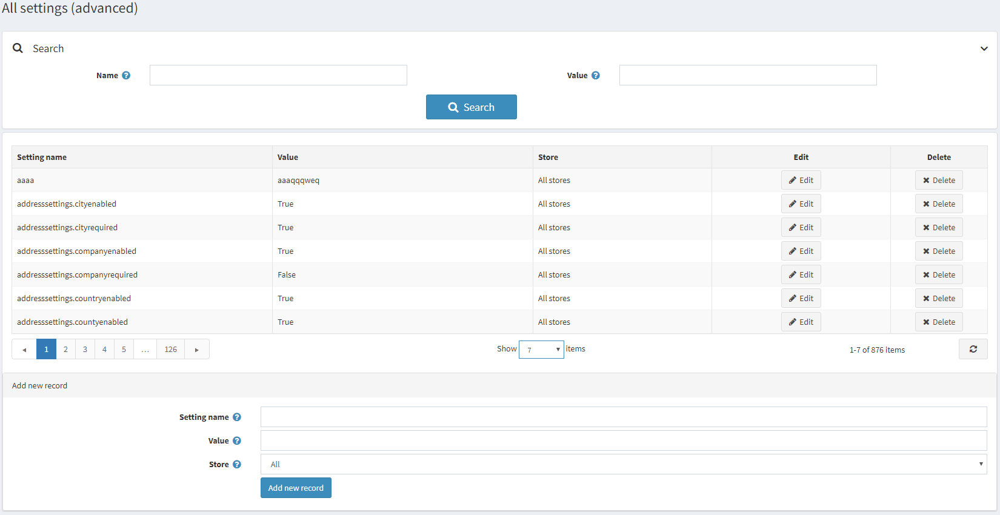
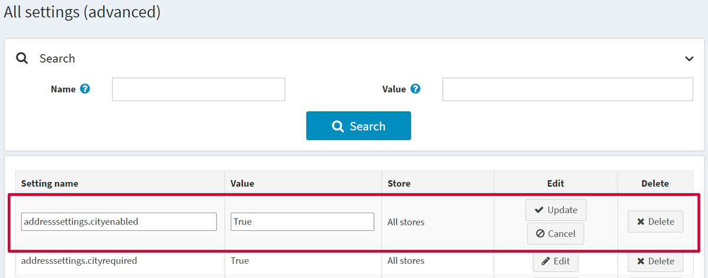

# 所有設定

*所有設定* 是一個進階工具，用於在單一畫面中修改網站的所有設定。例如，當您擁有數間商店，且需要根據第一間商店的設定來建立一個完全相同的副本時，使用 *所有設定* 在單一畫面中進行所有修改，可以為您節省大量時間。

> [!NOTE]
>
> 僅建議進階使用者在此視窗中修改設定。除非使用者對系統有非常深入的了解，否則不建議修改這些設定。

若要定義設定：

前往 **設定 → 設定 → 所有設定 (進階)**。系統將顯示 *所有設定 (進階)* 視窗：

## 新增設定

您可以使用頁面底部的 *新增記錄* 面板來新增設定。請為新設定定義下列欄位：

* 輸入 **設定名稱**。
* 輸入設定的 **數值**。
* 定義該設定適用於哪一間 **商店**。

點擊 **新增記錄** 以加入此設定。

## 編輯現有設定

若要編輯現有設定，請點擊該設定列中的 **編輯** 按鈕。您將能夠編輯 **設定名稱** 及其 **數值**。完成後，點擊 **更新** 以儲存變更。

