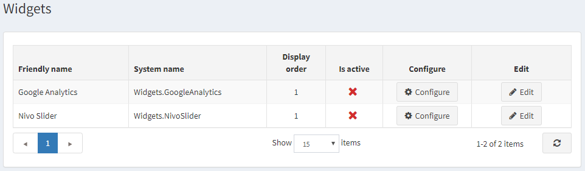
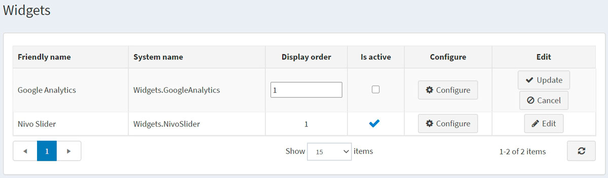
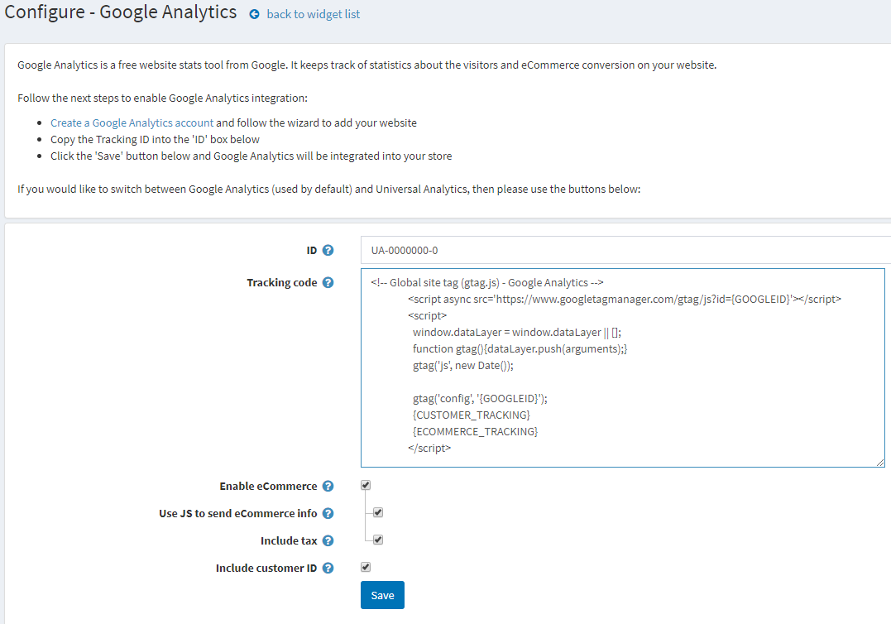

# Google Analytics 外掛

本節說明如何將 **Google Analytics** 外掛新增並整合至您的商店。

若要設定 Google Analytics 外掛：

前往 **設定 → 小工具**。隨即會顯示「小工具」視窗：

## 啟用外掛

點選 **Google Analytics** 旁邊的 **編輯**。視窗將展開如下：

勾選 **是否啟用** 核取方塊以啟用 Google Analytics 外掛。接著點選 **更新** 按鈕以儲存變更。

## 設定外掛

點選 **Google Analytics** 旁邊的 **設定**。隨即會顯示「設定 – Google Analytics」視窗如下：

請執行以下步驟以啟用 Google Analytics 整合：

* 依照連結 [http://www.google.com/analytics/](http://www.google.com/analytics/) 建立一個 **Google Analytics 帳戶**，並依照精靈指示新增您的網站。
* 將 **Google Analytics ID** 複製到表單中的 **ID** 欄位。
* 輸入由 Google Analytics 產生的 **追蹤碼**。{GOOGLEID} 與 {CUSTOMER_TRACKING} 將會被動態取代。
* 勾選 **啟用電子商務** 核取方塊，將訂單資訊傳遞至 Google 電子商務功能。若勾選此項，將顯示以下欄位：
  * 勾選 **使用 JS 發送電子商務資訊** 以使用 JS 程式碼，從訂單完成頁面發送電子商務資訊。針對採用重新導向付款方式的情況，部分顧客可能會跳過此頁面。否則，電子商務資訊將會透過 HTTP 請求發送。每次支付訂單時都會發送資訊，但此模式不支援 UTM。
  * 勾選 **包含稅金** 以在產生電子商務部分的追蹤碼時包含稅金。
* 勾選 **包含顧客 ID** 核取方塊，將顧客識別碼包含在指令碼中。

點選 **儲存**。Google Analytics 即會整合至您的商店中。