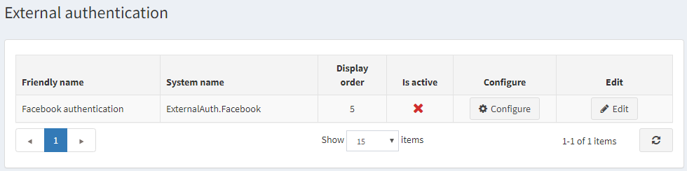
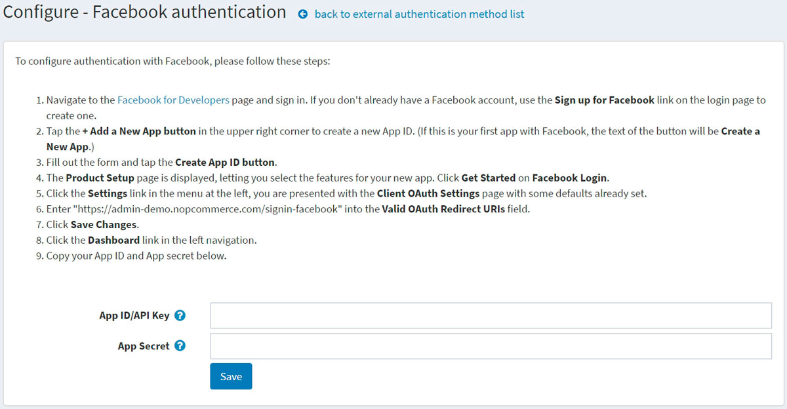

# 外部驗證方法

外部驗證方法允許使用者無需輸入電子郵件與密碼等登入資訊，即可登入 nopCommerce 網站。使用者可以透過外部網站（例如 Facebook 或 Google）進行驗證。nopCommerce 內建了透過 Facebook 進行外部驗證的功能。您可以使用來自 [市集](https://www.nopcommerce.com/marketplace) 的外掛來設定其他驗證方法。

當外部驗證方法設定完成並標記為啟用後，使用者會在登入頁面上看到新的驗證選項。

## 管理外部驗證方法

前往 **設定 → 驗證 → 外部驗證**。系統會顯示 *外部驗證* 視窗：

點擊驗證方法旁邊的 **編輯** 並勾選 **啟用** 以啟動該方法。您也可以定義該方法的 **顯示順序**。完成後，點擊 **更新** 按鈕以儲存變更。

點擊 **設定** 進行該方法的組態設定。

## 管理 Facebook 驗證

Facebook 驗證方法是一個內建的外部驗證外掛。若要設定 Facebook 驗證，請按照下列步驟操作：

1. 在 **設定 → 驗證 → 外部驗證** 頁面上，點擊 **Facebook 驗證** 旁邊的 **設定**。系統會顯示 *設定 - Facebook 驗證* 視窗：

   

1. 前往 [Facebook for Developers](https://developers.facebook.com/apps) 頁面並登入。如果您沒有 Facebook 帳號，請使用登入頁面上的註冊連結建立一個。
1. 點擊右上角的 **+ Add a New App** 按鈕以建立新的 App ID。（如果您是第一次在 Facebook 建立應用程式，按鈕文字將會是 **Create a New App**。）
1. 填寫表單並點擊 **Create App ID** 按鈕。
1. 系統將顯示 *Product Setup* 頁面，讓您為新應用程式選擇功能。在 *Facebook Login* 區域點擊 **Get Started**。
1. 點擊左側選單中的 **Settings** 連結；您將會看到已帶入部分預設值的 *Client OAuth Settings* 頁面。
1. 在 **Valid OAuth Redirect URIs** 欄位中輸入 `https://yoursitename.com/signin-facebook`，並將其中的 `yoursitename.com` 替換為您的網站網址。
1. 點擊 **Save Changes**。
1. 點擊左側導覽列中的 **Dashboard** 連結。
1. 將您的 **App ID/API Key** 與 **App secret** 複製並填入外掛設定頁面的對應欄位中。

點擊 **儲存** 按鈕。現在，您可以在前台網站的登入頁面上看到新加入的驗證方法。

## 參閱

* [nopCommerce 中的外掛](xref:zh-Hant/getting-started/advanced-configuration/plugins-in-nopcommerce)