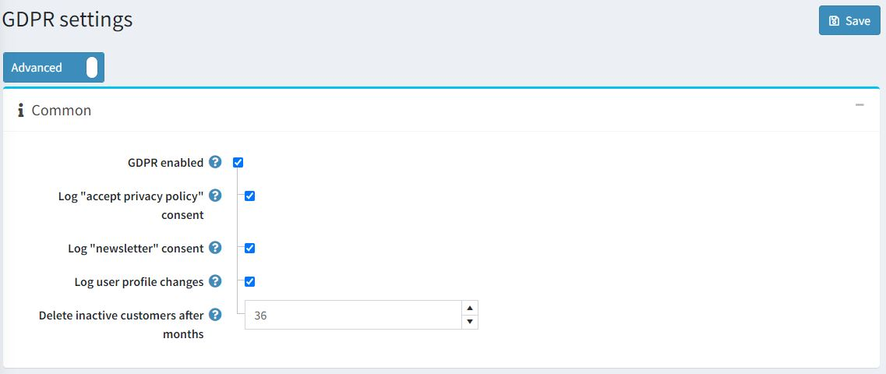
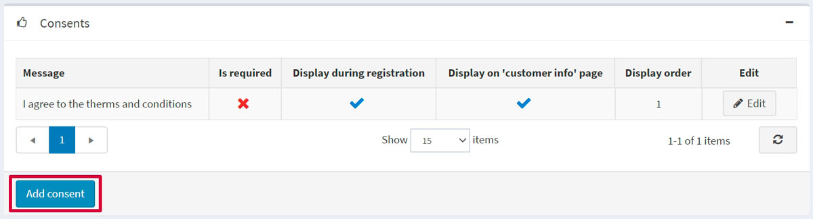
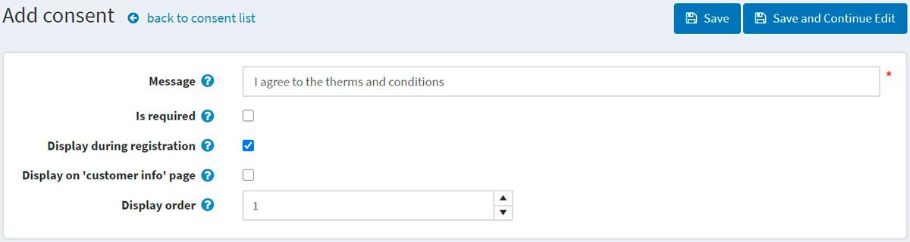
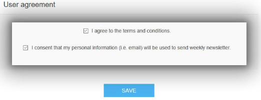
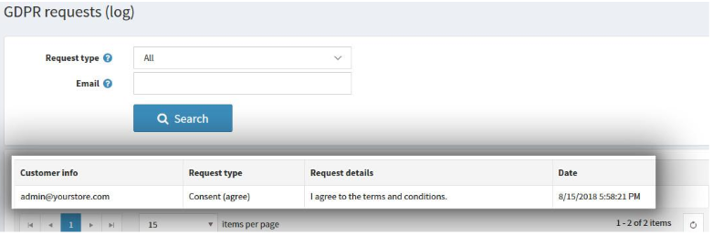
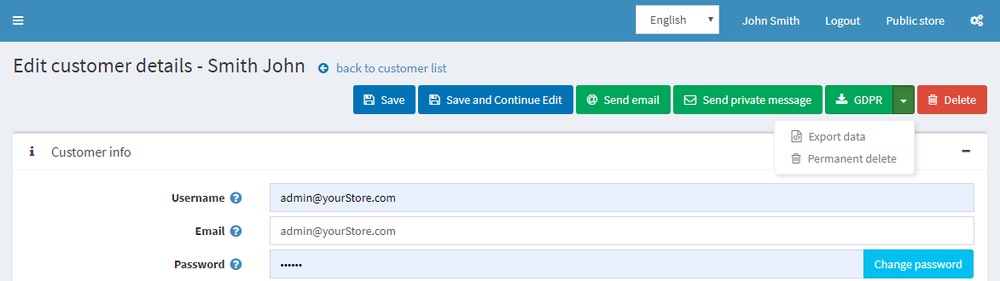

# GDPR 設定

*GDPR*（一般資料保護規範）是歐盟修訂的最新資料隱私法，該法規影響了所有公司收集、使用及分享其歐洲顧客個人資料的方式。該法規於 2016 年 5 月 24 日生效，並自 2018 年 5 月 25 日起實施。該法規是強化個人在數位時代基本權利的重要步驟，並透過釐清數位單一市場中企業與公共機構的規則，來促進商業發展。

欲了解更多資訊，請參考此來源：

[https://ec.europa.eu/info/law/law-topic/data-protection/data-protection-eu_en](https://ec.europa.eu/info/law/law-topic/data-protection/data-protection-eu_en)

## 設定 GDPR

若要在您的 nopCommerce 商店啟用 GDPR 設定，請前往 **後台 → 設定 → 設定 → GDPR 設定**。

接著勾選 **GDPR 啟用 (GDPR enabled)** 核取方塊。額外的設定將允許您記錄下列活動：

* **記錄「接受隱私權政策」同意**。
* **記錄「電子報」同意**。
* **記錄使用者個人資料變更**。
* **刪除不活躍顧客（月）** - 預設值為 36 個月。

您可以點擊 *同意項目 (Consents)* 面板中的 **新增同意項目 (Add consent)** 按鈕，在您的 nopCommerce 網站上新增同意項目：

若要新增一個同意項目，您將會被重新導向至 *新增同意項目* 視窗：

定義下列同意項目設定：

* 將顯示給顧客的 **訊息 (Message)** 或問題。
* 此同意項目是否 **為必要項目 (Is required)**。
* 此同意項目是否 **於註冊時顯示 (Displayed during registration)**。
* 此同意項目是否 **顯示於「我的帳戶」區段中的「顧客資訊」頁面 (Displayed on "customer info" page)**。
* **顯示順序 (Display order)** 為同意項目的顯示順序。1 代表清單中的第一項。

以下是顧客資訊頁面上同意選項的範例：

如果您已啟用同意項目記錄設定，則可以透過前往：**後台 → 顧客 → GDPR 請求 (記錄)** 來查看活動記錄。

當 GDPR 設定啟用時，商店管理員還可以執行下列動作：

* **永久刪除 (Permanent delete)**：用於刪除顧客紀錄。
* **匯出資料 (Export data)**：用於匯出顧客資料。

若要執行此操作，請前往 **後台 → 顧客 → 編輯顧客** 頁面。

## 教學課程

* [在 nopCommerce 中管理 GDPR 設定](https://www.youtube.com/watch?v=6bLc_TDqD18&feature=youtu.be)