# 本地化

在 nopCommerce 中，您的商店可以安裝多種語言。然而，顧客只會看到以他們所選擇的語言所定義的資料。

> [!TIP]
>
> 系統預設已安裝英文。

若要檢視或編輯已安裝的語言，請前往 **設定 → 語言**：
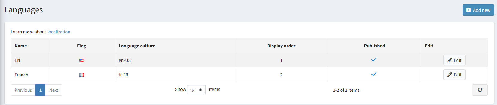

> [!NOTE]
>
> 您可以從官方的 [翻譯 (Translations)](https://www.nopcommerce.com/translations) 頁面下載新的語言包。

## 新增語言

若要新增語言，請點擊 **新增**。在 *新增語言* 視窗中，定義下列設定：

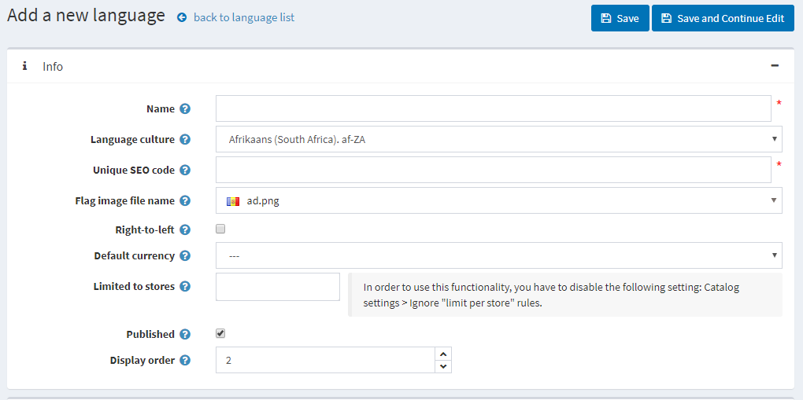

* **名稱 (Name)**：新語言的名稱。
* **語言文化 (Language culture)**：特定的語言代碼（例如，de-AT 代表奧地利德語）。

  > [!NOTE]
  >
  > 更新 **語言文化** 欄位時，請確保已針對該文化安裝適當的 CLDR 套件。您可以在 **設定 → 一般設定** 頁面的 *在地化* 面板中，為指定的文化設定 CLDR。

* **唯一 SEO 代碼 (Unique SEO code)**：當您擁有一個以上的已發布語言時，用於產生如 `http://www.yourstore.com/en/` 等網址的兩個字母語言 SEO 代碼。

  > [!NOTE]
  >
  > 您應在 **設定 → 一般設定 → 在地化設定** 面板中啟用 **多語言 SEO 友善網址 (SEO friendly URLs with multiple languages)** 選項。

* **旗幟圖片檔名 (Flag image file name)**：輸入旗幟圖片的檔案名稱。該圖片應儲存在 `…/images/flags` 目錄下。您也可以從預定義清單中選擇圖片。
* 若有需要，請勾選 **由右至左 (Right-to-Left)**（例如阿拉伯語或希伯來語）。
  
  > [!NOTE]
  >
  > 啟用的佈景主題必須支援 RTL（擁有適當的 CSS 樣式檔）。此選項僅影響前台網站。

* **預設貨幣 (Default currency)**：特定語言的貨幣。若未指定，則會使用第一個找到的貨幣（顯示順序最前者）。
* **限制於商店 (Limited to stores)**：允許將此語言設定為特定商店使用。您可以從預先建立的清單中選擇商店。若未使用此選項，請將此欄位留空。
  
  > [!NOTE]
  >
  > 若要使用商店限制功能，必須在 **設定 → 目錄設定 → 效能** 面板中停用 **忽略「每間商店的限制」規則 (全站)** 選項。

* **發布 (Publish)**：發布該語言以使其生效，並讓商店訪客能夠選取。
* **顯示順序 (Display order)**：語言的顯示順序。1 代表清單的最上方。

點擊 **儲存** 以儲存變更。

> [!NOTE]
>
> 由於語言文化僅在應用程式啟動時載入，因此在新增或刪除語言後，您必須重新啟動應用程式。
>
> [!NOTE]
>
> 新增語言後，您可以使用頁面頂端的 **匯入資源** 與 **匯出資源** 按鈕來匯入和匯出字串資源。語言編輯頁面上的 *字串資源* 面板，可讓您檢視現有的語言資源並手動新增資源。

## 匯入語言套件

若您希望在商店中新增語言，請執行以下步驟：

1. 前往 nopCommerce [翻譯](https://www.nopcommerce.com/translations) 頁面。
2. 選擇對應的 nopCommerce 版本並下載所需的語言套件。
3. 前往 **設定 → 語言** 並點擊 **新增** 按鈕。
   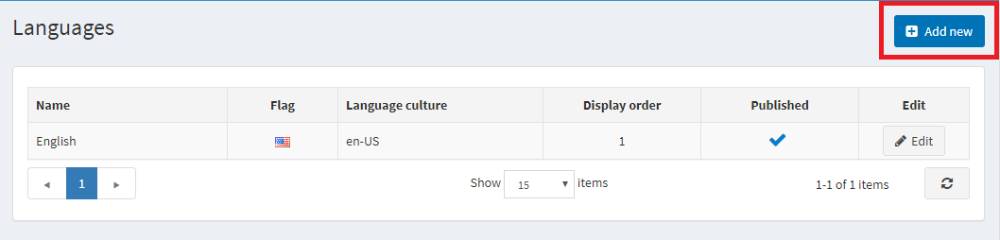

4. 填寫必要的欄位，並點擊 **儲存並繼續編輯**。
   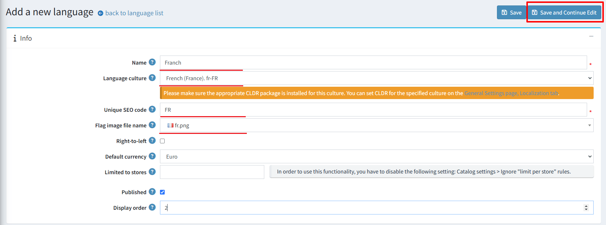

5. 點擊 **匯入資源**。接著指定您下載的語言套件檔案 (*.xml) 路徑。
   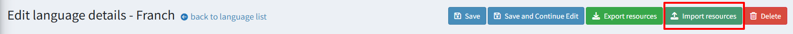

如果您發現翻譯有誤，或是想要自訂名稱，您可以在 *字串資源* 面板中編輯這些字串資源。

## 管理字串資源

前往 **設定 → 語言**。此時會顯示 *語言* 視窗：

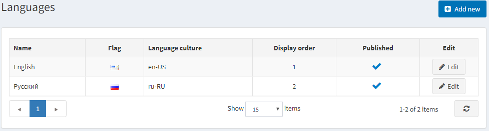

點擊該語言旁邊的 **編輯** 按鈕。在 **編輯語言詳細資料** 視窗中，找到 **字串資源** 面板。

例如，您想要將頁面頂端面板的名稱從「Administration」（如下圖所示）更改為「Control panel」。

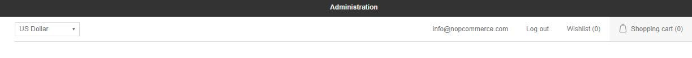

1. 若要尋找您需要編輯的地區設定資源，請在 **資源名稱** 欄位中輸入「administration」。如果該資源存在，它將會被搜尋出來。點擊其旁邊的 **編輯**。
1. 在 **值** 欄位中輸入新的數值，並點擊 **更新**。
  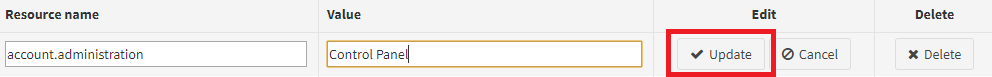

1. 變更將會套用：
  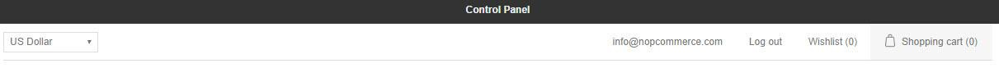

若要新增字串資源，請使用 **新增記錄** 面板。此視窗可讓您將新的資源記錄新增至網格中，說明如下：
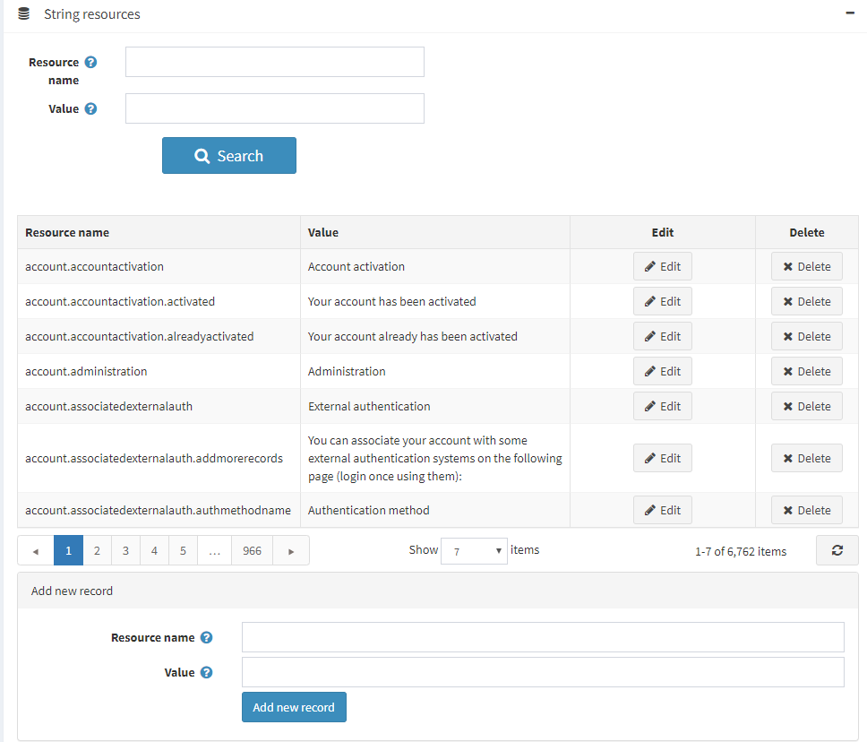

* 在 **資源名稱** 欄位中，輸入資源字串的識別碼。
* 在 **值** 欄位中，輸入此資源字串識別碼的對應值。

點擊 **儲存**。

## 在地化設定

若要設定在地化（Localization）相關設定，請前往 **後台 → 設定 → 一般設定**：

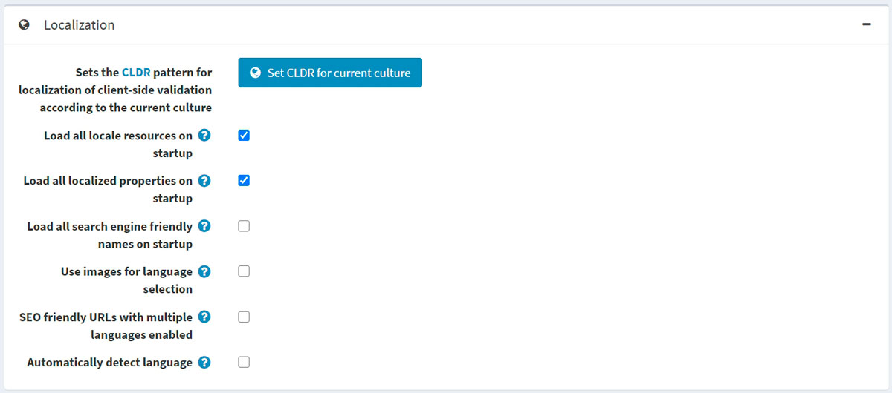

* 若要針對目前的文化特性（Culture）設定 [CLDR](http://cldr.unicode.org/) 模式以進行用戶端驗證在地化，請點擊 **設定目前文化特性的 CLDR** 按鈕。
* 勾選 **啟動時載入所有語系資源** 核取方塊，以便在應用程式啟動時載入所有語系資源。啟用後，所有語系資源將會在應用程式啟動時載入。雖然這會導致應用程式啟動速度變慢，但後續頁面的開啟速度會更快。
* 勾選 **啟動時載入所有在地化屬性** 核取方塊，以便在應用程式啟動時載入所有在地化屬性。啟用後，所有在地化屬性（如在地化的商品屬性）將會在應用程式啟動時載入。雖然這會導致應用程式啟動速度變慢，但後續頁面的開啟速度會更快。此選項僅在啟用兩種或更多語言時使用。若您的型錄龐大（數千個在地化實體），則不建議啟用此功能。
* 勾選 **啟動時載入所有 SEO 友善名稱** 核取方塊，以便在應用程式啟動時載入所有 SEO 友善名稱（slug）。啟用後，所有網址別名將會在應用程式啟動時載入。雖然這會導致應用程式啟動速度變慢，但後續頁面的開啟速度會更快。若您的型錄龐大（數千個實體），則不建議啟用此功能。
* 勾選 **使用圖片進行語言選擇** 核取方塊，以便使用圖片代替語言名稱。
* 勾選 **在啟用多語言時使用 SEO 友善 URL** 核取方塊，以允許所有語言使用 SEO 友善的 URL。啟用後，您的 URL 將會呈現為 `http://www.yourStore.com/en/` 或 `http://www.yourStore.com/fr/`（SEO 友善格式）。
  > [!NOTE]
  >
  > 在更新 **在啟用多語言時使用 SEO 友善 URL** 設定後，您必須重新啟動應用程式，否則可能會導致錯誤。
* 勾選 **自動偵測語言** 核取方塊，以便根據顧客的瀏覽器設定偵測語言。

## 本地化實體

如果您在商店中安裝了超過一種語言，您將能夠輸入顯示給不同語言顧客的某些欄位。例如：

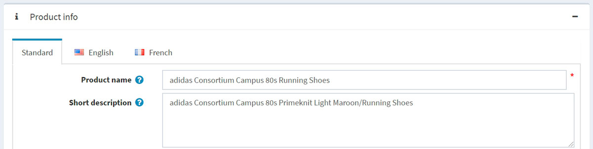

* 在 *標準 (Standard)* 頁籤中，輸入若未指定本地化欄位時，將顯示給顧客的文字。
* 在 *以語言名稱命名的頁籤* 中，輸入本地化的文字。