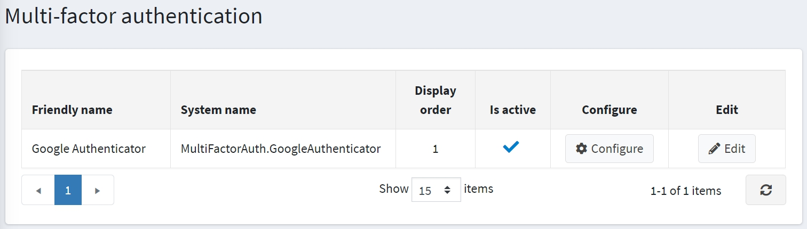
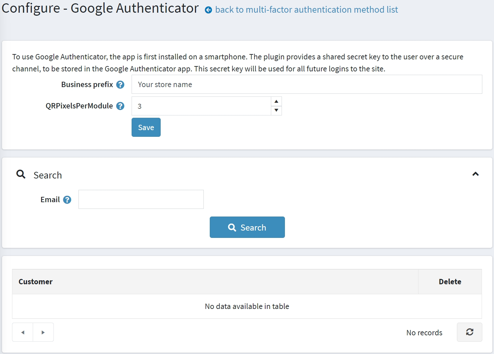
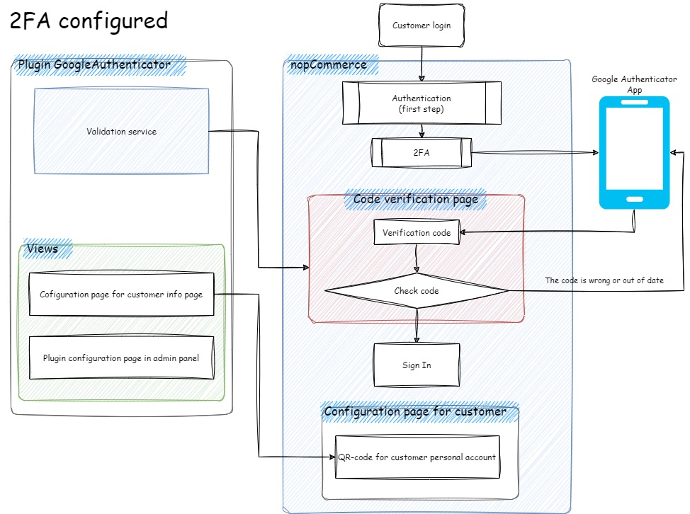
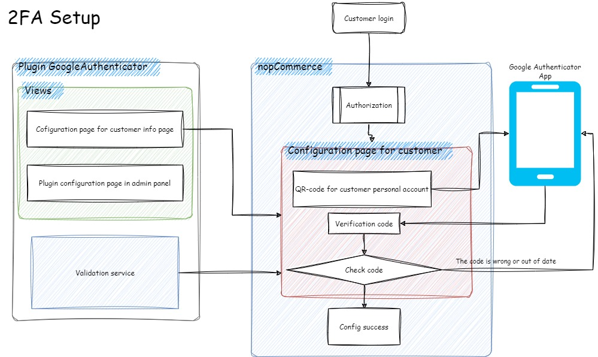
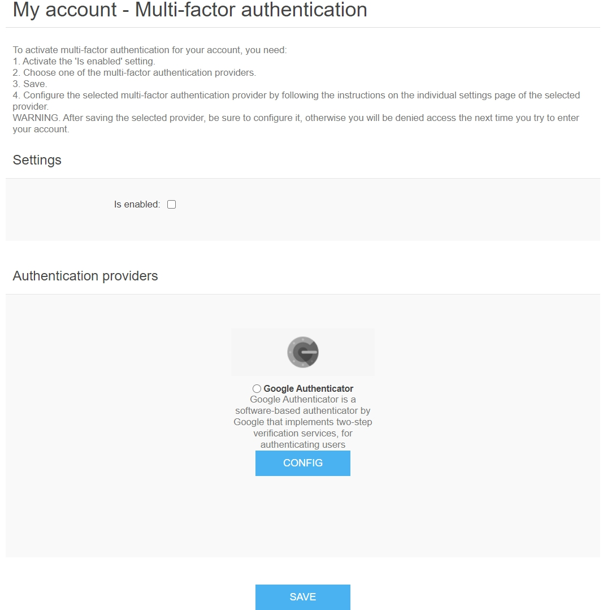

# 多因素驗證

多因素驗證 (Multifactor Authentication, MFA)（在我們的情況下，指雙因素驗證 – 2FA）是一種要求使用者提供兩個或更多驗證因素，以獲取資源存取權限的驗證方法。MFA 是強大身分與存取管理 (IAM) 政策的核心組成部分。MFA 不僅要求使用者名稱和密碼，還需要額外的一個或多個驗證因素，這降低了網路攻擊成功的可能性。

nopCommerce 透過 Google Authenticator 實作了內建的多因素驗證。您可以使用來自 [市集](https://www.nopcommerce.com/marketplace) 的外掛來設定其他方法。

## 管理多因素驗證方法

預設情況下，Google Authenticator 外掛未安裝。若要安裝此外掛，請前往 **設定 → 本機外掛**。

1. 在 **外掛名稱** 欄位搜尋 *Google Authenticator*。
1. 點擊 **安裝** 按鈕。
1. 然後點擊 **重新啟動應用程式以套用變更** 按鈕來套用變更。
1. 前往 **設定 → 驗證 → 多因素驗證**。系統將會顯示 *多因素驗證* 視窗：

   

1. 點擊驗證方法旁邊的 **編輯**，並勾選 **已啟用** 以啟用該方法。您也可以定義該方法的 **顯示順序**。完成後點擊 **更新** 按鈕以儲存變更。

## 設定 Google Authenticator 外掛

點擊該方法的 **設定** 進行配置。系統將會顯示 *設定 - Google Authenticator* 頁面如下：

在此頁面上，您必須輸入：

- 您的 **企業前綴**，讓使用者能夠在 Google Authenticator 應用程式中區分您商店的帳號資訊。
- **QRPixelsPerModule** 以設定每個單元的像素數量。該單元是 QR 碼中的一個正方形。預設值為 3，對應 171 × 171 像素的影像。

然後點擊 **儲存**。

在此頁面上，您也可以使用 *搜尋* 面板透過電子郵件搜尋顧客。

## 運作原理

若要了解多因素驗證在 nopCommerce 中如何運作，請參考上方的圖表。

- **2FA 已設定** 架構表示顧客已完成 2FA 設定的程序。

- **2FA 設定** 架構表示顧客需要完成 2FA 設定的程序。

## 前台網站的多因素驗證頁面

若要配置多因素驗證，顧客應前往 **我的帳戶 - 多因素驗證** 頁面，顯示如下：

啟用 MFA 的步驟：

1. 啟用 **已啟用** 設定。
2. 選擇其中一個多因素驗證提供者（預設只有一個）。
3. 儲存。
4. 依照所選提供者之個別設定頁面上的說明，配置該多因素驗證提供者。

> [!WARNING]
>
> 儲存所選的提供者後，請務必完成其設定；否則，下次您嘗試登入帳戶時將會被拒絕存取。