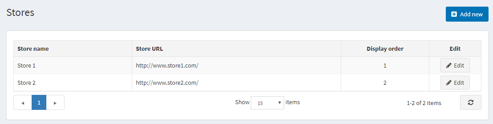
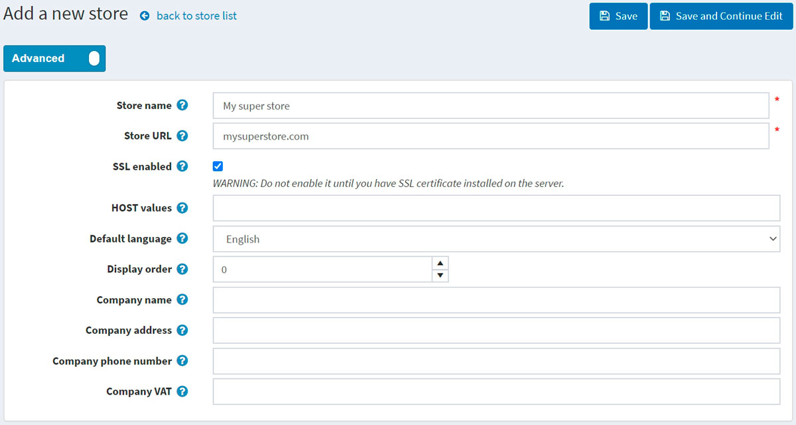
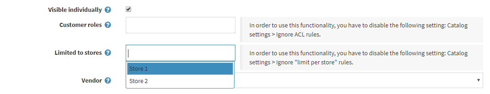
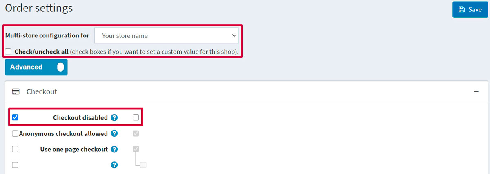

# 多重商店

nopCommerce 讓您可以使用單一 nopCommerce 安裝環境中的單一介面，執行超過一個以上的商店。

這使您能夠在不同的網域上架設多個前台商店，並從單一管理後台管理所有的後台作業。您可以在不同商店之間共用型錄資料、將同一個商品放置在一個以上的商店中，且您的顧客可以使用相同的憑證登入您所有的商店。

## 設定多商店 (multi-store)

### 1. 虛擬主機控制台部分

在以下範例中，我們將說明如何設定兩個範例商店：

* `www.store1.com`
* `www.store2.com`

1. 上傳並安裝網站至 `www.store1.com`。這是唯一存放 nopCommerce 檔案與 DLL 的地方。
      > [!NOTE]
      >
      > 關於如何安裝 nopCommerce 的詳細資訊，請參閱下一章：[安裝 nopCommerce](xref:zh-Hant/installation-and-upgrading/installing-nopcommerce/index)。

1. 在 `www.store2.com` 的控制台中（指的是您的虛擬主機控制台，而非 nopCommerce 管理後台），確保所有對 `www.store2.com` 的請求皆已轉發（forwarded，非 redirect 重導向）至 `www.store1.com`。請使用 CNAME 記錄來執行此步驟，這點非常關鍵。

1. 在 `www.store1.com` 的控制台中，設定 `www.store2.com` 的網域別名 (domain alias)。此步驟對某些使用者來說可能較為複雜（若遇到問題，請請教您的系統管理員來執行此步驟）。

    完成上述步驟後，當您從瀏覽器存取 `www.store2.com` 時，將會顯示 `www.store1.com` 的內容。下一步是在 nopCommerce 管理後台設定商店，這將在下方進行說明。完成後，您即可開始為兩間商店上傳內容。

1. 選用（範例）：此步驟可從下方的 Plesk 控制台執行，操作如下：
  
      當 `www.store2.com` 被重新導向至 `www.store1.com` 時，Plesk 的網頁伺服器會因為使用「名稱基礎虛擬主機」(Name-Based Virtual Hosting) 而不知道該如何顯示 `www.store2.com`。因此，您必須為 `www.store2.com` 建立一個網域別名，操作說明如下：

      * 透過直接登入或從伺服器管理面板點選 **Open in Control Panel** 連結，登入 `www.store1.com` 的網域面板。

      * 在 **Websites & Domains** 索引標籤中，選取頁籤底部附近的 **Add New Domain Alias** 連結。

      * 輸入完整的別名，例如 `store2.com`。

      * 確保已選取 **Web service** 選項。

      * **Mail** 服務為選用項目。若您希望來自 `www.store2.com` 的電子郵件也能以相同方式轉發，請選取此選項。

      * 確保 **Synchronize DNS zone with the primary domain** 選項為取消勾選狀態。

### 2. nopCommerce 管理後台部分

一旦安裝與技術設定完成，您即可從 nopCommerce 管理後台管理您的商店。前往 **設定 → 商店**。隨即會顯示「商店」視窗：

> [!NOTE]
>
> 預設情況下，系統僅會建立一個商店。

若要設定多個商店，請點擊 **新增** 並定義下列商店設定：

* 定義 **商店名稱**。
* 輸入您的 **商店 URL**。
* 如果您的商店有 SSL 安全保護，請勾選 **啟用 SSL** 核取方塊。SSL (Secure Sockets Layer) 是用於在伺服器與瀏覽器之間建立加密連結的標準安全性技術。此連結可確保伺服器與瀏覽器之間傳遞的所有資料保持隱私且完整。SSL 是全球數百萬個網站用來保護其與顧客之間線上交易的產業標準。

  > [!IMPORTANT]
  >
  > 請務必在伺服器安裝 SSL 憑證後，再勾選此選項。否則，您將無法存取您的網站，且必須手動編輯資料庫中的對應紀錄（[Store] 資料表）。

  > [!TIP]
  >
  > 閱讀以下章節以了解更多關於 SSL 設定的資訊：[如何安裝與設定 SSL 憑證](xref:zh-Hant/getting-started/advanced-configuration/how-to-install-and-configure-ssl-certificates)。

* **主機值 (HOST values)** 欄位是您商店可能使用的 HTTP_HOST 值清單（例如 `store1.com`、`www.store1.com`）。僅在您擁有「多商店」解決方案時，才需要填寫此欄位以識別當前商店。此欄位能區分不同 URL 的請求並判定當前商店。您也可以在 **系統 → 系統資訊** 中查看目前的 HTTP_HOST 值。
* 在 **預設語言** 欄位中，選擇您商店的預設語言。您也可以選擇不選。若未選擇，系統將使用找到的第一個語言（顯示順序最優先者）。
* 定義此商店的 **顯示順序**。1 代表列表的最上方。
* 定義 **公司名稱**。
* 定義 **公司地址**。
* 設定您的 **公司電話號碼**。
* 在 **公司 VAT** 欄位中，輸入您公司的加值型營業稅號（適用於歐盟）。

透過點擊 **設定 → 商店** 頁面上的 **新增** 按鈕並填寫類似欄位，即可增加另一個商店。

現在，這兩個商店已使用單一的 nopCommerce 安裝進行設定：

* www.store1.com
* www.store2.com

> [!NOTE]
>
> 多商店解決方案（透過 HTTP_HOST 區分商店）對於位於同一網域下虛擬目錄的網站並不適用。

例如，您無法將一個商店設在 `http://www.site.com/store1`，而將第二個商店設在 `http://www.site.com/store2`，因為這兩個網站的 HTTP_HOST 值皆相同（`www.site.com`）。

## 為多商店設定實體

一旦設定並配置好商店，您就可以為每個商店定義您的實體。您可以透過填寫下列各項詳細資料頁面中的 **Limited to stores**（限制於商店）欄位來完成此操作：[商品](xref:zh-Hant/running-your-store/catalog/products/index)、[類別](xref:zh-Hant/running-your-store/catalog/categories)、[製造商](xref:zh-Hant/running-your-store/catalog/manufacturers)、[語言](xref:zh-Hant/getting-started/advanced-configuration/localization)、[貨幣](xref:zh-Hant/getting-started/configure-payments/advanced-configuration/currencies)、[訊息範本](xref:zh-Hant/running-your-store/content-management/message-templates)、[部落格](xref:zh-Hant/running-your-store/content-management/blog)、[新聞](xref:zh-Hant/running-your-store/content-management/news)、[內容頁面](xref:zh-Hant/running-your-store/content-management/topics-pages)。

向下捲動至 **Limited to stores**（限制於商店）欄位，並從下拉式選單中選擇現有商店的名稱，如下方 *Edit product details*（編輯商品詳細資料）畫面所示：

## 設定多商店的設定

也可以為不同的商店設定不同的 [佈景主題](xref:zh-Hant/getting-started/design-your-store/choose-and-install-a-theme)。

此外，您可以針對每個商店覆寫任何設定值。例如，前往 **設定 → 訂單設定**，並查看 **多商店設定目標為** 下拉式清單，您可以在此選擇想要覆寫設定的商店：

當您選擇商店後，頁面將會重新整理，您便能為所選的商店定義任何欄位。接著只需點擊 **儲存** 即可儲存設定。