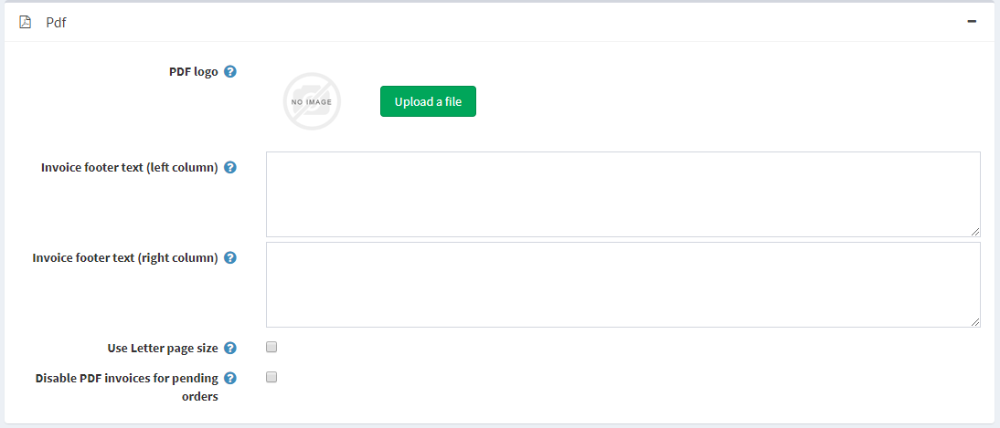

# PDF 設定

經營商店時，您可能需要自動產生的 PDF 檔案，例如發票與服務條款。

若要定義 PDF 設定，請前往 **設定 → 設定 → 一般設定** 並找到 *PDF* 面板：

* 在 **PDF 標誌區塊**，拖放要上傳的標誌檔案。此圖片檔案將顯示在 PDF 訂單發票上。建議使用小型圖片。
* 在 **發票頁尾文字 (左欄)** 欄位中，輸入將出現在產生發票底部（左欄）的文字。
* 在 **發票頁尾文字 (右欄)** 欄位中，輸入將出現在產生發票底部（右欄）的文字。
* 若希望您的 PDF 文件使用 Letter 頁面尺寸，請勾選 **使用 Letter 頁面尺寸**。當此核取方塊未勾選時，預設使用 A4 頁面尺寸。
* 若不希望顧客能為待處理的訂單列印 PDF 發票，請勾選 **停用待處理訂單的 PDF 發票**。

## 教學課程

* [在 PDF 發票上新增企業資訊（品牌識別）](https://youtu.be/TeXmuNWsdD4)