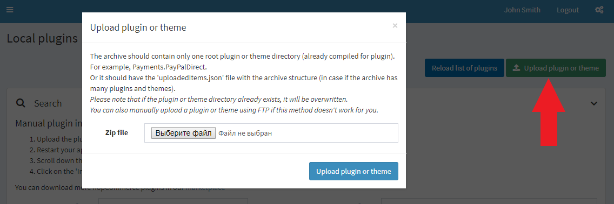
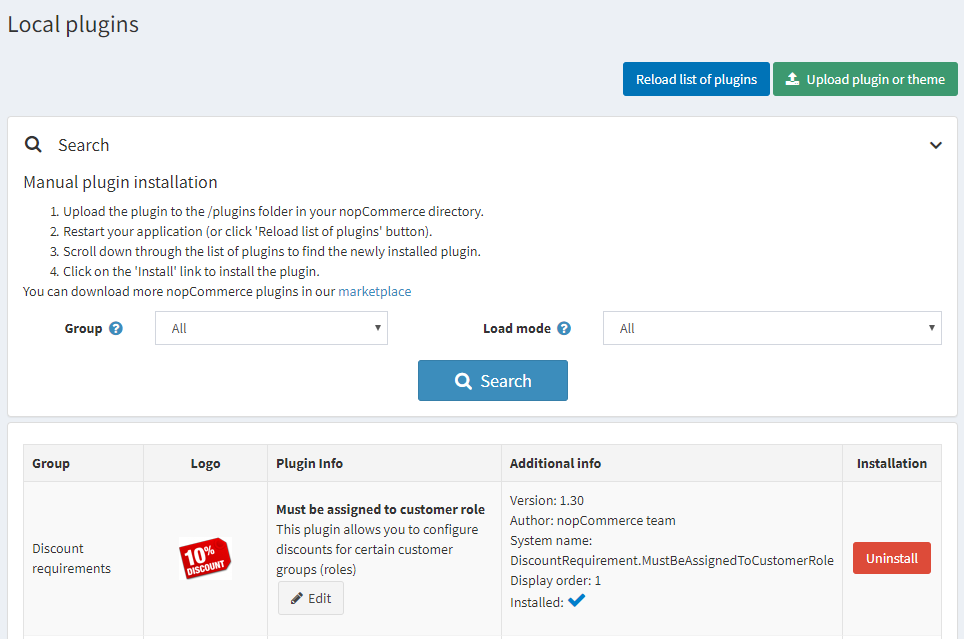
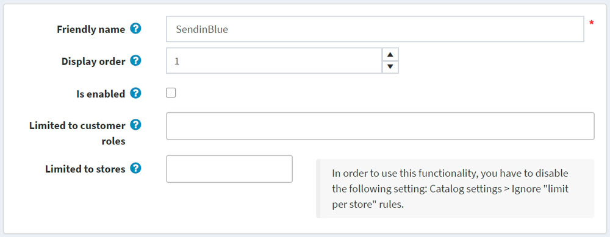

# nopCommerce 中的外掛

外掛是一組為 nopCommerce 商店增加特定功能的元件。外掛的範例包括付款模組、運費計算方式等。本章節說明如何手動安裝外掛。

nopCommerce [市集](http://www.nopcommerce.com/marketplace) 提供了多種擴充您商店功能的外掛。您可以透過從市集下載，或直接從管理後台存取前台網站來安裝外掛。

市集上的外掛可以依照類別、版本、名稱或評分進行排序，且分為免費或付費。

市集上提供的外掛是由 nopCommerce 團隊、解決方案合作夥伴或第三方供應商所開發。

> [!NOTE]
>
> 標示為「By nopCommerce team」的外掛是由 nopCommerce 團隊開發並免費發布。第三方服務連接器是在 *技術合作夥伴計畫* 下開發的；它們同樣適用於 nopCommerce [進階支援服務](http://www.nopcommerce.com/nopcommerce-premium-support-services)，且亦為免費發布。

## 安裝外掛

1. 使用者有兩種上傳外掛的方式，您可以選擇任何一種方便的方式：
    * 將外掛上傳到 nopCommerce 目錄中的 `/plugins` 資料夾，並重新啟動您的應用程式（或點擊 **重新載入外掛清單** 按鈕）。
    * 使用 **上傳外掛或佈景主題** 按鈕，並指定本機儲存空間中外掛封存檔的路徑。

    > [!TIP]
    >
    > 您可以在我們的 [擴充功能目錄](https://www.nopcommerce.com/marketplace) 中下載更多 nopCommerce 外掛。

    

1. 捲動瀏覽外掛清單以找到剛安裝的外掛。
1. 點擊 **安裝** 連結來安裝外掛。
1. 點擊上方面板的 **重新啟動應用程式以套用變更** 按鈕，完成安裝程序。
1. 外掛將會顯示在外掛清單中（**設定 → 本地外掛**）。

    > [!NOTE]
    >
    > 如果您在 medium trust 環境下執行 nopCommerce，建議清除您的 `\Plugins\bin\` 目錄。

## 設定外掛

1. 前往 **設定 → 本地外掛**。外掛清單將會顯示：
    
1. 點擊外掛旁邊的 **設定** 連結，以前往該外掛的設定頁面。如果外掛旁邊沒有 **設定** 按鈕，則表示該外掛無需進行設定。

## 變更外掛的友善名稱、顯示順序與限制

1. 前往 **設定 → 本地外掛**。外掛清單將會顯示：
    
1. 點擊外掛旁邊的 **編輯** 按鈕。依照下列說明編輯外掛詳情：
    
1. 輸入 **友善名稱**。
1. 在 **顯示順序** 欄位中，定義顯示該外掛的所需位置。1 代表清單的最上方。
1. 如果您想要在商店中啟用該外掛，請選取 **已啟用** 欄位。
1. 從 **限制顧客角色** 下拉式選單中，選擇您希望能夠使用此外掛的角色。
1. 在 **限制商店** 欄位中，定義該外掛將被使用的商店。
1. 點擊頁面上方的 **儲存**。

## 解除安裝外掛

1. 前往 **設定 → 本地外掛**。外掛清單將會顯示：

1. 點擊外掛旁邊的 **解除安裝** 連結進行解除安裝。外掛將會被移除。**安裝欄** 中的連結將變更為 **安裝**，讓您隨時可以重新安裝該外掛。
1. 點擊上方面板的 **重新啟動應用程式以套用變更** 按鈕，完成解除安裝程序。

## 教學課程

* [安裝外掛（適用於 3.90 - 4.10 版本）](https://youtu.be/eLDsSm-4gKA)
* [管理每個顧客角色對外掛的存取權限](https://www.youtube.com/watch?v=52lVVpQ3Qag)