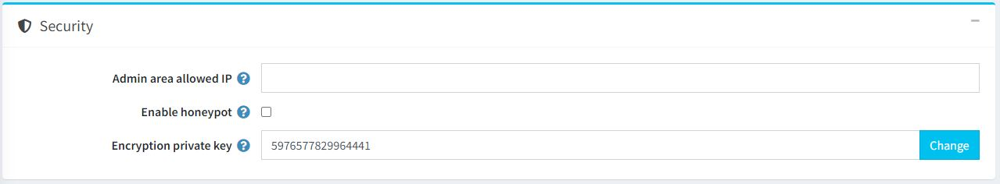
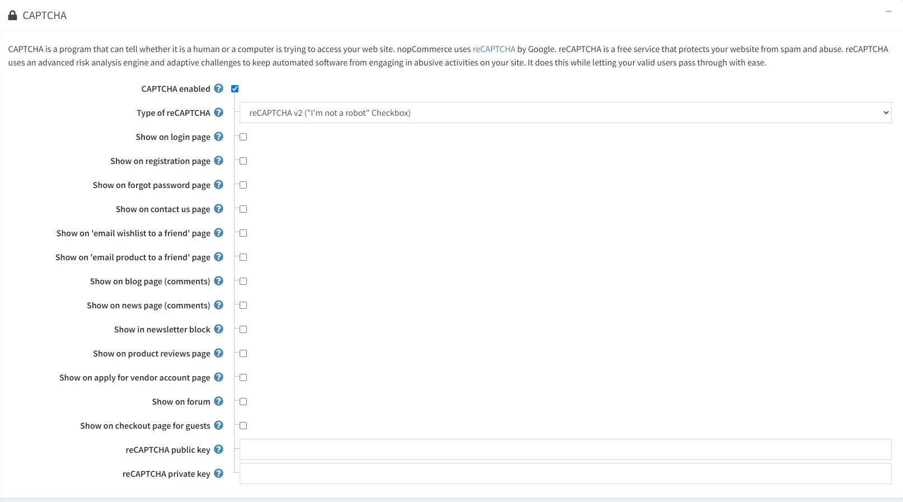

# 安全性設定

若要管理安全性設定，請前往 **設定 → 設定 → 一般設定**。

此頁面支援多商店設定；這意味著相同的設定可以套用於所有商店，或者針對不同商店進行個別定義。若您想要管理特定商店的設定，請從多商店設定下拉式清單中選擇該商店名稱，並勾選左側所需的核取方塊來為其設定自訂值。更多詳細資訊，請參閱 [多商店設定](xref:zh-Hant/getting-started/advanced-configuration/multi-store)。

## 安全性

定義 *安全性* 設定如下：

* 在 **後台允許的 IP** 欄位中，輸入允許存取後台的 IP 位址。如果您不想限制後台存取權，請將此欄位留空。IP 位址之間請使用逗號分隔（例如：127.0.0.10, 232.18.204.16）。
* 勾選 **啟用 Honeypot** 以啟用 [honeypot](https://en.wikipedia.org/wiki/Honeypot_(computing)。在電腦領域中，honeypot 是一種誘餌，用於偵測、轉移或以某種方式抵銷針對資訊系統的未經授權存取企圖。
* 在 **加密私鑰** 欄位中，輸入用於儲存敏感資料的加密私鑰。您可以隨時點擊 **變更** 來修改此金鑰。所有敏感資料皆使用此私鑰進行加密。

> [!NOTE]
>
> 建議您在變更加密金鑰之前先備份資料庫。敏感資料包含所有信用卡資訊（僅限信用卡資訊儲存在商店資料庫中的情況）。

## CAPTCHA

CAPTCHA 是一種能夠分辨存取網站的是人類還是電腦程式的機制。nopCommerce 使用 Google 的 reCAPTCHA。reCAPTCHA 是一項免費服務，可保護您的網站免受垃圾訊息與濫用行為。reCAPTCHA 使用先進的風險分析引擎與自動化驗證機制，在防止自動化軟體在您的網站進行濫用活動的同時，讓您的真實使用者能順暢通過驗證。

定義 *CAPTCHA* 設定如下：

當勾選 **啟用 CAPTCHA** 後，此面板將顯示以下設定：

* **reCAPTCHA 類型**：選擇 `reCAPTCHA v2` 或 `reCAPTCHA v3`。兩者的差異在於 reCAPTCHA v2 會顯示「我不是機器人」核取方塊，而 reCAPTCHA v3 對顧客來說則是隱形的。進一步了解 [reCAPTCHA v2](https://developers.google.com/recaptcha/docs/display) 與 [reCAPTCHA v3](https://developers.google.com/recaptcha/docs/v3)。
* **reCAPTCHA v3 分數門檻**：在選擇 reCAPTCHA v3 時啟用。進一步了解關於分數門檻的說明 [here](https://developers.google.com/recaptcha/docs/v3)。
* 在 **登入** 頁面顯示 CAPTCHA。
* 在 **註冊** 頁面顯示 CAPTCHA。
* 在 **忘記密碼** 頁面顯示 CAPTCHA。
* 在 **聯絡我們** 頁面顯示 CAPTCHA。
* 在 **將願望清單以電子郵件傳送給朋友** 頁面顯示 CAPTCHA。
* 在 **將商品以電子郵件傳送給朋友** 頁面顯示 CAPTCHA。
* 在 **部落格頁面（評論）** 顯示 CAPTCHA。
* 在 **新聞頁面（評論）** 顯示 CAPTCHA。
* 在 **電子報區塊** 顯示 CAPTCHA。
* 在 **商品評論** 頁面顯示 CAPTCHA。
* 在 **申請成為供應商** 頁面顯示 CAPTCHA。
* 在 **論壇** 頁面顯示 CAPTCHA。
* 在 **訪客結帳** 頁面顯示 CAPTCHA。
* 輸入 reCAPTCHA **公開金鑰**。
* 輸入 reCAPTCHA **私密金鑰**。

> [!NOTE]
>
> 已終止對 Recaptcha v1 的支援。