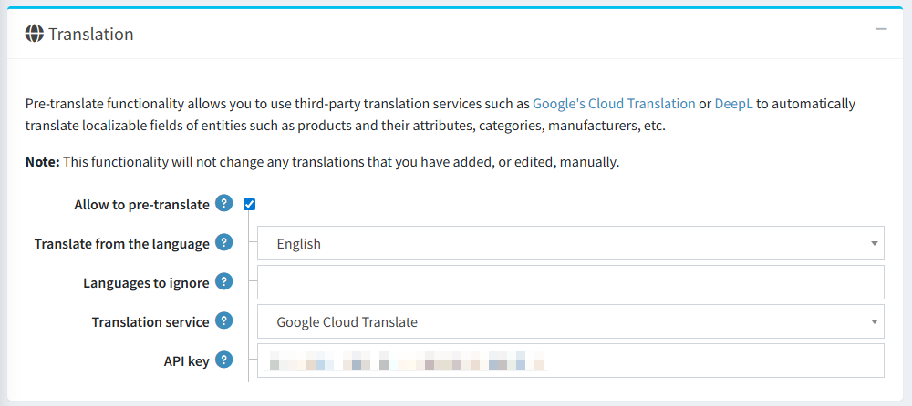
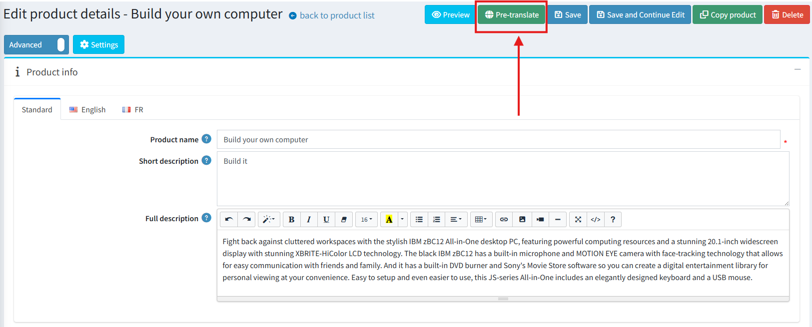
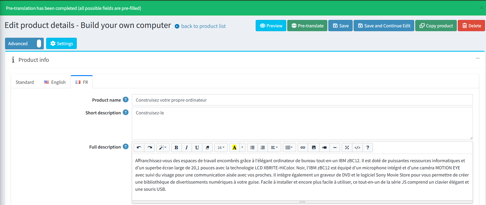
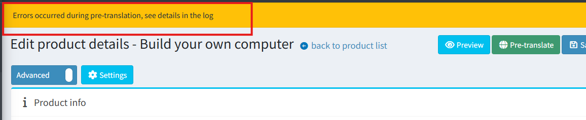

# 自動內容翻譯

## 概覽

此功能將自動翻譯能力整合至核心應用程式中，讓商店管理員能夠使用兩大主流機器翻譯平台：**DeepL** 與 **Google Translate**，將網站內容翻譯成多種語言。

目前，自動翻譯功能支援以下實體：

- 分類
- 製造商
- 商品
- 商品屬性
- 規格屬性

## 設定

此功能的所有設定皆位於 **一般設定** 頁面中的 **翻譯** 區塊。

關鍵設定選項包括：

- **允許預先翻譯 (Allow to pre-translate)**：用來開啟或關閉整個翻譯功能的總開關。
- **翻譯來源語言 (Translate from the language)**：在「標準」索引標籤中，您可以指定一個預設語言，作為所有翻譯的生成來源。
- **忽略的語言 (Languages to ignore)**：排除在自動翻譯流程之外的語言列表。
- **翻譯服務 (Translation service)**：用來選擇所要使用的翻譯服務（DeepL 或 Google Translate）的下拉式選單。
  - **DeepL**：需要 **Auth key**。
  - **Google Translate**：需要 **API key**。

> [!NOTE]
>
> 系統不會自動覆寫已手動儲存內容的欄位。

## 使用方式

一旦啟用該功能，使用方式非常直接。在所有支援實體的編輯頁面中，主要按鈕區塊會出現一個新按鈕。例如，在商品編輯頁面上，它看起來如下：

1. 點擊 **"Pre-translate"** 按鈕。
1. 若翻譯成功，將會出現確認訊息，其他語言的在地化欄位將會填入翻譯後的文字。

    

1. 若翻譯過程中發生錯誤，將會顯示警告訊息。

    

> [!WARNING]
>
> 請務必注意，此功能的作用為 **預先翻譯** 工具。翻譯後的內容會填入欄位中，但 **不會自動儲存**。這讓使用者擁有完全的控制權，能在手動儲存變更前，審閱、編輯或捨棄這些翻譯內容。