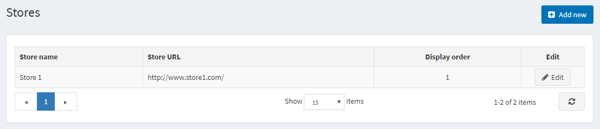
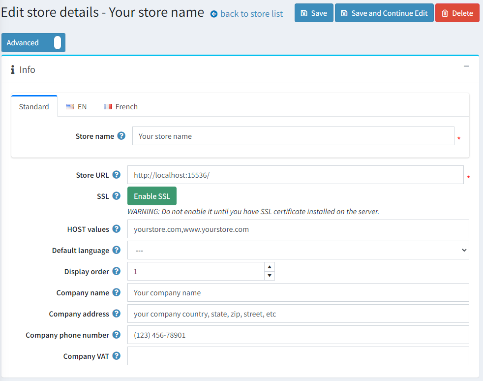

# 商店資訊

在預設的 nopCommerce 安裝中，系統會建立並需要設定一個商店，說明如下。
若要設定預設商店，請前往 **設定 → 商店**。

點擊預設商店旁邊的 **編輯** 按鈕進行設定。

## 資訊

請依照下列說明設定您的主要商店詳細資訊：

* 定義 **商店名稱**。
* 輸入您的 **商店 URL**。
* 如果您的商店已啟用 SSL 安全防護，請按下 **SSL** 按鈕。SSL (Secure Sockets Layer) 是用於在網站伺服器與瀏覽器之間建立加密連結的標準安全技術。此連結確保在伺服器與瀏覽器之間傳遞的所有資料皆保持隱私且完整。SSL 是數百萬個網站用來保護其與顧客之間線上交易的產業標準。

  > [!IMPORTANT]
  >
  > 請務必在您的伺服器安裝 SSL 憑證後，再按下此按鈕。否則，您將無法存取您的網站，並必須手動編輯資料庫中的對應紀錄（[Store] 資料表）。
  >
  > [!TIP]
  >
  > 閱讀下列章節以深入了解如何設定 SSL：[如何安裝與設定 SSL 憑證](xref:zh-Hant/getting-started/advanced-configuration/how-to-install-and-configure-ssl-certificates)。

* **HOST 值** 欄位是您商店可能使用的 HTTP_HOST 值列表（例如 `yourstore.com`、`www.yourstore.com`）。僅在您使用 [多商店解決方案](xref:zh-Hant/getting-started/advanced-configuration/multi-store) 時，才需要填寫此欄位來識別當前商店。此欄位能區分不同 URL 的請求，並判斷當前的商店。您也可以在 **系統 → 系統資訊** 中查看目前的 HTTP_HOST 值。
* 在 **預設語言** 欄位中，選擇您商店的預設語言。您也可以選擇不選，在此情況下，系統將會使用第一個找到的語言（顯示順序最小者）。
* 定義此商店的 **顯示順序**。1 代表列表最上方。
* 定義 **公司名稱**。
* 定義 **公司地址**。
* 設定您的 **公司電話號碼**。
* 在 **公司增值稅 (VAT)** 欄位中，輸入您公司的增值稅號碼（適用於歐盟地區）。

## SEO

商店擁有者可以為每家商店在地化主要的網站關鍵字、Meta 標題與 Meta 描述。

## 參閱

* [設定多商店](xref:zh-Hant/getting-started/advanced-configuration/multi-store)
* [國家/地區](xref:zh-Hant/getting-started/configure-shipping/advanced-configuration/countries-states)
* [語言](xref:zh-Hant/getting-started/advanced-configuration/localization)
* [安全性設定](xref:zh-Hant/getting-started/advanced-configuration/security-settings)
* [PDF 設定](xref:zh-Hant/getting-started/advanced-configuration/pdf-settings)
* [GDPR 設定](xref:zh-Hant/getting-started/advanced-configuration/gdpr-settings)