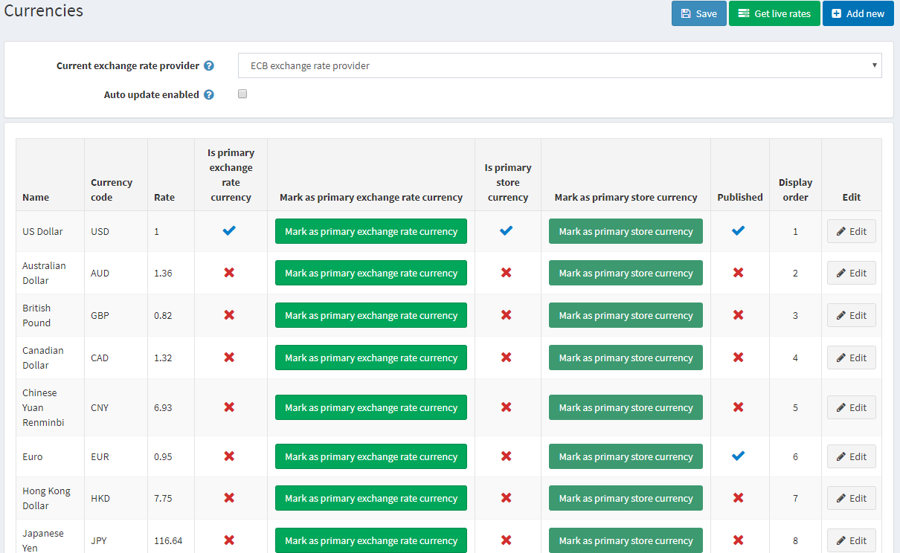
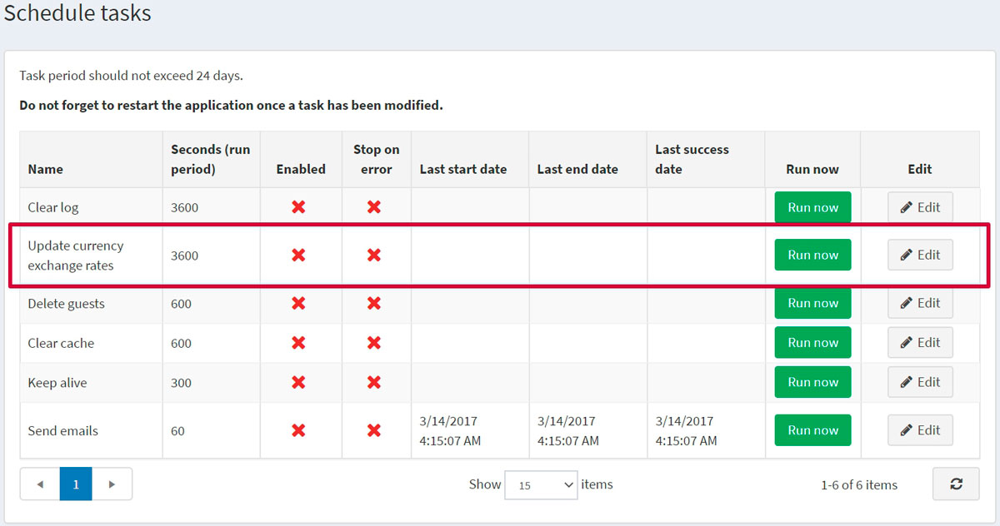
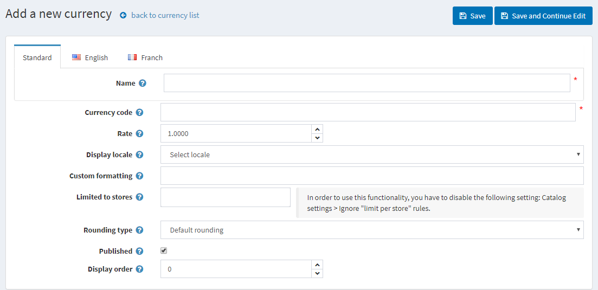
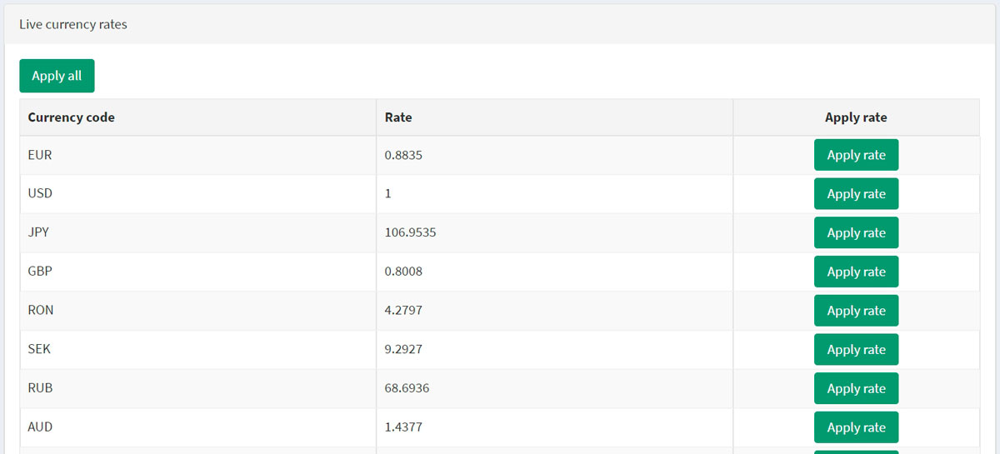

# 貨幣

在 nopCommerce 中，**僅使用一個主要商店貨幣**。主要商店貨幣是用於設定所有其他允許貨幣的基準貨幣。儘管 nopCommerce 允許使用多種貨幣來顯示您的商品價格，但主要貨幣會用於與線上付款閘道的交易。

如果您正在使用線上付款閘道（例如 PayPal），金額將會發送至該付款閘道，且金額會是您以主要商店貨幣輸入的價格。

主要商店貨幣僅供商店管理員使用。它用於設定商品價格，且不必與公開發布的貨幣相同。

如果您只有一種公開發布的貨幣，商店將不會顯示貨幣選擇器，也不會在價格旁顯示貨幣符號。如果發布了超過一種貨幣，所有價格都會標記目前選擇的貨幣。nopCommerce 建議移除任何不需要的貨幣。

nopCommerce 使用**匯率**來計算公開發布貨幣的金額。匯率是在新增或編輯貨幣時輸入的。或者，您可以使用**即時匯率**服務來計算金額，商品的價格將會乘以所提供的匯率。

匯率每天都會波動。因此，您可以視需要隨時編輯匯率以保持最新狀態。實際交易僅會以您商店的主要貨幣進行處理。對於信用卡交易，銀行通常會根據最新的貨幣價值自動進行換算。

若要定義貨幣設定，請前往 **設定 → 貨幣**。

從 **目前匯率提供者** 下拉清單中，選擇將用於獲取即時匯率的匯率提供者。

> [!NOTE]
>
> 預設情況下，nopCommerce 中僅提供一個匯率提供者 — ECB（歐洲中央銀行）。若要從 ECB 獲取即時匯率，您應該選擇 EUR 作為主要匯率貨幣。

選取 **啟用自動更新** 核取方塊，以啟用每小時接收自動更新匯率的功能。

點擊 **儲存**。

> [!NOTE]
>
> 預設情況下，所有匯率每小時更新一次。您可以在 **系統 → 排程工作** 中變更匯率更新設定；選擇 **更新貨幣匯率**。

## 新增幣別

點擊 **新增 (Add new)** 按鈕。

定義幣別設定：

* 幣別 **名稱 (Name)**。
* **幣別代碼 (Currency code)**。若要查看幣別代碼列表，請前往：<https://en.wikipedia.org/wiki/ISO_4217>
* 輸入相對於主要匯率的 **匯率 (Rate)**。
* 從 **顯示語系 (Display locale)** 下拉式選單中，選擇幣別數值的顯示語系。
* 輸入要套用於幣別數值的 **自訂格式 (Custom formatting)**。在此欄位中，您可以指定前台商店顯示幣別時使用的任何符號、小數位數等。
* 在 **限於商店 (Limited to stores)** 中，從下拉式選單選擇一個預先建立的商店。若不需要此功能，請將此欄位留空。
  > [!NOTE]
  >
  > 若要使用此功能，您必須停用下列設定：**目錄設定 (Catalog settings) → 忽略「各商店限制」規則 (全站) (Ignore "limit per store" rules (sitewide))**。閱讀更多關於多商店功能的資訊 [here](xref:zh-Hant/getting-started/advanced-configuration/multi-store)。

* 從 **捨入類型 (Rounding type)** 下拉式選單中，選擇下列其中一種捨入類型：
  * *預設捨入 (Default rounding)*
  * *以 0.05 為間隔無條件進位 (0.06 進位至 0.10)*
  * *以 0.05 為間隔無條件捨去 (0.06 捨去至 0.05)*
  * *以 0.10 為間隔無條件進位 (1.05 進位至 1.10)*
  * *以 0.10 為間隔無條件捨去 (1.05 捨去至 1.00)*
  * *以 0.50 為間隔捨入*
  * *以 1.00 為間隔捨入 (1.01–1.49 捨去至 1.00，1.50–1.99 進位至 2.00)*
  * *以 1.00 為間隔無條件進位 (1.01–1.99 進位至 2.00)*

* 勾選 **已發佈 (Published)** 核取方塊，使此幣別在您的商店中可見並供訪客選擇。nopCommerce 支援多幣別價格顯示。如果您有多個已發佈的幣別，顧客將能夠選擇他們想要的幣別。
* 在 **顯示順序 (Display order)** 欄位中，輸入此幣別的顯示順序。數值 1 代表列表的最上方。

點擊 **儲存 (Save)**。

## 取得即時匯率

點擊 *Currencies*（貨幣）視窗右上方的 **Get live rates**（取得即時匯率）按鈕。面板將會在頁面底部展開，如下所示：

點擊此處的 **Apply all**（全部套用），或是使用 **Apply rate**（套用匯率）按鈕手動為所有需要的貨幣套用新的匯率。

## 教學

* [在 nopCommerce 中管理貨幣](https://www.youtube.com/watch?v=2nzVxGyc5-M)