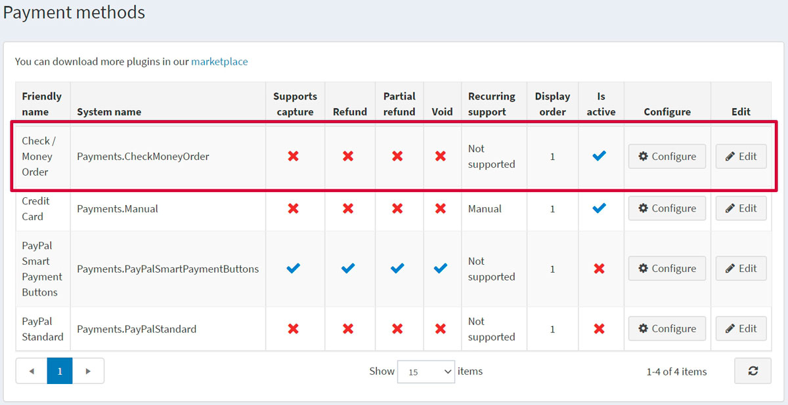
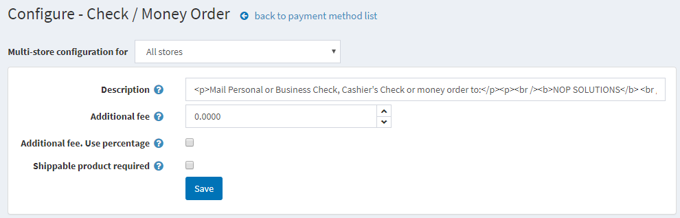
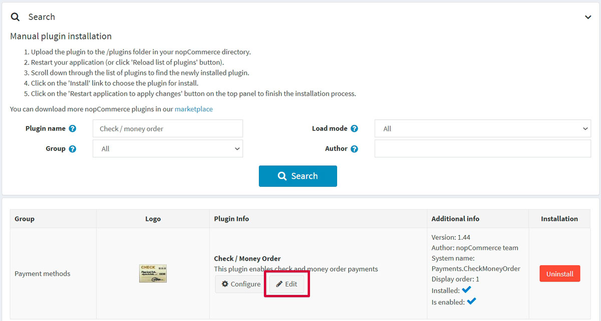
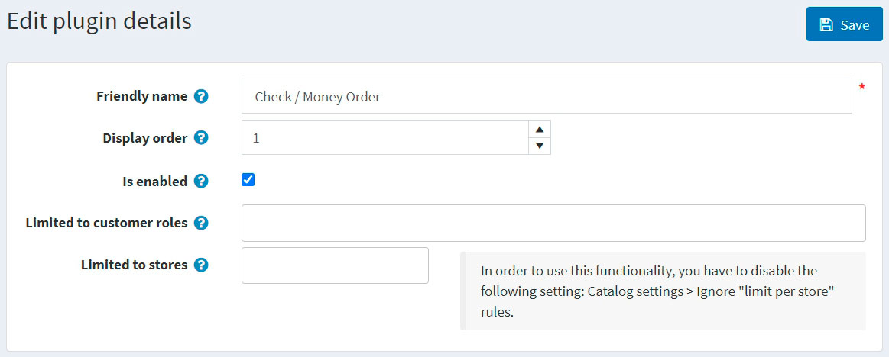

# 支票/匯票

支票或匯票通常由政府機構或大型企業使用。購物者不會直接透過您的網站付款，而是會要求您發送 **採購單 (Purchase order, PO)**，隨後他們會將款項寄回給您。大部分的訂單處理流程都在此軟體之外進行。

若要設定此付款方式，請前往 **設定 → 付款方式**。找到 **Check/money order (Payments.CheckMoneyOrder)** 付款方式列表：

## 啟用該方式、編輯名稱與顯示順序

您可以編輯付款方式名稱（這將顯示在前台網站供顧客查看）或其顯示順序。若要執行此操作，請點擊付款方式列表頁面中該外掛列的 **編輯 (Edit)** 按鈕。您可以輸入 **友善名稱 (Friendly name)** 與 **顯示順序 (Display order)**。在此列中，您也可以使用 **已啟用 (Is active)** 欄位來啟用或停用該外掛。點擊 **更新 (Update)** 按鈕，您的變更即會儲存。

## 設定付款方式

在 **設定 → 付款方式** 頁面上，找到 **Check/money order (Payments.CheckMoneyOrder)** 付款方式，然後點擊 **設定 (Configure)** 按鈕。系統將顯示如下的 *設定 - 支票/匯票* 視窗：

請依照下列方式設定付款方式：

* 在 **描述 (Description)** 欄位中，輸入在結帳期間顯示給顧客的資訊。
* 定義使用此方式的 **額外費用 (Additional fee)**。
* 在 **額外費用，使用百分比 (Additional fee. Use percentage)** 欄位中，定義是否要對訂單總額收取額外的百分比費用。若未啟用，則採用固定金額。
* **需要可運送商品 (Shippable product is required)** 欄位用於指示在結帳期間顯示此付款方式時，是否必須包含可運送的商品。

點擊 **儲存 (Save)**。

## 限制商店與顧客角色

您可以將任何付款方式限制在特定商店與顧客角色中使用。這意味著該方式僅適用於特定的商店或顧客角色。您可以在 *外掛列表* 頁面進行此設定。

1. 前往 **設定 → 本地外掛 (Local plugins)**。找到您想要限制的外掛。在我們的案例中，它是 **支票/匯票 (Check/money order)**。若要更快找到它，請使用頁面上方的 *搜尋* 面板，並透過 *付款方式* 選項，按 **外掛名稱 (Plugin name)** 或 **群組 (Group)** 進行搜尋。

   

1. 點擊 **編輯 (Edit)** 按鈕，系統將顯示如下的 *編輯外掛詳細資訊* 視窗：

   

1. 您可以設定下列限制：

   * 在 **限制顧客角色 (Limited to customer roles)** 欄位中，選擇一個或多個可以啟用此特定外掛的顧客角色，例如管理員、供應商或訪客。如果您不需要此選項，請將此欄位留空。

      > [!Important]
      > 為了使用此功能，您必須停用下列設定：**目錄設定 (Catalog settings) → 忽略 ACL 規則 (全站) (Ignore ACL rules (sitewide))**。閱讀更多關於存取控制清單 (ACL) 的資訊 [here](xref:zh-Hant/running-your-store/customer-management/access-control-list)。

   * 使用 **限制商店 (Limited to stores)** 選項將此外掛限制在特定商店。如果您有多個商店，請從列表中選擇一個或多個。如果您不使用此選項，請將此欄位留空。

      > [!Important]
      > 為了使用此功能，您必須停用下列設定：**目錄設定 (Catalog settings) → 忽略「限制商店」規則 (全站) (Ignore "limit per store" rules (sitewide))**。閱讀更多關於多商店功能的資訊 [here](xref:zh-Hant/getting-started/advanced-configuration/multi-store)。

 點擊 **儲存 (Save)**。