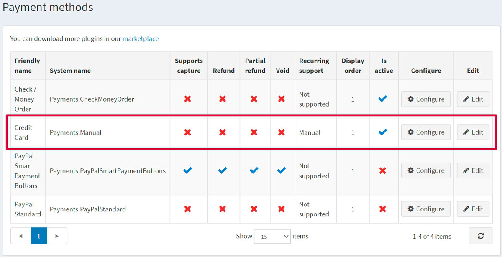
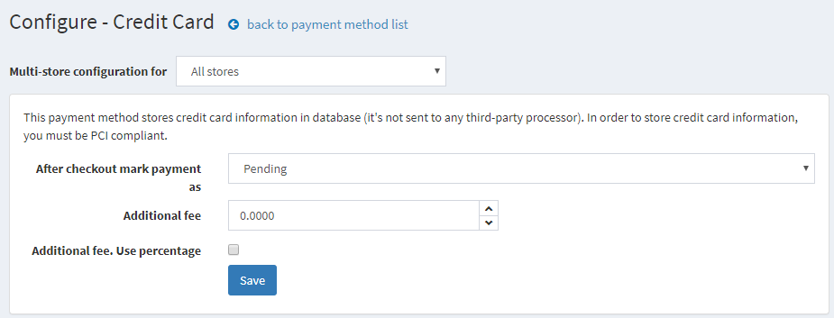
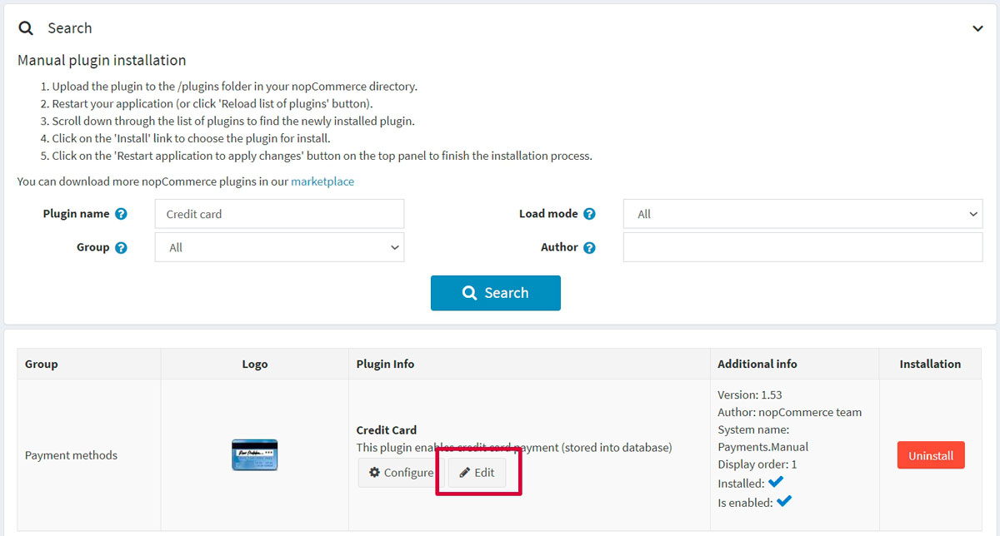
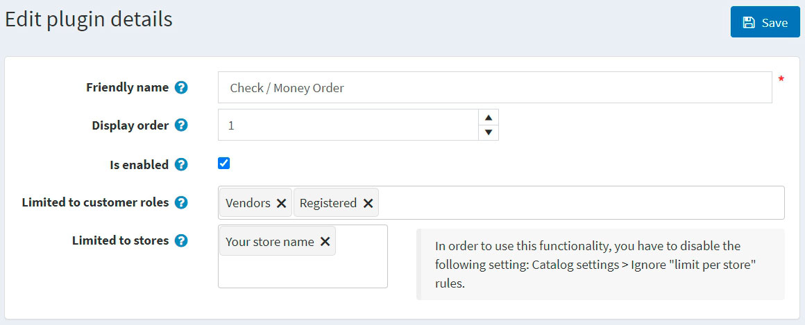

# 信用卡（手動處理）

這是一種特殊的付款外掛，它允許所有的訂單能在網站上成功建立，但它「不會」真正地向顧客收款或呼叫任何即時的支付閘道。如果您想要執行下列任一作業，建議使用此付款方式：

* 離線處理所有訂單
* 透過其他後勤系統手動處理訂單
* 在網站正式上線前進行端對端測試

若要設定此付款方式，請前往 **設定 → 付款方式**。接著在付款方式列表中找到 **信用卡 (Payments.Manual)** 付款方式：

## 啟用付款方式、編輯名稱與顯示順序

您可以編輯將顯示在前台網站給顧客看的付款方式名稱，或是調整其顯示順序。若要這麼做，請點擊付款方式列表頁面中該外掛列的 **編輯** 按鈕。您可以輸入 **友好名稱 (Friendly name)** 與 **顯示順序 (Display order)**。在此列中，您也可以透過 **已啟用 (Is active)** 欄位來啟用或停用此外掛。點擊 **更新** 按鈕，您的變更將會被儲存。

## 設定付款方式

在 **設定 → 付款方式** 頁面中，找到 **信用卡 (Payments.Manual)** 付款方式並點擊 **設定** 按鈕。屆時將顯示如下的 *設定 - 信用卡* 視窗：

請依照下列方式設定付款方式：

* 在 **結帳後將付款標記為** 欄位中，指定交易模式。
* 定義使用此方式的 **額外費用**。
* 在 **額外費用為百分比** 欄位中，定義是否要對訂單總額收取額外的百分比費用。若未啟用，則會使用固定金額。

點擊 **儲存**。

## 限制商店與顧客角色

您可以將任何付款方式限制在特定的商店與顧客角色。這意味著該方式將僅提供給特定的商店或顧客角色使用。您可以從 *外掛列表* 頁面進行此設定。

1. 前往 **設定 → 本地外掛**。找到您想要設定限制的外掛。在我們的案例中，它是 **信用卡**。若要更快找到它，請使用頁面頂部的 *搜尋* 面板，並使用 *付款方式* 選項依據 **外掛名稱** 或 **群組** 進行搜尋。

   

1. 點擊 **編輯** 按鈕，將顯示如下的 *編輯外掛詳細資料* 視窗：

   

1. 您可以設定下列限制：

   * 在 **限制顧客角色** 欄位中，選擇一個或多個能夠使用此外掛的顧客角色（例如：管理員、供應商、訪客）。如果您不需要此選項，只需將此欄位留空即可。

     > [!Important]
     > 為了使用此功能，您必須停用下列設定：**目錄設定 → 忽略 ACL 規則 (全站)**。閱讀更多關於存取控制清單 (ACL) 的資訊 [here](xref:zh-Hant/running-your-store/customer-management/access-control-list)。

   * 使用 **限制商店** 選項將此外掛限制在特定商店。如果您有多家商店，請從列表中選擇一個或多個。如果您不使用此選項，只需將此欄位留空即可。

     > [!Important]
     > 為了使用此功能，您必須停用下列設定：**目錄設定 → 忽略「各商店限制」規則 (全站)**。閱讀更多關於多商店功能的資訊 [here](xref:zh-Hant/getting-started/advanced-configuration/multi-store)。

 點擊 **儲存**。

## 教學課程

* [設定信用卡（手動處理）付款方式](https://www.youtube.com/watch?v=dN2q27dKvUU)