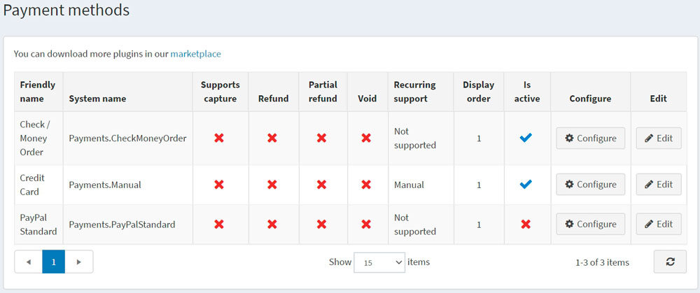

# 付款方式

付款方式是指顧客支付訂單款項的途徑。nopCommerce 同時支援「線上」與「離線」交易。對於線上付款方式，nopCommerce 與第三方支付閘道整合，當顧客完成訂單時，其信用卡資訊會自動透過閘道傳送（進行授權，或授權並請款）。您可以同時啟用多種付款方式，顧客在結帳時可自行選擇付款途徑。

若要定義付款方式，請前往 **設定 → 付款方式**。

> [!TIP]
>
> nopCommerce 預設提供了幾種付款方式，您也可以在 nopCommerce [市集](https://www.nopcommerce.com/marketplace) 中找到更多付款外掛。

關於付款方式的開發細節，請參閱 [說明文件](xref:zh-Hant/developer/plugins/payment-method)。

若要啟用付款方式，請點擊目標方式旁的 **編輯**，勾選 **啟用 (Is active)** 核取方塊，然後點擊 **更新**。**啟用** 選項將從 *false* 變更為 *true*。

不同的付款方式支援不同的選項。付款方式可能會支援以下 **4 種付款功能**（視具體方式而定）：

* **支援請款 (Supports capture)**：表示該方式是否允許在款項扣除後，處理資金轉帳作業。
* **退款 (Refund)**：表示該方式是否允許在款項扣除並完成請款後，進行全額退款。
* **部分退款 (Partial refund)**：表示該方式是否允許在款項扣除並完成請款後，進行部分退款。
* **撤銷 (Void)**：表示該方式是否允許在款項扣除前（即付款狀態為待處理時）進行撤銷退款。
* **支援週期性付款 (Recurring support)**：表示該方式是否允許週期性付款。

點擊付款方式旁的 **設定** 即可進行相關調整。

## 參閱

* [PayPal Commerce](xref:zh-Hant/getting-started/configure-payments/payment-methods/paypal-commerce)
* [PayPal Zettle](xref:zh-Hant/getting-started/configure-payments/payment-methods/paypal-zettle)
* [PayPal Standard](xref:zh-Hant/getting-started/configure-payments/payment-methods/paypal-standard)
* [PayPal Smart Payment Buttons](xref:zh-Hant/getting-started/configure-payments/payment-methods/paypal-smart-payment-buttons)
* [支票/匯票](xref:zh-Hant/getting-started/configure-payments/payment-methods/check-money-order)
* [信用卡（手動處理）](xref:zh-Hant/getting-started/configure-payments/payment-methods/credit-card-manual-processing)