> [!NOTE]
>
> 此份說明文件描述的是該外掛的舊版本（4.70.10 之前）。您可以在 [此頁面](xref:zh-Hant/getting-started/configure-payments/payment-methods/paypal-commerce) 找到最新的說明文件。

# PayPal Commerce

`PayPal Commerce` 為您的買家提供了更簡化且安全的結帳體驗。PayPal 會自動智慧地呈現最合適的付款類型給您的顧客，讓他們能更輕鬆地使用 Pay with Venmo、PayPal Credit、信用卡付款、iDEAL、Bancontact、Sofort 以及其他付款方式來完成購物。

## 設定付款方式

若要設定 `PayPal Commerce` 外掛，請前往 **設定 → 付款方式**。接著在付款方式列表中找到 **PayPal Commerce** 付款方式：

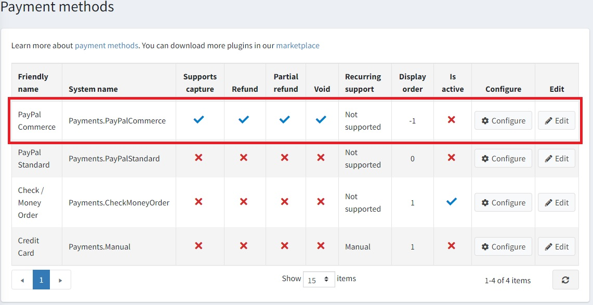

請依照下列步驟來設定 `PayPal Commerce`：

### 1. 啟用付款方式

若要執行此操作，請在付款方式列表頁面中，點擊該外掛所在列的 **Edit** 按鈕。勾選 **Is active** 核取方塊來啟用此外掛。接著點擊 **Update** 按鈕，您的變更將會被儲存。

### 2. 建立 PayPal 帳號

如果您已經擁有 PayPal 帳號，請直接前往 [下一節](#3-set-up-the-paypal-developer-dashboard)。如果您還沒有帳號，請註冊一個商業帳號。您可以透過兩種方式完成：在 PayPal 官網註冊，或直接從外掛設定頁面註冊。我們簡單說明這兩種方式：

#### 在 PayPal 官網註冊帳號

1. 在 [PayPal](https://www.paypal.com/us/webapps/mpp/referral/paypal-business-account2?partner_id=9JJPJNNPQ7PZ8) 網站註冊一個商業帳號。只需點擊該頁面的 **Sign up** 按鈕即可：

    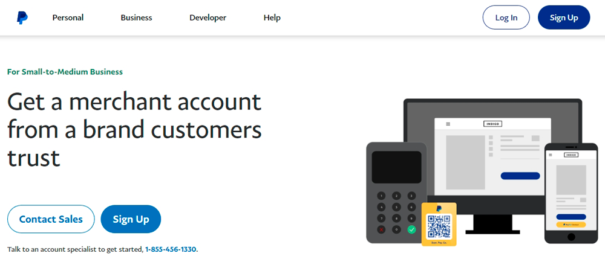
1. 接著填寫您個人及企業的相關資訊：

    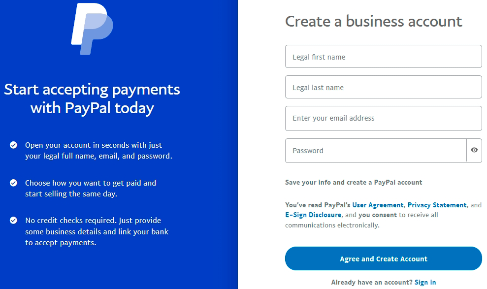

> [!NOTE]
>
> 如果您已經擁有帳號，系統將會引導您進入授權頁面。

#### 從外掛設定頁面註冊帳號

1. 在管理後台開啟 PayPal Commerce 設定頁面。您會看到如下表單：

    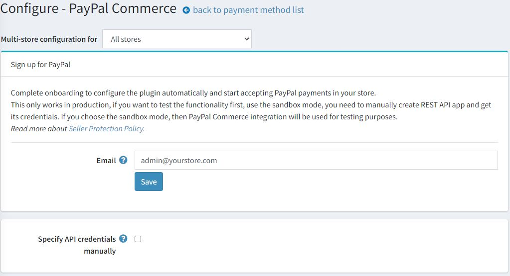

1. 輸入您的電子郵件地址，並點擊 **Save** 按鈕讓 PayPal 進行檢查。

1. 若一切順利，您會看到如下的綠色通知，以及一個新增的 **Sign up for PayPal** 按鈕：

    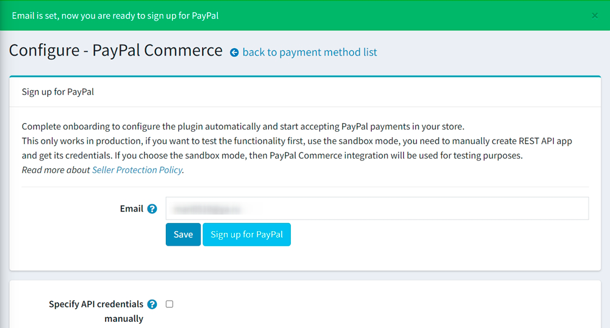

1. 點擊此按鈕後，您會看到一個彈出視窗，讓您填寫資料並註冊帳號：

    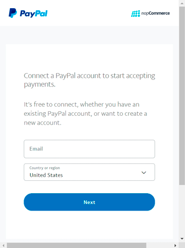

    您需要依照步驟填寫所有必要資料。最後一個步驟會要求您確認電子郵件以啟用您的帳號。

### 3. 設定 Paypal 開發者儀表板

1. 使用您的 PayPal 帳號憑證登入 [開發者儀表板](https://developer.paypal.com/developer/applications?partner_id=9JJPJNNPQ7PZ8)。

1. 在 **My Apps & Credentials** 中，使用切換開關在正式環境（live）與沙盒測試（sandbox）應用程式之間切換。
    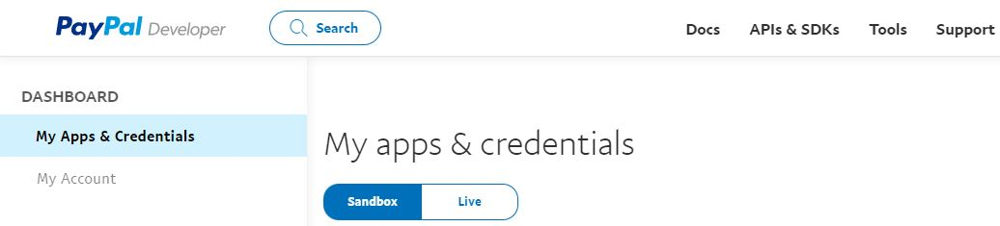
  
1. 前往 *REST API apps* 區段並點擊 **Create App**。
    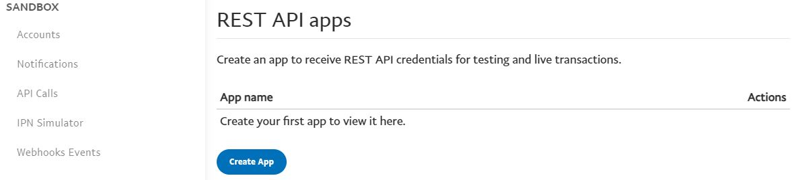

1. 輸入應用程式名稱並點擊 **Create App**。應用程式詳細資訊頁面將會開啟，並顯示您的憑證。

1. 複製並儲存您應用程式的 **Client ID** 與 **Secret**。

1. 檢查您的應用程式詳細資訊，若有任何變更，請務必儲存應用程式。

### 4. 在 nopCommerce 中設定付款方式

1. 在 **設定 → 付款方式** 頁面中找到 **PayPal Commerce** 付款方式，並點擊 **設定**。隨後會顯示 *設定 - PayPal Commerce* 頁面，如下所示：
    

1. 在 *設定 - PayPal Commerce* 頁面上定義下列設定：
    * **手動指定 API 憑證 (Specify API credentials manually)** - 決定您是否需要手動設定憑證。如果您已經建立應用程式，或者想要使用沙盒模式 (sandbox mode)，請選擇此選項。否則，外掛將會自動進行設定，您在完成 PayPal 註冊後，即可在您的商店中開始接受 PayPal 付款。

        

    * **使用沙盒 (Use sandbox)** - 如果您想要先測試此付款方式，請勾選此項。
    * 輸入您在前幾個步驟中儲存的 **Client ID**。
    * 輸入您在前幾個步驟中儲存的 **Secret**。
    * 選擇 **付款類型 (Payment type)**，可選擇立即請款，或在訂單建立後授權訂單款項。

1. 接著前往 *PayPal Prominently* 面板：
    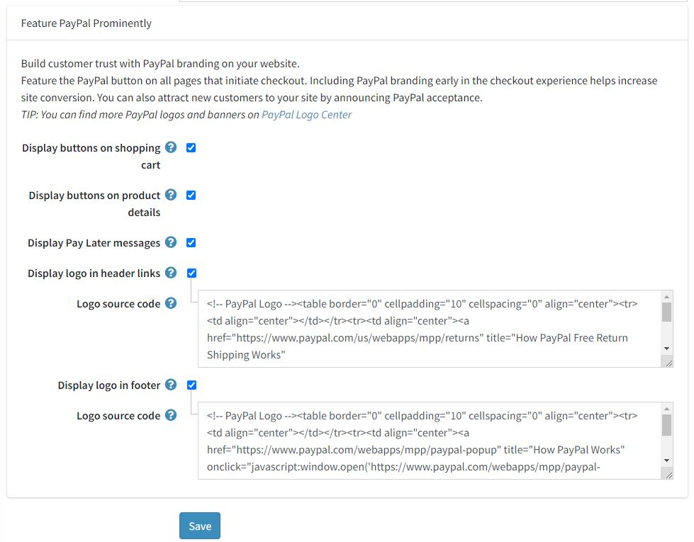
  
    在此面板上，定義顯示設定：

      * 勾選 **在購物車顯示按鈕 (Display buttons on shopping cart)** 核取方塊，可在購物車頁面上顯示 PayPal 按鈕，以取代預設的結帳按鈕。

      * 勾選 **在商品詳細資訊顯示按鈕 (Display buttons on product details)**，可在商品詳細資訊頁面上顯示 PayPal 按鈕；點擊這些按鈕的行為與預設的「加入購物車」按鈕相同。

      * 勾選 **顯示「稍後付款」訊息 (Display Pay Later messages)** 核取方塊，以善用您網站上的「稍後付款」訊息功能。該訊息會顯示在商品頁面與結帳頁面上，顯示顧客分四期付款的金額。

        

      * 勾選 **在頁首連結顯示標誌 (Display logo in header links)** 核取方塊，可在頁首連結中顯示 PayPal 標誌。這些標誌與橫幅是讓買家知道您選擇使用 PayPal 安全處理付款的絕佳方式。
        * 若勾選上述核取方塊，系統會顯示 **標誌原始碼 (Logo source code)** 欄位。在此欄位中輸入標誌的原始碼。您可以在 PayPal Logo Center 找到更多標誌與橫幅。您也可以修改程式碼，使其能妥善契合您的佈景主題與網站風格。

      * 勾選 **在頁尾顯示標誌 (Display logo in footer)** 核取方塊，可在頁尾顯示 PayPal 標誌。這些標誌與橫幅是讓買家知道您選擇使用 PayPal 安全處理付款的絕佳方式。
        * 若勾選上述核取方塊，系統會顯示 **標誌原始碼 (Logo source code)** 欄位。在此欄位中輸入標誌的原始碼。您可以在 PayPal Logo Center 找到更多標誌與橫幅。您也可以修改程式碼，使其能妥善契合您的佈景主題與網站風格。

點擊 **儲存 (Save)** 以儲存外掛設定。

## 限制商店與顧客角色

您可以將任何付款方式限制在特定的商店與顧客角色。這代表該方式將僅對特定的商店或顧客角色開放。您可以從 *外掛列表* 頁面進行此設定。

1. 前往 **設定 → 本地外掛**。找到您想要限制的外掛。以我們的案例來說，是 **PayPal Commerce**。若要更快找到它，請使用頁面上方的 *搜尋* 面板，並透過 *付款方式* 選項依 **外掛名稱** 或 **群組** 進行搜尋。

    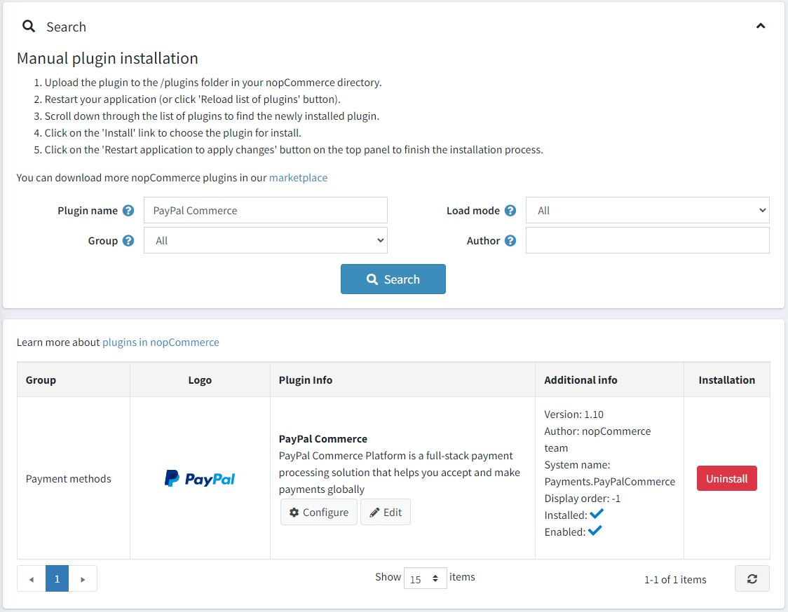

1. 點擊 **編輯** 按鈕，*編輯外掛詳情* 視窗將顯示如下：

    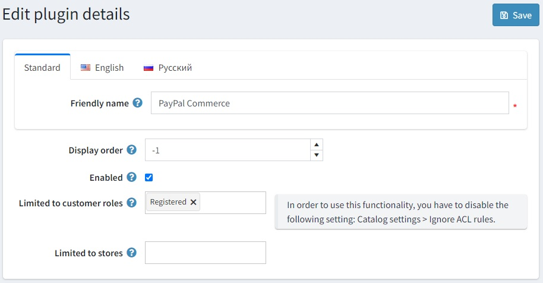

1. 您可以設定以下限制：

    * 在 **限制顧客角色** 欄位中，選擇一個或多個顧客角色（例如：管理員、供應商、訪客），這些角色將能夠使用此外掛。如果您不需要此選項，只需將此欄位留空即可。

        > [!Important]
        > 若要使用此功能，您必須停用下列設定：**目錄設定 → 忽略 ACL 規則 (全站)**。閱讀更多關於存取控制列表的資訊 [here](xref:zh-Hant/running-your-store/customer-management/access-control-list)。

    * 使用 **限制商店** 選項將此外掛限制在特定商店。如果您有多個商店，請從列表中選擇一個或多個。如果您不需要此選項，只需將此欄位留空即可。

        > [!Important]
        > 若要使用此功能，您必須停用下列設定：**目錄設定 → 忽略「各商店限制」規則 (全站)**。閱讀更多關於多商店功能的資訊 [here](xref:zh-Hant/getting-started/advanced-configuration/multi-store)。

    點擊 **儲存**。