# PayPal Commerce

`PayPal Commerce` 為您的買家提供簡化且安全的結帳體驗。PayPal 會自動向您的顧客顯示最相關的付款方式，讓他們能更輕鬆地使用信用卡付款、Apple Pay、Google Pay、PayPal Credit、Venmo、iDEAL、Bancontact 以及其他付款方式來完成購買。

## 設定付款方式

若要設定 `PayPal Commerce` 外掛，請前往 **設定 → 付款方式**。接著在此頁面找到 **PayPal** 付款方式。這並不困難，因為它是我們推薦的付款方式。

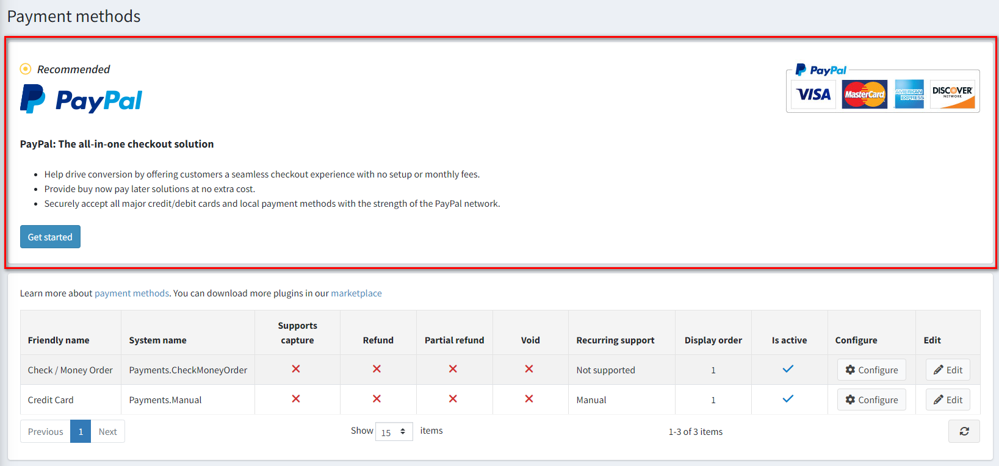

此外，您也可以從導覽選單存取外掛設定。

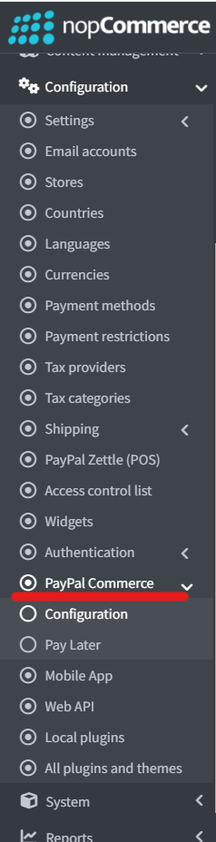

請依照下列步驟設定 `PayPal Commerce`：

### 1. 連接 PayPal 帳戶

無論您是否已經擁有 PayPal 商業帳戶、僅有個人帳戶，或是尚未註冊，連接的步驟都是相同的：

1. 在管理後台開啟 PayPal Commerce 設定頁面。您將會看到以下表單：

    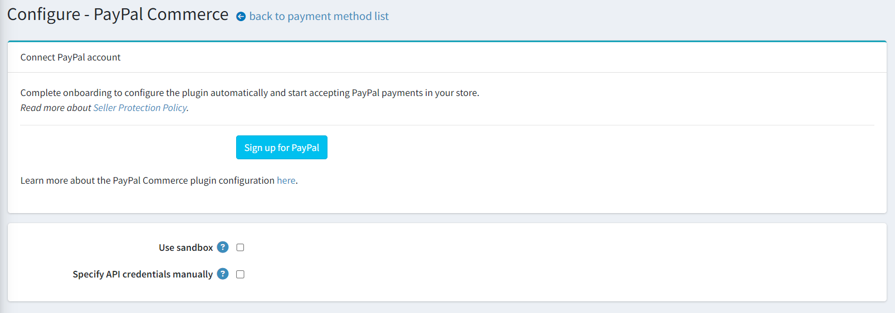

1. 選擇您想要連接的帳戶類型：正式環境（production）或沙盒測試環境（sandbox）。如果您想先測試此外掛，請啟用 **Use sandbox** 設定。

1. 點擊 **Sign up for PayPal** 按鈕，您將會看到下方的彈出視窗，讓您填寫資料並連接帳戶：

    

    您需要完成幾個步驟以填寫所有必要細節。具體的填寫內容會根據您是建立新帳戶、連接現有帳戶，還是將個人帳戶升級為商業帳戶而有所不同。

1. 當您完成作業並通過 PayPal 付款核准後，請回到外掛設定頁面並重新整理。您將會看到以下表單：

    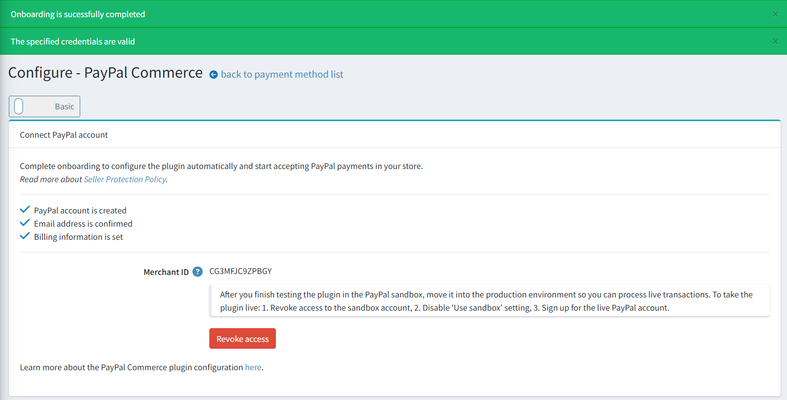

   在此您將會看到連接成功的通知。若出現任何警告或錯誤，請前往 **後台 → 系統 → 紀錄** 查看更多詳細資訊。

   同時也會顯示帳戶連接程序的狀態；若有任何步驟尚未完成，請登入您的 PayPal 個人帳戶以完成該步驟。

   如果您連接的是沙盒帳戶，系統也會提醒您在完成測試後需建立正式環境帳戶。

1. 如果您在 PayPal 帳戶中已經建立了 REST API App 並希望繼續使用，請勾選 **Specify API credentials manually** 核取方塊，並依照下列方式在下方欄位指定您的憑證：

    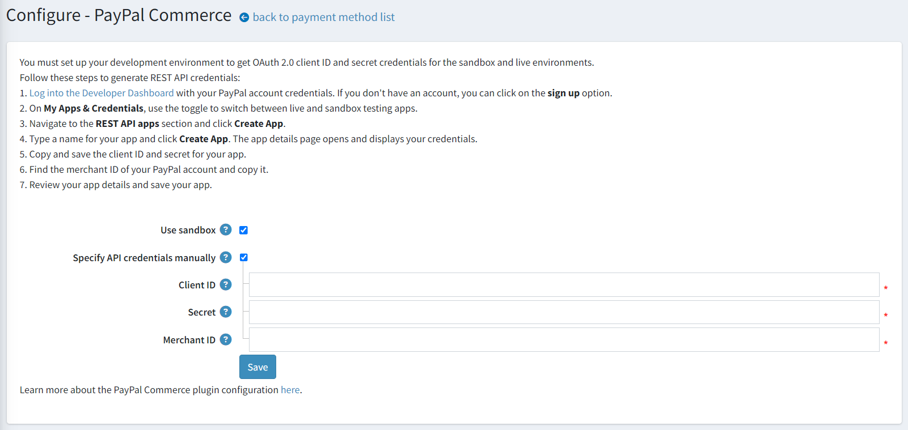

### 2. 設定外掛

1. 在 **後台 → 設定 → 付款方式** 頁面中找到 **PayPal Commerce** 付款方式並點擊 **設定**，您將會看到以下設定區塊：

    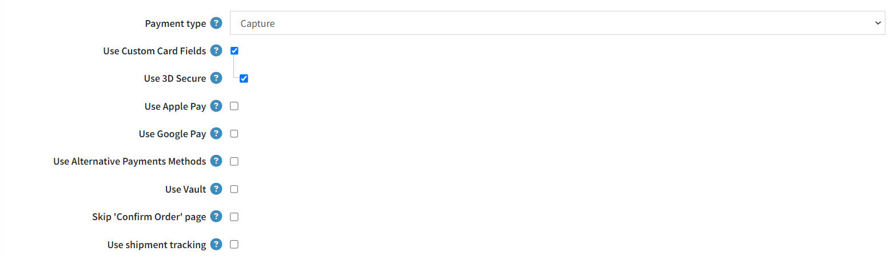

    * 選擇 **付款類型**，設定為立即請款，或在訂單建立後進行請款授權。
    * 勾選 **使用自訂卡片欄位** 以在您的商店中啟用進階信用卡與簽帳金融卡付款。這是一個符合 PCI 標準的解決方案，讓顧客能直接在您的商店進行信用卡與簽帳金融卡付款，無需重新導向至第三方網站。
    * 勾選 **使用 Apple Pay** 以在您的商店中啟用 Apple Pay。在沙盒或正式環境開始使用之前，請驗證您環境中將顯示 Apple Pay 按鈕的任何網域名稱。Apple Pay 交易僅能在註冊給您的網域與網站上運作。

        1. [下載](https://paypalobjects.com/devdoc/apple-pay/well-known/apple-developer-merchantid-domain-association) 您環境的網域關聯檔案。
        1. 在您想要註冊的每個網域與子網域的網站上，將該檔案放置於 */.well-known/apple-developer-merchantid-domain-association* 路徑下。
        1. 登入 PayPal 商務帳戶，前往 **付款方式**，在 **Apple Pay** 區塊中選擇 **管理** 連結，並在該處 **新增網域**。

    * 勾選 **使用 Google Pay** 以在您的商店中啟用 Google Pay。
    * 勾選 **使用替代付款方式** 以在您的商店中啟用替代付款方式。透過替代付款方式，全球各地的顧客皆能使用其銀行帳戶、電子錢包及其他在地付款方式進行支付。例如，荷蘭的顧客可能傾向使用 iDEAL（當地超過半數消費者用於線上購物的支付方式），而同一網站上的比利時顧客則可能想使用當地的熱門付款方式 Bancontact。此外掛預設會自動在單一位置呈現所有符合資格的按鈕。
    * 勾選 **使用 Vault** 以啟用 PayPal Vault。這能讓系統安全地儲存顧客的付款資訊，並在後續交易中使用，顧客無需再次輸入付款明細。
    * 勾選 **跳過「確認訂單」頁面** 以在結帳過程中跳過此步驟；如此一來，在 PayPal 網站上核准付款後，顧客將被直接重新導向至「訂單完成」頁面。
    * 勾選 **使用貨運追蹤** 以使用包裹追蹤功能。若要自動將貨運狀態與 PayPal 同步，請在管理後台建立或編輯貨運資訊時，指定追蹤號碼與貨運公司：

      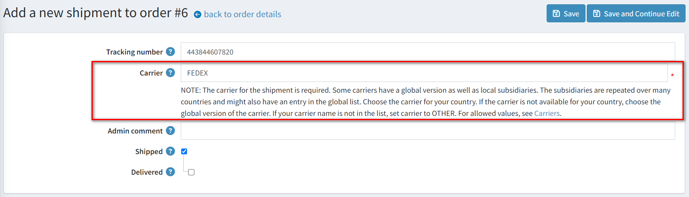

1. 接著前往 *PayPal 顯著功能* 面板：

    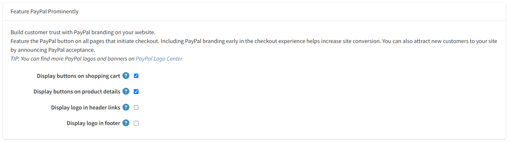
  
    在此面板上，定義顯示設定：

      * 勾選 **在購物車顯示按鈕** 核取方塊，除了預設的結帳按鈕外，亦在購物車頁面上顯示 PayPal 按鈕。

      * 勾選 **在商品詳細頁顯示按鈕** 核取方塊，以在商品詳細頁面上顯示 PayPal 按鈕，讓買家無需執行完整的結帳流程即可完成購買。

      * 勾選 **在頁首連結顯示標誌** 核取方塊，以在頁首連結中顯示 PayPal 標誌。這些標誌與橫幅是讓買家知道您選擇 PayPal 來安全處理付款的絕佳方式。
        * 若已勾選前一個核取方塊，則會顯示 **標誌原始碼** 欄位。在此欄位中，輸入該標誌的原始碼。您可以在 PayPal 標誌中心 (PayPal Logo Center) 找到更多標誌與橫幅。您也可以修改程式碼，使其能妥善契合您的佈景主題與網站風格。

      * 勾選 **在頁尾顯示標誌** 核取方塊，以在頁尾顯示 PayPal 標誌。這些標誌與橫幅是讓買家知道您選擇 PayPal 來安全處理付款的絕佳方式。
        * 若已勾選前一個核取方塊，則會顯示 **標誌原始碼** 欄位。在此欄位中，輸入該標誌的原始碼。您可以在 PayPal 標誌中心找到更多標誌與橫幅。您也可以修改程式碼，使其能妥善契合您的佈景主題與網站風格。

1. 點擊 **儲存** 以儲存外掛設定。

> [!NOTE]
>
> 您不需要啟用此外掛，它在安裝後會立即啟用。如果基於某些原因您不打算在商店中使用它，可以在 **設定 → 本機外掛** 頁面中將其停用。

### 3. 設定 PayPal Pay Later 訊息

PayPal 提供短期、無息付款以及其他特殊融資選項，讓買家可以「先買後付」，同時賣家能預先收到款項。Pay Later 優惠會根據國家/地區而有所不同。透過 Pay Later 優惠，賣家能賦予顧客更強大的購買力，並讓他們能靈活地分期支付購物費用。
如需有關 Pay Later 的詳細資訊，請參閱 [先買後付](https://www.paypal.com/digital-wallet/ways-to-pay/buy-now-pay-later)。

1. 點擊 **設定 → PayPal Commerce** 選單項目中的 **Pay Later** 連結，您將會看到以下設定介面：

    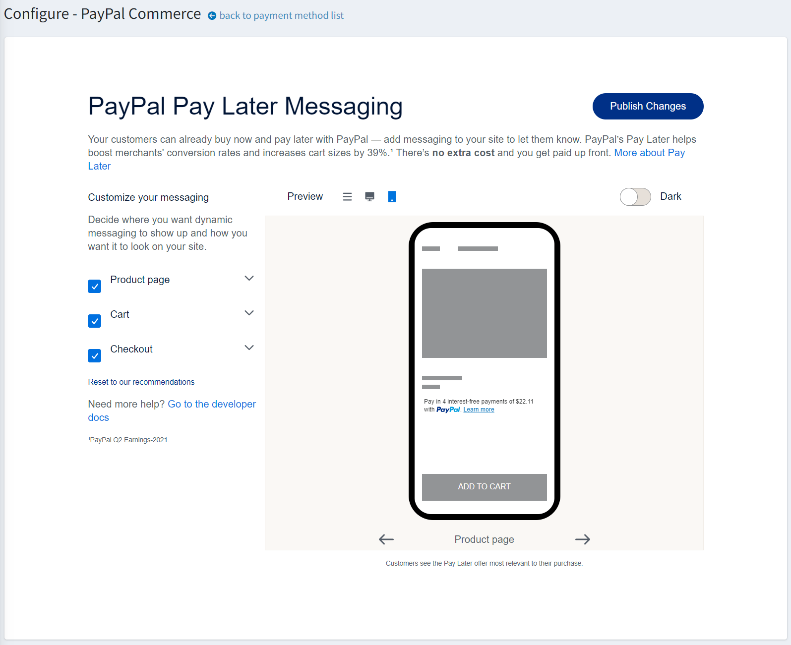

    您可以在此自訂您的 Pay Later 訊息。

1. 點擊 **Publish changes** 以儲存設定。

## 限制商店與顧客角色

您可以將任何付款方式限制在特定的商店與顧客角色。這意味著該付款方式將僅適用於特定的商店或顧客角色。您可以從*外掛清單*頁面進行此設定。

1. 前往 **設定 → 本地外掛**。找到您想要限制的外掛。以我們的範例來說，是 **PayPal Commerce**。為了更快速找到它，請使用頁面上方的*搜尋*面板，並選擇*付款方式*選項來搜尋 **外掛名稱** 或 **群組**。

    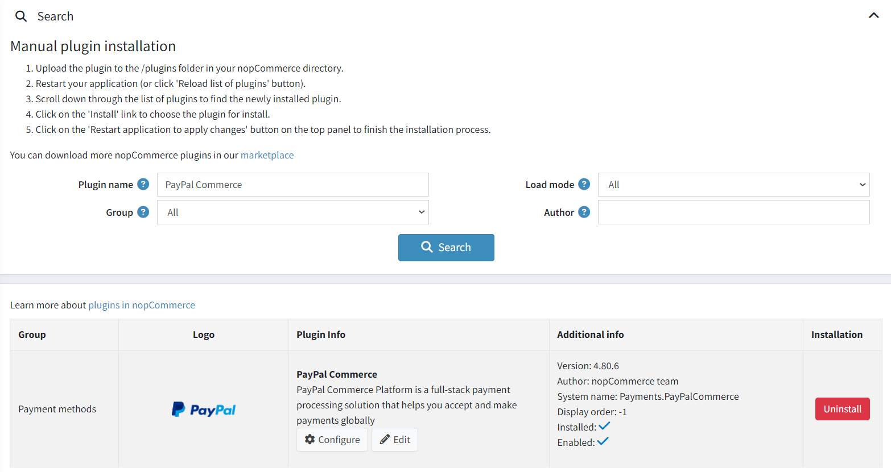

1. 點擊 **編輯** 按鈕，*編輯外掛詳情*視窗將顯示如下：

    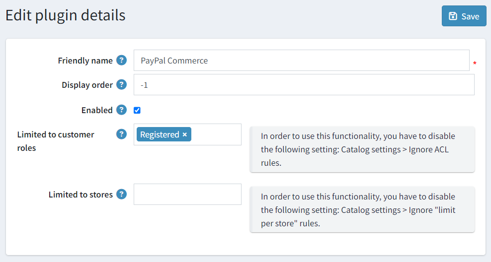

1. 您可以設定以下限制：

    * 在 **限制顧客角色** 欄位中，選擇一個或多個可以使用此外掛的顧客角色，例如系統管理員、供應商、訪客等。如果您不需要此選項，只需將此欄位留空即可。

        > [!Important]
        > 為了使用此功能，您必須停用以下設定：**目錄設定 → 忽略 ACL 規則 (全站)**。閱讀更多關於存取控制清單 (ACL) 的資訊 [here](xref:zh-Hant/running-your-store/customer-management/access-control-list)。

    * 使用 **限制商店** 選項將此外掛限制在特定商店。如果您有多個商店，請從清單中選擇一個或多個。如果您不使用此選項，只需將此欄位留空即可。

        > [!Important]
        > 為了使用此功能，您必須停用以下設定：**目錄設定 → 忽略「限制每間商店」規則 (全站)**。閱讀更多關於多商店功能的資訊 [here](xref:zh-Hant/getting-started/advanced-configuration/multi-store)。

1. 點擊 **儲存**。