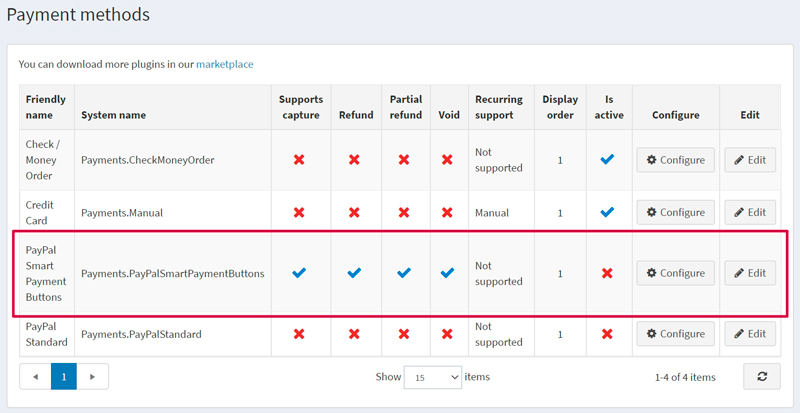
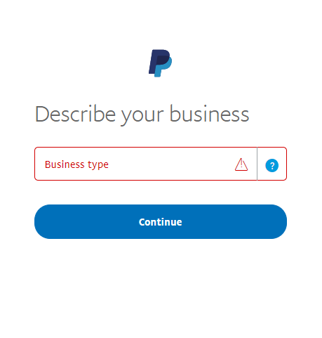
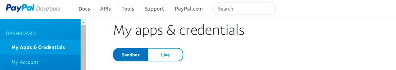
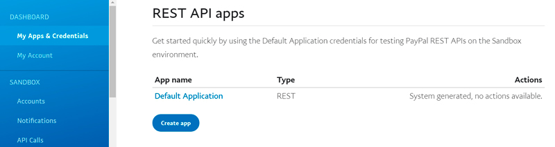
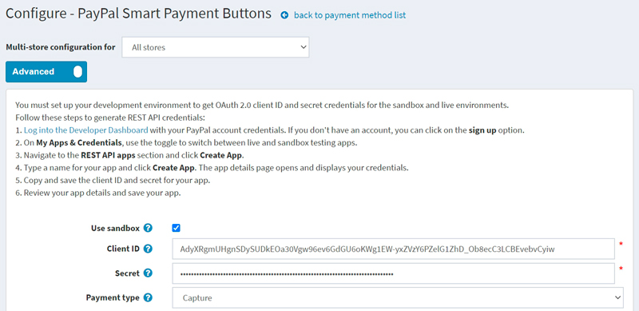
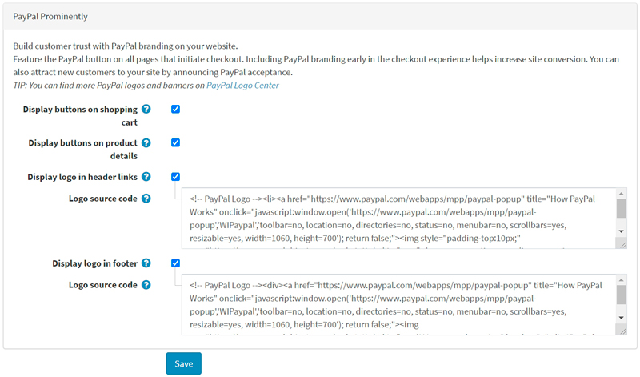
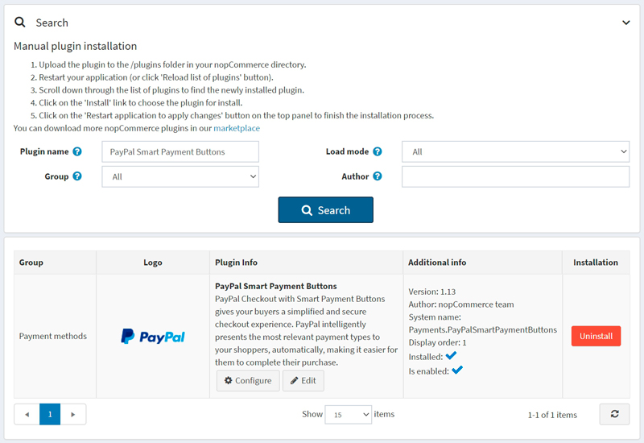
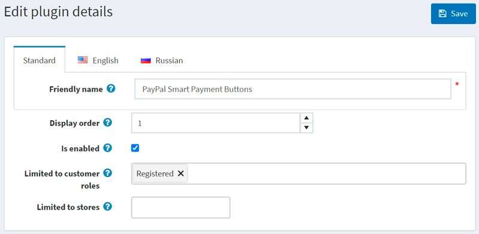

# PayPal Smart Payment Buttons

> [!Important]
>
> 此此外掛目前已棄用，並已由 [**PayPal Commerce**](xref:zh-Hant/getting-started/configure-payments/payment-methods/paypal-commerce) 外掛所取代。

透過 Smart Payment Buttons 進行的 PayPal Checkout 可為您的買家提供簡化且安全的結帳體驗。PayPal 會自動為您的顧客呈現最合適的付款方式，讓他們能更輕鬆地使用各種方式完成購買，例如 Pay with Venmo、PayPal Credit、信用卡付款、iDEAL、Bancontact、Sofort 以及其他付款類型。

## 影片教學

觀看此 [影片教學](https://youtu.be/lJxVqjwUFkY) 以學習如何設定 PayPal Smart Payment Buttons。

## 設定付款方式

若要設定 PayPal Smart Payment Buttons 外掛，請前往 **設定 → 付款方式**。接著在付款方式清單中找到 **PayPal Smart Payment Buttons** 付款方式：

請依照下列步驟設定 PayPal Smart Payment Buttons：

### 1. 啟用付款方式

若要執行此操作，請在付款方式列表頁面中，點擊該外掛列的 **編輯 (Edit)** 按鈕。勾選 **啟用 (Is active)** 核取方塊來啟用此外掛。點擊 **更新 (Update)** 按鈕，您的變更即會儲存。

### 2. 建立 PayPal 帳戶

如果您已經擁有 PayPal 帳戶，請直接前往 [下一節](#3-set-up-the-paypal-developer-dashboard)。

請在 [PayPal](https://www.paypal.com/us/webapps/mpp/referral/paypal-business-account2?partner_id=9JJPJNNPQ7PZ8) 上註冊一個企業帳戶。接著填寫關於您個人及企業的相關資訊：

> [!NOTE]
>
> 如果您已有帳戶，系統將會重新導向至授權頁面。

### 3. 設定 PayPal 開發者控制台

1. 使用您的 PayPal 帳號憑證登入 [Developer Dashboard](https://developer.paypal.com/developer/applications)。

1. 在 **My Apps & Credentials** 中，使用切換開關在正式環境（live）與沙盒測試環境（sandbox）的應用程式之間進行切換。
    
  
1. 前往 *REST API apps* 區塊並點擊 **Create App**。
    

1. 輸入您的應用程式名稱並點擊 **Create App**。接著會開啟應用程式詳細資料頁面，並顯示您的憑證資訊。

1. 複製並儲存您應用程式的 **Client ID** 與 **Secret**。

1. 檢查您的應用程式詳細資料，若有任何變更，請務必儲存。

### 4. 在 nopCommerce 中設定付款方式

1. 在 **設定 → 付款方式** 頁面中找到 **PayPal Smart Payment Buttons** 付款方式，並點擊 **設定**。隨後將顯示 *設定 - PayPal Smart Payment Buttons* 頁面，如下所示：
    

1. 在 *設定 - PayPal Smart Payment Buttons* 頁面中定義以下設定：
    * 若您想先測試此付款方式，請勾選 **使用沙盒 (Use sandbox)**。
    * 輸入您在前幾個步驟中儲存的 **用戶端 ID (Client ID)**。
    * 輸入您在前幾個步驟中儲存的 **密鑰 (Secret)**。
    * 選擇 **付款類型 (Payment type)**，以決定是要立即請款，還是在訂單建立後進行授權。

1. 接著前往 *PayPal 顯著位置 (PayPal Prominently)* 面板：
    
  
    在此面板上定義顯示設定：

      * 勾選 **在購物車顯示按鈕 (Display buttons on shopping cart)** 核取方塊，以便在購物車頁面顯示 PayPal 按鈕，取代預設的結帳按鈕。

      * 勾選 **在商品詳細頁顯示按鈕 (Display buttons on product details)**，以便在商品詳細頁面顯示 PayPal 按鈕；點擊這些按鈕的效果與預設的「加入購物車」按鈕行為相同。

      * 勾選 **在頁首連結顯示標誌 (Display logo in header links)** 核取方塊，以便在頁首連結中顯示 PayPal 標誌。這些標誌和橫幅是讓買家了解您選擇 PayPal 安全處理付款的絕佳方式。
        * 若勾選上述核取方塊，將會顯示 **標誌原始碼 (Logo source code)** 欄位。請在此欄位中輸入標誌的原始碼。您可以在 PayPal Logo Center 找到更多標誌和橫幅。您也可以修改程式碼以使其正確契合您的佈景主題與網站風格。

      * 勾選 **在頁尾顯示標誌 (Display logo in footer)** 核取方塊，以便在頁尾顯示 PayPal 標誌。這些標誌和橫幅是讓買家了解您選擇 PayPal 安全處理付款的絕佳方式。
        * 若勾選上述核取方塊，將會顯示 **標誌原始碼 (Logo source code)** 欄位。請在此欄位中輸入標誌的原始碼。您可以在 PayPal Logo Center 找到更多標誌和橫幅。您也可以修改程式碼以使其正確契合您的佈景主題與網站風格。

點擊 **儲存** 以儲存外掛設定。

## 限制商店與顧客角色

您可以將任何付款方式限制在特定的商店與顧客角色中。這表示該付款方式將僅適用於特定的商店或顧客角色。您可以從*外掛清單*頁面執行此操作。

1. 前往 **設定 → 本地外掛**。找到您想要限制的外掛。以本例來說，它是 **PayPal Smart Payment Buttons**。若要更快找到它，請使用頁面上方的*搜尋*面板，並透過*付款方式*選項，以 **外掛名稱** 或 **群組** 進行搜尋。

    

1. 按一下 **編輯** 按鈕，系統將會顯示如下的*編輯外掛詳細資料*視窗：

    

1. 您可以設定下列限制：

    * 在 **限制顧客角色** 欄位中，選擇一個或多個顧客角色（例如：管理員、供應商、訪客），這些角色將能夠使用此外掛。如果您不需要此選項，只需將此欄位留空即可。

        > [!Important]
        >
        > 為了使用此功能，您必須停用下列設定：**目錄設定 → 忽略 ACL 規則 (全站)**。閱讀更多關於存取控制清單 (ACL) 的說明 [here](xref:zh-Hant/running-your-store/customer-management/access-control-list)。

    * 使用 **限制商店** 選項可將此外掛限制在特定的商店。如果您有多個商店，請從清單中選擇一個或多個。如果您不使用此選項，只需將此欄位留空即可。

        > [!Important]
        >
        > 為了使用此功能，您必須停用下列設定：**目錄設定 → 忽略「依商店限制」規則 (全站)**。閱讀更多關於多商店功能的說明 [here](xref:zh-Hant/getting-started/advanced-configuration/multi-store)。

    按一下 **儲存**。