# PayPal Standard

> [!Important]
>
> 此此外掛目前已棄用，並由 [**PayPal Commerce**](xref:zh-Hant/getting-started/configure-payments/payment-methods/paypal-commerce) 外掛所取代。

PayPal Standard 是在線上安全地接受信用卡與 PayPal 付款最簡單的方式。

若要設定 PayPal Standard 外掛，請前往 **設定 → 付款方式**。接著在付款方式列表中找到 **PayPal Standard** 付款方式：

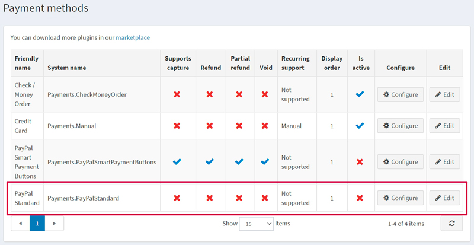

## 啟用付款方式、編輯名稱與顯示順序

您可以編輯付款方式的名稱（該名稱將會在前台網站顯示給顧客）或其顯示順序。若要進行此操作，請在付款方式列表頁面中，點擊該外掛所在列的 **Edit** 按鈕。您將可以輸入 **Friendly name**（友善名稱）與 **Display order**（顯示順序）。在這一列中，您也可以透過 **Is active** 欄位來啟用或停用此外掛。點擊 **Update** 按鈕，您的變更即會儲存。

## 設定付款方式

若要使用 **PayPal Standard** 外掛作為付款方式，請遵循以下步驟：

1. 在 www.paypal.com 註冊一個企業帳戶。請點選連結 [https://www.paypal.com/bizsignup/](https://www.paypal.com/bizsignup/)，然後填寫關於您個人及企業的資訊：

    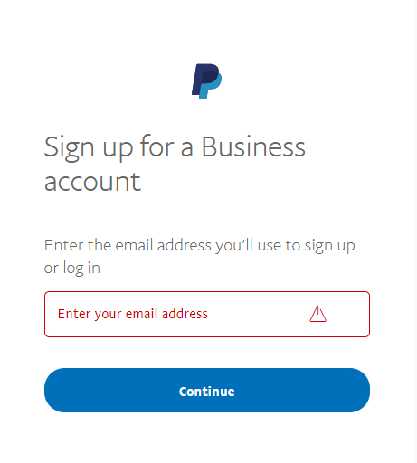

    > [!NOTE]
    >
    > 如果您已經擁有帳戶，系統將會導向至授權頁面。

    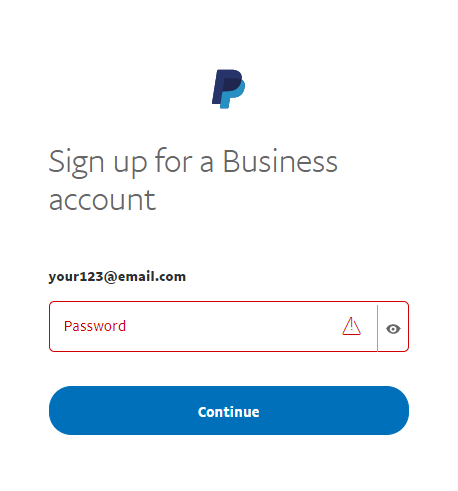

    

    

    

1. 在上方導覽列中，點選 **Settings** 圖示 。

1. 在左側面板中選擇 **Website payments**，並在 **Website preferences** 這一行點選 **Update**。

    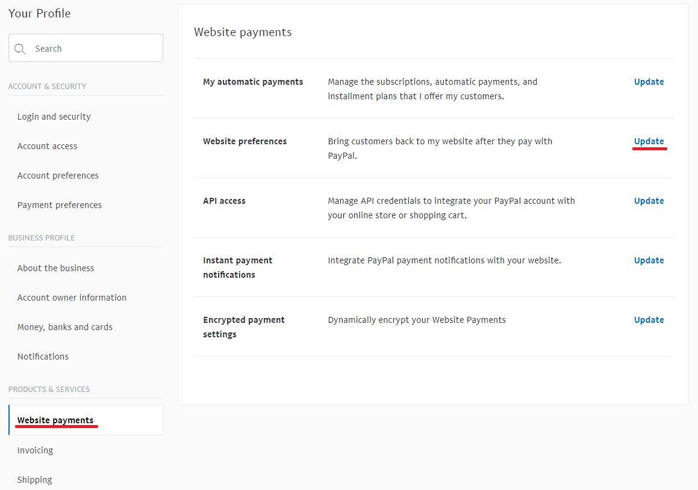
1. 在 **Auto return for website payments** 區段中，將開關設為 **On**。在 **Return URL** 欄位中，輸入您的網站 URL，該網址將會在顧客付款後接收由 PayPal 發送的交易 ID。以我們的範例來說，網址為 `http://localhost:15536/Plugins/PaymentPayPalStandard/PDTHandler`，但請別忘了將 localhost 替換成您實際的網站 URL。

    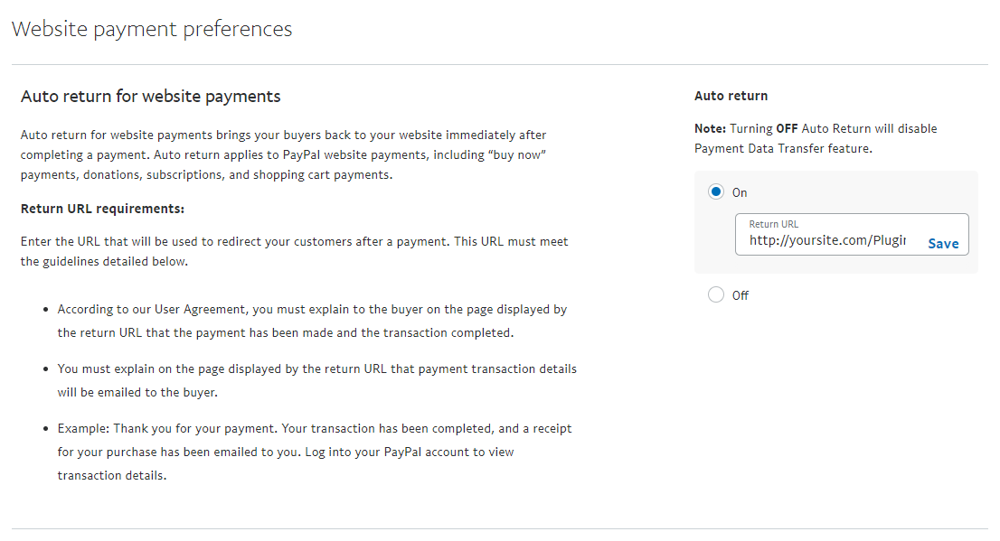
1. 在 **Payment data transfer** 區段中，將開關設為 **On** 並複製 **Identity Token**。

    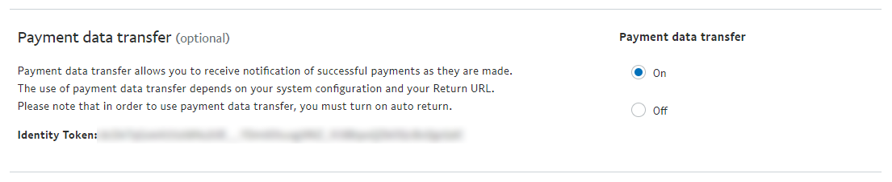
1. 若要在 nopCommerce 的管理後台設定此外掛，請前往 **後台 → 設定 → 付款方式**。在 **PayPal Standard** 這一行，點選 **Configure**。

   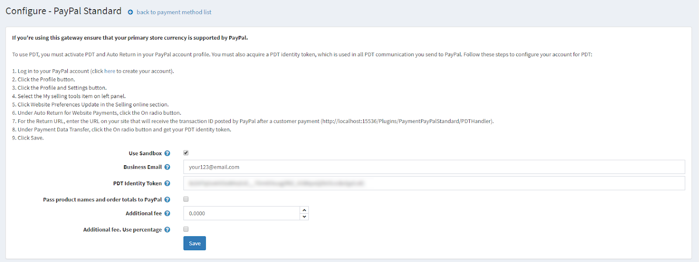

1. 在 **Business Email** 欄位中，輸入您在 paypal.com 註冊企業帳戶時所指定的電子郵件地址。

1. 在 **PDT Identity Token** 欄位中，貼上第 5 點所複製的 **Identity Token**。

1. 點選 **Save**。

若要啟用 **IPN** (即時付款通知)：

1. 在左側面板選擇 **Notifications**，並點選 **Instant payment notifications** 這一行的 **Update**。

   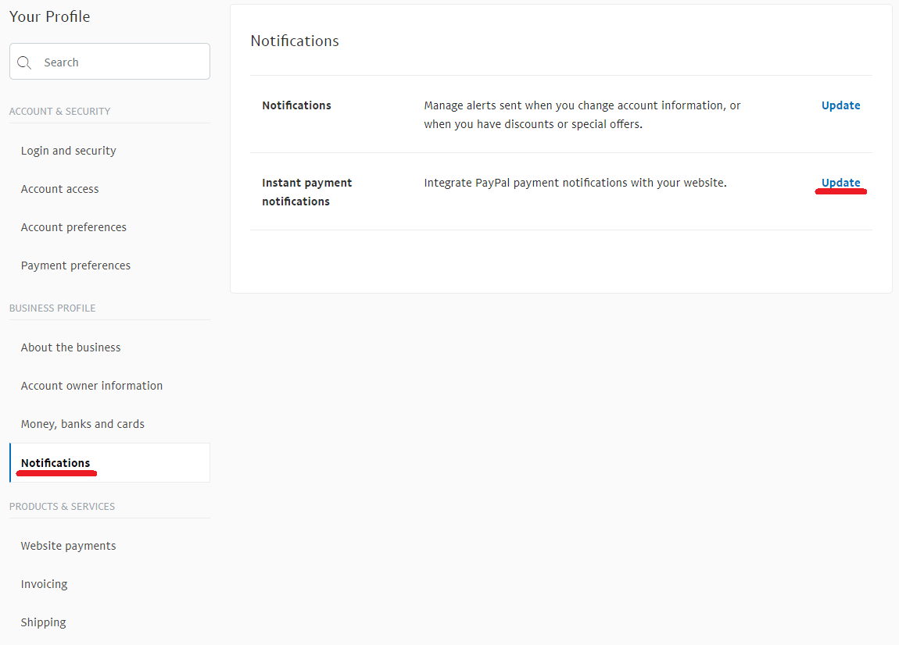

1. 閱讀關於 **IPN** 的資訊，並點選 **Choose IPN Settings**。

   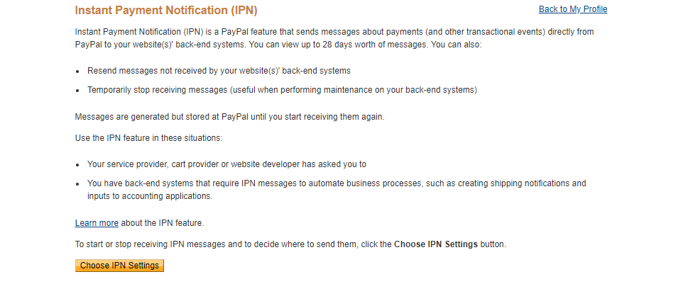

1. 選擇 **Receive IPN messages (Enabled)**。在 **Notification URL** 欄位中，輸入您的 IPN 處理程式 URL。

   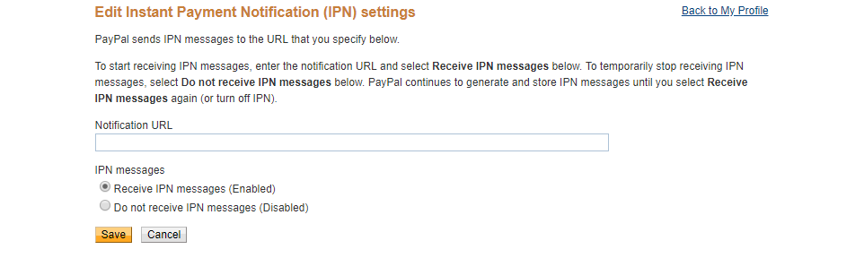

1. 點選 **Save**。您應該會收到訊息，告知您已成功啟用 IPN。

> [!NOTE]
>
> 即時付款通知 (IPN) 是一項 PayPal 訊息服務，會在交易發生變動時傳送通知。一旦整合 IPN，賣家即可自動化其後勤作業，無需等待款項入帳即可觸發訂單履行流程。

## 限制商店與顧客角色

您可以將任何付款方式限制在特定商店與顧客角色中使用。這代表該付款方式將僅適用於特定的商店或顧客角色。您可以從*外掛清單*頁面執行此操作。

1. 前往 **設定 → 本地外掛**。找到您想要限制的外掛。在本範例中，它是 **PayPal Standard**。若要更快速找到它，請使用頁面頂端的*搜尋*面板，透過「付款方式」選項，以 **外掛名稱** 或 **群組** 進行搜尋。

   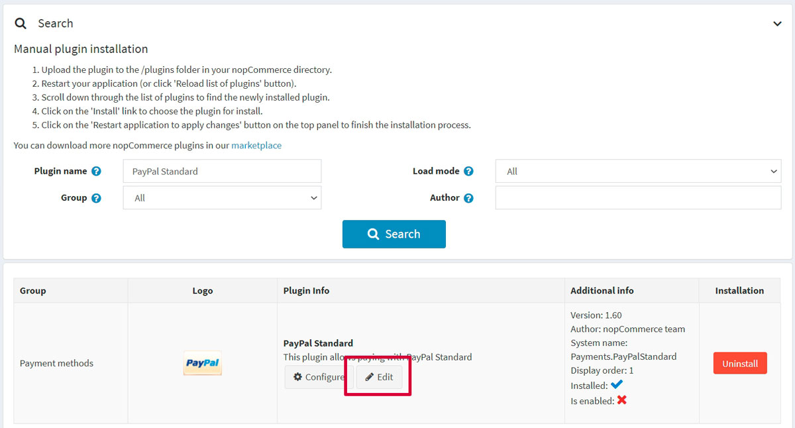

1. 點擊 **編輯** 按鈕，系統會顯示如下的*編輯外掛詳情*視窗：

   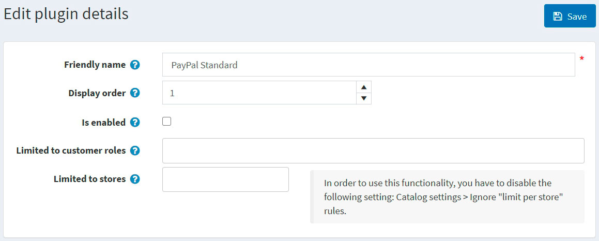

1. 您可以設定下列限制：

   - 在 **限制顧客角色** 欄位中，選擇一個或多個能夠使用此外掛的顧客角色（例如：管理員、供應商、訪客）。如果您不需要此選項，只需將此欄位留空即可。

     > [!IMPORTANT]
     >
     > 為了使用此功能，您必須停用下列設定：**目錄設定 → 忽略 ACL 規則 (全站)**。閱讀更多關於存取控制清單的內容 [here](xref:zh-Hant/running-your-store/customer-management/access-control-list)。

   - 使用 **限制商店** 選項將此外掛限制於特定商店。如果您有多個商店，請從清單中選擇一個或多個。如果您不需要此選項，只需將此欄位留空即可。

     > [!IMPORTANT]
     >
     > 為了使用此功能，您必須停用下列設定：**目錄設定 → 忽略「依商店限制」規則 (全站)**。閱讀更多關於多商店功能的內容 [here](xref:zh-Hant/getting-started/advanced-configuration/multi-store)。

   - 點擊 **儲存**。

## 已知問題

### 錯誤：目前似乎出了點問題 (PayPal)

如果您看到錯誤訊息「目前似乎出了點問題。請稍後再試 (Things don't appear to be working at the moment. Please try again later)」

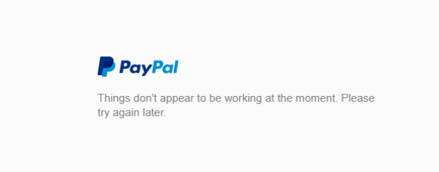

此錯誤是由您 PayPal 帳戶內的設定所導致。

**步驟 1**：在左側邊欄的「產品與服務 (Products & Services)」下方，點選「網站付款 (Website Payments)」。

**步驟 2**：點選「網站偏好設定 (Website Preferences)」區塊旁邊的「更新 (Update)」。

**步驟 3**：向下捲動至「加密網站付款 (Encrypted Website Payments)」區塊，將右側選取為「關閉 (Off)」，然後儲存您的變更。

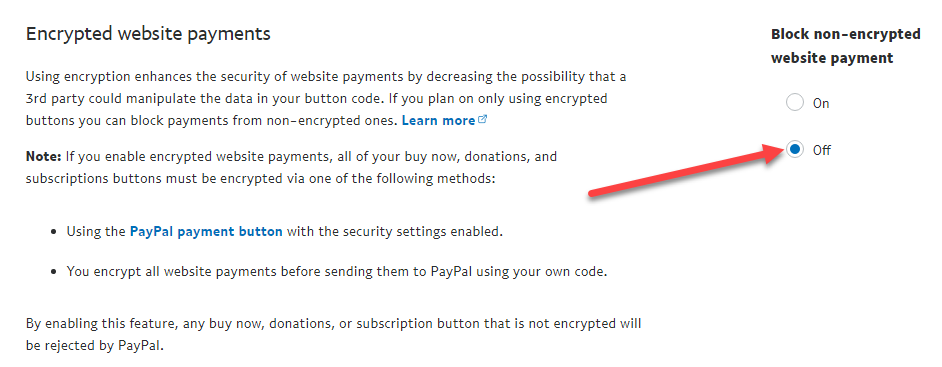

儲存變更後，您可以回到您的網站並再次嘗試該按鈕或表單，它們應該就能正常運作了。