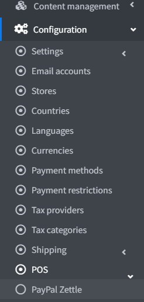
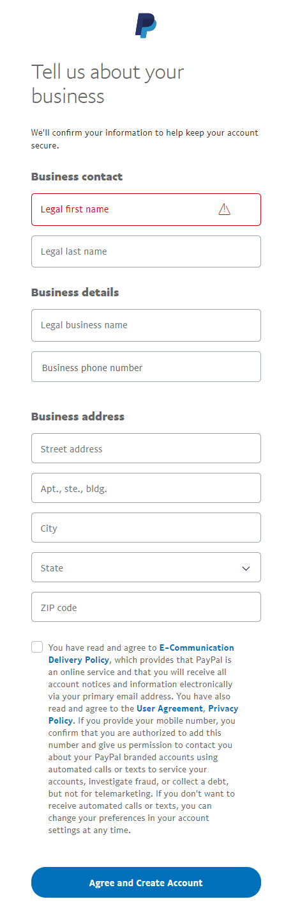

# PayPal Zettle

*PayPal Zettle* 是一套完整的銷售時點情報系統 (POS) 解決方案，讓您能夠接受信用卡、感應式與行動支付。它能與您的 nopCommerce 商店輕鬆同步，協助您無論是在線上、實體店面或隨時隨地，都能順利經營現有的業務，並為未來的銷售做好規劃。使用您的 PayPal 詳細資料即可註冊並在幾分鐘內連結您的帳戶，讓您的營收能直接存入您的 PayPal 帳戶中。

## 設定 POS 方法

若要設定 `PayPal Zettle` 外掛，請前往 **設定 → POS**。接著找到 **PayPal Zettle** POS 解決方案：

請按照以下步驟設定 `PayPal Zettle`。

1. 建立 PayPal Business 帳戶

   如果您已經擁有 PayPal 帳戶，請直接跳至下一節。

   如果您還沒有帳戶，請依照這些指示註冊 Business 帳戶。接著下載 PayPal Zettle POS 應用程式，並訂購您的讀卡機。

   

    > [!NOTE]
    >
    > 如果您已經擁有帳戶，系統會將您重新導向至授權頁面。

    

    

    

    

1. 設定 PayPal Zettle 外掛

    在管理後台開啟 PayPal Zettle 設定頁面。您將會看到以下表單：

   

1. 前往您的 **商戶帳戶**。  
    

    檢閱資訊並點擊 **Create key**。系統將會建立一個用戶端識別碼 (Client ID) 以及 API 金鑰。

    

    在 **Create API key page** 上，點擊 **Copy key** 並將其貼到此外掛設定頁面的對應欄位中，**Client ID** 也請比照辦理。

    

    > [!NOTE]
    >
    > API 金鑰只會顯示一次，請務必妥善備份。

    點擊 **Save** 以儲存外掛設定。

    輸入完成後，系統將會顯示目前的連線狀態、中斷連線按鈕以及部分個人檔案詳情。如果在連線過程中發生任何錯誤，或是商店設定與 *Zettle* 設定檔之間不一致，系統將會顯示警告。為了確保外掛正確運作，我們必須修正這些問題。

    

1. 商品庫同步

    商品庫同步是此外掛的主要功能。同步設定位於同一頁面中獨立的面板內。我們並未將「初始同步」與「更新」分開。所有項目都在同一個地方設定並執行，無論是初始同步還是隨後的定期更新，操作方式皆相同。

    

    > [!TIP]
    >
    > 我們在此提供關於如何進行同步的完整說明，且每個項目皆附有提示。

    nopCommerce 商店為資料來源，因此商品同步是單向的，即從 nopCommerce 商店同步至 Zettle 目錄。在此過程中，我們可以選擇要刪除目錄中的商品還是保留它們。

    同步可以設定為自動（透過排程工作）或由商戶在此頁面手動啟動。若要進行自動同步，我們必須勾選 **Enable auto synchronization** 並設定 **Auto synchronization period**。

    在同步之前，我們需要選擇想要匯入至 *Zettle* 目錄的商品。為此，設定下方提供了一個試算表。

    

    只有包含在此試算表中的商品才會進行同步。未來若商品有任何變更（更新詳情、刪除、變更圖片等），這些變更也會同步至目錄。特定商品的同步作業可以隨時暫停（透過 **Active** 屬性）。

    > [!NOTE]
    >
    > **Sync enabled**（與 **Active** 相同）、**Price sync enabled**、**Image sync enabled** 以及 **Inventory tracking enabled** 等設定是在將商品加入表格時應用的，因此這些為預設設定。您也可以針對每個特定商品個別設定。

    在同步期間，系統會匯入商品本身或其指定的商品屬性組合。

    我們也可以在同步時加入現有的折扣。

1. 庫存同步

    此外掛的第二項功能為 **Inventory Synchronization**（庫存同步）。此同步功能為雙向運作，無論是商店（nopCommerce）端的變更，還是目錄（Zettle）端的變更皆可處理。

    為了追蹤商品的庫存，我們需要啟用 **Inventory tracking enabled**。在下一次同步時，追蹤功能將會啟用並開始同步變更。如果我們不再需要追蹤某個商品，則必須相應地停用此選項。

現在我們應該儲存同步設定並 **啟動** 同步。

> [!TIP]
>
> 您可以在記錄中查看同步處理的詳細資訊。
> 

## 限制商店與顧客角色

您可以將任何付款方式限制在特定商店與顧客角色中使用。這代表該付款方式將僅適用於特定的商店或顧客角色。您可以在*外掛清單*頁面中進行此設定。

1. 前往 **設定 → 本地外掛**。找到您想要限制的外掛。以我們的範例來說，是 **PayPal Zettle**。為了更快速地找到它，請使用頁面上方的*搜尋*面板，並透過*付款方式*選項，以 **外掛名稱** 或 **群組** 進行搜尋。

    

1. 點擊 **編輯** 按鈕，*編輯外掛詳情*視窗將顯示如下：

    

1. 您可以設定以下限制：

    * 在 **限制顧客角色** 欄位中，選擇一個或多個顧客角色（例如：管理員、供應商、訪客），這些角色將能夠使用此外掛。如果您不需要此選項，只需將此欄位留空即可。

        > [!Important]
        > 為了使用此功能，您必須停用以下設定：**目錄設定 → 忽略存取控制清單 (ACL) 規則 (全站)**。閱讀更多關於存取控制清單的內容 [here](xref:zh-Hant/running-your-store/customer-management/access-control-list)。

    * 使用 **限制商店** 選項將此外掛限制在特定商店使用。如果您有多個商店，請從清單中選擇一個或多個。如果您不使用此選項，只需將此欄位留空即可。

        > [!Important]
        > 為了使用此功能，您必須停用以下設定：**目錄設定 → 忽略「依商店限制」規則 (全站)**。閱讀更多關於多商店功能的內容 [here](xref:zh-Hant/getting-started/advanced-configuration/multi-store)。

    點擊 **儲存**。